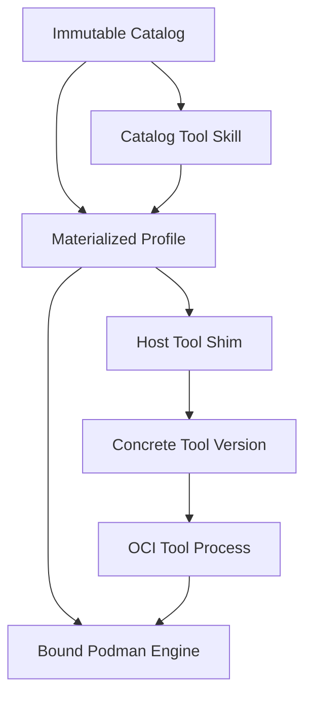

<!-- PAGE_ID: shimmy-01-overview -->

📚 Relevant source files

The following files were used as context for generating this wiki page:

- [README.md:1-396](https://github.com/wadebee/shimmy/blob/aaebadedc4bd1ac9f56f7e31bd394ae86cd97485/README.md#L1-L396)
- [CONTEXT.md:1-101](https://github.com/wadebee/shimmy/blob/aaebadedc4bd1ac9f56f7e31bd394ae86cd97485/CONTEXT.md#L1-L101)
- [ARCHITECTURE.md:1-1074](https://github.com/wadebee/shimmy/blob/aaebadedc4bd1ac9f56f7e31bd394ae86cd97485/docs/ARCHITECTURE.md#L1-L1074)

# Overview

> **Related Pages**: [[Getting Started|02-getting-started.md]], [[Architecture and State Model|04-architecture-and-state.md]], [[Bundled Tools|13-bundled-tools.md]]

---

<!-- BEGIN:AUTOGEN shimmy-01-overview-purpose -->
## Purpose and Scope

Shimmy is a profile-aware harness that makes OCI-packaged tool implementations available as ordinary host commands. It combines tool-version selection, runtime isolation, registry policy, and AI-agent integration while mounting the caller's current directory at `/work` for tool execution ([README.md:3-4](https://github.com/wadebee/shimmy/blob/aaebadedc4bd1ac9f56f7e31bd394ae86cd97485/README.md#L3-L4)).

The repository serves two roles: it is the source catalog of packaged tools and the source of the control plane that installs and manages them ([CONTEXT.md:3-4](https://github.com/wadebee/shimmy/blob/aaebadedc4bd1ac9f56f7e31bd394ae86cd97485/CONTEXT.md#L3-L4)). The installed launcher exposes five management groups—`admin`, `profile`, `catalog`, `shim`, and `ai-skill`—while host-visible tool shims form the normal execution surface ([README.md:117-127](https://github.com/wadebee/shimmy/blob/aaebadedc4bd1ac9f56f7e31bd394ae86cd97485/README.md#L117-L127)). This division keeps installation and lifecycle work in the control plane and routine CLI use in small wrappers around `podman run` ([CONTEXT.md:3-16](https://github.com/wadebee/shimmy/blob/aaebadedc4bd1ac9f56f7e31bd394ae86cd97485/CONTEXT.md#L3-L16)).

Shimmy targets both human and automated callers. Its notional architecture explicitly identifies both audiences, while the implemented CLI provides dry-run operations and stable manifest output suitable for inspection and automation ([ARCHITECTURE.md:6-15](https://github.com/wadebee/shimmy/blob/aaebadedc4bd1ac9f56f7e31bd394ae86cd97485/docs/ARCHITECTURE.md#L6-L15), [README.md:224-228](https://github.com/wadebee/shimmy/blob/aaebadedc4bd1ac9f56f7e31bd394ae86cd97485/README.md#L224-L228)). The architecture document is explicitly a statement of future direction rather than an implementation contract, so current behavior is defined by the repository's operational documentation and code ([ARCHITECTURE.md:1-4](https://github.com/wadebee/shimmy/blob/aaebadedc4bd1ac9f56f7e31bd394ae86cd97485/docs/ARCHITECTURE.md#L1-L4)).

Sources: [README.md:3-4](https://github.com/wadebee/shimmy/blob/aaebadedc4bd1ac9f56f7e31bd394ae86cd97485/README.md#L3-L4), [README.md:117-127](https://github.com/wadebee/shimmy/blob/aaebadedc4bd1ac9f56f7e31bd394ae86cd97485/README.md#L117-L127), [CONTEXT.md:3-16](https://github.com/wadebee/shimmy/blob/aaebadedc4bd1ac9f56f7e31bd394ae86cd97485/CONTEXT.md#L3-L16), [ARCHITECTURE.md:1-15](https://github.com/wadebee/shimmy/blob/aaebadedc4bd1ac9f56f7e31bd394ae86cd97485/docs/ARCHITECTURE.md#L1-L15)
<!-- END:AUTOGEN shimmy-01-overview-purpose -->

---

<!-- BEGIN:AUTOGEN shimmy-01-overview-core-concepts -->
## Core Concepts

Shimmy separates a user's desired tool context from the engine that supplies execution capacity. The following concepts define that model:

| Concept | Role |
|---|---|
| **Profile** | An independent materialized installation with a source commit, catalog-generation pin, engine binding, shim policies and versions, startup ownership, and AI-skill bundles ([CONTEXT.md:20-34](https://github.com/wadebee/shimmy/blob/aaebadedc4bd1ac9f56f7e31bd394ae86cd97485/CONTEXT.md#L20-L34)). |
| **Shim** | A profile-owned `bin/<tool>` wrapper that presents a stable host command and resolves the profile's selected concrete tool version; selectors use `tool` or `tool@version` ([README.md:278-291](https://github.com/wadebee/shimmy/blob/aaebadedc4bd1ac9f56f7e31bd394ae86cd97485/README.md#L278-L291)). |
| **Concrete version** | A version-specific runtime that owns its `run.sh`, smoke and image configuration, refresh behavior, and any local container context ([CONTEXT.md:77-82](https://github.com/wadebee/shimmy/blob/aaebadedc4bd1ac9f56f7e31bd394ae86cd97485/CONTEXT.md#L77-L82)). |
| **Catalog** | The installation's `default` catalog, composed of retained immutable generations. Each profile pins one generation, so catalog publication or rollback does not silently replace profile contents ([README.md:233-244](https://github.com/wadebee/shimmy/blob/aaebadedc4bd1ac9f56f7e31bd394ae86cd97485/README.md#L233-L244)). |
| **Engine** | The rootless Podman execution environment bound to a profile. Linux profiles use the current user's local engine; macOS profiles use an installation-owned shared machine or an explicitly isolated machine ([CONTEXT.md:67-75](https://github.com/wadebee/shimmy/blob/aaebadedc4bd1ac9f56f7e31bd394ae86cd97485/CONTEXT.md#L67-L75)). |
| **Tool skill** | A tool-specific `SKILL.md` owned by catalog content and materialized from the profile's pinned generation. Management skills instead come from the profile's exact control-plane source commit ([README.md:293-301](https://github.com/wadebee/shimmy/blob/aaebadedc4bd1ac9f56f7e31bd394ae86cd97485/README.md#L293-L301)). |

The key separation is that a profile records intent and policy, while an engine supplies execution. The architecture therefore treats profile, engine, workload, and catalog as distinct concerns, and permits several profiles to bind to a shared engine or a profile to choose an isolated engine ([ARCHITECTURE.md:8-27](https://github.com/wadebee/shimmy/blob/aaebadedc4bd1ac9f56f7e31bd394ae86cd97485/docs/ARCHITECTURE.md#L8-L27)).

Sources: [CONTEXT.md:20-34](https://github.com/wadebee/shimmy/blob/aaebadedc4bd1ac9f56f7e31bd394ae86cd97485/CONTEXT.md#L20-L34), [CONTEXT.md:67-82](https://github.com/wadebee/shimmy/blob/aaebadedc4bd1ac9f56f7e31bd394ae86cd97485/CONTEXT.md#L67-L82), [README.md:233-244](https://github.com/wadebee/shimmy/blob/aaebadedc4bd1ac9f56f7e31bd394ae86cd97485/README.md#L233-L244), [README.md:278-301](https://github.com/wadebee/shimmy/blob/aaebadedc4bd1ac9f56f7e31bd394ae86cd97485/README.md#L278-L301), [ARCHITECTURE.md:8-27](https://github.com/wadebee/shimmy/blob/aaebadedc4bd1ac9f56f7e31bd394ae86cd97485/docs/ARCHITECTURE.md#L8-L27)
<!-- END:AUTOGEN shimmy-01-overview-core-concepts -->

---

<!-- BEGIN:AUTOGEN shimmy-01-overview-design-principles -->
## Design Principles

Shimmy's implementation and state model emphasize small components, explicit authority, and recoverable mutations.

- **POSIX shell throughout.** Tool runtimes are small POSIX shell wrappers around `podman run`, and the checkout's bootstrap script is the sole lifecycle entrypoint into the installed control plane ([CONTEXT.md:3-16](https://github.com/wadebee/shimmy/blob/aaebadedc4bd1ac9f56f7e31bd394ae86cd97485/CONTEXT.md#L3-L16)).
- **Explicit ownership and authority.** Activation is the boundary for engine, registry, active-profile, and user skill-link authority. Deletion is limited to exactly proven owned state; shared, external, and ambiguous engines are preserved ([CONTEXT.md:57-65](https://github.com/wadebee/shimmy/blob/aaebadedc4bd1ac9f56f7e31bd394ae86cd97485/CONTEXT.md#L57-L65)).
- **Immutable catalog history.** A catalog generation fingerprints only the complete `tools/` payload, retains provenance separately, and is reused when equivalent content already exists. Profiles adopt source or catalog changes only through explicit synchronization or shim operations ([CONTEXT.md:36-43](https://github.com/wadebee/shimmy/blob/aaebadedc4bd1ac9f56f7e31bd394ae86cd97485/CONTEXT.md#L36-L43)).
- **Transactional mutation.** Catalog, profile, shim, startup, registry, engine, active-record, and skill-link changes use staged validation, locks, exact commit checks, and compensating rollback. The last valid state remains in place until its replacement commits, and incomplete rollback retains recovery evidence ([CONTEXT.md:45-55](https://github.com/wadebee/shimmy/blob/aaebadedc4bd1ac9f56f7e31bd394ae86cd97485/CONTEXT.md#L45-L55)).
- **Stable concepts over backend details.** The notional architecture aims to preserve concepts such as profiles, catalogs, shims, engines, activation, isolation, status, and dry-run even if implementation technologies later change ([ARCHITECTURE.md:750-782](https://github.com/wadebee/shimmy/blob/aaebadedc4bd1ac9f56f7e31bd394ae86cd97485/docs/ARCHITECTURE.md#L750-L782)).

Sources: [CONTEXT.md:3-16](https://github.com/wadebee/shimmy/blob/aaebadedc4bd1ac9f56f7e31bd394ae86cd97485/CONTEXT.md#L3-L16), [CONTEXT.md:36-65](https://github.com/wadebee/shimmy/blob/aaebadedc4bd1ac9f56f7e31bd394ae86cd97485/CONTEXT.md#L36-L65), [ARCHITECTURE.md:750-782](https://github.com/wadebee/shimmy/blob/aaebadedc4bd1ac9f56f7e31bd394ae86cd97485/docs/ARCHITECTURE.md#L750-L782)
<!-- END:AUTOGEN shimmy-01-overview-design-principles -->

---

<!-- BEGIN:AUTOGEN shimmy-01-overview-platform-model -->
## Platform Model

Podman is an explicit prerequisite; Shimmy neither installs it nor adopts a pre-existing machine ([CONTEXT.md:67-70](https://github.com/wadebee/shimmy/blob/aaebadedc4bd1ac9f56f7e31bd394ae86cd97485/CONTEXT.md#L67-L70)). Its runtime helper maps supported Linux and Darwin `amd64` and `arm64` hosts to native `linux/amd64` or `linux/arm64`, and tool runtimes mount the current directory at `/work` unless a tool documents an exception ([CONTEXT.md:77-82](https://github.com/wadebee/shimmy/blob/aaebadedc4bd1ac9f56f7e31bd394ae86cd97485/CONTEXT.md#L77-L82)).

| Host model | Engine behavior |
|---|---|
| **Linux** | Profiles share the current user's local rootless Podman engine, and Shimmy performs no machine operation ([CONTEXT.md:73-75](https://github.com/wadebee/shimmy/blob/aaebadedc4bd1ac9f56f7e31bd394ae86cd97485/CONTEXT.md#L73-L75)). Activation selects the active profile's exact user registry-policy link and validates that local engine ([README.md:196-198](https://github.com/wadebee/shimmy/blob/aaebadedc4bd1ac9f56f7e31bd394ae86cd97485/README.md#L196-L198)). |
| **macOS shared** | Fresh bootstrap creates the installation-owned `shimmy-default` machine. Ordinary profiles share it, and shared-to-shared activation keeps that VM and its running containers up unless a changed registry projection requires recycling only the rootless API service ([CONTEXT.md:69-73](https://github.com/wadebee/shimmy/blob/aaebadedc4bd1ac9f56f7e31bd394ae86cd97485/CONTEXT.md#L69-L73), [README.md:198-202](https://github.com/wadebee/shimmy/blob/aaebadedc4bd1ac9f56f7e31bd394ae86cd97485/README.md#L198-L202)). |
| **macOS isolated** | An explicitly isolated profile creates an independently owned `shimmy-<profile>` machine. Switching between shared and isolated engines stages target policy, stops the previous machine only when required, and requires `--stop-running` when listed workloads would be interrupted ([CONTEXT.md:70-73](https://github.com/wadebee/shimmy/blob/aaebadedc4bd1ac9f56f7e31bd394ae86cd97485/CONTEXT.md#L70-L73), [README.md:202-206](https://github.com/wadebee/shimmy/blob/aaebadedc4bd1ac9f56f7e31bd394ae86cd97485/README.md#L202-L206)). |

This design makes shared execution the ordinary case while retaining an explicit stronger isolation boundary on macOS. It also keeps machine lifecycle outside the Linux model and prevents Shimmy from treating an existing Podman machine as implicitly owned ([README.md:29-41](https://github.com/wadebee/shimmy/blob/aaebadedc4bd1ac9f56f7e31bd394ae86cd97485/README.md#L29-L41)).

Sources: [CONTEXT.md:67-82](https://github.com/wadebee/shimmy/blob/aaebadedc4bd1ac9f56f7e31bd394ae86cd97485/CONTEXT.md#L67-L82), [README.md:29-41](https://github.com/wadebee/shimmy/blob/aaebadedc4bd1ac9f56f7e31bd394ae86cd97485/README.md#L29-L41), [README.md:196-206](https://github.com/wadebee/shimmy/blob/aaebadedc4bd1ac9f56f7e31bd394ae86cd97485/README.md#L196-L206)
<!-- END:AUTOGEN shimmy-01-overview-platform-model -->

---
