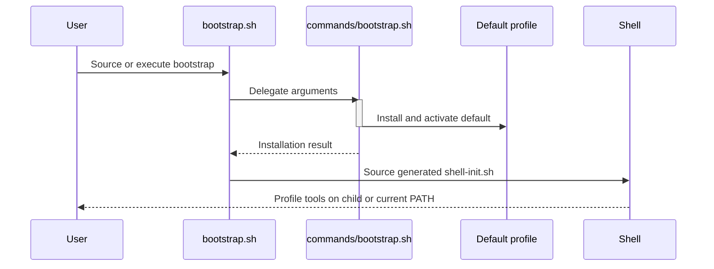

<!-- PAGE_ID: shimmy-02-getting-started -->
<details>
<summary>📚 Relevant source files</summary>

The following files were used as context for generating this wiki page:

- [BOOTSTRAP.md:1-182](https://github.com/wadebee/shimmy/blob/aaebadedc4bd1ac9f56f7e31bd394ae86cd97485/BOOTSTRAP.md#L1-L182)
- [bootstrap.sh:1-54](https://github.com/wadebee/shimmy/blob/aaebadedc4bd1ac9f56f7e31bd394ae86cd97485/bootstrap.sh#L1-L54)
- [bootstrap.sh:1-77](https://github.com/wadebee/shimmy/blob/aaebadedc4bd1ac9f56f7e31bd394ae86cd97485/commands/bootstrap.sh#L1-L77)
- [README.md:1-396](https://github.com/wadebee/shimmy/blob/aaebadedc4bd1ac9f56f7e31bd394ae86cd97485/README.md#L1-L396)

</details>

# Getting Started

> **Related Pages**: [[Command-Line Reference|03-command-line-reference.md]], [[Profile Lifecycle|05-profile-lifecycle.md]], [[Administration, Diagnostics, and Recovery|12-administration-and-recovery.md]]

---

<!-- BEGIN:AUTOGEN shimmy-02-getting-started-prerequisites -->
## Prerequisites

Begin with a complete Shimmy checkout and the following host dependencies:

| Requirement | What Shimmy expects |
|---|---|
| Shell | A POSIX-compatible `/bin/sh` ([BOOTSTRAP.md:26-31](https://github.com/wadebee/shimmy/blob/aaebadedc4bd1ac9f56f7e31bd394ae86cd97485/BOOTSTRAP.md#L26-L31)) |
| Source control | Git and a complete checkout ([BOOTSTRAP.md:26-31](https://github.com/wadebee/shimmy/blob/aaebadedc4bd1ac9f56f7e31bd394ae86cd97485/BOOTSTRAP.md#L26-L31)) |
| Container runtime | The Podman CLI and a reachable local rootless engine; Shimmy does not install Podman ([BOOTSTRAP.md:28-35](https://github.com/wadebee/shimmy/blob/aaebadedc4bd1ac9f56f7e31bd394ae86cd97485/BOOTSTRAP.md#L28-L35)) |
| Checkout state | A clean, committed checkout on attached local branch `main`, with `HEAD` equal to `refs/heads/main` ([BOOTSTRAP.md:48-55](https://github.com/wadebee/shimmy/blob/aaebadedc4bd1ac9f56f7e31bd394ae86cd97485/BOOTSTRAP.md#L48-L55)) |

On macOS, the official Podman package may place the CLI at `/opt/podman/bin/podman`. The names `shimmy-default` must be unused by both Podman machines and connections before bootstrap; Shimmy creates that shared machine and does not adopt a pre-existing same-name resource. ([BOOTSTRAP.md:33-43](https://github.com/wadebee/shimmy/blob/aaebadedc4bd1ac9f56f7e31bd394ae86cd97485/BOOTSTRAP.md#L33-L43))

On Linux, bootstrap uses and validates the current user's rootless Podman service as a shared host-local engine and performs no machine operation. ([BOOTSTRAP.md:45-46](https://github.com/wadebee/shimmy/blob/aaebadedc4bd1ac9f56f7e31bd394ae86cd97485/BOOTSTRAP.md#L45-L46))

Bootstrap validates the complete tracked tool catalog, not only the initial tools. Any executable-bit correction therefore has to be committed before bootstrap. ([BOOTSTRAP.md:50-55](https://github.com/wadebee/shimmy/blob/aaebadedc4bd1ac9f56f7e31bd394ae86cd97485/BOOTSTRAP.md#L50-L55))

Sources: [BOOTSTRAP.md:26-55](https://github.com/wadebee/shimmy/blob/aaebadedc4bd1ac9f56f7e31bd394ae86cd97485/BOOTSTRAP.md#L26-L55), [README.md:29-41](https://github.com/wadebee/shimmy/blob/aaebadedc4bd1ac9f56f7e31bd394ae86cd97485/README.md#L29-L41)
<!-- END:AUTOGEN shimmy-02-getting-started-prerequisites -->

---

<!-- BEGIN:AUTOGEN shimmy-02-getting-started-bootstrap -->
## Bootstrap the Default Profile

Run bootstrap from the clean checkout root. Source it when the newly installed profile should be selected in the current shell:

```sh
. ./bootstrap.sh
```

For automation that should install and activate the profile without changing its parent shell, execute the script and select manual startup policy:

```sh
./bootstrap.sh --no-startup
```

Sourcing and execution perform the same installation. The difference is shell scope: the root entrypoint delegates to `commands/bootstrap.sh` and then sources the generated `profiles/default/shell-init.sh`; when `bootstrap.sh` is executed, that PATH change is confined to its child process. ([bootstrap.sh:18-35](https://github.com/wadebee/shimmy/blob/aaebadedc4bd1ac9f56f7e31bd394ae86cd97485/bootstrap.sh#L18-L35), [README.md:85-92](https://github.com/wadebee/shimmy/blob/aaebadedc4bd1ac9f56f7e31bd394ae86cd97485/README.md#L85-L92))



The initial transaction creates the installation root at `${XDG_CONFIG_HOME:-$HOME/.config}/shimmy`, publishes the first immutable `default` catalog generation, installs jq, rg, and Skopeo, materializes the control and tool skill bundles, activates engine and registry authority, records the active profile, reconciles user-skill links, and applies startup policy. ([BOOTSTRAP.md:76-95](https://github.com/wadebee/shimmy/blob/aaebadedc4bd1ac9f56f7e31bd394ae86cd97485/BOOTSTRAP.md#L76-L95))

The supported bootstrap options are:

| Option | Effect |
|---|---|
| `--shell <bash\|zsh\|sh\|ksh\|mksh>` | Records the managed startup shell ([BOOTSTRAP.md:70-74](https://github.com/wadebee/shimmy/blob/aaebadedc4bd1ac9f56f7e31bd394ae86cd97485/BOOTSTRAP.md#L70-L74)) |
| `--no-startup` | Records manual startup policy and owns no startup files ([BOOTSTRAP.md:70-74](https://github.com/wadebee/shimmy/blob/aaebadedc4bd1ac9f56f7e31bd394ae86cd97485/BOOTSTRAP.md#L70-L74)) |
| `-h`, `--help` | Prints help without validating or modifying installation state ([BOOTSTRAP.md:70-74](https://github.com/wadebee/shimmy/blob/aaebadedc4bd1ac9f56f7e31bd394ae86cd97485/BOOTSTRAP.md#L70-L74)) |

If `XDG_CONFIG_HOME` is set, it must be a normalized absolute path. Bootstrap requires the resulting configuration root not to exist; it will not merge, migrate, or adopt partial state. ([BOOTSTRAP.md:76-85](https://github.com/wadebee/shimmy/blob/aaebadedc4bd1ac9f56f7e31bd394ae86cd97485/BOOTSTRAP.md#L76-L85))

With manual startup policy, select the default profile by sourcing its generated initializer from the desired startup chain:

```sh
shimmy_shell_init_file=${XDG_CONFIG_HOME:-$HOME/.config}/shimmy/profiles/default/shell-init.sh
if [ -r "$shimmy_shell_init_file" ]; then
  . "$shimmy_shell_init_file"
fi
unset shimmy_shell_init_file
```

The initializer changes PATH selection only; it does not start or stop Podman or set a connection variable. ([BOOTSTRAP.md:105-122](https://github.com/wadebee/shimmy/blob/aaebadedc4bd1ac9f56f7e31bd394ae86cd97485/BOOTSTRAP.md#L105-L122))

Sources: [BOOTSTRAP.md:48-122](https://github.com/wadebee/shimmy/blob/aaebadedc4bd1ac9f56f7e31bd394ae86cd97485/BOOTSTRAP.md#L48-L122), [bootstrap.sh:18-35](https://github.com/wadebee/shimmy/blob/aaebadedc4bd1ac9f56f7e31bd394ae86cd97485/bootstrap.sh#L18-L35), [bootstrap.sh:29-77](https://github.com/wadebee/shimmy/blob/aaebadedc4bd1ac9f56f7e31bd394ae86cd97485/commands/bootstrap.sh#L29-L77), [README.md:71-112](https://github.com/wadebee/shimmy/blob/aaebadedc4bd1ac9f56f7e31bd394ae86cd97485/README.md#L71-L112)
<!-- END:AUTOGEN shimmy-02-getting-started-bootstrap -->

---

<!-- BEGIN:AUTOGEN shimmy-02-getting-started-verify -->
## Verify the Installation

After selecting the installed profile, inspect the installation, engine binding, active profile, and materialized shims through the supported manifest interfaces, then exercise the jq and rg wrappers:

```sh
shimmy admin status --format manifest
shimmy admin engine status --format manifest
shimmy profile status --format manifest
shimmy shim list --format manifest
jq --version
rg --version
```

These commands are the documented post-bootstrap verification sequence. ([BOOTSTRAP.md:130-139](https://github.com/wadebee/shimmy/blob/aaebadedc4bd1ac9f56f7e31bd394ae86cd97485/BOOTSTRAP.md#L130-L139)) Use `shimmy admin engine status` for operational inspection rather than editing the generated, read-only engine record. ([README.md:94-98](https://github.com/wadebee/shimmy/blob/aaebadedc4bd1ac9f56f7e31bd394ae86cd97485/README.md#L94-L98))

For an AI-agent invocation, a Podman error observed only inside a sandbox means engine access is unverified from that sandbox. Retry the same safe wrapper operation through the approval boundary before concluding that the profile or engine is broken; status, activation dry-run, activation, and any later `--stop-running` acknowledgement remain separate decisions. ([BOOTSTRAP.md:141-145](https://github.com/wadebee/shimmy/blob/aaebadedc4bd1ac9f56f7e31bd394ae86cd97485/BOOTSTRAP.md#L141-L145))

Sources: [BOOTSTRAP.md:130-145](https://github.com/wadebee/shimmy/blob/aaebadedc4bd1ac9f56f7e31bd394ae86cd97485/BOOTSTRAP.md#L130-L145), [README.md:94-98](https://github.com/wadebee/shimmy/blob/aaebadedc4bd1ac9f56f7e31bd394ae86cd97485/README.md#L94-L98)
<!-- END:AUTOGEN shimmy-02-getting-started-verify -->

---

<!-- BEGIN:AUTOGEN shimmy-02-getting-started-first-profile -->
## Create and Select a Profile

Create a shared sibling profile by previewing the transaction before applying it:

```sh
shimmy profile create team-one --dry-run
shimmy profile create team-one
shimmy profile list
```

The dry run reports the exact profile root, shared-engine transition, registry service action, image preparation, active-record change, and skill collisions without mutation. Normal creation binds the profile to the existing shared engine and does not initialize a Podman machine. ([BOOTSTRAP.md:147-160](https://github.com/wadebee/shimmy/blob/aaebadedc4bd1ac9f56f7e31bd394ae86cd97485/BOOTSTRAP.md#L147-L160))

Profile creation activates the new profile at installation scope. To select another profile, preview activation, activate it, and then source that profile's initializer so the current shell's PATH points at its launcher and tool wrappers:

```sh
shimmy profile activate default --dry-run
shimmy profile activate default
. "${XDG_CONFIG_HOME:-$HOME/.config}/shimmy/profiles/default/shell-init.sh"
```

Creation activates its target, while sourcing the selected profile's initializer updates the current shell. ([README.md:177-194](https://github.com/wadebee/shimmy/blob/aaebadedc4bd1ac9f56f7e31bd394ae86cd97485/README.md#L177-L194)) In AI-agent sessions, shell sourcing does not persist across separate tool calls, so use an absolute profile launcher or source and invoke it in the same shell command. ([BOOTSTRAP.md:119-122](https://github.com/wadebee/shimmy/blob/aaebadedc4bd1ac9f56f7e31bd394ae86cd97485/BOOTSTRAP.md#L119-L122))

Sources: [BOOTSTRAP.md:119-122](https://github.com/wadebee/shimmy/blob/aaebadedc4bd1ac9f56f7e31bd394ae86cd97485/BOOTSTRAP.md#L119-L122), [BOOTSTRAP.md:147-160](https://github.com/wadebee/shimmy/blob/aaebadedc4bd1ac9f56f7e31bd394ae86cd97485/BOOTSTRAP.md#L147-L160), [README.md:150-194](https://github.com/wadebee/shimmy/blob/aaebadedc4bd1ac9f56f7e31bd394ae86cd97485/README.md#L150-L194)
<!-- END:AUTOGEN shimmy-02-getting-started-first-profile -->

---

<!-- BEGIN:AUTOGEN shimmy-02-getting-started-initial-failures -->
## Bootstrap Failure Boundaries

Bootstrap fails before mutation when the destination configuration root already exists, and macOS bootstrap treats an existing `shimmy-default` machine or connection as a collision rather than adopting it. ([BOOTSTRAP.md:37-43](https://github.com/wadebee/shimmy/blob/aaebadedc4bd1ac9f56f7e31bd394ae86cd97485/BOOTSTRAP.md#L37-L43), [BOOTSTRAP.md:76-79](https://github.com/wadebee/shimmy/blob/aaebadedc4bd1ac9f56f7e31bd394ae86cd97485/BOOTSTRAP.md#L76-L79)) Catalog validation can also stop bootstrap, including for a tool outside the initial jq, rg, and Skopeo set. ([BOOTSTRAP.md:50-55](https://github.com/wadebee/shimmy/blob/aaebadedc4bd1ac9f56f7e31bd394ae86cd97485/BOOTSTRAP.md#L50-L55), [BOOTSTRAP.md:87-95](https://github.com/wadebee/shimmy/blob/aaebadedc4bd1ac9f56f7e31bd394ae86cd97485/BOOTSTRAP.md#L87-L95))

Once mutation begins, installation and activation run as one compensated lifecycle. A normal failure removes newly created installation state and restores recoverable external changes. Image-preparation errors identify the tool, version, pull or build action, and configured image reference without guessing whether the root cause is registry access, authentication, or networking. ([BOOTSTRAP.md:87-95](https://github.com/wadebee/shimmy/blob/aaebadedc4bd1ac9f56f7e31bd394ae86cd97485/BOOTSTRAP.md#L87-L95))

Machine initialization is deliberately more conservative. Shimmy records intent before calling Podman and acquires automatic deletion authority only after it commits the exact machine identity. If initialization remains ambiguous or exact machine removal fails, it reports incomplete rollback and retains the configuration root plus `engines/shared/lifecycle.conf`; the retained state prevents another fresh bootstrap. ([BOOTSTRAP.md:97-103](https://github.com/wadebee/shimmy/blob/aaebadedc4bd1ac9f56f7e31bd394ae86cd97485/BOOTSTRAP.md#L97-L103))

When recovery evidence is retained:

1. Do not immediately retry bootstrap.
2. Do not delete, rename, or adopt a Podman machine merely by matching its name.
3. Inspect the reported lifecycle state and preserve the retained configuration root until the machine identity and recovery action are understood. ([BOOTSTRAP.md:97-103](https://github.com/wadebee/shimmy/blob/aaebadedc4bd1ac9f56f7e31bd394ae86cd97485/BOOTSTRAP.md#L97-L103))

Sources: [BOOTSTRAP.md:37-43](https://github.com/wadebee/shimmy/blob/aaebadedc4bd1ac9f56f7e31bd394ae86cd97485/BOOTSTRAP.md#L37-L43), [BOOTSTRAP.md:50-55](https://github.com/wadebee/shimmy/blob/aaebadedc4bd1ac9f56f7e31bd394ae86cd97485/BOOTSTRAP.md#L50-L55), [BOOTSTRAP.md:76-103](https://github.com/wadebee/shimmy/blob/aaebadedc4bd1ac9f56f7e31bd394ae86cd97485/BOOTSTRAP.md#L76-L103), [README.md:100-112](https://github.com/wadebee/shimmy/blob/aaebadedc4bd1ac9f56f7e31bd394ae86cd97485/README.md#L100-L112)
<!-- END:AUTOGEN shimmy-02-getting-started-initial-failures -->

---
