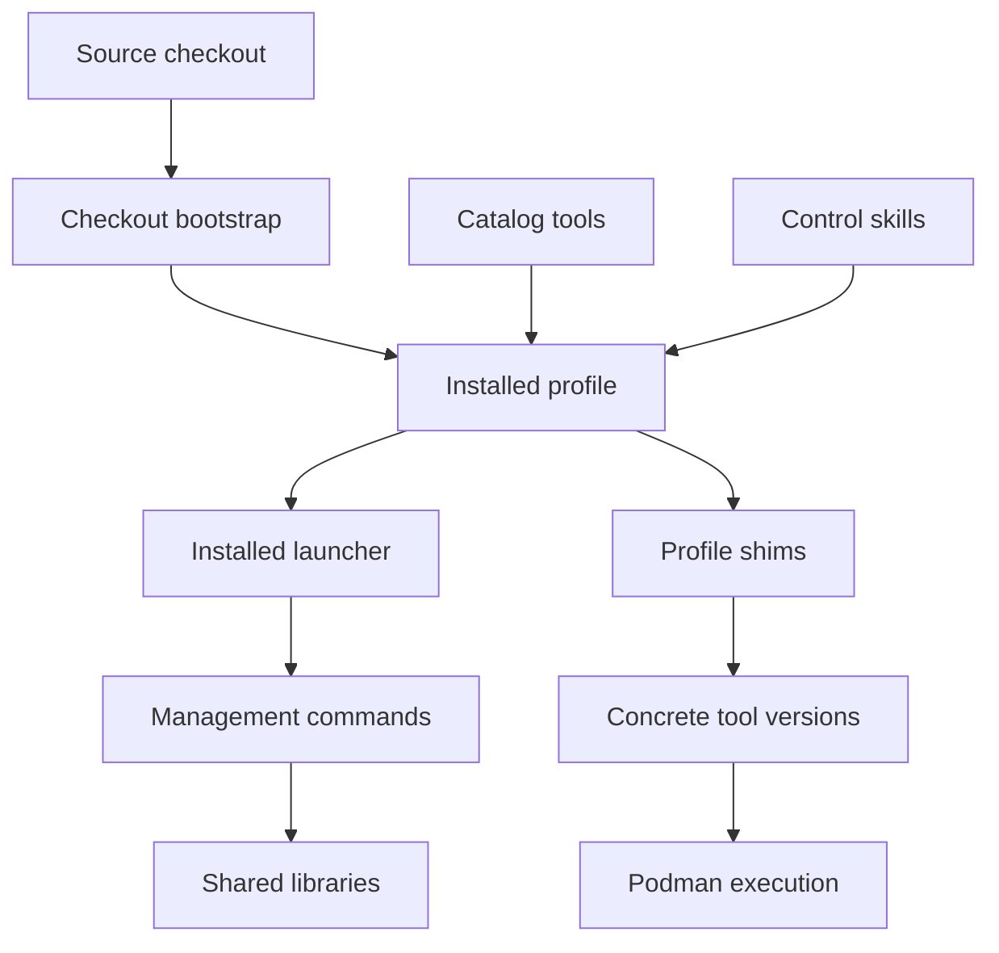
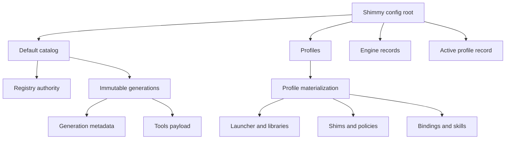
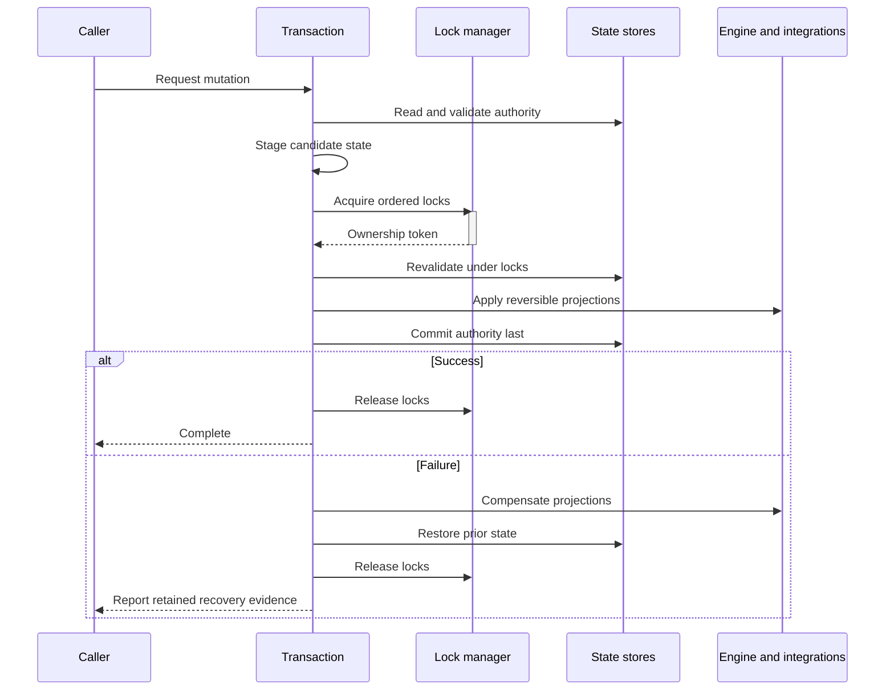
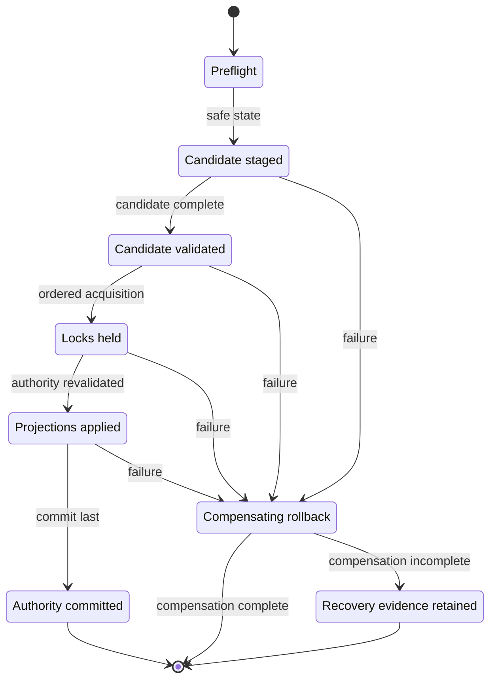

<!-- PAGE_ID: shimmy-04-architecture-and-state -->
<details>
<summary>📚 Relevant source files</summary>

The following files were used as context for generating this wiki page:

- [ARCHITECTURE.md:1-1074](https://github.com/wadebee/shimmy/blob/aaebadedc4bd1ac9f56f7e31bd394ae86cd97485/docs/ARCHITECTURE.md#L1-L1074)
- [CONTEXT.md:1-101](https://github.com/wadebee/shimmy/blob/aaebadedc4bd1ac9f56f7e31bd394ae86cd97485/CONTEXT.md#L1-L101)
- [CONTEXT.md:1-28](https://github.com/wadebee/shimmy/blob/aaebadedc4bd1ac9f56f7e31bd394ae86cd97485/lib/CONTEXT.md#L1-L28)
- [CONTEXT.md:1-42](https://github.com/wadebee/shimmy/blob/aaebadedc4bd1ac9f56f7e31bd394ae86cd97485/lib/install/CONTEXT.md#L1-L42)
- [CONTEXT.md:1-33](https://github.com/wadebee/shimmy/blob/aaebadedc4bd1ac9f56f7e31bd394ae86cd97485/lib/profile/CONTEXT.md#L1-L33)
- [common.sh:1-348](https://github.com/wadebee/shimmy/blob/aaebadedc4bd1ac9f56f7e31bd394ae86cd97485/lib/common/common.sh#L1-L348)
- [lock.sh:1-357](https://github.com/wadebee/shimmy/blob/aaebadedc4bd1ac9f56f7e31bd394ae86cd97485/lib/common/lock.sh#L1-L357)
- [CONTRIBUTING.md:1-218](https://github.com/wadebee/shimmy/blob/aaebadedc4bd1ac9f56f7e31bd394ae86cd97485/CONTRIBUTING.md#L1-L218)

</details>

# Architecture and State Model

> **Related Pages**: [[Profile Lifecycle|05-profile-lifecycle.md]], [[Engines, Activation, and Registries|06-engines-and-registries.md]], [[Catalog Lifecycle|07-catalog-lifecycle.md]]

---

<!-- BEGIN:AUTOGEN shimmy-04-architecture-and-state-components -->
## System Components

Shimmy is a POSIX-shell control plane around OCI-packaged command-line tools. The repository is both the source catalog and the source of the management control plane, while installed profiles materialize the commands, libraries, shims, policies, and skills needed at runtime. ([CONTEXT.md:3-4](https://github.com/wadebee/shimmy/blob/aaebadedc4bd1ac9f56f7e31bd394ae86cd97485/CONTEXT.md#L3-L4), [CONTEXT.md:12-16](https://github.com/wadebee/shimmy/blob/aaebadedc4bd1ac9f56f7e31bd394ae86cd97485/lib/install/CONTEXT.md#L12-L16))

The checkout and installed surfaces have distinct roles:

| Component | Responsibility |
|---|---|
| Checkout `bootstrap.sh` | Sole checkout lifecycle entry point; delegates installation work to `commands/bootstrap.sh` and can source the installed shell initializer when invoked by sourcing. ([CONTEXT.md:8-10](https://github.com/wadebee/shimmy/blob/aaebadedc4bd1ac9f56f7e31bd394ae86cd97485/CONTEXT.md#L8-L10)) |
| Installed `bin/shimmy` | Exposes the fixed management groups `admin`, `profile`, `catalog`, `shim`, and `ai-skill`. ([CONTEXT.md:11-12](https://github.com/wadebee/shimmy/blob/aaebadedc4bd1ac9f56f7e31bd394ae86cd97485/CONTEXT.md#L11-L12)) |
| `commands/` | Contains checkout and installed management entry points; `commands/run-tool.sh` remains a contributor/source dispatcher rather than a public installed launcher. ([CONTEXT.md:13-16](https://github.com/wadebee/shimmy/blob/aaebadedc4bd1ac9f56f7e31bd394ae86cd97485/CONTEXT.md#L13-L16), [CONTEXT.md:89-90](https://github.com/wadebee/shimmy/blob/aaebadedc4bd1ac9f56f7e31bd394ae86cd97485/CONTEXT.md#L89-L90)) |
| `lib/` | Supplies narrow, sourceable modules used by management commands and tool runtimes; tool-specific behavior does not belong here. ([CONTEXT.md:3-4](https://github.com/wadebee/shimmy/blob/aaebadedc4bd1ac9f56f7e31bd394ae86cd97485/lib/CONTEXT.md#L3-L4)) |
| Profiles | Hold independent materializations of control-plane and runtime state, including direct concrete shim versions, the launcher, engine binding, registry policy, manifests, and skill bundles. ([CONTEXT.md:12-16](https://github.com/wadebee/shimmy/blob/aaebadedc4bd1ac9f56f7e31bd394ae86cd97485/lib/install/CONTEXT.md#L12-L16)) |
| Tools | Live below `tools/<tool>/` with metadata, guide, canonical tool skill, tests, and concrete versions. ([CONTEXT.md:91-92](https://github.com/wadebee/shimmy/blob/aaebadedc4bd1ac9f56f7e31bd394ae86cd97485/CONTEXT.md#L91-L92)) |



The repository's architectural document separates profile intent, execution engines, running workloads, and catalog content as distinct concepts. It explicitly describes a notional future direction rather than an implementation contract, so current behavior should be derived from the repository context and implementation state. ([ARCHITECTURE.md:1-15](https://github.com/wadebee/shimmy/blob/aaebadedc4bd1ac9f56f7e31bd394ae86cd97485/docs/ARCHITECTURE.md#L1-L15))

Sources: [CONTEXT.md:3-16](https://github.com/wadebee/shimmy/blob/aaebadedc4bd1ac9f56f7e31bd394ae86cd97485/CONTEXT.md#L3-L16), [CONTEXT.md:87-96](https://github.com/wadebee/shimmy/blob/aaebadedc4bd1ac9f56f7e31bd394ae86cd97485/CONTEXT.md#L87-L96), [CONTEXT.md:3-24](https://github.com/wadebee/shimmy/blob/aaebadedc4bd1ac9f56f7e31bd394ae86cd97485/lib/CONTEXT.md#L3-L24), [CONTEXT.md:12-16](https://github.com/wadebee/shimmy/blob/aaebadedc4bd1ac9f56f7e31bd394ae86cd97485/lib/install/CONTEXT.md#L12-L16), [ARCHITECTURE.md:1-15](https://github.com/wadebee/shimmy/blob/aaebadedc4bd1ac9f56f7e31bd394ae86cd97485/docs/ARCHITECTURE.md#L1-L15)
<!-- END:AUTOGEN shimmy-04-architecture-and-state-components -->

---

<!-- BEGIN:AUTOGEN shimmy-04-architecture-and-state-installation-layout -->
## Installation Layout

All installation state is rooted at `${XDG_CONFIG_HOME:-$HOME/.config}/shimmy`. The canonical profile path resolver requires an absolute `XDG_CONFIG_HOME` when set, otherwise uses `$HOME/.config`, and maps safe arbitrary names beneath `shimmy/profiles/<profile>`. ([CONTEXT.md:20-28](https://github.com/wadebee/shimmy/blob/aaebadedc4bd1ac9f56f7e31bd394ae86cd97485/CONTEXT.md#L20-L28), [CONTEXT.md:6-9](https://github.com/wadebee/shimmy/blob/aaebadedc4bd1ac9f56f7e31bd394ae86cd97485/lib/CONTEXT.md#L6-L9))

```text
${XDG_CONFIG_HOME:-$HOME/.config}/shimmy/
├── catalogs/
│   └── default/
│       ├── registry authority
│       └── retained immutable generations/
│           ├── generation.conf
│           └── tools/
├── profiles/
│   └── <name>/
│       ├── installed control files and launcher
│       ├── direct shims and concrete versions
│       ├── engine binding and registry policy
│       ├── profile manifest and startup ownership
│       └── control and tool skill bundles
├── engines/
│   └── <id>/
│       └── identity, ownership, projection, and lifecycle state
└── active-profile.conf
    └── active profile and exact user skill root
```

Catalog generations are retained and immutable. Each contains exactly `generation.conf` and `tools/`, while the registry identifies catalog authority; publishing equivalent current content is a registry-preserving no-op, and profiles do not follow later source or registry changes implicitly. ([CONTEXT.md:22-23](https://github.com/wadebee/shimmy/blob/aaebadedc4bd1ac9f56f7e31bd394ae86cd97485/CONTEXT.md#L22-L23), [CONTEXT.md:36-43](https://github.com/wadebee/shimmy/blob/aaebadedc4bd1ac9f56f7e31bd394ae86cd97485/CONTEXT.md#L36-L43))



The ownership boundary is explicit: a profile owns its materialized selections and policies; installation-wide state owns catalog authority and the active record; engine records carry engine identity and lifecycle evidence. The future-state architecture uses the same scope distinction and separately identifies installation, profile, engine, workload, and external ownership. ([CONTEXT.md:20-34](https://github.com/wadebee/shimmy/blob/aaebadedc4bd1ac9f56f7e31bd394ae86cd97485/CONTEXT.md#L20-L34), [ARCHITECTURE.md:226-238](https://github.com/wadebee/shimmy/blob/aaebadedc4bd1ac9f56f7e31bd394ae86cd97485/docs/ARCHITECTURE.md#L226-L238))

Sources: [CONTEXT.md:18-43](https://github.com/wadebee/shimmy/blob/aaebadedc4bd1ac9f56f7e31bd394ae86cd97485/CONTEXT.md#L18-L43), [CONTEXT.md:6-9](https://github.com/wadebee/shimmy/blob/aaebadedc4bd1ac9f56f7e31bd394ae86cd97485/lib/CONTEXT.md#L6-L9), [CONTEXT.md:12-16](https://github.com/wadebee/shimmy/blob/aaebadedc4bd1ac9f56f7e31bd394ae86cd97485/lib/install/CONTEXT.md#L12-L16), [ARCHITECTURE.md:226-238](https://github.com/wadebee/shimmy/blob/aaebadedc4bd1ac9f56f7e31bd394ae86cd97485/docs/ARCHITECTURE.md#L226-L238)
<!-- END:AUTOGEN shimmy-04-architecture-and-state-installation-layout -->

---

<!-- BEGIN:AUTOGEN shimmy-04-architecture-and-state-authority -->
## Authority and Identity

Shimmy distinguishes the identity of the profile whose installed launcher is running from the installation-wide active profile. Profile management exposes invoking-profile status, while `active-profile.conf` is the installation-wide authority for the active profile and exact user skill root. ([CONTEXT.md:11-14](https://github.com/wadebee/shimmy/blob/aaebadedc4bd1ac9f56f7e31bd394ae86cd97485/lib/profile/CONTEXT.md#L11-L14), [CONTEXT.md:27-28](https://github.com/wadebee/shimmy/blob/aaebadedc4bd1ac9f56f7e31bd394ae86cd97485/CONTEXT.md#L27-L28))

Each profile carries several identities that move independently:

| Identity or authority | Meaning |
|---|---|
| Profile name | A safe lowercase name made from letters, digits, and single hyphens. ([CONTEXT.md:30-31](https://github.com/wadebee/shimmy/blob/aaebadedc4bd1ac9f56f7e31bd394ae86cd97485/CONTEXT.md#L30-L31)) |
| Engine binding | A schema-1 binding from the profile to a strict engine record; engine discovery and transitions use that record rather than a name alone. ([CONTEXT.md:31-34](https://github.com/wadebee/shimmy/blob/aaebadedc4bd1ac9f56f7e31bd394ae86cd97485/CONTEXT.md#L31-L34), [CONTEXT.md:20-29](https://github.com/wadebee/shimmy/blob/aaebadedc4bd1ac9f56f7e31bd394ae86cd97485/lib/profile/CONTEXT.md#L20-L29)) |
| Control source | The recorded `refs/heads/main` identity and exact source commit from which management commands, libraries, and control skills are materialized. ([CONTEXT.md:31-34](https://github.com/wadebee/shimmy/blob/aaebadedc4bd1ac9f56f7e31bd394ae86cd97485/CONTEXT.md#L31-L34), [CONTEXT.md:12-16](https://github.com/wadebee/shimmy/blob/aaebadedc4bd1ac9f56f7e31bd394ae86cd97485/lib/install/CONTEXT.md#L12-L16)) |
| Catalog pin | One independently retained default-catalog generation supplying tool content and tool skills. ([CONTEXT.md:31-34](https://github.com/wadebee/shimmy/blob/aaebadedc4bd1ac9f56f7e31bd394ae86cd97485/CONTEXT.md#L31-L34), [CONTEXT.md:14-16](https://github.com/wadebee/shimmy/blob/aaebadedc4bd1ac9f56f7e31bd394ae86cd97485/lib/install/CONTEXT.md#L14-L16)) |
| Active authority | A successful activation projection across the engine, registry, active record, and exact AI-skill links. ([CONTEXT.md:57-60](https://github.com/wadebee/shimmy/blob/aaebadedc4bd1ac9f56f7e31bd394ae86cd97485/CONTEXT.md#L57-L60)) |

Catalog publication changes registry authority without rewriting profile pins. A profile adopts newer applicable source or catalog state only through explicit synchronization or shim lifecycle operations. ([CONTEXT.md:36-43](https://github.com/wadebee/shimmy/blob/aaebadedc4bd1ac9f56f7e31bd394ae86cd97485/CONTEXT.md#L36-L43))

During cross-profile activation, the recorded active profile must be fully valid both before planning and again after locks are acquired, because it is the rollback source. The target engine transition commits last; same-profile activation may instead validate and repair its own inactive engine or registry state. ([CONTEXT.md:15-18](https://github.com/wadebee/shimmy/blob/aaebadedc4bd1ac9f56f7e31bd394ae86cd97485/lib/profile/CONTEXT.md#L15-L18), [CONTEXT.md:20-25](https://github.com/wadebee/shimmy/blob/aaebadedc4bd1ac9f56f7e31bd394ae86cd97485/lib/profile/CONTEXT.md#L20-L25))

Sources: [CONTEXT.md:18-43](https://github.com/wadebee/shimmy/blob/aaebadedc4bd1ac9f56f7e31bd394ae86cd97485/CONTEXT.md#L18-L43), [CONTEXT.md:57-60](https://github.com/wadebee/shimmy/blob/aaebadedc4bd1ac9f56f7e31bd394ae86cd97485/CONTEXT.md#L57-L60), [CONTEXT.md:11-29](https://github.com/wadebee/shimmy/blob/aaebadedc4bd1ac9f56f7e31bd394ae86cd97485/lib/profile/CONTEXT.md#L11-L29), [CONTEXT.md:12-20](https://github.com/wadebee/shimmy/blob/aaebadedc4bd1ac9f56f7e31bd394ae86cd97485/lib/install/CONTEXT.md#L12-L20)
<!-- END:AUTOGEN shimmy-04-architecture-and-state-authority -->

---

<!-- BEGIN:AUTOGEN shimmy-04-architecture-and-state-transactions -->
## Transactions, Locks, and Rollback

Control-plane mutations use staged validation, exact authority checks, ordered locks, commit boundaries, and compensating rollback. The last valid manifest or registry remains in place until a validated replacement is committed, and unsafe or unrecognized state blocks mutation. ([CONTEXT.md:45-50](https://github.com/wadebee/shimmy/blob/aaebadedc4bd1ac9f56f7e31bd394ae86cd97485/CONTEXT.md#L45-L50))

The shared lock implementation assigns a global order: catalog at rank 10, activation at rank 20, profile at rank 30, and registry at rank 40. Rank inversions are rejected; multiple profile or registry locks at the same rank must refer to different profiles acquired in lexical order. ([lock.sh:30-61](https://github.com/wadebee/shimmy/blob/aaebadedc4bd1ac9f56f7e31bd394ae86cd97485/lib/common/lock.sh#L30-L61), [lock.sh:110-143](https://github.com/wadebee/shimmy/blob/aaebadedc4bd1ac9f56f7e31bd394ae86cd97485/lib/common/lock.sh#L110-L143))



Lock acquisition first renders and validates a mode-0600 ownership candidate, then creates the lock with a hard link and verifies the resulting owner identity before recording it as held. Stale locks are quarantined only after their schema, path identity, process state, and fingerprint are checked; any change during cleanup causes restoration or failure. ([lock.sh:70-108](https://github.com/wadebee/shimmy/blob/aaebadedc4bd1ac9f56f7e31bd394ae86cd97485/lib/common/lock.sh#L70-L108), [lock.sh:146-190](https://github.com/wadebee/shimmy/blob/aaebadedc4bd1ac9f56f7e31bd394ae86cd97485/lib/common/lock.sh#L146-L190), [lock.sh:192-256](https://github.com/wadebee/shimmy/blob/aaebadedc4bd1ac9f56f7e31bd394ae86cd97485/lib/common/lock.sh#L192-L256))



Profile activation holds the activation lock followed by lexical profile and registry locks, defers the engine commit, and compensates active-record and exact user-skill link changes. Its external compensation journal restores registered Shimmy state in reverse; overwritten foreign skill content is reported as irrecoverable rather than falsely reported as restored. ([CONTEXT.md:11-18](https://github.com/wadebee/shimmy/blob/aaebadedc4bd1ac9f56f7e31bd394ae86cd97485/lib/profile/CONTEXT.md#L11-L18), [CONTEXT.md:31-33](https://github.com/wadebee/shimmy/blob/aaebadedc4bd1ac9f56f7e31bd394ae86cd97485/lib/profile/CONTEXT.md#L31-L33))

For engine creation and deletion, rollback authority is stricter than a matching machine name. Creation writes durable initializing intent before Podman mutation and removes a machine during compensation only with exact committed identity evidence; ambiguous or incomplete cleanup retains both the journal and installation state. Profile deletion similarly removes only an exactly proven owned isolated engine, while shared, external, or ambiguous engines are preserved. ([CONTEXT.md:52-55](https://github.com/wadebee/shimmy/blob/aaebadedc4bd1ac9f56f7e31bd394ae86cd97485/CONTEXT.md#L52-L55), [CONTEXT.md:62-65](https://github.com/wadebee/shimmy/blob/aaebadedc4bd1ac9f56f7e31bd394ae86cd97485/CONTEXT.md#L62-L65))

Exit and signal traps clean any in-progress lock candidate and release held locks in reverse acquisition order. Release itself validates the lock path and exact owner fields before removal. ([lock.sh:258-283](https://github.com/wadebee/shimmy/blob/aaebadedc4bd1ac9f56f7e31bd394ae86cd97485/lib/common/lock.sh#L258-L283), [lock.sh:306-357](https://github.com/wadebee/shimmy/blob/aaebadedc4bd1ac9f56f7e31bd394ae86cd97485/lib/common/lock.sh#L306-L357))

Sources: [CONTEXT.md:45-65](https://github.com/wadebee/shimmy/blob/aaebadedc4bd1ac9f56f7e31bd394ae86cd97485/CONTEXT.md#L45-L65), [CONTEXT.md:11-33](https://github.com/wadebee/shimmy/blob/aaebadedc4bd1ac9f56f7e31bd394ae86cd97485/lib/profile/CONTEXT.md#L11-L33), [CONTEXT.md:3-25](https://github.com/wadebee/shimmy/blob/aaebadedc4bd1ac9f56f7e31bd394ae86cd97485/lib/install/CONTEXT.md#L3-L25), [lock.sh:15-357](https://github.com/wadebee/shimmy/blob/aaebadedc4bd1ac9f56f7e31bd394ae86cd97485/lib/common/lock.sh#L15-L357)
<!-- END:AUTOGEN shimmy-04-architecture-and-state-transactions -->

---

<!-- BEGIN:AUTOGEN shimmy-04-architecture-and-state-schema -->
## Strict State Contracts

Shimmy treats persisted state as a strict contract rather than a best-effort configuration. Active records and profile manifests are parsed and then validated together with profile identity, catalog generation, shims and versions, startup ownership, and AI-skill bundles as one read-only authority. ([CONTEXT.md:7-9](https://github.com/wadebee/shimmy/blob/aaebadedc4bd1ac9f56f7e31bd394ae86cd97485/lib/profile/CONTEXT.md#L7-L9))

The common validation layer enforces concrete lexical and structural rules before state participates in a transaction:

| Contract | Validation behavior |
|---|---|
| Names | Rejects empty values, leading or trailing hyphens, repeated hyphens, and characters outside lowercase letters, digits, and hyphens. ([common.sh:118-124](https://github.com/wadebee/shimmy/blob/aaebadedc4bd1ac9f56f7e31bd394ae86cd97485/lib/common/common.sh#L118-L124)) |
| Commits | Accepts only 40- or 64-character lowercase hexadecimal commit identifiers. ([common.sh:133-137](https://github.com/wadebee/shimmy/blob/aaebadedc4bd1ac9f56f7e31bd394ae86cd97485/lib/common/common.sh#L133-L137)) |
| Fingerprints | Requires a `sha256:` prefix followed by exactly 64 lowercase hexadecimal characters. ([common.sh:139-147](https://github.com/wadebee/shimmy/blob/aaebadedc4bd1ac9f56f7e31bd394ae86cd97485/lib/common/common.sh#L139-L147)) |
| State files | Requires a non-symlink, non-empty regular file, a final newline, and no NUL bytes. ([common.sh:169-176](https://github.com/wadebee/shimmy/blob/aaebadedc4bd1ac9f56f7e31bd394ae86cd97485/lib/common/common.sh#L169-L176)) |
| Absolute paths | Rejects empty, root-only, relative, trailing-slash, duplicate-separator, `.`-segment, and `..`-segment forms. ([common.sh:197-205](https://github.com/wadebee/shimmy/blob/aaebadedc4bd1ac9f56f7e31bd394ae86cd97485/lib/common/common.sh#L197-L205)) |
| Ordered lists | Requires line lists to already be lexically sorted and unique. ([common.sh:214-219](https://github.com/wadebee/shimmy/blob/aaebadedc4bd1ac9f56f7e31bd394ae86cd97485/lib/common/common.sh#L214-L219)) |

Lock records illustrate the schema approach: a lock is exactly five lines beginning with `shimmy_lock_schema=1`; its kind, profile, PID, and token must pass strict validation, and the parsed representation must render byte-for-byte back to the same content. ([lock.sh:70-108](https://github.com/wadebee/shimmy/blob/aaebadedc4bd1ac9f56f7e31bd394ae86cd97485/lib/common/lock.sh#L70-L108))

Profile manifests are rendered only by the schema-2 manifest module, while engine bindings use schema 1 and strict engine records. The schema-1 ownership contract is replaced in place: Shimmy intentionally has no compatibility reader or migration for installations produced by the prior contract; those installations must be removed with the version that created them and bootstrapped again. ([CONTEXT.md:3-5](https://github.com/wadebee/shimmy/blob/aaebadedc4bd1ac9f56f7e31bd394ae86cd97485/lib/install/CONTEXT.md#L3-L5), [CONTEXT.md:30-32](https://github.com/wadebee/shimmy/blob/aaebadedc4bd1ac9f56f7e31bd394ae86cd97485/CONTEXT.md#L30-L32), [CONTRIBUTING.md:61-69](https://github.com/wadebee/shimmy/blob/aaebadedc4bd1ac9f56f7e31bd394ae86cd97485/CONTRIBUTING.md#L61-L69))

The operational consequence is fail-closed mutation: invalid, unrecognized, unsafe, or ambiguous state is preserved for inspection instead of being silently adopted, coerced, or destroyed. ([CONTEXT.md:47-55](https://github.com/wadebee/shimmy/blob/aaebadedc4bd1ac9f56f7e31bd394ae86cd97485/CONTEXT.md#L47-L55))

Sources: [CONTEXT.md:30-55](https://github.com/wadebee/shimmy/blob/aaebadedc4bd1ac9f56f7e31bd394ae86cd97485/CONTEXT.md#L30-L55), [CONTEXT.md:3-5](https://github.com/wadebee/shimmy/blob/aaebadedc4bd1ac9f56f7e31bd394ae86cd97485/lib/install/CONTEXT.md#L3-L5), [CONTEXT.md:7-9](https://github.com/wadebee/shimmy/blob/aaebadedc4bd1ac9f56f7e31bd394ae86cd97485/lib/profile/CONTEXT.md#L7-L9), [common.sh:118-219](https://github.com/wadebee/shimmy/blob/aaebadedc4bd1ac9f56f7e31bd394ae86cd97485/lib/common/common.sh#L118-L219), [lock.sh:70-108](https://github.com/wadebee/shimmy/blob/aaebadedc4bd1ac9f56f7e31bd394ae86cd97485/lib/common/lock.sh#L70-L108), [CONTRIBUTING.md:61-69](https://github.com/wadebee/shimmy/blob/aaebadedc4bd1ac9f56f7e31bd394ae86cd97485/CONTRIBUTING.md#L61-L69)
<!-- END:AUTOGEN shimmy-04-architecture-and-state-schema -->

---
