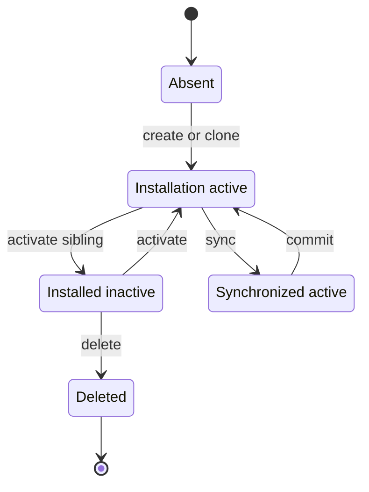
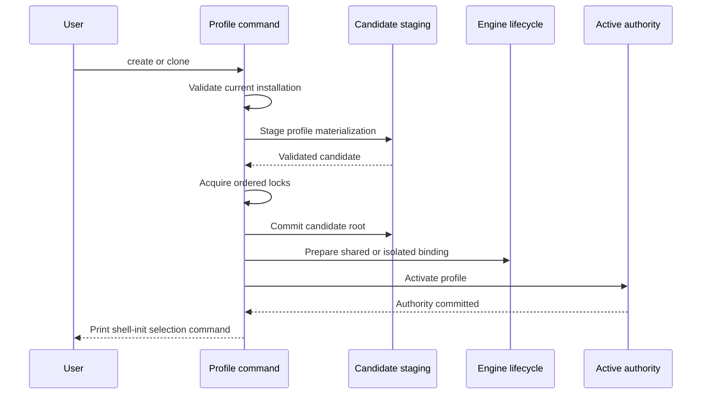
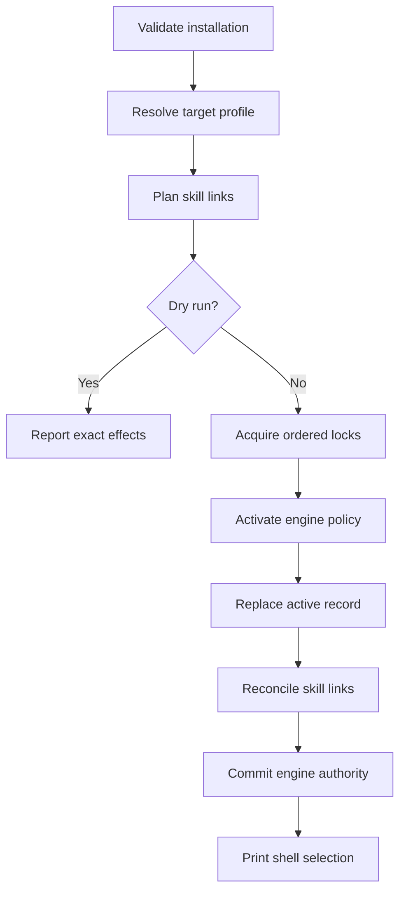

<!-- PAGE_ID: shimmy-05-profile-lifecycle -->

📚 Relevant source files

The following files were used as context for generating this wiki page:

- [profile.sh:1-296](https://github.com/wadebee/shimmy/blob/aaebadedc4bd1ac9f56f7e31bd394ae86cd97485/commands/profile.sh#L1-L296)
- [profile.sh:1-61](https://github.com/wadebee/shimmy/blob/aaebadedc4bd1ac9f56f7e31bd394ae86cd97485/lib/profile/profile.sh#L1-L61)
- [management.sh:1-632](https://github.com/wadebee/shimmy/blob/aaebadedc4bd1ac9f56f7e31bd394ae86cd97485/lib/profile/management.sh#L1-L632)
- [activation.sh:1-832](https://github.com/wadebee/shimmy/blob/aaebadedc4bd1ac9f56f7e31bd394ae86cd97485/lib/profile/activation.sh#L1-L832)
- [transaction.sh:1-103](https://github.com/wadebee/shimmy/blob/aaebadedc4bd1ac9f56f7e31bd394ae86cd97485/lib/profile/transaction.sh#L1-L103)
- [state.sh:1-192](https://github.com/wadebee/shimmy/blob/aaebadedc4bd1ac9f56f7e31bd394ae86cd97485/lib/profile/state.sh#L1-L192)
- [startup.sh:1-109](https://github.com/wadebee/shimmy/blob/aaebadedc4bd1ac9f56f7e31bd394ae86cd97485/lib/startup/startup.sh#L1-L109)
- [CONTEXT.md:1-33](https://github.com/wadebee/shimmy/blob/aaebadedc4bd1ac9f56f7e31bd394ae86cd97485/lib/profile/CONTEXT.md#L1-L33)
- [lifecycle.sh:1-825](https://github.com/wadebee/shimmy/blob/aaebadedc4bd1ac9f56f7e31bd394ae86cd97485/lib/install/lifecycle.sh#L1-L825)
- [profile.sh:1-293](https://github.com/wadebee/shimmy/blob/aaebadedc4bd1ac9f56f7e31bd394ae86cd97485/lib/update/profile.sh#L1-L293)
- [uninstall.sh:1-1568](https://github.com/wadebee/shimmy/blob/aaebadedc4bd1ac9f56f7e31bd394ae86cd97485/lib/install/uninstall.sh#L1-L1568)

# Profile Lifecycle

> **Related Pages**: [[Engines, Activation, and Registries|06-engines-and-registries.md]], [[Shims and Tool Execution|08-shims-and-tool-execution.md]], [[AI-Agent Integration|11-ai-agent-integration.md]]

---

<!-- BEGIN:AUTOGEN shimmy-05-profile-lifecycle-model -->
## Profile Model

A profile is a validated materialization under `${XDG_CONFIG_HOME:-$HOME/.config}/shimmy/profiles/<name>`. Its canonical paths include the install manifest, engine binding, registry policy, direct `bin/shimmy` launcher, tool materialization, and profile-local configuration; name and parent-chain validation are prerequisites for resolving those paths ([profile.sh:4-45](https://github.com/wadebee/shimmy/blob/aaebadedc4bd1ac9f56f7e31bd394ae86cd97485/lib/profile/profile.sh#L4-L45)).

The profile manifest records several independent dimensions of state:

| Dimension | Stored authority |
|---|---|
| Identity | Manifest schema, materialized-root layout, and profile name ([state.sh:67-76](https://github.com/wadebee/shimmy/blob/aaebadedc4bd1ac9f56f7e31bd394ae86cd97485/lib/profile/state.sh#L67-L76)). |
| Control source | Source URL, the fixed tracking ref `refs/heads/main`, and one exact source commit ([state.sh:74-76](https://github.com/wadebee/shimmy/blob/aaebadedc4bd1ac9f56f7e31bd394ae86cd97485/lib/profile/state.sh#L74-L76), [state.sh:111-117](https://github.com/wadebee/shimmy/blob/aaebadedc4bd1ac9f56f7e31bd394ae86cd97485/lib/profile/state.sh#L111-L117)). |
| Catalog and shims | One catalog pin, shim policy records, and concrete version records ([state.sh:79-93](https://github.com/wadebee/shimmy/blob/aaebadedc4bd1ac9f56f7e31bd394ae86cd97485/lib/profile/state.sh#L79-L93)). |
| Startup ownership | An optional shell and a lexically unique ledger of normalized absolute startup-file paths ([state.sh:94-128](https://github.com/wadebee/shimmy/blob/aaebadedc4bd1ac9f56f7e31bd394ae86cd97485/lib/profile/state.sh#L94-L128)). |
| Engine and registries | A strict engine binding plus profile-local `registries.conf`; candidate validation rejects an invalid or partially published binding or registry configuration ([management.sh:59-70](https://github.com/wadebee/shimmy/blob/aaebadedc4bd1ac9f56f7e31bd394ae86cd97485/lib/profile/management.sh#L59-L70)). |
| AI skills | A control bundle tied to the exact source commit and a shim bundle tied to the catalog generation and fingerprint ([state.sh:148-163](https://github.com/wadebee/shimmy/blob/aaebadedc4bd1ac9f56f7e31bd394ae86cd97485/lib/profile/state.sh#L148-L163)). |

The installation-wide `active-profile.conf` is separate from each profile. It is a mode-0644, three-line record containing the active profile name and the exact user skill root ([state.sh:27-50](https://github.com/wadebee/shimmy/blob/aaebadedc4bd1ac9f56f7e31bd394ae86cd97485/lib/profile/state.sh#L27-L50)). This separation permits an installed launcher to identify its **invoking profile** while a different profile owns active engine, registry, and AI-skill authority; profile status and mutations therefore validate both local materialization and installation-wide authority ([profile.sh:46-48](https://github.com/wadebee/shimmy/blob/aaebadedc4bd1ac9f56f7e31bd394ae86cd97485/commands/profile.sh#L46-L48), [management.sh:90-116](https://github.com/wadebee/shimmy/blob/aaebadedc4bd1ac9f56f7e31bd394ae86cd97485/lib/profile/management.sh#L90-L116)).

The modules preserve distinct ownership boundaries: management coordinates list, status, and activation transactions; activation owns engine and registry selection; engine modules supply primitives but do not activate profiles; and the external transaction journal compensates active-record and skill-link changes ([CONTEXT.md:11-33](https://github.com/wadebee/shimmy/blob/aaebadedc4bd1ac9f56f7e31bd394ae86cd97485/lib/profile/CONTEXT.md#L11-L33)).

Sources: [profile.sh:4-45](https://github.com/wadebee/shimmy/blob/aaebadedc4bd1ac9f56f7e31bd394ae86cd97485/lib/profile/profile.sh#L4-L45), [state.sh:27-191](https://github.com/wadebee/shimmy/blob/aaebadedc4bd1ac9f56f7e31bd394ae86cd97485/lib/profile/state.sh#L27-L191), [management.sh:30-116](https://github.com/wadebee/shimmy/blob/aaebadedc4bd1ac9f56f7e31bd394ae86cd97485/lib/profile/management.sh#L30-L116), [CONTEXT.md:11-33](https://github.com/wadebee/shimmy/blob/aaebadedc4bd1ac9f56f7e31bd394ae86cd97485/lib/profile/CONTEXT.md#L11-L33)
<!-- END:AUTOGEN shimmy-05-profile-lifecycle-model -->

---

<!-- BEGIN:AUTOGEN shimmy-05-profile-lifecycle-create-clone -->
## Create and Clone

`shimmy profile create <name>` defaults to a shared engine binding; `--isolated` selects an isolated binding. `clone <source> <target>` inherits the source binding by default and accepts the mutually exclusive `--shared` or `--isolated` overrides. Both commands also accept `--restart`, `--stop-running`, and `--dry-run` ([profile.sh:71-124](https://github.com/wadebee/shimmy/blob/aaebadedc4bd1ac9f56f7e31bd394ae86cd97485/commands/profile.sh#L71-L124)).

Creation derives the new profile's control source and catalog pin from the invoking profile, but installs the pinned catalog's baseline shim set rather than copying the invoking profile's current shim records. It stages a new materialization, acquires catalog, activation, profile, and registry locks, revalidates the source profile, commits the candidate, prepares isolated-engine creation when requested, and automatically activates the new profile ([lifecycle.sh:352-449](https://github.com/wadebee/shimmy/blob/aaebadedc4bd1ac9f56f7e31bd394ae86cd97485/lib/install/lifecycle.sh#L352-L449)).

Cloning copies the source profile's exact source commit, catalog pin, shim policies, concrete versions, registry policy, and control-skill bundle. Its binding mode is inherited unless overridden; an isolated clone receives a target-specific engine identity rather than reusing the source's isolated engine. Source manifest, registry, and binding fingerprints are rechecked under locks before the staged target is committed and activated ([lifecycle.sh:500-567](https://github.com/wadebee/shimmy/blob/aaebadedc4bd1ac9f56f7e31bd394ae86cd97485/lib/install/lifecycle.sh#L500-L567), [lifecycle.sh:568-622](https://github.com/wadebee/shimmy/blob/aaebadedc4bd1ac9f56f7e31bd394ae86cd97485/lib/install/lifecycle.sh#L568-L622)).

Dry-run performs binding and platform preflight without publishing a profile. It reports the target root, copied control source, catalog pin, image plan, engine and connection, isolated machine creation when applicable, active-record target, and skill-link collisions ([lifecycle.sh:262-350](https://github.com/wadebee/shimmy/blob/aaebadedc4bd1ac9f56f7e31bd394ae86cd97485/lib/install/lifecycle.sh#L262-L350)). On Linux, creation rejects `--restart` and `--stop-running`; these options apply to managed macOS engine transitions ([lifecycle.sh:290-305](https://github.com/wadebee/shimmy/blob/aaebadedc4bd1ac9f56f7e31bd394ae86cd97485/lib/install/lifecycle.sh#L290-L305)).

Successful create and clone operations both activate the target installation-wide, then print the exact `shell-init.sh` command needed to select its `bin` directory in the current shell ([lifecycle.sh:446-459](https://github.com/wadebee/shimmy/blob/aaebadedc4bd1ac9f56f7e31bd394ae86cd97485/lib/install/lifecycle.sh#L446-L459), [lifecycle.sh:608-622](https://github.com/wadebee/shimmy/blob/aaebadedc4bd1ac9f56f7e31bd394ae86cd97485/lib/install/lifecycle.sh#L608-L622)).

Sources: [profile.sh:71-124](https://github.com/wadebee/shimmy/blob/aaebadedc4bd1ac9f56f7e31bd394ae86cd97485/commands/profile.sh#L71-L124), [lifecycle.sh:262-459](https://github.com/wadebee/shimmy/blob/aaebadedc4bd1ac9f56f7e31bd394ae86cd97485/lib/install/lifecycle.sh#L262-L459), [lifecycle.sh:482-622](https://github.com/wadebee/shimmy/blob/aaebadedc4bd1ac9f56f7e31bd394ae86cd97485/lib/install/lifecycle.sh#L482-L622)
<!-- END:AUTOGEN shimmy-05-profile-lifecycle-create-clone -->

---

<!-- BEGIN:AUTOGEN shimmy-05-profile-lifecycle-activate -->
## Activate and Select

Activation is a coordinated authority transition. Before mutation, Shimmy validates the installation, the recorded active profile, the target materialization, and the target AI-skill reconciliation plan. A dry-run delegates to the platform activation planner, reports the prospective active-record write and target profile, and renders the skill-link plan without committing it ([management.sh:230-259](https://github.com/wadebee/shimmy/blob/aaebadedc4bd1ac9f56f7e31bd394ae86cd97485/lib/profile/management.sh#L230-L259)).

For a real transition, Shimmy holds the activation lock, profile locks in lexical order, and the target registry lock. It revalidates the active authority and target under those locks, changes engine or registry authority first, replaces the active record, reconciles exact AI-skill links, and commits engine authority last ([management.sh:201-214](https://github.com/wadebee/shimmy/blob/aaebadedc4bd1ac9f56f7e31bd394ae86cd97485/lib/profile/management.sh#L201-L214), [management.sh:261-315](https://github.com/wadebee/shimmy/blob/aaebadedc4bd1ac9f56f7e31bd394ae86cd97485/lib/profile/management.sh#L261-L315)). Active-record and external-link changes are registered in a reverse-order compensation journal; rollback distinguishes restorable Shimmy state from overwritten foreign content that cannot be recovered ([transaction.sh:8-47](https://github.com/wadebee/shimmy/blob/aaebadedc4bd1ac9f56f7e31bd394ae86cd97485/lib/profile/transaction.sh#L8-L47), [transaction.sh:49-102](https://github.com/wadebee/shimmy/blob/aaebadedc4bd1ac9f56f7e31bd394ae86cd97485/lib/profile/transaction.sh#L49-L102)).

Platform effects differ:

| Host | Activation behavior |
|---|---|
| macOS | Validates a Shimmy-created managed machine and its ownership, plans registry projection, may start the target, stop another running machine, or restart the same machine, and selects the expected Podman connection ([activation.sh:567-616](https://github.com/wadebee/shimmy/blob/aaebadedc4bd1ac9f56f7e31bd394ae86cd97485/lib/profile/activation.sh#L567-L616), [activation.sh:651-729](https://github.com/wadebee/shimmy/blob/aaebadedc4bd1ac9f56f7e31bd394ae86cd97485/lib/profile/activation.sh#L651-L729)). |
| Linux | Rejects `--restart` and `--stop-running`, validates the local rootless engine, and atomically applies only the selected profile's registry-policy link ([activation.sh:745-806](https://github.com/wadebee/shimmy/blob/aaebadedc4bd1ac9f56f7e31bd394ae86cd97485/lib/profile/activation.sh#L745-L806)). |

On macOS, `--stop-running` is valid only when activation will stop a running machine. If containers are present, the transition is blocked unless that acknowledgement is supplied; dry-run lists the planned stop, start, service recycle, restart, and acknowledgement state ([activation.sh:617-648](https://github.com/wadebee/shimmy/blob/aaebadedc4bd1ac9f56f7e31bd394ae86cd97485/lib/profile/activation.sh#L617-L648)). Connection and registry override variables are rejected without printing their values because they would mask profile authority ([activation.sh:79-94](https://github.com/wadebee/shimmy/blob/aaebadedc4bd1ac9f56f7e31bd394ae86cd97485/lib/profile/activation.sh#L79-L94)).

Activation does not change the parent process's `PATH`. After the transaction commits, the command prints a source command for the target profile's `shell-init.sh`; running that command is the separate shell-selection step ([management.sh:313-317](https://github.com/wadebee/shimmy/blob/aaebadedc4bd1ac9f56f7e31bd394ae86cd97485/lib/profile/management.sh#L313-L317)).

Sources: [management.sh:201-318](https://github.com/wadebee/shimmy/blob/aaebadedc4bd1ac9f56f7e31bd394ae86cd97485/lib/profile/management.sh#L201-L318), [activation.sh:79-94](https://github.com/wadebee/shimmy/blob/aaebadedc4bd1ac9f56f7e31bd394ae86cd97485/lib/profile/activation.sh#L79-L94), [activation.sh:567-832](https://github.com/wadebee/shimmy/blob/aaebadedc4bd1ac9f56f7e31bd394ae86cd97485/lib/profile/activation.sh#L567-L832), [transaction.sh:8-102](https://github.com/wadebee/shimmy/blob/aaebadedc4bd1ac9f56f7e31bd394ae86cd97485/lib/profile/transaction.sh#L8-L102)
<!-- END:AUTOGEN shimmy-05-profile-lifecycle-activate -->

---

<!-- BEGIN:AUTOGEN shimmy-05-profile-lifecycle-sync-startup -->
## Sync and Startup Repair

`shimmy profile sync` operates only on the active invoking profile. It validates the current engine, captures the existing source, shims, concrete versions, startup ledger, registry policy, and engine binding, then fetches the source URL's `refs/heads/main` and targets the installation's registry-current default-catalog generation ([profile.sh:151-155](https://github.com/wadebee/shimmy/blob/aaebadedc4bd1ac9f56f7e31bd394ae86cd97485/commands/profile.sh#L151-L155), [profile.sh:185-225](https://github.com/wadebee/shimmy/blob/aaebadedc4bd1ac9f56f7e31bd394ae86cd97485/lib/update/profile.sh#L185-L225)).

Sync preserves pinned shim policy and retained concrete-version records. For a tracking shim, it replaces the old default slot with the new catalog default while keeping the remaining version records, then validates the complete result against the adopted generation ([profile.sh:137-183](https://github.com/wadebee/shimmy/blob/aaebadedc4bd1ac9f56f7e31bd394ae86cd97485/lib/update/profile.sh#L137-L183)). The candidate is materialized with the existing startup metadata, registry configuration, and engine binding; source `main` is revalidated before locks are acquired ([profile.sh:226-243](https://github.com/wadebee/shimmy/blob/aaebadedc4bd1ac9f56f7e31bd394ae86cd97485/lib/update/profile.sh#L226-L243)). Under catalog, activation, profile, and registry locks, Shimmy verifies that neither the prior manifest nor catalog and registry inputs changed, swaps the staged assets with a rollback backup, reconciles active skill links, and only then removes the backup and staging checkout ([profile.sh:245-292](https://github.com/wadebee/shimmy/blob/aaebadedc4bd1ac9f56f7e31bd394ae86cd97485/lib/update/profile.sh#L245-L292)).

Startup integration is ledger-based. A managed profile manifest records the startup shell and exact startup file paths; an empty ledger means the profile owns no startup files ([state.sh:94-128](https://github.com/wadebee/shimmy/blob/aaebadedc4bd1ac9f56f7e31bd394ae86cd97485/lib/profile/state.sh#L94-L128)). The owned block sources the profile's `shell-init.sh` only when readable, and the updater removes and rewrites the exact marked block rather than replacing unrelated startup content ([startup.sh:4-16](https://github.com/wadebee/shimmy/blob/aaebadedc4bd1ac9f56f7e31bd394ae86cd97485/lib/startup/startup.sh#L4-L16), [startup.sh:67-109](https://github.com/wadebee/shimmy/blob/aaebadedc4bd1ac9f56f7e31bd394ae86cd97485/lib/startup/startup.sh#L67-L109)).

`shimmy profile repair-startup` consumes only that recorded ledger. It validates and fingerprints the invoking profile, locks and revalidates it, updates the listed files inside an external transaction, rolls back on failure, and reports each repaired file. With no managed startup files, it exits successfully without modifying a shell file ([profile.sh:157-161](https://github.com/wadebee/shimmy/blob/aaebadedc4bd1ac9f56f7e31bd394ae86cd97485/commands/profile.sh#L157-L161), [profile.sh:35-70](https://github.com/wadebee/shimmy/blob/aaebadedc4bd1ac9f56f7e31bd394ae86cd97485/lib/update/profile.sh#L35-L70)).

Sources: [profile.sh:151-161](https://github.com/wadebee/shimmy/blob/aaebadedc4bd1ac9f56f7e31bd394ae86cd97485/commands/profile.sh#L151-L161), [profile.sh:8-70](https://github.com/wadebee/shimmy/blob/aaebadedc4bd1ac9f56f7e31bd394ae86cd97485/lib/update/profile.sh#L8-L70), [profile.sh:137-293](https://github.com/wadebee/shimmy/blob/aaebadedc4bd1ac9f56f7e31bd394ae86cd97485/lib/update/profile.sh#L137-L293), [state.sh:94-128](https://github.com/wadebee/shimmy/blob/aaebadedc4bd1ac9f56f7e31bd394ae86cd97485/lib/profile/state.sh#L94-L128), [startup.sh:4-109](https://github.com/wadebee/shimmy/blob/aaebadedc4bd1ac9f56f7e31bd394ae86cd97485/lib/startup/startup.sh#L4-L109)
<!-- END:AUTOGEN shimmy-05-profile-lifecycle-sync-startup -->

---

<!-- BEGIN:AUTOGEN shimmy-05-profile-lifecycle-delete -->
## Delete a Profile

`shimmy profile delete <name> [--stop-running] [--dry-run]` accepts only an inactive, non-`default` profile. Before planning removal it validates the owned profile root and resolves the profile's engine binding and origin ([profile.sh:163-180](https://github.com/wadebee/shimmy/blob/aaebadedc4bd1ac9f56f7e31bd394ae86cd97485/commands/profile.sh#L163-L180), [uninstall.sh:355-388](https://github.com/wadebee/shimmy/blob/aaebadedc4bd1ac9f56f7e31bd394ae86cd97485/lib/install/uninstall.sh#L355-L388)).

| Binding and evidence | Deletion result |
|---|---|
| Shared engine | Remove the inactive profile's owned materialization and clean its projection; preserve the shared engine ([uninstall.sh:512-525](https://github.com/wadebee/shimmy/blob/aaebadedc4bd1ac9f56f7e31bd394ae86cd97485/lib/install/uninstall.sh#L512-L525)). |
| macOS isolated, Shimmy-created, ownership proven | Remove the machine through its durable removal lifecycle, then remove profile and engine records ([uninstall.sh:391-435](https://github.com/wadebee/shimmy/blob/aaebadedc4bd1ac9f56f7e31bd394ae86cd97485/lib/install/uninstall.sh#L391-L435), [uninstall.sh:471-532](https://github.com/wadebee/shimmy/blob/aaebadedc4bd1ac9f56f7e31bd394ae86cd97485/lib/install/uninstall.sh#L471-L532)). |
| External or ambiguous isolated machine | Preserve the machine; `--stop-running` cannot grant destructive authority without ownership proof ([uninstall.sh:409-439](https://github.com/wadebee/shimmy/blob/aaebadedc4bd1ac9f56f7e31bd394ae86cd97485/lib/install/uninstall.sh#L409-L439), [uninstall.sh:534-540](https://github.com/wadebee/shimmy/blob/aaebadedc4bd1ac9f56f7e31bd394ae86cd97485/lib/install/uninstall.sh#L534-L540)). |

For a proven owned isolated machine, running containers block deletion unless the user supplies `--stop-running`; the option is rejected when no running owned machine needs that acknowledgement. Dry-run reports binding mode, engine identity and origin, ownership classification, planned deletion action, and the irreversible VM-local data categories when machine removal is authorized ([uninstall.sh:420-453](https://github.com/wadebee/shimmy/blob/aaebadedc4bd1ac9f56f7e31bd394ae86cd97485/lib/install/uninstall.sh#L420-L453)).

Deletion revalidates inactivity, owned profile state, binding identity, ownership, and running workloads after acquiring activation, profile, and registry locks. If machine removal succeeds but later cleanup is interrupted, the retained removal journal supports retrying the same deletion and completing profile, engine-state, and lifecycle cleanup without repeating an unproven destructive action ([uninstall.sh:455-510](https://github.com/wadebee/shimmy/blob/aaebadedc4bd1ac9f56f7e31bd394ae86cd97485/lib/install/uninstall.sh#L455-L510), [uninstall.sh:284-353](https://github.com/wadebee/shimmy/blob/aaebadedc4bd1ac9f56f7e31bd394ae86cd97485/lib/install/uninstall.sh#L284-L353)).

Sources: [profile.sh:163-180](https://github.com/wadebee/shimmy/blob/aaebadedc4bd1ac9f56f7e31bd394ae86cd97485/commands/profile.sh#L163-L180), [uninstall.sh:284-353](https://github.com/wadebee/shimmy/blob/aaebadedc4bd1ac9f56f7e31bd394ae86cd97485/lib/install/uninstall.sh#L284-L353), [uninstall.sh:355-540](https://github.com/wadebee/shimmy/blob/aaebadedc4bd1ac9f56f7e31bd394ae86cd97485/lib/install/uninstall.sh#L355-L540)
<!-- END:AUTOGEN shimmy-05-profile-lifecycle-delete -->

---
