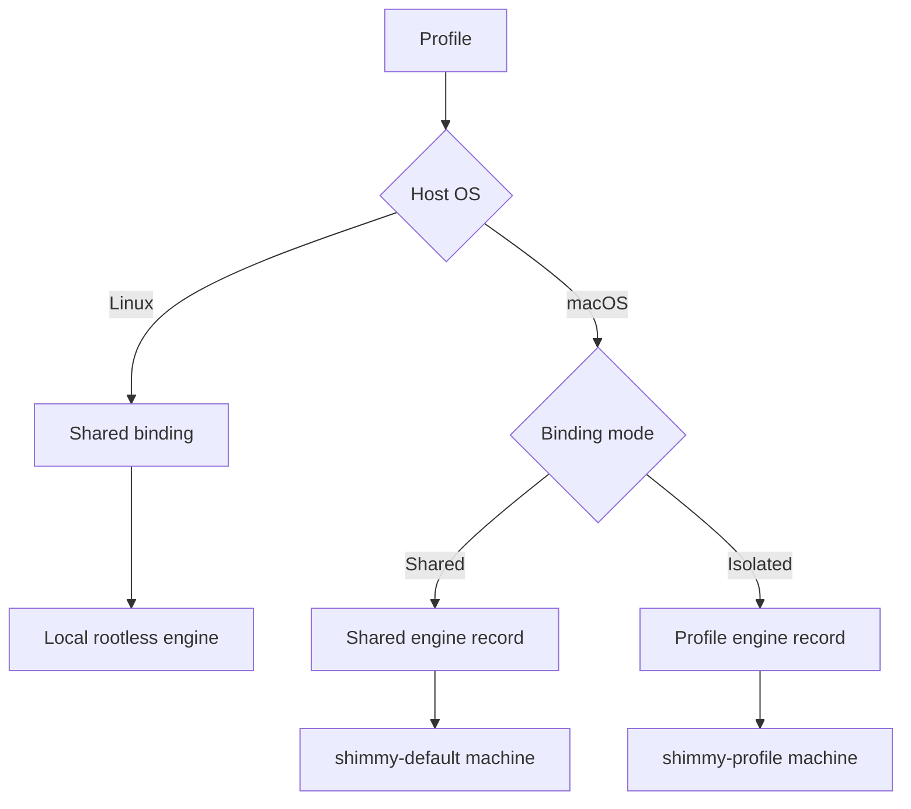
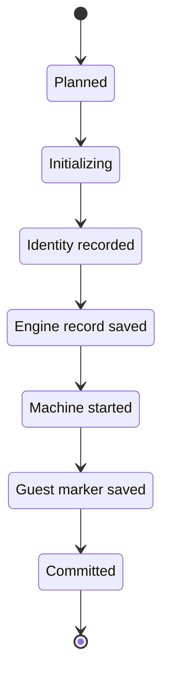
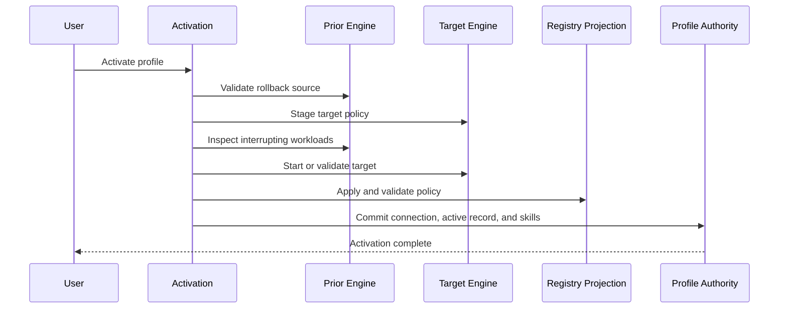

<!-- PAGE_ID: shimmy-06-engines-and-registries -->

📚 Relevant source files

The following files were used as context for generating this wiki page:

- [podman.md:1-312](https://github.com/wadebee/shimmy/blob/aaebadedc4bd1ac9f56f7e31bd394ae86cd97485/docs/podman.md#L1-L312)
- [registries.md:1-107](https://github.com/wadebee/shimmy/blob/aaebadedc4bd1ac9f56f7e31bd394ae86cd97485/docs/registries.md#L1-L107)
- [CONTEXT.md:1-39](https://github.com/wadebee/shimmy/blob/aaebadedc4bd1ac9f56f7e31bd394ae86cd97485/lib/engine/CONTEXT.md#L1-L39)
- [state.sh:1-411](https://github.com/wadebee/shimmy/blob/aaebadedc4bd1ac9f56f7e31bd394ae86cd97485/lib/engine/state.sh#L1-L411)
- [ownership.sh:1-89](https://github.com/wadebee/shimmy/blob/aaebadedc4bd1ac9f56f7e31bd394ae86cd97485/lib/engine/ownership.sh#L1-L89)
- [lifecycle.sh:1-321](https://github.com/wadebee/shimmy/blob/aaebadedc4bd1ac9f56f7e31bd394ae86cd97485/lib/engine/lifecycle.sh#L1-L321)
- [projection.sh:1-254](https://github.com/wadebee/shimmy/blob/aaebadedc4bd1ac9f56f7e31bd394ae86cd97485/lib/engine/projection.sh#L1-L254)
- [registries.sh:1-921](https://github.com/wadebee/shimmy/blob/aaebadedc4bd1ac9f56f7e31bd394ae86cd97485/lib/registries/registries.sh#L1-L921)

# Engines, Activation, and Registries

> **Related Pages**: [[Profile Lifecycle|05-profile-lifecycle.md]], [[Catalog Lifecycle|07-catalog-lifecycle.md]], [[Administration, Diagnostics, and Recovery|12-administration-and-recovery.md]]

---

<!-- BEGIN:AUTOGEN shimmy-06-engines-and-registries-binding -->
## Engine Binding Model

Every supported profile has one strict binding to one valid engine record. The binding is routing authority; the engine record supplies the engine's runtime kind, lifecycle scope, endpoint, connection, provider, origin, and any ownership evidence ([CONTEXT.md:3-12](https://github.com/wadebee/shimmy/blob/aaebadedc4bd1ac9f56f7e31bd394ae86cd97485/lib/engine/CONTEXT.md#L3-L12), [state.sh:141-160](https://github.com/wadebee/shimmy/blob/aaebadedc4bd1ac9f56f7e31bd394ae86cd97485/lib/engine/state.sh#L141-L160)).

| Host and mode | Logical engine ID | Engine record | Runtime boundary |
|---|---|---|---|
| Linux shared | `shared` | `linux-rootless`, installation-scoped, host-local | All ordinary profiles use the current user's local rootless engine; activation changes only Shimmy's user registry-policy link ([podman.md:68-69](https://github.com/wadebee/shimmy/blob/aaebadedc4bd1ac9f56f7e31bd394ae86cd97485/docs/podman.md#L68-L69), [state.sh:112-119](https://github.com/wadebee/shimmy/blob/aaebadedc4bd1ac9f56f7e31bd394ae86cd97485/lib/engine/state.sh#L112-L119)). |
| macOS shared | `shared` | `darwin-machine`, installation-scoped, Shimmy-created | Ordinary profiles share the installation-owned `shimmy-default` machine; a shared-to-shared profile switch does not stop or start the VM ([podman.md:68-75](https://github.com/wadebee/shimmy/blob/aaebadedc4bd1ac9f56f7e31bd394ae86cd97485/docs/podman.md#L68-L75)). |
| macOS isolated | `profile-<profile>` | `darwin-machine`, profile-scoped, Shimmy-created | The profile receives a separate VM-local container, image, and volume namespace ([podman.md:77-89](https://github.com/wadebee/shimmy/blob/aaebadedc4bd1ac9f56f7e31bd394ae86cd97485/docs/podman.md#L77-L89)). |

The binding format permits only `shared|shared` or `isolated|profile-<same-profile>` pairs. Resolution then verifies that the referenced engine record matches the binding: shared profiles may resolve to the installation-scoped macOS machine or Linux host-local engine, while isolated profiles must resolve to a profile-scoped Shimmy-created macOS machine ([state.sh:55-70](https://github.com/wadebee/shimmy/blob/aaebadedc4bd1ac9f56f7e31bd394ae86cd97485/lib/engine/state.sh#L55-L70), [state.sh:364-389](https://github.com/wadebee/shimmy/blob/aaebadedc4bd1ac9f56f7e31bd394ae86cd97485/lib/engine/state.sh#L364-L389)). Engine-local state is kept beneath `engines/<engine-id>/` as `engine.conf`, `registries.conf`, `projection.conf`, and `lifecycle.conf` ([state.sh:13-25](https://github.com/wadebee/shimmy/blob/aaebadedc4bd1ac9f56f7e31bd394ae86cd97485/lib/engine/state.sh#L13-L25)).

Source: [CONTEXT.md:3-12](https://github.com/wadebee/shimmy/blob/aaebadedc4bd1ac9f56f7e31bd394ae86cd97485/lib/engine/CONTEXT.md#L3-L12), [state.sh:55-70](https://github.com/wadebee/shimmy/blob/aaebadedc4bd1ac9f56f7e31bd394ae86cd97485/lib/engine/state.sh#L55-L70), [state.sh:364-389](https://github.com/wadebee/shimmy/blob/aaebadedc4bd1ac9f56f7e31bd394ae86cd97485/lib/engine/state.sh#L364-L389), [podman.md:68-89](https://github.com/wadebee/shimmy/blob/aaebadedc4bd1ac9f56f7e31bd394ae86cd97485/docs/podman.md#L68-L89)
<!-- END:AUTOGEN shimmy-06-engines-and-registries-binding -->

---

<!-- BEGIN:AUTOGEN shimmy-06-engines-and-registries-ownership -->
## Ownership Evidence and Lifecycle

Engine names and profile bindings identify where work should run, but they do not authorize destruction. Shimmy preserves a machine whenever current ownership evidence is missing or mismatched, and creation does not gain deletion authority until exact machine identity has been committed ([CONTEXT.md:28-35](https://github.com/wadebee/shimmy/blob/aaebadedc4bd1ac9f56f7e31bd394ae86cd97485/lib/engine/CONTEXT.md#L28-L35)).

For a Shimmy-created macOS machine, host-side proof requires a valid `darwin-machine` record with `shimmy-created` origin, a present machine in a known state, the recorded provider, a rootless connection, and an inspect-derived identity matching `created_identity` ([ownership.sh:10-68](https://github.com/wadebee/shimmy/blob/aaebadedc4bd1ac9f56f7e31bd394ae86cd97485/lib/engine/ownership.sh#L10-L68)). Full destructive proof additionally verifies the guest marker against both the logical engine ID and the generated ownership token; failure changes the state to ambiguous ([ownership.sh:70-88](https://github.com/wadebee/shimmy/blob/aaebadedc4bd1ac9f56f7e31bd394ae86cd97485/lib/engine/ownership.sh#L70-L88)). Tokens are 32 random bytes encoded as 64 lowercase hexadecimal characters ([ownership.sh:4-8](https://github.com/wadebee/shimmy/blob/aaebadedc4bd1ac9f56f7e31bd394ae86cd97485/lib/engine/ownership.sh#L4-L8), [state.sh:83-87](https://github.com/wadebee/shimmy/blob/aaebadedc4bd1ac9f56f7e31bd394ae86cd97485/lib/engine/state.sh#L83-L87)).

Creation and removal are journal-first state machines. Creation writes `planned` before initialization, records exact identity and a new token after `podman machine init`, persists the engine record, starts and revalidates the same machine, writes the guest marker, and clears the journal only after `committed` ([lifecycle.sh:61-94](https://github.com/wadebee/shimmy/blob/aaebadedc4bd1ac9f56f7e31bd394ae86cd97485/lib/engine/lifecycle.sh#L61-L94), [lifecycle.sh:96-187](https://github.com/wadebee/shimmy/blob/aaebadedc4bd1ac9f56f7e31bd394ae86cd97485/lib/engine/lifecycle.sh#L96-L187)).

Removal records the initial running or stopped state, starts a stopped machine when necessary to verify its guest marker, rechecks ownership before stopping and again before deletion, and reaches `removed` before the caller commits and clears the journal ([lifecycle.sh:235-320](https://github.com/wadebee/shimmy/blob/aaebadedc4bd1ac9f56f7e31bd394ae86cd97485/lib/engine/lifecycle.sh#L235-L320)). Accordingly, a shared-profile deletion removes profile-owned files but not the shared engine; an isolated machine is destroyed only with complete current proof, while legacy, external, or ambiguous machines are preserved ([podman.md:229-238](https://github.com/wadebee/shimmy/blob/aaebadedc4bd1ac9f56f7e31bd394ae86cd97485/docs/podman.md#L229-L238)).

Source: [CONTEXT.md:28-35](https://github.com/wadebee/shimmy/blob/aaebadedc4bd1ac9f56f7e31bd394ae86cd97485/lib/engine/CONTEXT.md#L28-L35), [ownership.sh:4-88](https://github.com/wadebee/shimmy/blob/aaebadedc4bd1ac9f56f7e31bd394ae86cd97485/lib/engine/ownership.sh#L4-L88), [lifecycle.sh:61-320](https://github.com/wadebee/shimmy/blob/aaebadedc4bd1ac9f56f7e31bd394ae86cd97485/lib/engine/lifecycle.sh#L61-L320), [podman.md:229-238](https://github.com/wadebee/shimmy/blob/aaebadedc4bd1ac9f56f7e31bd394ae86cd97485/docs/podman.md#L229-L238)
<!-- END:AUTOGEN shimmy-06-engines-and-registries-ownership -->

---

<!-- BEGIN:AUTOGEN shimmy-06-engines-and-registries-transition -->
## Activation Transitions

Activation aligns four authority surfaces: the target engine, registry projection, installation active-profile record, and exact AI-skill links. It does not modify the caller's `PATH`, and an interrupting transition is blocked when running containers exist unless the user separately supplies `--stop-running` ([podman.md:48-61](https://github.com/wadebee/shimmy/blob/aaebadedc4bd1ac9f56f7e31bd394ae86cd97485/docs/podman.md#L48-L61)).

The transition depends on the current and target bindings:

| Transition | Engine effect | Registry effect |
|---|---|---|
| Same active profile | Repairs target-owned engine or registry state ([podman.md:63-66](https://github.com/wadebee/shimmy/blob/aaebadedc4bd1ac9f56f7e31bd394ae86cd97485/docs/podman.md#L63-L66)) | Reconciles the selected profile's projection. |
| macOS shared to shared | Leaves the VM running ([podman.md:68-75](https://github.com/wadebee/shimmy/blob/aaebadedc4bd1ac9f56f7e31bd394ae86cd97485/docs/podman.md#L68-L75)) | Recycles only rootless `podman.service` when normalized policy differs; equal policy needs no recycle. |
| Shared to isolated, or isolated to shared/isolated | Stages target policy, checks workloads on every machine that must stop, then starts and validates the target ([podman.md:105-110](https://github.com/wadebee/shimmy/blob/aaebadedc4bd1ac9f56f7e31bd394ae86cd97485/docs/podman.md#L105-L110)) | Commits projection and profile authority only after target validation. |
| Explicit recovery | `--restart` requests VM restart recovery; it is distinct from service recycling ([podman.md:112-114](https://github.com/wadebee/shimmy/blob/aaebadedc4bd1ac9f56f7e31bd394ae86cd97485/docs/podman.md#L112-L114)) | Ordinary activation repairs a stale managed registry projection without `--restart` ([registries.md:64-72](https://github.com/wadebee/shimmy/blob/aaebadedc4bd1ac9f56f7e31bd394ae86cd97485/docs/registries.md#L64-L72)). |

The engine projection transaction copies and validates staged registry state, records source and effective fingerprints, and chooses service recycling only when the loaded effective fingerprint differs ([projection.sh:45-70](https://github.com/wadebee/shimmy/blob/aaebadedc4bd1ac9f56f7e31bd394ae86cd97485/lib/engine/projection.sh#L45-L70), [projection.sh:153-173](https://github.com/wadebee/shimmy/blob/aaebadedc4bd1ac9f56f7e31bd394ae86cd97485/lib/engine/projection.sh#L153-L173)). Applying the projection recycles the service when required, validates registry mappings through the selected connection, and then records the loaded fingerprint ([projection.sh:202-214](https://github.com/wadebee/shimmy/blob/aaebadedc4bd1ac9f56f7e31bd394ae86cd97485/lib/engine/projection.sh#L202-L214)). If activation fails, Shimmy restores the previous engine, projection, default connection, active record, and skill links; projection rollback restores prior files and, if needed, recycles and validates the prior policy ([podman.md:105-110](https://github.com/wadebee/shimmy/blob/aaebadedc4bd1ac9f56f7e31bd394ae86cd97485/docs/podman.md#L105-L110), [projection.sh:216-239](https://github.com/wadebee/shimmy/blob/aaebadedc4bd1ac9f56f7e31bd394ae86cd97485/lib/engine/projection.sh#L216-L239)).

Source: [podman.md:48-75](https://github.com/wadebee/shimmy/blob/aaebadedc4bd1ac9f56f7e31bd394ae86cd97485/docs/podman.md#L48-L75), [podman.md:105-114](https://github.com/wadebee/shimmy/blob/aaebadedc4bd1ac9f56f7e31bd394ae86cd97485/docs/podman.md#L105-L114), [projection.sh:45-70](https://github.com/wadebee/shimmy/blob/aaebadedc4bd1ac9f56f7e31bd394ae86cd97485/lib/engine/projection.sh#L45-L70), [projection.sh:153-239](https://github.com/wadebee/shimmy/blob/aaebadedc4bd1ac9f56f7e31bd394ae86cd97485/lib/engine/projection.sh#L153-L239)
<!-- END:AUTOGEN shimmy-06-engines-and-registries-transition -->

---

<!-- BEGIN:AUTOGEN shimmy-06-engines-and-registries-redirects -->
## Registry Redirects

Each profile owns an authoritative `registries.conf` containing a strict containers/image version-2 replacement policy. Redirects are managed through `shimmy profile redirect`, and `set` is an idempotent upsert keyed by exact logical prefix; entries are sorted, while deleting all entries retains a valid empty managed file ([registries.md:3-22](https://github.com/wadebee/shimmy/blob/aaebadedc4bd1ac9f56f7e31bd394ae86cd97485/docs/registries.md#L3-L22)).

A redirect maps a logical registry prefix, such as `docker.io`, to a physical replacement location. This is replacement behavior, not a fallback mirror: failure to serve the logical digest at the physical endpoint ends the operation without consulting a public fallback ([registries.md:30-34](https://github.com/wadebee/shimmy/blob/aaebadedc4bd1ac9f56f7e31bd394ae86cd97485/docs/registries.md#L30-L34)). Prefixes and locations accept fully qualified registries, optional ports, and safe lowercase namespace paths; the policy explicitly excludes credential, TLS, private-CA, signature, and short-name-search management ([registries.md:24-28](https://github.com/wadebee/shimmy/blob/aaebadedc4bd1ac9f56f7e31bd394ae86cd97485/docs/registries.md#L24-L28)).

Policy is profile-local at rest and engine-active only through projection:

| Platform | Active projection | Update behavior |
|---|---|---|
| Linux | An absolute link at the exact Shimmy-owned user drop-in selects the active profile's authoritative file ([registries.md:36-48](https://github.com/wadebee/shimmy/blob/aaebadedc4bd1ac9f56f7e31bd394ae86cd97485/docs/registries.md#L36-L48)). | The link state distinguishes absent, current, sibling, and invalid targets; invalid or foreign paths are not replaced ([registries.sh:18-68](https://github.com/wadebee/shimmy/blob/aaebadedc4bd1ac9f56f7e31bd394ae86cd97485/lib/registries/registries.sh#L18-L68), [registries.sh:92-137](https://github.com/wadebee/shimmy/blob/aaebadedc4bd1ac9f56f7e31bd394ae86cd97485/lib/registries/registries.sh#L92-L137)). |
| macOS | A stable guest drop-in points to the engine projection under `engines/<engine-id>/registries.conf` ([registries.md:50-58](https://github.com/wadebee/shimmy/blob/aaebadedc4bd1ac9f56f7e31bd394ae86cd97485/docs/registries.md#L50-L58)). | Activation renders from the selected profile, records source and loaded fingerprints, and recycles only rootless `podman.service` when effective policy changes; the VM and running containers remain up ([registries.md:56-62](https://github.com/wadebee/shimmy/blob/aaebadedc4bd1ac9f56f7e31bd394ae86cd97485/docs/registries.md#L56-L62)). |

Changing an inactive profile mutates only its source file. Changing the active profile applies and validates both source and projection transactionally ([registries.md:36-38](https://github.com/wadebee/shimmy/blob/aaebadedc4bd1ac9f56f7e31bd394ae86cd97485/docs/registries.md#L36-L38)). On Linux, `redirect delete --all --detach` is the explicit recovery operation that clears redirects and detaches the exact active link; macOS projections remain attached and publish valid empty policy instead ([registries.md:74-84](https://github.com/wadebee/shimmy/blob/aaebadedc4bd1ac9f56f7e31bd394ae86cd97485/docs/registries.md#L74-L84)). Foreign or damaged paths are preserved rather than replaced or removed ([registries.md:83-92](https://github.com/wadebee/shimmy/blob/aaebadedc4bd1ac9f56f7e31bd394ae86cd97485/docs/registries.md#L83-L92)).

Source: [registries.md:3-92](https://github.com/wadebee/shimmy/blob/aaebadedc4bd1ac9f56f7e31bd394ae86cd97485/docs/registries.md#L3-L92), [registries.sh:18-68](https://github.com/wadebee/shimmy/blob/aaebadedc4bd1ac9f56f7e31bd394ae86cd97485/lib/registries/registries.sh#L18-L68), [registries.sh:92-137](https://github.com/wadebee/shimmy/blob/aaebadedc4bd1ac9f56f7e31bd394ae86cd97485/lib/registries/registries.sh#L92-L137)
<!-- END:AUTOGEN shimmy-06-engines-and-registries-redirects -->

---

<!-- BEGIN:AUTOGEN shimmy-06-engines-and-registries-consumers -->
## Registry Policy Consumers

Fresh host Podman processes use the active engine projection. Skopeo is the initial tool-container consumer: its runtime mounts the active profile's authoritative registry policy read-only, preserving logical image references while applying the same redirects used by `shimmy catalog verify` ([registries.md:94-104](https://github.com/wadebee/shimmy/blob/aaebadedc4bd1ac9f56f7e31bd394ae86cd97485/docs/registries.md#L94-L104)).

The client mount resolver enforces profile and policy affinity before emitting the read-only mount. It validates the installed profile identity and active record, rejects unsafe or invalid policy paths, refuses masking connection or registry variables without displaying their values, and requires a current platform-specific projection ([registries.sh:279-307](https://github.com/wadebee/shimmy/blob/aaebadedc4bd1ac9f56f7e31bd394ae86cd97485/lib/registries/registries.sh#L279-L307), [registries.sh:309-374](https://github.com/wadebee/shimmy/blob/aaebadedc4bd1ac9f56f7e31bd394ae86cd97485/lib/registries/registries.sh#L309-L374)). A sibling-active, stale, unsafe, masked, or invalid policy therefore fails closed rather than silently bypassing the profile boundary ([registries.md:103-107](https://github.com/wadebee/shimmy/blob/aaebadedc4bd1ac9f56f7e31bd394ae86cd97485/docs/registries.md#L103-L107)).

Catalog operations inherit this boundary through Skopeo:

| Consumer | Registry behavior | Credential boundary |
|---|---|---|
| Host Podman | Loads the active engine projection ([registries.md:94-97](https://github.com/wadebee/shimmy/blob/aaebadedc4bd1ac9f56f7e31bd394ae86cd97485/docs/registries.md#L94-L97)). | Redirect policy does not manage credentials or TLS settings ([registries.md:24-28](https://github.com/wadebee/shimmy/blob/aaebadedc4bd1ac9f56f7e31bd394ae86cd97485/docs/registries.md#L24-L28)). |
| Skopeo runtime | Mounts the active profile policy read-only and is the initial tool-container opt-in ([registries.md:96-104](https://github.com/wadebee/shimmy/blob/aaebadedc4bd1ac9f56f7e31bd394ae86cd97485/docs/registries.md#L96-L104)). | Private access requires explicit `SHIMMY_SKOPEO_AUTH_SECRET`; host credentials are not mounted and TLS verification is not disabled ([registries.md:103-107](https://github.com/wadebee/shimmy/blob/aaebadedc4bd1ac9f56f7e31bd394ae86cd97485/docs/registries.md#L103-L107)). |
| `catalog verify` | Uses Skopeo's active-profile redirects while inspecting remote manifests without pulling target layers ([podman.md:132-144](https://github.com/wadebee/shimmy/blob/aaebadedc4bd1ac9f56f7e31bd394ae86cd97485/docs/podman.md#L132-L144)). | Authentication remains an explicit Podman secret ([podman.md:137-144](https://github.com/wadebee/shimmy/blob/aaebadedc4bd1ac9f56f7e31bd394ae86cd97485/docs/podman.md#L137-L144)). |
| `catalog refresh` | Inherits the same Skopeo runtime and redirects while resolving and rechecking an immutable candidate ([podman.md:146-151](https://github.com/wadebee/shimmy/blob/aaebadedc4bd1ac9f56f7e31bd394ae86cd97485/docs/podman.md#L146-L151)). | It retains the same explicit-secret boundary ([podman.md:146-148](https://github.com/wadebee/shimmy/blob/aaebadedc4bd1ac9f56f7e31bd394ae86cd97485/docs/podman.md#L146-L148)). |

The source documentation calls Skopeo the initial tool-container opt-in; it does not state that other tool-container runtimes consume registry redirects ([registries.md:96-105](https://github.com/wadebee/shimmy/blob/aaebadedc4bd1ac9f56f7e31bd394ae86cd97485/docs/registries.md#L96-L105)). This keeps registry consumption an explicit client capability rather than an implicit property of every shim.

Source: [registries.md:94-107](https://github.com/wadebee/shimmy/blob/aaebadedc4bd1ac9f56f7e31bd394ae86cd97485/docs/registries.md#L94-L107), [registries.sh:279-374](https://github.com/wadebee/shimmy/blob/aaebadedc4bd1ac9f56f7e31bd394ae86cd97485/lib/registries/registries.sh#L279-L374), [podman.md:132-151](https://github.com/wadebee/shimmy/blob/aaebadedc4bd1ac9f56f7e31bd394ae86cd97485/docs/podman.md#L132-L151)
<!-- END:AUTOGEN shimmy-06-engines-and-registries-consumers -->

---
