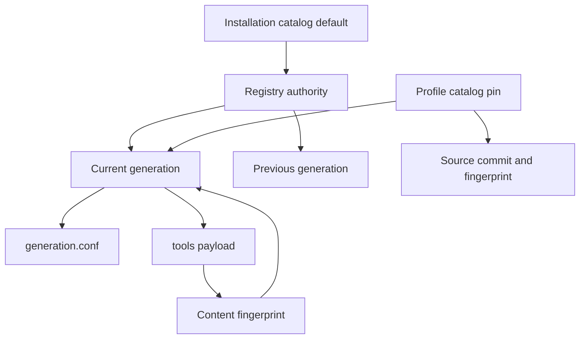
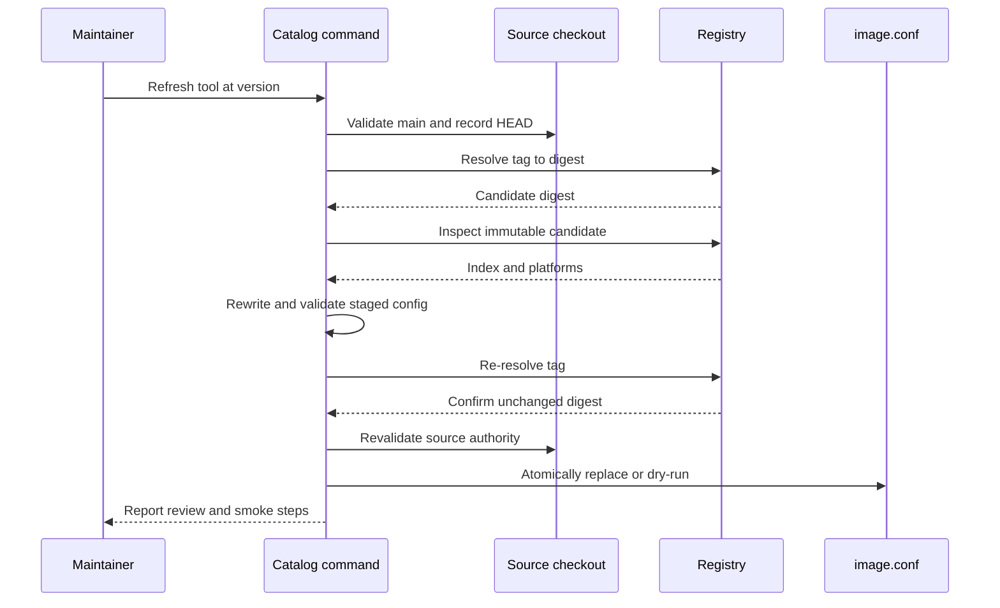
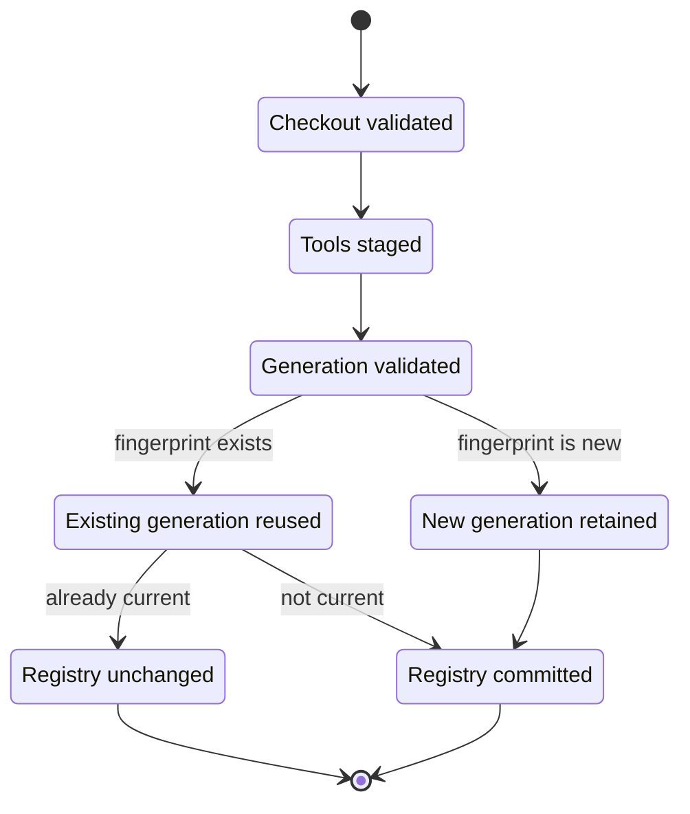

<!-- PAGE_ID: shimmy-07-catalog-lifecycle -->

📚 Relevant source files

The following files were used as context for generating this wiki page:

- [catalog.sh:36-160](https://github.com/wadebee/shimmy/blob/aaebadedc4bd1ac9f56f7e31bd394ae86cd97485/commands/catalog.sh#L36-L160)
- [catalog.sh:4-360](https://github.com/wadebee/shimmy/blob/aaebadedc4bd1ac9f56f7e31bd394ae86cd97485/lib/catalog/catalog.sh#L4-L360)
- [state.sh:4-100](https://github.com/wadebee/shimmy/blob/aaebadedc4bd1ac9f56f7e31bd394ae86cd97485/lib/catalog/state.sh#L4-L100)
- [authority.sh:18-261](https://github.com/wadebee/shimmy/blob/aaebadedc4bd1ac9f56f7e31bd394ae86cd97485/lib/catalog/authority.sh#L18-L261)
- [refresh.sh:65-521](https://github.com/wadebee/shimmy/blob/aaebadedc4bd1ac9f56f7e31bd394ae86cd97485/lib/catalog/refresh.sh#L65-L521)
- [catalog.sh:6-339](https://github.com/wadebee/shimmy/blob/aaebadedc4bd1ac9f56f7e31bd394ae86cd97485/lib/images/catalog.sh#L6-L339)
- [images.sh:4-182](https://github.com/wadebee/shimmy/blob/aaebadedc4bd1ac9f56f7e31bd394ae86cd97485/lib/images/images.sh#L4-L182)
- [CONTEXT.md:1-20](https://github.com/wadebee/shimmy/blob/aaebadedc4bd1ac9f56f7e31bd394ae86cd97485/lib/catalog/CONTEXT.md#L1-L20)
- [catalog.sh:18-300](https://github.com/wadebee/shimmy/blob/aaebadedc4bd1ac9f56f7e31bd394ae86cd97485/lib/install/catalog.sh#L18-L300)
- [profile.sh:137-293](https://github.com/wadebee/shimmy/blob/aaebadedc4bd1ac9f56f7e31bd394ae86cd97485/lib/update/profile.sh#L137-L293)
- [profile.sh:151-155](https://github.com/wadebee/shimmy/blob/aaebadedc4bd1ac9f56f7e31bd394ae86cd97485/commands/profile.sh#L151-L155)
- [CONTEXT.md:18-43](https://github.com/wadebee/shimmy/blob/aaebadedc4bd1ac9f56f7e31bd394ae86cd97485/CONTEXT.md#L18-L43)

# Catalog Lifecycle

> **Related Pages**: [[Shims and Tool Execution|08-shims-and-tool-execution.md]], [[Tool Authoring and Image Supply Chain|09-tool-authoring.md]], [[Bundled Tool Catalog|13-bundled-tools.md]]

---

<!-- BEGIN:AUTOGEN shimmy-07-catalog-lifecycle-model -->
## Catalog and Generation Model

An installation has one catalog named `default`. Its registry is stored under `catalogs/default/`, alongside retained immutable generation directories; each generation root contains exactly `generation.conf` and `tools/` ([authority.sh:95-110](https://github.com/wadebee/shimmy/blob/aaebadedc4bd1ac9f56f7e31bd394ae86cd97485/lib/catalog/authority.sh#L95-L110), [authority.sh:130-140](https://github.com/wadebee/shimmy/blob/aaebadedc4bd1ac9f56f7e31bd394ae86cd97485/lib/catalog/authority.sh#L130-L140), [authority.sh:35-54](https://github.com/wadebee/shimmy/blob/aaebadedc4bd1ac9f56f7e31bd394ae86cd97485/lib/catalog/authority.sh#L35-L54)). The payload is therefore tool data only: tool skills and metadata, version runtimes, smoke metadata, image metadata, refresh scripts, and any local image contexts accepted by the schema-1 validator ([catalog.sh:173-290](https://github.com/wadebee/shimmy/blob/aaebadedc4bd1ac9f56f7e31bd394ae86cd97485/lib/catalog/catalog.sh#L173-L290)).

Generation identity is content-derived. Shimmy hashes every regular file below `tools/`, including whether each file is executable, and converts the resulting `sha256:` fingerprint into a `sha256-…` directory name ([catalog.sh:299-327](https://github.com/wadebee/shimmy/blob/aaebadedc4bd1ac9f56f7e31bd394ae86cd97485/lib/catalog/catalog.sh#L299-L327), [state.sh:6-24](https://github.com/wadebee/shimmy/blob/aaebadedc4bd1ac9f56f7e31bd394ae86cd97485/lib/catalog/state.sh#L6-L24)). `generation.conf` is outside that fingerprint scope and records four fields: catalog format, schema, source commit, and content fingerprint ([state.sh:83-100](https://github.com/wadebee/shimmy/blob/aaebadedc4bd1ac9f56f7e31bd394ae86cd97485/lib/catalog/state.sh#L83-L100)). Validation recomputes the fingerprint and requires both the directory name and metadata to agree with the content ([authority.sh:56-93](https://github.com/wadebee/shimmy/blob/aaebadedc4bd1ac9f56f7e31bd394ae86cd97485/lib/catalog/authority.sh#L56-L93)).

The registry records the current generation, an optional previous generation, and the current generation's source commit and fingerprint ([state.sh:44-80](https://github.com/wadebee/shimmy/blob/aaebadedc4bd1ac9f56f7e31bd394ae86cd97485/lib/catalog/state.sh#L44-L80)). Profiles do not merely refer to the registry: each profile carries a four-part pin—catalog name, generation, source commit, and fingerprint—and the pin is valid only when all identities agree ([state.sh:26-41](https://github.com/wadebee/shimmy/blob/aaebadedc4bd1ac9f56f7e31bd394ae86cd97485/lib/catalog/state.sh#L26-L41)).

Sources: [CONTEXT.md:1-20](https://github.com/wadebee/shimmy/blob/aaebadedc4bd1ac9f56f7e31bd394ae86cd97485/lib/catalog/CONTEXT.md#L1-L20), [catalog.sh:173-360](https://github.com/wadebee/shimmy/blob/aaebadedc4bd1ac9f56f7e31bd394ae86cd97485/lib/catalog/catalog.sh#L173-L360), [state.sh:4-100](https://github.com/wadebee/shimmy/blob/aaebadedc4bd1ac9f56f7e31bd394ae86cd97485/lib/catalog/state.sh#L4-L100), [authority.sh:35-110](https://github.com/wadebee/shimmy/blob/aaebadedc4bd1ac9f56f7e31bd394ae86cd97485/lib/catalog/authority.sh#L35-L110)
<!-- END:AUTOGEN shimmy-07-catalog-lifecycle-model -->

---

<!-- BEGIN:AUTOGEN shimmy-07-catalog-lifecycle-inspection -->
## Inspect and Verify

The catalog command exposes three read-oriented views: `status`, `tools`, and `verify`. `status` and `tools` accept human or manifest output; `tools` can inspect the current generation or an explicitly named retained generation. `verify` can select one or more `tool` or `tool@version` values, skip authenticated records with `--public-only`, treat upstream movement as a failure with `--require-current-upstream`, and render human or manifest output ([catalog.sh:40-47](https://github.com/wadebee/shimmy/blob/aaebadedc4bd1ac9f56f7e31bd394ae86cd97485/commands/catalog.sh#L40-L47), [catalog.sh:63-113](https://github.com/wadebee/shimmy/blob/aaebadedc4bd1ac9f56f7e31bd394ae86cd97485/commands/catalog.sh#L63-L113)).

| Command | What it proves or reports |
|---|---|
| `shimmy catalog status` | Validates the complete catalog tree and reports the current generation, previous generation, source commit, and health ([authority.sh:186-204](https://github.com/wadebee/shimmy/blob/aaebadedc4bd1ac9f56f7e31bd394ae86cd97485/lib/catalog/authority.sh#L186-L204)). |
| `shimmy catalog tools` | Validates the selected generation, then lists each tool's default and all retained concrete versions in sorted order ([authority.sh:206-261](https://github.com/wadebee/shimmy/blob/aaebadedc4bd1ac9f56f7e31bd394ae86cd97485/lib/catalog/authority.sh#L206-L261)). |
| `shimmy catalog verify` | Expands selected tool/version records, inspects pinned image references, validates index type and required platforms, and evaluates upstream-tag drift ([catalog.sh:297-339](https://github.com/wadebee/shimmy/blob/aaebadedc4bd1ac9f56f7e31bd394ae86cd97485/lib/images/catalog.sh#L297-L339), [catalog.sh:204-294](https://github.com/wadebee/shimmy/blob/aaebadedc4bd1ac9f56f7e31bd394ae86cd97485/lib/images/catalog.sh#L204-L294)). |

Remote verification runs through the active profile's materialized Skopeo and jq runtimes, while image selection comes from the catalog's current registry generation ([catalog.sh:6-14](https://github.com/wadebee/shimmy/blob/aaebadedc4bd1ac9f56f7e31bd394ae86cd97485/lib/images/catalog.sh#L6-L14), [catalog.sh:89-99](https://github.com/wadebee/shimmy/blob/aaebadedc4bd1ac9f56f7e31bd394ae86cd97485/lib/images/catalog.sh#L89-L99)). An acceptable image document must be an OCI index or Docker manifest list and contain both `linux/amd64` and `linux/arm64` descriptors; arm64 may omit the variant or declare `v8` ([images.sh:4-25](https://github.com/wadebee/shimmy/blob/aaebadedc4bd1ac9f56f7e31bd394ae86cd97485/lib/images/images.sh#L4-L25)). For tag-backed upstream references, a moved tag is normally a warning, but `--require-current-upstream` promotes it to failure; digest-backed upstream references have no drift comparison ([catalog.sh:260-294](https://github.com/wadebee/shimmy/blob/aaebadedc4bd1ac9f56f7e31bd394ae86cd97485/lib/images/catalog.sh#L260-L294)).

Sources: [catalog.sh:36-113](https://github.com/wadebee/shimmy/blob/aaebadedc4bd1ac9f56f7e31bd394ae86cd97485/commands/catalog.sh#L36-L113), [authority.sh:186-261](https://github.com/wadebee/shimmy/blob/aaebadedc4bd1ac9f56f7e31bd394ae86cd97485/lib/catalog/authority.sh#L186-L261), [catalog.sh:6-339](https://github.com/wadebee/shimmy/blob/aaebadedc4bd1ac9f56f7e31bd394ae86cd97485/lib/images/catalog.sh#L6-L339), [images.sh:4-25](https://github.com/wadebee/shimmy/blob/aaebadedc4bd1ac9f56f7e31bd394ae86cd97485/lib/images/images.sh#L4-L25)
<!-- END:AUTOGEN shimmy-07-catalog-lifecycle-inspection -->

---

<!-- BEGIN:AUTOGEN shimmy-07-catalog-lifecycle-refresh -->
## Refresh a Concrete Version

`shimmy catalog refresh` is a maintainer operation against exactly one qualified `tool@version` selector. It uses the current working directory as the checkout root and supports `--dry-run` ([catalog.sh:114-149](https://github.com/wadebee/shimmy/blob/aaebadedc4bd1ac9f56f7e31bd394ae86cd97485/commands/catalog.sh#L114-L149)). The checkout must be a normalized Git worktree root on attached local `main`, with `HEAD` equal to `refs/heads/main`; refresh records that commit and revalidates it before mutation ([refresh.sh:65-120](https://github.com/wadebee/shimmy/blob/aaebadedc4bd1ac9f56f7e31bd394ae86cd97485/lib/catalog/refresh.sh#L65-L120)).

For each refreshable runtime or base-image record, Shimmy resolves the tag to a digest, requires the configured and upstream repository names to match, then inspects the candidate digest as a multi-platform index. Immutable upstream references are skipped, and the operation refuses to continue if no tag-backed record is refreshable or any candidate fails validation ([refresh.sh:196-260](https://github.com/wadebee/shimmy/blob/aaebadedc4bd1ac9f56f7e31bd394ae86cd97485/lib/catalog/refresh.sh#L196-L260)). It rewrites only the unique matching `image_default_ref` or base-image key in a staged copy, preserves the original file mode, and validates the complete candidate `image.conf` ([refresh.sh:262-292](https://github.com/wadebee/shimmy/blob/aaebadedc4bd1ac9f56f7e31bd394ae86cd97485/lib/catalog/refresh.sh#L262-L292)).

Before committing, refresh resolves every tag again and fails if an upstream moved during the transaction ([refresh.sh:294-311](https://github.com/wadebee/shimmy/blob/aaebadedc4bd1ac9f56f7e31bd394ae86cd97485/lib/catalog/refresh.sh#L294-L311)). A non-dry-run update acquires a Git-owned refresh lock, stages candidate and rollback copies on the same filesystem, atomically replaces `image.conf`, validates its fingerprint, mode, and schema, and restores the original if post-write validation fails ([refresh.sh:318-379](https://github.com/wadebee/shimmy/blob/aaebadedc4bd1ac9f56f7e31bd394ae86cd97485/lib/catalog/refresh.sh#L318-L379)). Successful output still says `PUBLISHED no` and directs the maintainer to review, run native Linux amd64 and Darwin arm64 smoke tests, commit the source diff, and publish separately ([refresh.sh:403-450](https://github.com/wadebee/shimmy/blob/aaebadedc4bd1ac9f56f7e31bd394ae86cd97485/lib/catalog/refresh.sh#L403-L450)).

Sources: [catalog.sh:114-149](https://github.com/wadebee/shimmy/blob/aaebadedc4bd1ac9f56f7e31bd394ae86cd97485/commands/catalog.sh#L114-L149), [refresh.sh:65-120](https://github.com/wadebee/shimmy/blob/aaebadedc4bd1ac9f56f7e31bd394ae86cd97485/lib/catalog/refresh.sh#L65-L120), [refresh.sh:196-379](https://github.com/wadebee/shimmy/blob/aaebadedc4bd1ac9f56f7e31bd394ae86cd97485/lib/catalog/refresh.sh#L196-L379), [refresh.sh:403-521](https://github.com/wadebee/shimmy/blob/aaebadedc4bd1ac9f56f7e31bd394ae86cd97485/lib/catalog/refresh.sh#L403-L521)
<!-- END:AUTOGEN shimmy-07-catalog-lifecycle-refresh -->

---

<!-- BEGIN:AUTOGEN shimmy-07-catalog-lifecycle-publish -->
## Publish and Reuse Generations

Publication is stricter than refresh: it requires a normalized repository root on attached local `main`, a valid `HEAD` equal to `refs/heads/main`, and an entirely clean index, worktree, and untracked state. Shimmy repeats the branch, commit, and cleanliness checks after staging so a moving source cannot become catalog authority ([catalog.sh:18-69](https://github.com/wadebee/shimmy/blob/aaebadedc4bd1ac9f56f7e31bd394ae86cd97485/lib/install/catalog.sh#L18-L69)).

Shimmy stages only the committed `tools/` tree with `git archive`, validates the payload, computes its fingerprint and generation name, writes `generation.conf`, and validates the completed staged generation before it can enter retained state ([catalog.sh:71-94](https://github.com/wadebee/shimmy/blob/aaebadedc4bd1ac9f56f7e31bd394ae86cd97485/lib/install/catalog.sh#L71-L94)). This separates content identity from provenance: the fingerprint and generation directory depend on tool content and executable modes, while `generation.conf` records the source commit outside the fingerprint ([catalog.sh:299-327](https://github.com/wadebee/shimmy/blob/aaebadedc4bd1ac9f56f7e31bd394ae86cd97485/lib/catalog/catalog.sh#L299-L327), [state.sh:83-100](https://github.com/wadebee/shimmy/blob/aaebadedc4bd1ac9f56f7e31bd394ae86cd97485/lib/catalog/state.sh#L83-L100)).

If an equivalent generation is already retained, publication validates and reuses it, including its original source commit. If that generation is already current, publication cleans up without changing the registry. Otherwise, the valid former current generation becomes `previous`, and a validated transactional registry replacement makes the staged or reused generation current ([catalog.sh:224-277](https://github.com/wadebee/shimmy/blob/aaebadedc4bd1ac9f56f7e31bd394ae86cd97485/lib/install/catalog.sh#L224-L277)). Retained generations are not deleted by publication or rollback ([CONTEXT.md:6-11](https://github.com/wadebee/shimmy/blob/aaebadedc4bd1ac9f56f7e31bd394ae86cd97485/lib/install/CONTEXT.md#L6-L11)).

Sources: [catalog.sh:18-94](https://github.com/wadebee/shimmy/blob/aaebadedc4bd1ac9f56f7e31bd394ae86cd97485/lib/install/catalog.sh#L18-L94), [catalog.sh:150-183](https://github.com/wadebee/shimmy/blob/aaebadedc4bd1ac9f56f7e31bd394ae86cd97485/lib/install/catalog.sh#L150-L183), [catalog.sh:224-277](https://github.com/wadebee/shimmy/blob/aaebadedc4bd1ac9f56f7e31bd394ae86cd97485/lib/install/catalog.sh#L224-L277), [CONTEXT.md:6-11](https://github.com/wadebee/shimmy/blob/aaebadedc4bd1ac9f56f7e31bd394ae86cd97485/lib/install/CONTEXT.md#L6-L11)
<!-- END:AUTOGEN shimmy-07-catalog-lifecycle-publish -->

---

<!-- BEGIN:AUTOGEN shimmy-07-catalog-lifecycle-rollback-adoption -->
## Rollback and Profile Adoption

`shimmy catalog rollback` changes catalog registry authority; it does not delete or rebuild a generation. Rollback requires a retained previous generation, validates it after acquiring the catalog lock, makes it current using its recorded provenance and fingerprint, and—when the old current generation is valid—records that old current generation as the new previous value ([catalog.sh:279-300](https://github.com/wadebee/shimmy/blob/aaebadedc4bd1ac9f56f7e31bd394ae86cd97485/lib/install/catalog.sh#L279-L300)). The command then renders the resulting catalog status manifest ([catalog.sh:151-160](https://github.com/wadebee/shimmy/blob/aaebadedc4bd1ac9f56f7e31bd394ae86cd97485/commands/catalog.sh#L151-L160)).

Existing profiles remain pinned when publication or rollback changes the registry. The installation model explicitly keeps profile catalog pins independent from registry changes and requires profile synchronization or shim lifecycle work for adoption ([CONTEXT.md:36-43](https://github.com/wadebee/shimmy/blob/aaebadedc4bd1ac9f56f7e31bd394ae86cd97485/CONTEXT.md#L36-L43)). Consequently, changing catalog authority can create or remove drift between a profile's pinned generation and the registry's current generation without mutating that profile.

`shimmy profile sync` is the explicit full-profile adoption route for the active invoking profile ([profile.sh:151-155](https://github.com/wadebee/shimmy/blob/aaebadedc4bd1ac9f56f7e31bd394ae86cd97485/commands/profile.sh#L151-L155), [profile.sh:185-195](https://github.com/wadebee/shimmy/blob/aaebadedc4bd1ac9f56f7e31bd394ae86cd97485/lib/update/profile.sh#L185-L195)). Sync snapshots the catalog registry's current generation, source commit, and fingerprint into a new profile catalog record, resolves tracking shims against that generation, and stages a complete materialization before locks are acquired ([profile.sh:196-238](https://github.com/wadebee/shimmy/blob/aaebadedc4bd1ac9f56f7e31bd394ae86cd97485/lib/update/profile.sh#L196-L238)). Under catalog, activation, profile, and registry locks, it revalidates the active profile, prior manifest, catalog registry, redirect configuration, and generation authority before committing the staged profile and reconciling AI-skill links ([profile.sh:245-292](https://github.com/wadebee/shimmy/blob/aaebadedc4bd1ac9f56f7e31bd394ae86cd97485/lib/update/profile.sh#L245-L292)).

Operationally, treat these as separate choices:

| Operation | Changes catalog registry authority | Changes an existing profile pin |
|---|---:|---:|
| `catalog publish` | Yes, unless content is already current ([catalog.sh:254-273](https://github.com/wadebee/shimmy/blob/aaebadedc4bd1ac9f56f7e31bd394ae86cd97485/lib/install/catalog.sh#L254-L273)) | No ([CONTEXT.md:40-43](https://github.com/wadebee/shimmy/blob/aaebadedc4bd1ac9f56f7e31bd394ae86cd97485/CONTEXT.md#L40-L43)) |
| `catalog rollback` | Yes ([catalog.sh:279-300](https://github.com/wadebee/shimmy/blob/aaebadedc4bd1ac9f56f7e31bd394ae86cd97485/lib/install/catalog.sh#L279-L300)) | No ([CONTEXT.md:40-43](https://github.com/wadebee/shimmy/blob/aaebadedc4bd1ac9f56f7e31bd394ae86cd97485/CONTEXT.md#L40-L43)) |
| `profile sync` | No | Yes, to the snapshotted current generation after authority revalidation ([profile.sh:207-215](https://github.com/wadebee/shimmy/blob/aaebadedc4bd1ac9f56f7e31bd394ae86cd97485/lib/update/profile.sh#L207-L215), [profile.sh:245-262](https://github.com/wadebee/shimmy/blob/aaebadedc4bd1ac9f56f7e31bd394ae86cd97485/lib/update/profile.sh#L245-L262)) |

Sources: [catalog.sh:151-160](https://github.com/wadebee/shimmy/blob/aaebadedc4bd1ac9f56f7e31bd394ae86cd97485/commands/catalog.sh#L151-L160), [catalog.sh:279-300](https://github.com/wadebee/shimmy/blob/aaebadedc4bd1ac9f56f7e31bd394ae86cd97485/lib/install/catalog.sh#L279-L300), [CONTEXT.md:36-43](https://github.com/wadebee/shimmy/blob/aaebadedc4bd1ac9f56f7e31bd394ae86cd97485/CONTEXT.md#L36-L43), [profile.sh:185-292](https://github.com/wadebee/shimmy/blob/aaebadedc4bd1ac9f56f7e31bd394ae86cd97485/lib/update/profile.sh#L185-L292)
<!-- END:AUTOGEN shimmy-07-catalog-lifecycle-rollback-adoption -->

---
