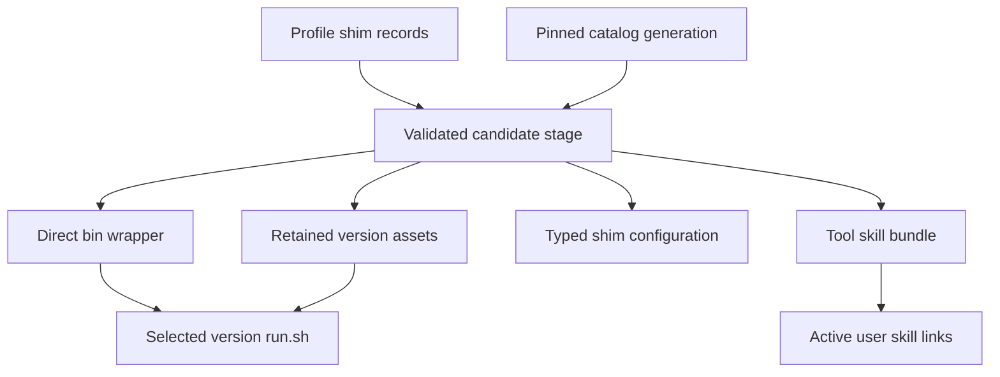
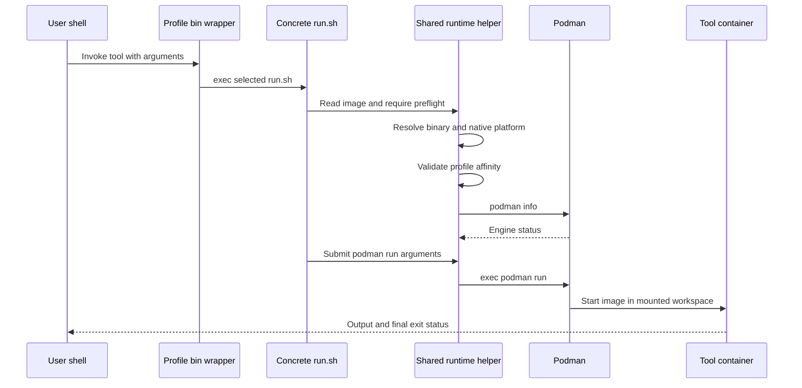

<!-- PAGE_ID: shimmy-08-shims-and-tool-execution -->

📚 Relevant source files

The following files were used as context for generating this wiki page:

- [shim.sh:21-194](https://github.com/wadebee/shimmy/blob/aaebadedc4bd1ac9f56f7e31bd394ae86cd97485/commands/shim.sh#L21-L194)
- [run-tool.sh:27-67](https://github.com/wadebee/shimmy/blob/aaebadedc4bd1ac9f56f7e31bd394ae86cd97485/commands/run-tool.sh#L27-L67)
- [shim.sh:17-711](https://github.com/wadebee/shimmy/blob/aaebadedc4bd1ac9f56f7e31bd394ae86cd97485/lib/shim/shim.sh#L17-L711)
- [state.sh:4-73](https://github.com/wadebee/shimmy/blob/aaebadedc4bd1ac9f56f7e31bd394ae86cd97485/lib/shim/state.sh#L4-L73)
- [CONTEXT.md:1-13](https://github.com/wadebee/shimmy/blob/aaebadedc4bd1ac9f56f7e31bd394ae86cd97485/lib/shim/CONTEXT.md#L1-L13)
- [podman.sh:287-522](https://github.com/wadebee/shimmy/blob/aaebadedc4bd1ac9f56f7e31bd394ae86cd97485/lib/runtime/podman.sh#L287-L522)
- [image.sh:320-325](https://github.com/wadebee/shimmy/blob/aaebadedc4bd1ac9f56f7e31bd394ae86cd97485/lib/runtime/image.sh#L320-L325)
- [log.sh:4-62](https://github.com/wadebee/shimmy/blob/aaebadedc4bd1ac9f56f7e31bd394ae86cd97485/lib/runtime/log.sh#L4-L62)
- [run.sh:1-37](https://github.com/wadebee/shimmy/blob/aaebadedc4bd1ac9f56f7e31bd394ae86cd97485/tools/jq/versions/1.8/run.sh#L1-L37)
- [smoke.conf:1-2](https://github.com/wadebee/shimmy/blob/aaebadedc4bd1ac9f56f7e31bd394ae86cd97485/tools/jq/versions/1.8/smoke.conf#L1-L2)
- [catalog.sh:242-291](https://github.com/wadebee/shimmy/blob/aaebadedc4bd1ac9f56f7e31bd394ae86cd97485/lib/catalog/catalog.sh#L242-L291)
- [testing.md:50-68](https://github.com/wadebee/shimmy/blob/aaebadedc4bd1ac9f56f7e31bd394ae86cd97485/docs/testing.md#L50-L68)

# Shims and Tool Execution

> **Related Pages**: [[Catalog Lifecycle|07-catalog-lifecycle.md]], [[Tool Authoring and Image Supply Chain|09-tool-authoring.md]], [[Runtime Security and Configuration|10-runtime-security-and-configuration.md]]

---

<!-- BEGIN:AUTOGEN shimmy-08-shims-and-tool-execution-selection -->
## Selectors and Version Policy

Shim lifecycle commands accept two selector forms: `tool` and `tool@version`. The parser rejects an empty tool, an empty version after `@`, a version containing another `@`, and names that fail Shimmy's component or version-token validation ([shim.sh:38-50](https://github.com/wadebee/shimmy/blob/aaebadedc4bd1ac9f56f7e31bd394ae86cd97485/commands/shim.sh#L38-L50)).

The selector chosen for the first `add` establishes the tool's update policy:

| Selector | Selection behavior | Recorded policy |
|---|---|---|
| `tool` | Requires an interactive terminal, lists the retained catalog versions, and uses the catalog default when the response is empty ([shim.sh:52-65](https://github.com/wadebee/shimmy/blob/aaebadedc4bd1ac9f56f7e31bd394ae86cd97485/commands/shim.sh#L52-L65)). | `tracking` ([shim.sh:162-169](https://github.com/wadebee/shimmy/blob/aaebadedc4bd1ac9f56f7e31bd394ae86cd97485/commands/shim.sh#L162-L169)). |
| `tool@version` | Selects an exact catalog version without an interactive prompt ([shim.sh:162-169](https://github.com/wadebee/shimmy/blob/aaebadedc4bd1ac9f56f7e31bd394ae86cd97485/commands/shim.sh#L162-L169)). | `pinned` when it creates the shim ([shim.sh:25-34](https://github.com/wadebee/shimmy/blob/aaebadedc4bd1ac9f56f7e31bd394ae86cd97485/commands/shim.sh#L25-L34)). |

Profile state separates one tool policy record (`tool|tracking` or `tool|pinned`) from version records (`tool|version|default` or `tool|version|exact`). Validation requires unique records, at least one retained version for every installed tool, and exactly one default version per tool ([state.sh:4-24](https://github.com/wadebee/shimmy/blob/aaebadedc4bd1ac9f56f7e31bd394ae86cd97485/lib/shim/state.sh#L4-L24), [state.sh:27-73](https://github.com/wadebee/shimmy/blob/aaebadedc4bd1ac9f56f7e31bd394ae86cd97485/lib/shim/state.sh#L27-L73)). This allows an installed shim to retain additional exact versions while exposing one version through its ordinary command name.

The source-checkout dispatcher has a different purpose. It reads `tool_default_version` and an optional `tool_selector_env` from `tool.conf`, lets that environment variable override the default, verifies the selected `run.sh` is executable, and then replaces itself with that concrete runtime ([run-tool.sh:36-67](https://github.com/wadebee/shimmy/blob/aaebadedc4bd1ac9f56f7e31bd394ae86cd97485/commands/run-tool.sh#L36-L67)). Installed profile commands instead use the version selected in profile state and embedded in the generated direct wrapper ([shim.sh:175-200](https://github.com/wadebee/shimmy/blob/aaebadedc4bd1ac9f56f7e31bd394ae86cd97485/lib/shim/shim.sh#L175-L200)).

Sources: [shim.sh:25-65](https://github.com/wadebee/shimmy/blob/aaebadedc4bd1ac9f56f7e31bd394ae86cd97485/commands/shim.sh#L25-L65), [state.sh:4-73](https://github.com/wadebee/shimmy/blob/aaebadedc4bd1ac9f56f7e31bd394ae86cd97485/lib/shim/state.sh#L4-L73), [run-tool.sh:36-67](https://github.com/wadebee/shimmy/blob/aaebadedc4bd1ac9f56f7e31bd394ae86cd97485/commands/run-tool.sh#L36-L67)
<!-- END:AUTOGEN shimmy-08-shims-and-tool-execution-selection -->

---

<!-- BEGIN:AUTOGEN shimmy-08-shims-and-tool-execution-materialization -->
## Shim Materialization

A profile-local shim is a validated set of mutually consistent assets, not only a command file. For each installed tool, Shimmy expects an executable `bin/<tool>` wrapper, a generated `config/shims/<tool>/shim.conf`, a profile-local `tools/<tool>/tool.conf`, and every retained concrete version under `tools/<tool>/versions/<version>` ([shim.sh:241-302](https://github.com/wadebee/shimmy/blob/aaebadedc4bd1ac9f56f7e31bd394ae86cd97485/lib/shim/shim.sh#L241-L302)). The generated wrapper resolves its containing profile root and directly `exec`s the selected version's `run.sh`, preserving the caller's arguments ([shim.sh:175-186](https://github.com/wadebee/shimmy/blob/aaebadedc4bd1ac9f56f7e31bd394ae86cd97485/lib/shim/shim.sh#L175-L186)).

Concrete version directories are copied from the profile's retained catalog generation and compared recursively during validation; their `smoke.conf` files are also copied into typed per-version shim configuration ([shim.sh:283-302](https://github.com/wadebee/shimmy/blob/aaebadedc4bd1ac9f56f7e31bd394ae86cd97485/lib/shim/shim.sh#L283-L302)). The materialization also includes a deterministic tool-skill bundle. Shim assets and recognized tool-skill links are staged and compensated together, so a mutation is allowed only when the invoking profile is also active and its AI-skill authority resolves to that same profile ([CONTEXT.md:7-13](https://github.com/wadebee/shimmy/blob/aaebadedc4bd1ac9f56f7e31bd394ae86cd97485/lib/shim/CONTEXT.md#L7-L13), [shim.sh:130-152](https://github.com/wadebee/shimmy/blob/aaebadedc4bd1ac9f56f7e31bd394ae86cd97485/commands/shim.sh#L130-L152)).

The ordinary command path is therefore stable (`profile/bin/<tool>`), while the wrapper's generated target changes when the profile selects a different default version. Retained non-default versions remain profile assets and can be addressed by lifecycle and smoke-test selectors even though they do not receive separate public command names ([shim.sh:267-302](https://github.com/wadebee/shimmy/blob/aaebadedc4bd1ac9f56f7e31bd394ae86cd97485/lib/shim/shim.sh#L267-L302)).

Sources: [shim.sh:175-186](https://github.com/wadebee/shimmy/blob/aaebadedc4bd1ac9f56f7e31bd394ae86cd97485/lib/shim/shim.sh#L175-L186), [shim.sh:241-302](https://github.com/wadebee/shimmy/blob/aaebadedc4bd1ac9f56f7e31bd394ae86cd97485/lib/shim/shim.sh#L241-L302), [CONTEXT.md:7-13](https://github.com/wadebee/shimmy/blob/aaebadedc4bd1ac9f56f7e31bd394ae86cd97485/lib/shim/CONTEXT.md#L7-L13), [shim.sh:130-152](https://github.com/wadebee/shimmy/blob/aaebadedc4bd1ac9f56f7e31bd394ae86cd97485/commands/shim.sh#L130-L152)
<!-- END:AUTOGEN shimmy-08-shims-and-tool-execution-materialization -->

---

<!-- BEGIN:AUTOGEN shimmy-08-shims-and-tool-execution-runtime -->
## Container Runtime Flow

The exact Podman argument set belongs to each concrete version. The jq runtime illustrates the common shape: it loads the shared image helper, reads the version-owned immutable image default, performs shared preflight, then requests `podman run --rm -i` for the native platform with `$PWD` mounted at `/work` and `/work` as the container working directory ([run.sh:1-37](https://github.com/wadebee/shimmy/blob/aaebadedc4bd1ac9f56f7e31bd394ae86cd97485/tools/jq/versions/1.8/run.sh#L1-L37), [image.sh:320-325](https://github.com/wadebee/shimmy/blob/aaebadedc4bd1ac9f56f7e31bd394ae86cd97485/lib/runtime/image.sh#L320-L325)). The direct wrapper only forwards the caller's arguments, leaving runtime options to the concrete `run.sh` ([shim.sh:175-186](https://github.com/wadebee/shimmy/blob/aaebadedc4bd1ac9f56f7e31bd394ae86cd97485/lib/shim/shim.sh#L175-L186)).

Shared preflight resolves `podman` from `PATH` or the macOS package location, normalizes supported hosts to `linux/amd64` or `linux/arm64`, enforces installed-profile affinity, and checks engine reachability with `podman info` ([podman.sh:4-29](https://github.com/wadebee/shimmy/blob/aaebadedc4bd1ac9f56f7e31bd394ae86cd97485/lib/runtime/podman.sh#L4-L29), [podman.sh:287-338](https://github.com/wadebee/shimmy/blob/aaebadedc4bd1ac9f56f7e31bd394ae86cd97485/lib/runtime/podman.sh#L287-L338), [podman.sh:417-440](https://github.com/wadebee/shimmy/blob/aaebadedc4bd1ac9f56f7e31bd394ae86cd97485/lib/runtime/podman.sh#L417-L440)). `--preview-shim` stops before execution and prints the shell-quoted Podman command; otherwise the helper uses `exec`, so Podman and the wrapped tool determine the process's final status ([podman.sh:393-415](https://github.com/wadebee/shimmy/blob/aaebadedc4bd1ac9f56f7e31bd394ae86cd97485/lib/runtime/podman.sh#L393-L415), [podman.sh:496-522](https://github.com/wadebee/shimmy/blob/aaebadedc4bd1ac9f56f7e31bd394ae86cd97485/lib/runtime/podman.sh#L496-L522)).

The shared runtime logging helper normalizes message levels, compares them by numeric priority, and writes enabled messages to standard error with an uppercase level prefix ([log.sh:4-40](https://github.com/wadebee/shimmy/blob/aaebadedc4bd1ac9f56f7e31bd394ae86cd97485/lib/runtime/log.sh#L4-L40)).

Sources: [run.sh:1-37](https://github.com/wadebee/shimmy/blob/aaebadedc4bd1ac9f56f7e31bd394ae86cd97485/tools/jq/versions/1.8/run.sh#L1-L37), [image.sh:320-325](https://github.com/wadebee/shimmy/blob/aaebadedc4bd1ac9f56f7e31bd394ae86cd97485/lib/runtime/image.sh#L320-L325), [log.sh:4-40](https://github.com/wadebee/shimmy/blob/aaebadedc4bd1ac9f56f7e31bd394ae86cd97485/lib/runtime/log.sh#L4-L40), [podman.sh:287-338](https://github.com/wadebee/shimmy/blob/aaebadedc4bd1ac9f56f7e31bd394ae86cd97485/lib/runtime/podman.sh#L287-L338), [podman.sh:393-440](https://github.com/wadebee/shimmy/blob/aaebadedc4bd1ac9f56f7e31bd394ae86cd97485/lib/runtime/podman.sh#L393-L440), [podman.sh:496-522](https://github.com/wadebee/shimmy/blob/aaebadedc4bd1ac9f56f7e31bd394ae86cd97485/lib/runtime/podman.sh#L496-L522)
<!-- END:AUTOGEN shimmy-08-shims-and-tool-execution-runtime -->

---

<!-- BEGIN:AUTOGEN shimmy-08-shims-and-tool-execution-lifecycle -->
## Add, Remove, Select, and Sync

`add`, `remove`, `set-version`, and `sync` all pass through the active-profile and AI-skill preflight before changing materialized state; `list` and `test` do not enter that mutation preflight ([shim.sh:130-169](https://github.com/wadebee/shimmy/blob/aaebadedc4bd1ac9f56f7e31bd394ae86cd97485/commands/shim.sh#L130-L169), [shim.sh:171-193](https://github.com/wadebee/shimmy/blob/aaebadedc4bd1ac9f56f7e31bd394ae86cd97485/commands/shim.sh#L171-L193)).

| Operation | Supported mutation |
|---|---|
| `add tool` | Interactively creates a tracking shim at the chosen catalog version ([shim.sh:52-65](https://github.com/wadebee/shimmy/blob/aaebadedc4bd1ac9f56f7e31bd394ae86cd97485/commands/shim.sh#L52-L65), [shim.sh:162-169](https://github.com/wadebee/shimmy/blob/aaebadedc4bd1ac9f56f7e31bd394ae86cd97485/commands/shim.sh#L162-L169)). |
| `add tool@version` | Creates a pinned shim or retains another exact version for an existing shim ([shim.sh:558-579](https://github.com/wadebee/shimmy/blob/aaebadedc4bd1ac9f56f7e31bd394ae86cd97485/lib/shim/shim.sh#L558-L579)). |
| `remove tool` | Removes the tool policy and all of its retained version records ([shim.sh:582-599](https://github.com/wadebee/shimmy/blob/aaebadedc4bd1ac9f56f7e31bd394ae86cd97485/lib/shim/shim.sh#L582-L599)). |
| `remove tool@version` | Removes an installed non-default exact version; the selected default cannot be removed this way ([shim.sh:582-599](https://github.com/wadebee/shimmy/blob/aaebadedc4bd1ac9f56f7e31bd394ae86cd97485/lib/shim/shim.sh#L582-L599)). |
| `set-version tool@version` | Promotes an installed exact version to default, demotes the old default to exact, and changes the policy to pinned ([shim.sh:602-614](https://github.com/wadebee/shimmy/blob/aaebadedc4bd1ac9f56f7e31bd394ae86cd97485/lib/shim/shim.sh#L602-L614)). |
| `sync` | For tracking tools, adopts the default from the pinned catalog generation; for every selected tool or exact selector, prepares the retained concrete version assets ([shim.sh:617-658](https://github.com/wadebee/shimmy/blob/aaebadedc4bd1ac9f56f7e31bd394ae86cd97485/lib/shim/shim.sh#L617-L658)). |

Every mutation first builds and validates a candidate and prepares required images. Commit acquires activation and profile locks, revalidates that authority did not change during staging, moves the prior assets to a backup, installs staged assets with the manifest last, and restores the backup if committed validation fails ([shim.sh:436-494](https://github.com/wadebee/shimmy/blob/aaebadedc4bd1ac9f56f7e31bd394ae86cd97485/lib/shim/shim.sh#L436-L494)). Tool-skill reconciliation is then planned and applied as an external transaction; failures roll back both the recognized links and the shim materialization before locks are released ([shim.sh:504-542](https://github.com/wadebee/shimmy/blob/aaebadedc4bd1ac9f56f7e31bd394ae86cd97485/lib/shim/shim.sh#L504-L542)).

Sources: [shim.sh:130-193](https://github.com/wadebee/shimmy/blob/aaebadedc4bd1ac9f56f7e31bd394ae86cd97485/commands/shim.sh#L130-L193), [shim.sh:436-542](https://github.com/wadebee/shimmy/blob/aaebadedc4bd1ac9f56f7e31bd394ae86cd97485/lib/shim/shim.sh#L436-L542), [shim.sh:558-658](https://github.com/wadebee/shimmy/blob/aaebadedc4bd1ac9f56f7e31bd394ae86cd97485/lib/shim/shim.sh#L558-L658)
<!-- END:AUTOGEN shimmy-08-shims-and-tool-execution-lifecycle -->

---

<!-- BEGIN:AUTOGEN shimmy-08-shims-and-tool-execution-smokes -->
## Version-Owned Smoke Tests

Each concrete version owns a `smoke.conf`. Catalog validation requires that file, requires schema version `1`, accepts `smoke_arg` and `smoke_env` keys, and requires at least one `smoke_arg` ([catalog.sh:242-278](https://github.com/wadebee/shimmy/blob/aaebadedc4bd1ac9f56f7e31bd394ae86cd97485/lib/catalog/catalog.sh#L242-L278)). A typical definition is jq's two-line configuration containing `smoke_arg=--version` ([smoke.conf:1-2](https://github.com/wadebee/shimmy/blob/aaebadedc4bd1ac9f56f7e31bd394ae86cd97485/tools/jq/versions/1.8/smoke.conf#L1-L2)).

Selector scope is explicit:

| Invocation | Versions tested |
|---|---|
| `shimmy shim test` | Every retained concrete version in the profile ([shim.sh:95-104](https://github.com/wadebee/shimmy/blob/aaebadedc4bd1ac9f56f7e31bd394ae86cd97485/commands/shim.sh#L95-L104)). |
| `shimmy shim test tool` | The tool's selected default version ([shim.sh:105-114](https://github.com/wadebee/shimmy/blob/aaebadedc4bd1ac9f56f7e31bd394ae86cd97485/commands/shim.sh#L105-L114)). |
| `shimmy shim test tool@version` | That exact installed version ([shim.sh:105-114](https://github.com/wadebee/shimmy/blob/aaebadedc4bd1ac9f56f7e31bd394ae86cd97485/commands/shim.sh#L105-L114)). |

The installed runner verifies `run.sh` is executable and `smoke.conf` exists, extracts every `smoke_arg` in file order, requires a non-empty argument list, invokes the concrete runtime, returns its failure status unchanged, and emits `shimmy_shim_test=tool|version|pass` only after success ([shim.sh:693-707](https://github.com/wadebee/shimmy/blob/aaebadedc4bd1ac9f56f7e31bd394ae86cd97485/lib/shim/shim.sh#L693-L707)). Although the catalog schema permits `smoke_env`, this installed runner only interprets `smoke_arg`; it does not construct a sanitized environment. Consequently, smoke safety depends on version authors choosing non-mutating arguments and on the runtime wrapper's normal security boundaries, not on environment isolation added by `shimmy shim test` ([catalog.sh:242-278](https://github.com/wadebee/shimmy/blob/aaebadedc4bd1ac9f56f7e31bd394ae86cd97485/lib/catalog/catalog.sh#L242-L278), [shim.sh:701-706](https://github.com/wadebee/shimmy/blob/aaebadedc4bd1ac9f56f7e31bd394ae86cd97485/lib/shim/shim.sh#L701-L706)).

These smokes are installed-runtime acceptance checks, not a copy of the repository test suite. Project guidance limits live Podman checks to non-mutating commands such as `--version`, `version`, or `--help`, and requires native Linux `amd64` and Apple Silicon macOS `arm64` smoke results when images are introduced or rotated ([testing.md:50-68](https://github.com/wadebee/shimmy/blob/aaebadedc4bd1ac9f56f7e31bd394ae86cd97485/docs/testing.md#L50-L68), [testing.md:133-139](https://github.com/wadebee/shimmy/blob/aaebadedc4bd1ac9f56f7e31bd394ae86cd97485/docs/testing.md#L133-L139)).

Sources: [catalog.sh:242-278](https://github.com/wadebee/shimmy/blob/aaebadedc4bd1ac9f56f7e31bd394ae86cd97485/lib/catalog/catalog.sh#L242-L278), [smoke.conf:1-2](https://github.com/wadebee/shimmy/blob/aaebadedc4bd1ac9f56f7e31bd394ae86cd97485/tools/jq/versions/1.8/smoke.conf#L1-L2), [shim.sh:95-117](https://github.com/wadebee/shimmy/blob/aaebadedc4bd1ac9f56f7e31bd394ae86cd97485/commands/shim.sh#L95-L117), [shim.sh:693-707](https://github.com/wadebee/shimmy/blob/aaebadedc4bd1ac9f56f7e31bd394ae86cd97485/lib/shim/shim.sh#L693-L707), [testing.md:50-68](https://github.com/wadebee/shimmy/blob/aaebadedc4bd1ac9f56f7e31bd394ae86cd97485/docs/testing.md#L50-L68)
<!-- END:AUTOGEN shimmy-08-shims-and-tool-execution-smokes -->

---
