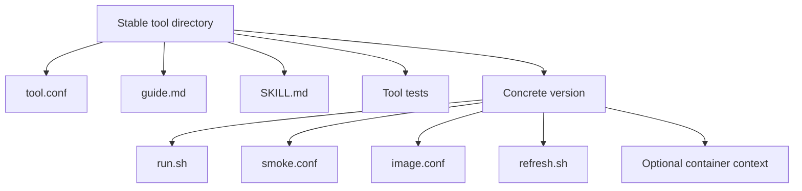
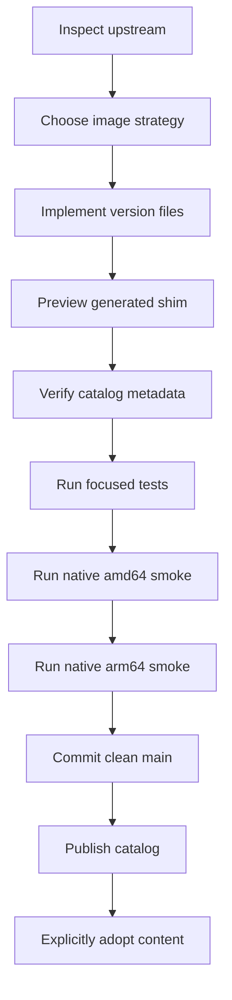

<!-- PAGE_ID: shimmy-09-tool-authoring -->

📚 Relevant source files

The following files were used as context for generating this wiki page:

- [AGENTS.md:1-23](https://github.com/wadebee/shimmy/blob/aaebadedc4bd1ac9f56f7e31bd394ae86cd97485/docs/templates/generic-shim/AGENTS.md#L1-L23)
- [SKILL.md:1-73](https://github.com/wadebee/shimmy/blob/aaebadedc4bd1ac9f56f7e31bd394ae86cd97485/docs/templates/generic-shim/SKILL.md#L1-L73)
- [SKILL.md:1-111](https://github.com/wadebee/shimmy/blob/aaebadedc4bd1ac9f56f7e31bd394ae86cd97485/plugins/shimmy/skills/shimmy-create-tool/SKILL.md#L1-L111)
- [SKILL.md:1-68](https://github.com/wadebee/shimmy/blob/aaebadedc4bd1ac9f56f7e31bd394ae86cd97485/plugins/shimmy/skills/shimmy-tool-local-build/SKILL.md#L1-L68)
- [tool.conf:1-5](https://github.com/wadebee/shimmy/blob/aaebadedc4bd1ac9f56f7e31bd394ae86cd97485/tools/jq/tool.conf#L1-L5)
- [run.sh:1-37](https://github.com/wadebee/shimmy/blob/aaebadedc4bd1ac9f56f7e31bd394ae86cd97485/tools/jq/versions/1.8/run.sh#L1-L37)
- [image.conf:1-7](https://github.com/wadebee/shimmy/blob/aaebadedc4bd1ac9f56f7e31bd394ae86cd97485/tools/jq/versions/1.8/image.conf#L1-L7)
- [smoke.conf:1-2](https://github.com/wadebee/shimmy/blob/aaebadedc4bd1ac9f56f7e31bd394ae86cd97485/tools/jq/versions/1.8/smoke.conf#L1-L2)
- [run.sh:1-44](https://github.com/wadebee/shimmy/blob/aaebadedc4bd1ac9f56f7e31bd394ae86cd97485/tools/jv/versions/6.0/run.sh#L1-L44)
- [image.conf:1-11](https://github.com/wadebee/shimmy/blob/aaebadedc4bd1ac9f56f7e31bd394ae86cd97485/tools/jv/versions/6.0/image.conf#L1-L11)
- [smoke.conf:1-2](https://github.com/wadebee/shimmy/blob/aaebadedc4bd1ac9f56f7e31bd394ae86cd97485/tools/jv/versions/6.0/smoke.conf#L1-L2)
- [refresh.sh:1-27](https://github.com/wadebee/shimmy/blob/aaebadedc4bd1ac9f56f7e31bd394ae86cd97485/tools/jv/versions/6.0/refresh.sh#L1-L27)

# Tool Authoring and Image Supply Chain

> **Related Pages**: [[Catalog Lifecycle|07-catalog-lifecycle.md]], [[Shims and Tool Execution|08-shims-and-tool-execution.md]], [[Testing and Validation|14-testing.md]]

---

<!-- BEGIN:AUTOGEN shimmy-09-tool-authoring-layout -->
## Tool and Version Layout

Shimmy separates the stable user command from its concrete implementations. A tool-level `tool.conf` selects the default concrete version and, optionally, a selector environment variable; the selected version's `run.sh` owns its Podman, image, mount, credential, and local-build behavior ([SKILL.md:24-30](https://github.com/wadebee/shimmy/blob/aaebadedc4bd1ac9f56f7e31bd394ae86cd97485/plugins/shimmy/skills/shimmy-create-tool/SKILL.md#L24-L30)).

The required surface keeps user guidance and agent guidance beside the stable tool metadata, while each version owns its runtime, smoke definition, image metadata, and refresh hook. Tool-specific tests belong under the tool only when generic catalog coverage is insufficient ([SKILL.md:32-40](https://github.com/wadebee/shimmy/blob/aaebadedc4bd1ac9f56f7e31bd394ae86cd97485/plugins/shimmy/skills/shimmy-create-tool/SKILL.md#L32-L40)).

The optional `container/Containerfile` exists only for a local-build version; it is not part of an external-image version ([SKILL.md:30-44](https://github.com/wadebee/shimmy/blob/aaebadedc4bd1ac9f56f7e31bd394ae86cd97485/docs/templates/generic-shim/SKILL.md#L30-L44)).

Sources: [SKILL.md:24-40](https://github.com/wadebee/shimmy/blob/aaebadedc4bd1ac9f56f7e31bd394ae86cd97485/plugins/shimmy/skills/shimmy-create-tool/SKILL.md#L24-L40), [SKILL.md:30-44](https://github.com/wadebee/shimmy/blob/aaebadedc4bd1ac9f56f7e31bd394ae86cd97485/docs/templates/generic-shim/SKILL.md#L30-L44)
<!-- END:AUTOGEN shimmy-09-tool-authoring-layout -->

---

<!-- BEGIN:AUTOGEN shimmy-09-tool-authoring-discovery -->
## Discovery and Companion Audit

Authoring begins with the project context, contributor rules, the shared project prompt, and a comparable existing tool. Image provenance, version, and strategy choices follow a plan-review-act step because those decisions materially shape the resulting tool ([SKILL.md:10-20](https://github.com/wadebee/shimmy/blob/aaebadedc4bd1ac9f56f7e31bd394ae86cd97485/plugins/shimmy/skills/shimmy-create-tool/SKILL.md#L10-L20)).

Before implementation, use primary upstream documentation to identify all required companion CLIs, plugins, credentials, and network privileges. If the intended image or design cannot provide a required dependency, stop for a user decision instead of silently relying on a host-installed companion tool ([SKILL.md:57-63](https://github.com/wadebee/shimmy/blob/aaebadedc4bd1ac9f56f7e31bd394ae86cd97485/plugins/shimmy/skills/shimmy-create-tool/SKILL.md#L57-L63)). Network access, privileges, credentials, and write operations must remain explicit opt-ins, and both the user guide and tool skill must document the safe default ([SKILL.md:65-67](https://github.com/wadebee/shimmy/blob/aaebadedc4bd1ac9f56f7e31bd394ae86cd97485/plugins/shimmy/skills/shimmy-create-tool/SKILL.md#L65-L67)).

For local builds, a multi-platform base image is only the starting point. Packages, installers, compiled dependencies, and release archives also require an audit for native `linux/amd64` and `linux/arm64` support ([SKILL.md:85-87](https://github.com/wadebee/shimmy/blob/aaebadedc4bd1ac9f56f7e31bd394ae86cd97485/plugins/shimmy/skills/shimmy-create-tool/SKILL.md#L85-L87)). When publisher archive names vary by architecture, the runtime must map them explicitly and fail closed for unknown architectures ([SKILL.md:47-49](https://github.com/wadebee/shimmy/blob/aaebadedc4bd1ac9f56f7e31bd394ae86cd97485/plugins/shimmy/skills/shimmy-tool-local-build/SKILL.md#L47-L49)).

Sources: [SKILL.md:10-20](https://github.com/wadebee/shimmy/blob/aaebadedc4bd1ac9f56f7e31bd394ae86cd97485/plugins/shimmy/skills/shimmy-create-tool/SKILL.md#L10-L20), [SKILL.md:57-67](https://github.com/wadebee/shimmy/blob/aaebadedc4bd1ac9f56f7e31bd394ae86cd97485/plugins/shimmy/skills/shimmy-create-tool/SKILL.md#L57-L67), [SKILL.md:85-87](https://github.com/wadebee/shimmy/blob/aaebadedc4bd1ac9f56f7e31bd394ae86cd97485/plugins/shimmy/skills/shimmy-create-tool/SKILL.md#L85-L87), [SKILL.md:47-49](https://github.com/wadebee/shimmy/blob/aaebadedc4bd1ac9f56f7e31bd394ae86cd97485/plugins/shimmy/skills/shimmy-tool-local-build/SKILL.md#L47-L49)
<!-- END:AUTOGEN shimmy-09-tool-authoring-discovery -->

---

<!-- BEGIN:AUTOGEN shimmy-09-tool-authoring-image-strategy -->
## External and Local-Build Images

Every concrete version chooses exactly one image strategy in `image.conf`: `external` for a suitable publisher image or `local-build` for a version-owned build context ([SKILL.md:47-49](https://github.com/wadebee/shimmy/blob/aaebadedc4bd1ac9f56f7e31bd394ae86cd97485/plugins/shimmy/skills/shimmy-create-tool/SKILL.md#L47-L49)).

| Strategy | Metadata and runtime behavior | Concrete example |
|---|---|---|
| External | `image.conf` records a mutable upstream discovery reference, an immutable default reference, registry access, and required platforms. The runtime reads the configured default through the shared image helper ([run.sh:20-25](https://github.com/wadebee/shimmy/blob/aaebadedc4bd1ac9f56f7e31bd394ae86cd97485/tools/jq/versions/1.8/run.sh#L20-L25)). | `jq` declares `image_source=external`, a GHCR tag for discovery, a digest-pinned default, and both required platforms ([image.conf:1-7](https://github.com/wadebee/shimmy/blob/aaebadedc4bd1ac9f56f7e31bd394ae86cd97485/tools/jq/versions/1.8/image.conf#L1-L7)). |
| Local build | `image.conf` names the version-owned context, local repository, build arguments, base-image metadata, registry access, and required platforms ([SKILL.md:30-39](https://github.com/wadebee/shimmy/blob/aaebadedc4bd1ac9f56f7e31bd394ae86cd97485/plugins/shimmy/skills/shimmy-tool-local-build/SKILL.md#L30-L39)). The runtime asks the shared helper to build or reuse the image ([run.sh:24-32](https://github.com/wadebee/shimmy/blob/aaebadedc4bd1ac9f56f7e31bd394ae86cd97485/tools/jv/versions/6.0/run.sh#L24-L32)). | `jv` declares `image_source=local-build`, the `container` context, a local repository, one base build argument, a digest-pinned Alpine base, and both required platforms ([image.conf:1-11](https://github.com/wadebee/shimmy/blob/aaebadedc4bd1ac9f56f7e31bd394ae86cd97485/tools/jv/versions/6.0/image.conf#L1-L11)). |

Repository defaults and non-`scratch` bases must use fully qualified immutable top-level OCI index or Docker manifest-list digests that contain `linux/amd64` and `linux/arm64`; mutable tags are retained only as discovery references. The configuration must not pin a platform child digest or duplicate the default in shell or a Containerfile ([SKILL.md:47-55](https://github.com/wadebee/shimmy/blob/aaebadedc4bd1ac9f56f7e31bd394ae86cd97485/plugins/shimmy/skills/shimmy-create-tool/SKILL.md#L47-L55)).

Local builds default to the cached image and use a documented `SHIMMY_<TOOL>_IMAGE_BUILD=always` opt-in for rebuilding. Image identity must change consistently when a digest or effective build argument changes, so ensure, build, and stale cleanup all resolve the same current image reference ([SKILL.md:40-51](https://github.com/wadebee/shimmy/blob/aaebadedc4bd1ac9f56f7e31bd394ae86cd97485/plugins/shimmy/skills/shimmy-tool-local-build/SKILL.md#L40-L51)).

Sources: [SKILL.md:47-55](https://github.com/wadebee/shimmy/blob/aaebadedc4bd1ac9f56f7e31bd394ae86cd97485/plugins/shimmy/skills/shimmy-create-tool/SKILL.md#L47-L55), [image.conf:1-7](https://github.com/wadebee/shimmy/blob/aaebadedc4bd1ac9f56f7e31bd394ae86cd97485/tools/jq/versions/1.8/image.conf#L1-L7), [SKILL.md:30-51](https://github.com/wadebee/shimmy/blob/aaebadedc4bd1ac9f56f7e31bd394ae86cd97485/plugins/shimmy/skills/shimmy-tool-local-build/SKILL.md#L30-L51), [image.conf:1-11](https://github.com/wadebee/shimmy/blob/aaebadedc4bd1ac9f56f7e31bd394ae86cd97485/tools/jv/versions/6.0/image.conf#L1-L11)
<!-- END:AUTOGEN shimmy-09-tool-authoring-image-strategy -->

---

<!-- BEGIN:AUTOGEN shimmy-09-tool-authoring-runtime-contract -->
## Runtime and Metadata Contracts

The concrete runtime remains a small executable POSIX shell wrapper with `#!/bin/sh` and `set -eu`. It mounts the current working directory at `/work` unless the tool documents an exception, delegates native platform selection to the shared Podman helper, and gives every Shimmy-defined environment variable the `SHIMMY_` prefix ([SKILL.md:42-45](https://github.com/wadebee/shimmy/blob/aaebadedc4bd1ac9f56f7e31bd394ae86cd97485/plugins/shimmy/skills/shimmy-create-tool/SKILL.md#L42-L45)).

The `jq` runtime illustrates the contract: it locates and sources the shared image helper, performs preflight-or-preview handling, then runs the selected image with `--rm -i`, the shared platform value, `$PWD:/work`, `/work` as the working directory, and the unchanged original argument vector ([run.sh:4-25](https://github.com/wadebee/shimmy/blob/aaebadedc4bd1ac9f56f7e31bd394ae86cd97485/tools/jq/versions/1.8/run.sh#L4-L25), [run.sh:31-37](https://github.com/wadebee/shimmy/blob/aaebadedc4bd1ac9f56f7e31bd394ae86cd97485/tools/jq/versions/1.8/run.sh#L31-L37)).

| File | Authority | Example |
|---|---|---|
| `tool.conf` | Stable tool defaults and optional selector environment ([SKILL.md:69-72](https://github.com/wadebee/shimmy/blob/aaebadedc4bd1ac9f56f7e31bd394ae86cd97485/plugins/shimmy/skills/shimmy-create-tool/SKILL.md#L69-L72)) | `jq` selects version `1.8`, has no selector environment, and declares `--version` as its smoke argument ([tool.conf:1-5](https://github.com/wadebee/shimmy/blob/aaebadedc4bd1ac9f56f7e31bd394ae86cd97485/tools/jq/tool.conf#L1-L5)). |
| `smoke.conf` | Concrete version's non-mutating smoke command ([SKILL.md:71-72](https://github.com/wadebee/shimmy/blob/aaebadedc4bd1ac9f56f7e31bd394ae86cd97485/plugins/shimmy/skills/shimmy-create-tool/SKILL.md#L71-L72)) | Both sampled versions use `--version` ([smoke.conf:1-2](https://github.com/wadebee/shimmy/blob/aaebadedc4bd1ac9f56f7e31bd394ae86cd97485/tools/jq/versions/1.8/smoke.conf#L1-L2), [smoke.conf:1-2](https://github.com/wadebee/shimmy/blob/aaebadedc4bd1ac9f56f7e31bd394ae86cd97485/tools/jv/versions/6.0/smoke.conf#L1-L2)). |
| `image.conf` | Image strategy, immutable defaults, registry access, local build inputs, and required platforms ([SKILL.md:71-74](https://github.com/wadebee/shimmy/blob/aaebadedc4bd1ac9f56f7e31bd394ae86cd97485/plugins/shimmy/skills/shimmy-create-tool/SKILL.md#L71-L74)) | The `jq` and `jv` files encode the external and local-build forms, respectively ([image.conf:1-7](https://github.com/wadebee/shimmy/blob/aaebadedc4bd1ac9f56f7e31bd394ae86cd97485/tools/jq/versions/1.8/image.conf#L1-L7), [image.conf:1-11](https://github.com/wadebee/shimmy/blob/aaebadedc4bd1ac9f56f7e31bd394ae86cd97485/tools/jv/versions/6.0/image.conf#L1-L11)). |
| `refresh.sh` | Version-local pull or build preparation; there is no central refresh case list ([SKILL.md:75-76](https://github.com/wadebee/shimmy/blob/aaebadedc4bd1ac9f56f7e31bd394ae86cd97485/plugins/shimmy/skills/shimmy-create-tool/SKILL.md#L75-L76)) | `jv` accepts `pull` as a no-op and `build` as an explicit rebuild followed by stale-image cleanup ([refresh.sh:12-25](https://github.com/wadebee/shimmy/blob/aaebadedc4bd1ac9f56f7e31bd394ae86cd97485/tools/jv/versions/6.0/refresh.sh#L12-L25)). |

Tool-specific runtime behavior stays out of `commands/run-tool.sh` and shared library dispatch; the generic command performs only source dispatch ([SKILL.md:27-30](https://github.com/wadebee/shimmy/blob/aaebadedc4bd1ac9f56f7e31bd394ae86cd97485/plugins/shimmy/skills/shimmy-create-tool/SKILL.md#L27-L30)).

Sources: [SKILL.md:24-30](https://github.com/wadebee/shimmy/blob/aaebadedc4bd1ac9f56f7e31bd394ae86cd97485/plugins/shimmy/skills/shimmy-create-tool/SKILL.md#L24-L30), [SKILL.md:42-45](https://github.com/wadebee/shimmy/blob/aaebadedc4bd1ac9f56f7e31bd394ae86cd97485/plugins/shimmy/skills/shimmy-create-tool/SKILL.md#L42-L45), [SKILL.md:69-76](https://github.com/wadebee/shimmy/blob/aaebadedc4bd1ac9f56f7e31bd394ae86cd97485/plugins/shimmy/skills/shimmy-create-tool/SKILL.md#L69-L76), [run.sh:4-37](https://github.com/wadebee/shimmy/blob/aaebadedc4bd1ac9f56f7e31bd394ae86cd97485/tools/jq/versions/1.8/run.sh#L4-L37), [refresh.sh:12-25](https://github.com/wadebee/shimmy/blob/aaebadedc4bd1ac9f56f7e31bd394ae86cd97485/tools/jv/versions/6.0/refresh.sh#L12-L25)
<!-- END:AUTOGEN shimmy-09-tool-authoring-runtime-contract -->

---

<!-- BEGIN:AUTOGEN shimmy-09-tool-authoring-acceptance -->
## Refresh and Acceptance

Validation starts with source preview and catalog metadata verification, then covers repository tests and whitespace validation. Live execution uses a non-mutating `--version`, `version`, or `--help` command only after Podman and the exact outer Shimmy wrapper command have the required approval ([SKILL.md:89-104](https://github.com/wadebee/shimmy/blob/aaebadedc4bd1ac9f56f7e31bd394ae86cd97485/plugins/shimmy/skills/shimmy-create-tool/SKILL.md#L89-L104)).

The native acceptance gate requires the version-owned smoke on Linux `amd64` and Apple Silicon macOS `arm64`; cross-emulation is not a substitute ([SKILL.md:105-106](https://github.com/wadebee/shimmy/blob/aaebadedc4bd1ac9f56f7e31bd394ae86cd97485/plugins/shimmy/skills/shimmy-create-tool/SKILL.md#L105-L106)). For local builds, the live build itself requires explicit authorization and a running Podman engine before exercising a non-mutating tool command ([SKILL.md:53-66](https://github.com/wadebee/shimmy/blob/aaebadedc4bd1ac9f56f7e31bd394ae86cd97485/plugins/shimmy/skills/shimmy-tool-local-build/SKILL.md#L53-L66)).

A digest rotation resolves the publisher tag to its top-level index, verifies both platforms and registry access, updates only the affected `image.conf`, checks local cache identity where applicable, and repeats both native smokes. The prior digest remains in Git history or review notes as the rollback reference ([SKILL.md:108-111](https://github.com/wadebee/shimmy/blob/aaebadedc4bd1ac9f56f7e31bd394ae86cd97485/plugins/shimmy/skills/shimmy-create-tool/SKILL.md#L108-L111)).

Publication is a separate lifecycle boundary: a schema-valid tool enters the immutable default catalog only through `shimmy catalog publish` from a clean, committed, attached `main`. Publishing changes catalog availability but does not alter installed profile versions; adoption remains explicit through `shimmy shim add`, `shimmy shim sync`, or `shimmy profile sync`, while an invalid partial entry fails catalog validation before mutation ([SKILL.md:78-83](https://github.com/wadebee/shimmy/blob/aaebadedc4bd1ac9f56f7e31bd394ae86cd97485/plugins/shimmy/skills/shimmy-create-tool/SKILL.md#L78-L83)).

Sources: [SKILL.md:78-111](https://github.com/wadebee/shimmy/blob/aaebadedc4bd1ac9f56f7e31bd394ae86cd97485/plugins/shimmy/skills/shimmy-create-tool/SKILL.md#L78-L111), [SKILL.md:53-68](https://github.com/wadebee/shimmy/blob/aaebadedc4bd1ac9f56f7e31bd394ae86cd97485/plugins/shimmy/skills/shimmy-tool-local-build/SKILL.md#L53-L68)
<!-- END:AUTOGEN shimmy-09-tool-authoring-acceptance -->

---
