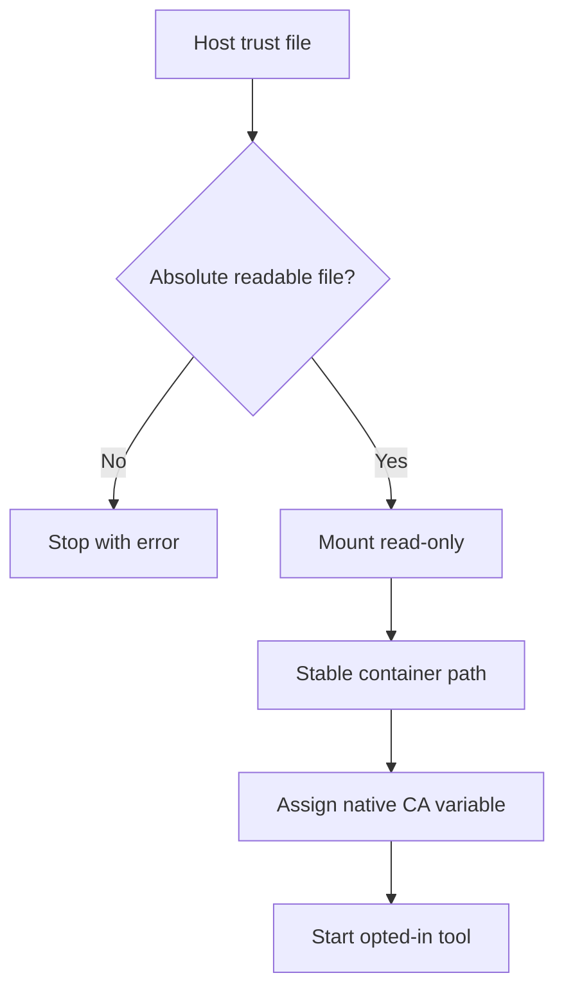
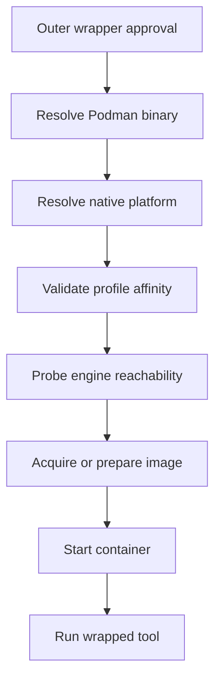

<!-- PAGE_ID: shimmy-10-runtime-security-and-configuration -->

📚 Relevant source files

The following files were used as context for generating this wiki page:

- [README.md:3-393](https://github.com/wadebee/shimmy/blob/aaebadedc4bd1ac9f56f7e31bd394ae86cd97485/README.md#L3-L393)
- [runtime-preflight.md:10-414](https://github.com/wadebee/shimmy/blob/aaebadedc4bd1ac9f56f7e31bd394ae86cd97485/docs/runtime-preflight.md#L10-L414)
- [network-tools.md:3-65](https://github.com/wadebee/shimmy/blob/aaebadedc4bd1ac9f56f7e31bd394ae86cd97485/docs/network-tools.md#L3-L65)
- [preflight-review.sh:1-28](https://github.com/wadebee/shimmy/blob/aaebadedc4bd1ac9f56f7e31bd394ae86cd97485/lib/runtime/preflight-review.sh#L1-L28)
- [podman.sh:4-522](https://github.com/wadebee/shimmy/blob/aaebadedc4bd1ac9f56f7e31bd394ae86cd97485/lib/runtime/podman.sh#L4-L522)
- [guide.md:33-65](https://github.com/wadebee/shimmy/blob/aaebadedc4bd1ac9f56f7e31bd394ae86cd97485/tools/aws/guide.md#L33-L65)
- [guide.md:24-56](https://github.com/wadebee/shimmy/blob/aaebadedc4bd1ac9f56f7e31bd394ae86cd97485/tools/nmap/guide.md#L24-L56)
- [guide.md:38-127](https://github.com/wadebee/shimmy/blob/aaebadedc4bd1ac9f56f7e31bd394ae86cd97485/tools/opnsense-mcp-read-only/guide.md#L38-L127)
- [guide.md:34-62](https://github.com/wadebee/shimmy/blob/aaebadedc4bd1ac9f56f7e31bd394ae86cd97485/tools/terraform/guide.md#L34-L62)

# Runtime Security and Configuration

> **Related Pages**: [[Shims and Tool Execution|08-shims-and-tool-execution.md]], [[AI-Agent Integration|11-ai-agent-integration.md]], [[Administration, Diagnostics, and Recovery|12-administration-and-recovery.md]]

---

<!-- BEGIN:AUTOGEN shimmy-10-runtime-security-and-configuration-environment -->
## Environment and Filesystem Boundaries

Shimmy exposes containerized implementations as host commands, but the runtime boundary remains visible: the working directory is mounted at `/work`, and the wrapper selects a native Linux platform for the container ([README.md:3-4](https://github.com/wadebee/shimmy/blob/aaebadedc4bd1ac9f56f7e31bd394ae86cd97485/README.md#L3-L4)). Tool guides define additional mounts and forwarded environment families rather than relying on one universal configuration surface.

| Boundary | Type | Declared behavior |
|---|---|---|
| Current directory | Read-write mount | AWS, Nmap, OPNsense MCP read-only, and Terraform all expose `$PWD` as `/work`; tool processes therefore operate on the caller's current workspace ([guide.md:40-45](https://github.com/wadebee/shimmy/blob/aaebadedc4bd1ac9f56f7e31bd394ae86cd97485/tools/aws/guide.md#L40-L45), [guide.md:43-46](https://github.com/wadebee/shimmy/blob/aaebadedc4bd1ac9f56f7e31bd394ae86cd97485/tools/nmap/guide.md#L43-L46), [guide.md:113-116](https://github.com/wadebee/shimmy/blob/aaebadedc4bd1ac9f56f7e31bd394ae86cd97485/tools/opnsense-mcp-read-only/guide.md#L113-L116), [guide.md:41-47](https://github.com/wadebee/shimmy/blob/aaebadedc4bd1ac9f56f7e31bd394ae86cd97485/tools/terraform/guide.md#L41-L47)). |
| Tool configuration | Tool-specific mount | AWS mounts `~/.aws` read-only at `/root/.aws`; Terraform adds the same AWS mount and may mount `~/.terraform.d/plugin-cache` at the container's root-user cache location ([guide.md:40-45](https://github.com/wadebee/shimmy/blob/aaebadedc4bd1ac9f56f7e31bd394ae86cd97485/tools/aws/guide.md#L40-L45), [guide.md:41-47](https://github.com/wadebee/shimmy/blob/aaebadedc4bd1ac9f56f7e31bd394ae86cd97485/tools/terraform/guide.md#L41-L47)). |
| Tool-native environment | Forwarded input | AWS documents `AWS_*`; Terraform documents `AWS_*` and `TF_VAR_*` as forwarded families ([guide.md:47-49](https://github.com/wadebee/shimmy/blob/aaebadedc4bd1ac9f56f7e31bd394ae86cd97485/tools/aws/guide.md#L47-L49), [guide.md:49-52](https://github.com/wadebee/shimmy/blob/aaebadedc4bd1ac9f56f7e31bd394ae86cd97485/tools/terraform/guide.md#L49-L52)). |
| Shimmy controls | Host-wrapper input | Runtime image, pull, build, trust, network, and privilege switches use names such as `SHIMMY_AWS_IMAGE`, `SHIMMY_HOST_CA_BUNDLE`, and `SHIMMY_NMAP_NETWORK`; these values control wrapper construction and are distinct from tool-native variables ([guide.md:33-38](https://github.com/wadebee/shimmy/blob/aaebadedc4bd1ac9f56f7e31bd394ae86cd97485/tools/aws/guide.md#L33-L38), [guide.md:32-41](https://github.com/wadebee/shimmy/blob/aaebadedc4bd1ac9f56f7e31bd394ae86cd97485/tools/nmap/guide.md#L32-L41)). |
| Platform | Derived runtime value | Shared runtime code accepts Linux or Darwin, normalizes `amd64`/`x86_64` and `arm64`/`aarch64`, and sets `SHIMMY_PODMAN_PLATFORM` to the corresponding native `linux/<architecture>` value ([podman.sh:287-338](https://github.com/wadebee/shimmy/blob/aaebadedc4bd1ac9f56f7e31bd394ae86cd97485/lib/runtime/podman.sh#L287-L338)). |

Container-side paths such as `/root/.aws` are part of each tool's explicit mount contract. Callers should reason about permissions at those container destinations instead of assuming that a host username or home-directory layout is reproduced inside every image.

Sources: [README.md:3-4](https://github.com/wadebee/shimmy/blob/aaebadedc4bd1ac9f56f7e31bd394ae86cd97485/README.md#L3-L4), [podman.sh:287-338](https://github.com/wadebee/shimmy/blob/aaebadedc4bd1ac9f56f7e31bd394ae86cd97485/lib/runtime/podman.sh#L287-L338), [guide.md:33-49](https://github.com/wadebee/shimmy/blob/aaebadedc4bd1ac9f56f7e31bd394ae86cd97485/tools/aws/guide.md#L33-L49), [guide.md:32-46](https://github.com/wadebee/shimmy/blob/aaebadedc4bd1ac9f56f7e31bd394ae86cd97485/tools/nmap/guide.md#L32-L46), [guide.md:113-121](https://github.com/wadebee/shimmy/blob/aaebadedc4bd1ac9f56f7e31bd394ae86cd97485/tools/opnsense-mcp-read-only/guide.md#L113-L121), [guide.md:34-62](https://github.com/wadebee/shimmy/blob/aaebadedc4bd1ac9f56f7e31bd394ae86cd97485/tools/terraform/guide.md#L34-L62)
<!-- END:AUTOGEN shimmy-10-runtime-security-and-configuration-environment -->

---

<!-- BEGIN:AUTOGEN shimmy-10-runtime-security-and-configuration-secrets -->
## Credentials and Podman Secrets

Credential delivery is implementation-specific. The documented tool contracts use read-only host configuration mounts, selected environment families, and Podman secrets; they do not collapse all credentials into one generic mechanism.

| Credential source | Type | Container exposure and constraints |
|---|---|---|
| AWS configuration directory | Read-only host mount | AWS and Terraform mount an existing `~/.aws` at `/root/.aws`; both may also receive documented `AWS_*` environment variables ([guide.md:40-49](https://github.com/wadebee/shimmy/blob/aaebadedc4bd1ac9f56f7e31bd394ae86cd97485/tools/aws/guide.md#L40-L49), [guide.md:41-52](https://github.com/wadebee/shimmy/blob/aaebadedc4bd1ac9f56f7e31bd394ae86cd97485/tools/terraform/guide.md#L41-L52)). |
| Terraform input variables | Forwarded environment | `TF_VAR_*` is forwarded to Terraform alongside `AWS_*` ([guide.md:49-52](https://github.com/wadebee/shimmy/blob/aaebadedc4bd1ac9f56f7e31bd394ae86cd97485/tools/terraform/guide.md#L49-L52)). |
| OPNsense API key and secret | Podman secrets | The setup creates two Podman secrets from standard input; selector variables name those secrets, which are mounted as `OPNSENSE_API_KEY` and `OPNSENSE_API_SECRET` ([guide.md:73-78](https://github.com/wadebee/shimmy/blob/aaebadedc4bd1ac9f56f7e31bd394ae86cd97485/tools/opnsense-mcp-read-only/guide.md#L73-L78), [guide.md:82-90](https://github.com/wadebee/shimmy/blob/aaebadedc4bd1ac9f56f7e31bd394ae86cd97485/tools/opnsense-mcp-read-only/guide.md#L82-L90)). |

For OPNsense, keep API key material in Podman secrets rather than project files or MCP configuration JSON, use a dedicated read-only account, and keep read-only credentials separate from admin credentials ([guide.md:194-201](https://github.com/wadebee/shimmy/blob/aaebadedc4bd1ac9f56f7e31bd394ae86cd97485/tools/opnsense-mcp-read-only/guide.md#L194-L201)). The read-only guide also recommends the `System: Deny config write` privilege so broader page grants do not permit saved-configuration changes ([guide.md:123-127](https://github.com/wadebee/shimmy/blob/aaebadedc4bd1ac9f56f7e31bd394ae86cd97485/tools/opnsense-mcp-read-only/guide.md#L123-L127)).

Runtime diagnostics protect sensitive configuration values: connection and registry overrides are identified by variable name while their values remain hidden ([README.md:208-210](https://github.com/wadebee/shimmy/blob/aaebadedc4bd1ac9f56f7e31bd394ae86cd97485/README.md#L208-L210)). The runtime preflight design likewise requires secret redaction and forbids printing connection URIs, identity paths, overrides, raw arguments, or captured standard error in diagnostics ([runtime-preflight.md:404-414](https://github.com/wadebee/shimmy/blob/aaebadedc4bd1ac9f56f7e31bd394ae86cd97485/docs/runtime-preflight.md#L404-L414)).

Sources: [guide.md:40-60](https://github.com/wadebee/shimmy/blob/aaebadedc4bd1ac9f56f7e31bd394ae86cd97485/tools/aws/guide.md#L40-L60), [guide.md:73-90](https://github.com/wadebee/shimmy/blob/aaebadedc4bd1ac9f56f7e31bd394ae86cd97485/tools/opnsense-mcp-read-only/guide.md#L73-L90), [guide.md:123-127](https://github.com/wadebee/shimmy/blob/aaebadedc4bd1ac9f56f7e31bd394ae86cd97485/tools/opnsense-mcp-read-only/guide.md#L123-L127), [guide.md:194-201](https://github.com/wadebee/shimmy/blob/aaebadedc4bd1ac9f56f7e31bd394ae86cd97485/tools/opnsense-mcp-read-only/guide.md#L194-L201), [guide.md:41-52](https://github.com/wadebee/shimmy/blob/aaebadedc4bd1ac9f56f7e31bd394ae86cd97485/tools/terraform/guide.md#L41-L52), [runtime-preflight.md:404-414](https://github.com/wadebee/shimmy/blob/aaebadedc4bd1ac9f56f7e31bd394ae86cd97485/docs/runtime-preflight.md#L404-L414)
<!-- END:AUTOGEN shimmy-10-runtime-security-and-configuration-secrets -->

---

<!-- BEGIN:AUTOGEN shimmy-10-runtime-security-and-configuration-trust -->
## Host CA Bundle Integration

CA-aware implementations opt in through the host-only `SHIMMY_HOST_CA_BUNDLE` control. Shared runtime code accepts an empty value as no configuration, otherwise requires an absolute path to a readable regular file, fixes the container target at `/tmp/shimmy-host-ca-bundle.pem`, and constructs an implementation-native environment assignment ([podman.sh:350-391](https://github.com/wadebee/shimmy/blob/aaebadedc4bd1ac9f56f7e31bd394ae86cd97485/lib/runtime/podman.sh#L350-L391)).

The control variable itself is not forwarded. Instead, the wrapper mounts the exact file read-only and assigns the tool's native CA variable to the stable container path; leaving the control unset or empty leaves the Podman command unchanged ([README.md:43-51](https://github.com/wadebee/shimmy/blob/aaebadedc4bd1ac9f56f7e31bd394ae86cd97485/README.md#L43-L51)).

| Implementation group | Type | Native assignment |
|---|---|---|
| AWS CLI `2.31` | Replacement-capable tool trust setting | `AWS_CA_BUNDLE` ([README.md:53-55](https://github.com/wadebee/shimmy/blob/aaebadedc4bd1ac9f56f7e31bd394ae86cd97485/README.md#L53-L55)) |
| Google Cloud CLI `573.0` | Tool-specific trust setting | `CLOUDSDK_CORE_CUSTOM_CA_CERTS_FILE` ([README.md:53-56](https://github.com/wadebee/shimmy/blob/aaebadedc4bd1ac9f56f7e31bd394ae86cd97485/README.md#L53-L56)) |
| npx `24.18`, gdrive `0.2`, Tessl `0.1` | Node trust extension | `NODE_EXTRA_CA_CERTS` ([README.md:53-57](https://github.com/wadebee/shimmy/blob/aaebadedc4bd1ac9f56f7e31bd394ae86cd97485/README.md#L53-L57)) |
| Go `1.26`, Terraform `1.15`, GitHub CLI `2.94`, Task `3.45` | Runtime trust-file assignment | `SSL_CERT_FILE` ([README.md:53-58](https://github.com/wadebee/shimmy/blob/aaebadedc4bd1ac9f56f7e31bd394ae86cd97485/README.md#L53-L58)) |
| OpenShift CLI and Skopeo versions listed in the README | Runtime trust-file assignment | `SSL_CERT_FILE` ([README.md:59](https://github.com/wadebee/shimmy/blob/aaebadedc4bd1ac9f56f7e31bd394ae86cd97485/README.md#L59)) |
| OPNsense MCP read-only `0.4` | HTTPX trust-file assignment | `SSL_CERT_FILE` ([README.md:60](https://github.com/wadebee/shimmy/blob/aaebadedc4bd1ac9f56f7e31bd394ae86cd97485/README.md#L60)) |

Trust semantics differ by implementation. Node's variable augments built-in public roots, while the AWS, Google Cloud CLI, Go, and HTTPX mechanisms can replace normal trust-file discovery or have their own precedence; use a combined public-and-corporate bundle when both are required because Shimmy does not discover, merge, parse, or install certificates ([README.md:62-67](https://github.com/wadebee/shimmy/blob/aaebadedc4bd1ac9f56f7e31bd394ae86cd97485/README.md#L62-L67)). For OPNsense verified TLS, also set `OPNSENSE_VERIFY_SSL=true`; the wrapper passes the same host path to curl with `--cacert`, mounts it read-only, and assigns `SSL_CERT_FILE` inside the container ([guide.md:54-71](https://github.com/wadebee/shimmy/blob/aaebadedc4bd1ac9f56f7e31bd394ae86cd97485/tools/opnsense-mcp-read-only/guide.md#L54-L71)).

Sources: [README.md:43-69](https://github.com/wadebee/shimmy/blob/aaebadedc4bd1ac9f56f7e31bd394ae86cd97485/README.md#L43-L69), [podman.sh:350-391](https://github.com/wadebee/shimmy/blob/aaebadedc4bd1ac9f56f7e31bd394ae86cd97485/lib/runtime/podman.sh#L350-L391), [guide.md:51-60](https://github.com/wadebee/shimmy/blob/aaebadedc4bd1ac9f56f7e31bd394ae86cd97485/tools/aws/guide.md#L51-L60), [guide.md:54-71](https://github.com/wadebee/shimmy/blob/aaebadedc4bd1ac9f56f7e31bd394ae86cd97485/tools/opnsense-mcp-read-only/guide.md#L54-L71), [guide.md:54-57](https://github.com/wadebee/shimmy/blob/aaebadedc4bd1ac9f56f7e31bd394ae86cd97485/tools/terraform/guide.md#L54-L57)
<!-- END:AUTOGEN shimmy-10-runtime-security-and-configuration-trust -->

---

<!-- BEGIN:AUTOGEN shimmy-10-runtime-security-and-configuration-network -->
## Network and Privilege Opt-Ins

Network reachability, discovery, capabilities, and rootful execution are separate authority decisions. The network guide recommends a narrow Netcat probe or TCP connect scan before discovery, and requires exact hosts, ports, and network perspective in agent workflows ([network-tools.md:18-22](https://github.com/wadebee/shimmy/blob/aaebadedc4bd1ac9f56f7e31bd394ae86cd97485/docs/network-tools.md#L18-L22), [network-tools.md:57-65](https://github.com/wadebee/shimmy/blob/aaebadedc4bd1ac9f56f7e31bd394ae86cd97485/docs/network-tools.md#L57-L65)).

| Switch or policy | Type | Security boundary |
|---|---|---|
| `SHIMMY_NMAP_NETWORK=<value>` | Network selection | Passes an explicit Podman network value; it does not imply LAN discovery or privileged execution ([guide.md:32-38](https://github.com/wadebee/shimmy/blob/aaebadedc4bd1ac9f56f7e31bd394ae86cd97485/tools/nmap/guide.md#L32-L38)). |
| `SHIMMY_NMAP_LAN_SCAN=1` | LAN-scan opt-in | Enables host networking plus raw/network capabilities for an explicitly scoped scan ([guide.md:34-38](https://github.com/wadebee/shimmy/blob/aaebadedc4bd1ac9f56f7e31bd394ae86cd97485/tools/nmap/guide.md#L34-L38)). |
| `SHIMMY_NMAP_PRIVILEGED=1` or `0` | Tool mode | Passes Nmap's `--privileged` or `--unprivileged` mode explicitly ([guide.md:39-41](https://github.com/wadebee/shimmy/blob/aaebadedc4bd1ac9f56f7e31bd394ae86cd97485/tools/nmap/guide.md#L39-L41)). |
| `SHIMMY_PODMAN_PRIVILEGED=1` | Container privilege | Adds Podman's `--privileged` only as an explicit last resort and selects a separately verified rootful connection ([guide.md:38-39](https://github.com/wadebee/shimmy/blob/aaebadedc4bd1ac9f56f7e31bd394ae86cd97485/tools/nmap/guide.md#L38-L39)). |
| `OPNSENSE_ALLOW_WRITES=true` | Application capability | Overrides the read-only default only for an intentional change window ([guide.md:80](https://github.com/wadebee/shimmy/blob/aaebadedc4bd1ac9f56f7e31bd394ae86cd97485/tools/opnsense-mcp-read-only/guide.md#L80), [guide.md:92-94](https://github.com/wadebee/shimmy/blob/aaebadedc4bd1ac9f56f7e31bd394ae86cd97485/tools/opnsense-mcp-read-only/guide.md#L92-L94)). |

Privileged container execution does not silently reuse the ordinary rootless path. Shared runtime code resolves an explicit or companion rootful connection, verifies that its Podman engine reports `Rootless=false`, and refuses the operation when no verified rootful connection is available ([podman.sh:442-493](https://github.com/wadebee/shimmy/blob/aaebadedc4bd1ac9f56f7e31bd394ae86cd97485/lib/runtime/podman.sh#L442-L493)). The Nmap guide keeps the normal default connection unchanged and recommends `-sT -Pn` against known hosts or narrow subnets when raw discovery is unnecessary ([guide.md:52-56](https://github.com/wadebee/shimmy/blob/aaebadedc4bd1ac9f56f7e31bd394ae86cd97485/tools/nmap/guide.md#L52-L56)).

On macOS, scans originate inside the selected Podman machine and can observe a different network from a native host process. That perspective difference is why `SHIMMY_PODMAN_PRIVILEGED=1` remains an explicit fallback, not a substitute for selecting the correct host, VM, or container viewpoint ([network-tools.md:45-55](https://github.com/wadebee/shimmy/blob/aaebadedc4bd1ac9f56f7e31bd394ae86cd97485/docs/network-tools.md#L45-L55)).

Sources: [network-tools.md:18-65](https://github.com/wadebee/shimmy/blob/aaebadedc4bd1ac9f56f7e31bd394ae86cd97485/docs/network-tools.md#L18-L65), [podman.sh:442-493](https://github.com/wadebee/shimmy/blob/aaebadedc4bd1ac9f56f7e31bd394ae86cd97485/lib/runtime/podman.sh#L442-L493), [guide.md:32-56](https://github.com/wadebee/shimmy/blob/aaebadedc4bd1ac9f56f7e31bd394ae86cd97485/tools/nmap/guide.md#L32-L56), [guide.md:80-94](https://github.com/wadebee/shimmy/blob/aaebadedc4bd1ac9f56f7e31bd394ae86cd97485/tools/opnsense-mcp-read-only/guide.md#L80-L94)
<!-- END:AUTOGEN shimmy-10-runtime-security-and-configuration-network -->

---

<!-- BEGIN:AUTOGEN shimmy-10-runtime-security-and-configuration-preflight -->
## Runtime Preflight and Failure Layers

The live runtime path resolves Podman, resolves the native platform, validates installed-profile affinity where applicable, probes `podman info`, then lets the version-owned runtime assemble its command and replace the wrapper process with `podman run` ([runtime-preflight.md:18-28](https://github.com/wadebee/shimmy/blob/aaebadedc4bd1ac9f56f7e31bd394ae86cd97485/docs/runtime-preflight.md#L18-L28)). Preview is a separate engine-free path that resolves only enough binary and platform state to render command text ([runtime-preflight.md:30-31](https://github.com/wadebee/shimmy/blob/aaebadedc4bd1ac9f56f7e31bd394ae86cd97485/docs/runtime-preflight.md#L30-L31), [podman.sh:403-440](https://github.com/wadebee/shimmy/blob/aaebadedc4bd1ac9f56f7e31bd394ae86cd97485/lib/runtime/podman.sh#L403-L440)).

| Layer | Type | Failure meaning and next check |
|---|---|---|
| Outer agent sandbox | Authorization boundary | A sandbox-only wrapper failure does not verify profile or engine state. Direct `podman info` approval also does not authorize nested access through a wrapper; retry the same safe outer wrapper operation with escalation when appropriate ([podman.sh:58-63](https://github.com/wadebee/shimmy/blob/aaebadedc4bd1ac9f56f7e31bd394ae86cd97485/lib/runtime/podman.sh#L58-L63)). |
| Podman binary and platform | Host prerequisite | The runtime checks `PATH`, then `/opt/podman/bin/podman` for the macOS package installation, and rejects missing Podman or unsupported host OS/architecture before contacting an engine ([podman.sh:4-37](https://github.com/wadebee/shimmy/blob/aaebadedc4bd1ac9f56f7e31bd394ae86cd97485/lib/runtime/podman.sh#L4-L37), [podman.sh:287-338](https://github.com/wadebee/shimmy/blob/aaebadedc4bd1ac9f56f7e31bd394ae86cd97485/lib/runtime/podman.sh#L287-L338)). |
| Installed-profile affinity | Authority boundary | On Darwin, validation covers the materialized profile, active record, strict engine binding, connection and registry state, machine state, workloads, and an explicit-connection probe before the generic probe ([runtime-preflight.md:33-38](https://github.com/wadebee/shimmy/blob/aaebadedc4bd1ac9f56f7e31bd394ae86cd97485/docs/runtime-preflight.md#L33-L38)). On Linux, the ordinary runtime affinity helper currently stops after materialized profile identity validation ([runtime-preflight.md:40-44](https://github.com/wadebee/shimmy/blob/aaebadedc4bd1ac9f56f7e31bd394ae86cd97485/docs/runtime-preflight.md#L40-L44)). |
| Engine reachability | Runtime prerequisite | A failed `podman info` produces engine-specific guidance, names a masking `CONTAINER_HOST` without printing its value, and retains the outer-agent-boundary reminder ([podman.sh:65-79](https://github.com/wadebee/shimmy/blob/aaebadedc4bd1ac9f56f7e31bd394ae86cd97485/lib/runtime/podman.sh#L65-L79), [podman.sh:417-428](https://github.com/wadebee/shimmy/blob/aaebadedc4bd1ac9f56f7e31bd394ae86cd97485/lib/runtime/podman.sh#L417-L428)). |
| Image acquisition | Supply/runtime setup | Image preparation errors identify the tool, version, pull-or-build action, and configured reference so the catalog entry can be inspected directly ([README.md:106-112](https://github.com/wadebee/shimmy/blob/aaebadedc4bd1ac9f56f7e31bd394ae86cd97485/README.md#L106-L112)). |
| Container setup and wrapped tool | Podman/tool result | The final helper uses `exec`, so failures after that boundary remain Podman's or the wrapped tool's result; the runtime does not replay a failed operation ([podman.sh:515-522](https://github.com/wadebee/shimmy/blob/aaebadedc4bd1ac9f56f7e31bd394ae86cd97485/lib/runtime/podman.sh#L515-L522), [runtime-preflight.md:10-16](https://github.com/wadebee/shimmy/blob/aaebadedc4bd1ac9f56f7e31bd394ae86cd97485/docs/runtime-preflight.md#L10-L16), [runtime-preflight.md:182-185](https://github.com/wadebee/shimmy/blob/aaebadedc4bd1ac9f56f7e31bd394ae86cd97485/docs/runtime-preflight.md#L182-L185)). |

The similarly named helpers in `lib/runtime/preflight-review.sh` are dormant extraction seams used only by source benchmarks; production runtimes do not source that module, and moving those helpers into production requires a separate reviewed decision ([preflight-review.sh:1-7](https://github.com/wadebee/shimmy/blob/aaebadedc4bd1ac9f56f7e31bd394ae86cd97485/lib/runtime/preflight-review.sh#L1-L7)). This distinction prevents benchmark structure from being mistaken for the current production call graph.

Sources: [README.md:106-112](https://github.com/wadebee/shimmy/blob/aaebadedc4bd1ac9f56f7e31bd394ae86cd97485/README.md#L106-L112), [README.md:387-393](https://github.com/wadebee/shimmy/blob/aaebadedc4bd1ac9f56f7e31bd394ae86cd97485/README.md#L387-L393), [runtime-preflight.md:10-50](https://github.com/wadebee/shimmy/blob/aaebadedc4bd1ac9f56f7e31bd394ae86cd97485/docs/runtime-preflight.md#L10-L50), [runtime-preflight.md:182-185](https://github.com/wadebee/shimmy/blob/aaebadedc4bd1ac9f56f7e31bd394ae86cd97485/docs/runtime-preflight.md#L182-L185), [preflight-review.sh:1-28](https://github.com/wadebee/shimmy/blob/aaebadedc4bd1ac9f56f7e31bd394ae86cd97485/lib/runtime/preflight-review.sh#L1-L28), [podman.sh:4-79](https://github.com/wadebee/shimmy/blob/aaebadedc4bd1ac9f56f7e31bd394ae86cd97485/lib/runtime/podman.sh#L4-L79), [podman.sh:403-440](https://github.com/wadebee/shimmy/blob/aaebadedc4bd1ac9f56f7e31bd394ae86cd97485/lib/runtime/podman.sh#L403-L440), [podman.sh:515-522](https://github.com/wadebee/shimmy/blob/aaebadedc4bd1ac9f56f7e31bd394ae86cd97485/lib/runtime/podman.sh#L515-L522)
<!-- END:AUTOGEN shimmy-10-runtime-security-and-configuration-preflight -->

---
