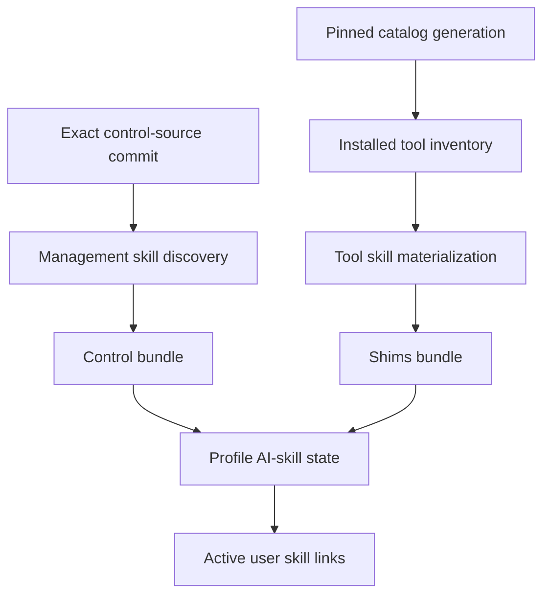
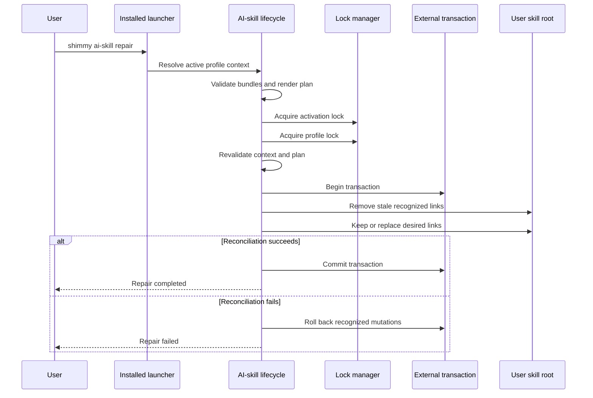

<!-- PAGE_ID: shimmy-11-ai-agent-integration -->
<details>
<summary>📚 Relevant source files</summary>

The following files were used as context for generating this wiki page:

- [ai-skill.sh:21-74](https://github.com/wadebee/shimmy/blob/aaebadedc4bd1ac9f56f7e31bd394ae86cd97485/commands/ai-skill.sh#L21-L74)
- [agent-preflight.sh:134-214](https://github.com/wadebee/shimmy/blob/aaebadedc4bd1ac9f56f7e31bd394ae86cd97485/commands/agent-preflight.sh#L134-L214)
- [ai-skill.sh:42-168](https://github.com/wadebee/shimmy/blob/aaebadedc4bd1ac9f56f7e31bd394ae86cd97485/lib/ai-skill/ai-skill.sh#L42-L168)
- [bundle.sh:4-167](https://github.com/wadebee/shimmy/blob/aaebadedc4bd1ac9f56f7e31bd394ae86cd97485/lib/ai-skill/bundle.sh#L4-L167)
- [link.sh:36-287](https://github.com/wadebee/shimmy/blob/aaebadedc4bd1ac9f56f7e31bd394ae86cd97485/lib/ai-skill/link.sh#L36-L287)
- [CONTEXT.md:1-20](https://github.com/wadebee/shimmy/blob/aaebadedc4bd1ac9f56f7e31bd394ae86cd97485/lib/ai-skill/CONTEXT.md#L1-L20)
- [SKILL.md:10-235](https://github.com/wadebee/shimmy/blob/aaebadedc4bd1ac9f56f7e31bd394ae86cd97485/plugins/shimmy/skills/shimmy-escalation/SKILL.md#L10-L235)
- [SKILL.md:10-136](https://github.com/wadebee/shimmy/blob/aaebadedc4bd1ac9f56f7e31bd394ae86cd97485/plugins/shimmy/skills/shimmy-init/SKILL.md#L10-L136)
- [runtime-preflight.md:18-26](https://github.com/wadebee/shimmy/blob/aaebadedc4bd1ac9f56f7e31bd394ae86cd97485/docs/runtime-preflight.md#L18-L26)
- [management.sh:118-318](https://github.com/wadebee/shimmy/blob/aaebadedc4bd1ac9f56f7e31bd394ae86cd97485/lib/profile/management.sh#L118-L318)
- [shim.sh:370-543](https://github.com/wadebee/shimmy/blob/aaebadedc4bd1ac9f56f7e31bd394ae86cd97485/lib/shim/shim.sh#L370-L543)
- [profile.sh:185-290](https://github.com/wadebee/shimmy/blob/aaebadedc4bd1ac9f56f7e31bd394ae86cd97485/lib/update/profile.sh#L185-L290)
- [AGENTS.md:51-54](https://github.com/wadebee/shimmy/blob/aaebadedc4bd1ac9f56f7e31bd394ae86cd97485/AGENTS.md#L51-L54)

</details>

# AI-Agent Integration

> **Related Pages**: [[Profile Lifecycle|05-profile-lifecycle.md]], [[Shims and Tool Execution|08-shims-and-tool-execution.md]], [[Runtime Security and Configuration|10-runtime-security-and-configuration.md]]

---

<!-- BEGIN:AUTOGEN shimmy-11-ai-agent-integration-bundles -->
## Control and Tool Skill Bundles

Shimmy gives an active AI agent two distinct kinds of instructions: control skills describe Shimmy lifecycle operations, while tool skills describe the profile's installed command wrappers. They are materialized into separate `control` and `shims` bundles under a profile so that their different authorities remain explicit ([CONTEXT.md:3-18](https://github.com/wadebee/shimmy/blob/aaebadedc4bd1ac9f56f7e31bd394ae86cd97485/lib/ai-skill/CONTEXT.md#L3-L18)).

| Bundle | Authoritative input | Source identity | Materialized skill names |
| --- | --- | --- | --- |
| `control` | Every valid direct skill directory under `plugins/shimmy/skills/` at the profile's exact control-source commit ([ai-skill.sh:42-77](https://github.com/wadebee/shimmy/blob/aaebadedc4bd1ac9f56f7e31bd394ae86cd97485/lib/ai-skill/ai-skill.sh#L42-L77)) | Git commit | Original management-skill name |
| `shims` | `SKILL.md` for every shim in the profile, read from its pinned retained catalog generation ([ai-skill.sh:135-168](https://github.com/wadebee/shimmy/blob/aaebadedc4bd1ac9f56f7e31bd394ae86cd97485/lib/ai-skill/ai-skill.sh#L135-L168)) | Catalog generation plus content fingerprint | `shimmy-tool-<tool>` |

Control-bundle discovery uses `git ls-tree` against the exact commit, requires a non-empty lexically sorted inventory, reads each `SKILL.md` from that commit, and records the resulting file fingerprint and control identity ([ai-skill.sh:42-77](https://github.com/wadebee/shimmy/blob/aaebadedc4bd1ac9f56f7e31bd394ae86cd97485/lib/ai-skill/ai-skill.sh#L42-L77), [ai-skill.sh:80-132](https://github.com/wadebee/shimmy/blob/aaebadedc4bd1ac9f56f7e31bd394ae86cd97485/lib/ai-skill/ai-skill.sh#L80-L132)). The tool bundle independently reads each installed tool's skill from the retained catalog generation, renames it to `shimmy-tool-<tool>`, and records a source reference containing both the generation and its fingerprint ([ai-skill.sh:135-168](https://github.com/wadebee/shimmy/blob/aaebadedc4bd1ac9f56f7e31bd394ae86cd97485/lib/ai-skill/ai-skill.sh#L135-L168)).



Bundle validation is deliberately strict. Schema 1 records bind the bundle kind, profile, source reference, skill name, content fingerprint, and identity; a control bundle must be non-empty, while a shims bundle may be empty when the profile has no installed tools ([bundle.sh:6-58](https://github.com/wadebee/shimmy/blob/aaebadedc4bd1ac9f56f7e31bd394ae86cd97485/lib/ai-skill/bundle.sh#L6-L58), [bundle.sh:77-105](https://github.com/wadebee/shimmy/blob/aaebadedc4bd1ac9f56f7e31bd394ae86cd97485/lib/ai-skill/bundle.sh#L77-L105)). Each materialized skill must have matching frontmatter, the managed-copy warning, the recorded SHA-256 fingerprint, and a regular link-free directory containing only `SKILL.md`; the bundle root itself may contain only `bundle.conf` and `skills/` ([bundle.sh:60-75](https://github.com/wadebee/shimmy/blob/aaebadedc4bd1ac9f56f7e31bd394ae86cd97485/lib/ai-skill/bundle.sh#L60-L75), [bundle.sh:107-167](https://github.com/wadebee/shimmy/blob/aaebadedc4bd1ac9f56f7e31bd394ae86cd97485/lib/ai-skill/bundle.sh#L107-L167)).

Sources: [CONTEXT.md:3-18](https://github.com/wadebee/shimmy/blob/aaebadedc4bd1ac9f56f7e31bd394ae86cd97485/lib/ai-skill/CONTEXT.md#L3-L18), [ai-skill.sh:42-168](https://github.com/wadebee/shimmy/blob/aaebadedc4bd1ac9f56f7e31bd394ae86cd97485/lib/ai-skill/ai-skill.sh#L42-L168), [bundle.sh:6-167](https://github.com/wadebee/shimmy/blob/aaebadedc4bd1ac9f56f7e31bd394ae86cd97485/lib/ai-skill/bundle.sh#L6-L167)
<!-- END:AUTOGEN shimmy-11-ai-agent-integration-bundles -->

---

<!-- BEGIN:AUTOGEN shimmy-11-ai-agent-integration-links -->
## Active-Profile Skill Links

The active profile projects bundle entries as direct child links under the recorded user skill root. Before inspection or mutation, Shimmy requires that root to equal `$HOME/.agents/skills`, be a real directory rather than a link, and have a safe parent chain ([ai-skill.sh:294-328](https://github.com/wadebee/shimmy/blob/aaebadedc4bd1ac9f56f7e31bd394ae86cd97485/lib/ai-skill/ai-skill.sh#L294-L328)). A projected link must resolve to the exact profile bundle path `profiles/<profile>/ai-skills/<kind>/skills/<name>` and the skill name must be declared by that bundle ([link.sh:6-34](https://github.com/wadebee/shimmy/blob/aaebadedc4bd1ac9f56f7e31bd394ae86cd97485/lib/ai-skill/link.sh#L6-L34)).

Shimmy classifies every exact destination before deciding what to do:

| Classification family | Meaning | Reconciliation result |
| --- | --- | --- |
| `shimmy-link-current` | The link already targets the desired bundle skill ([link.sh:42-53](https://github.com/wadebee/shimmy/blob/aaebadedc4bd1ac9f56f7e31bd394ae86cd97485/lib/ai-skill/link.sh#L42-L53)) | Keep it |
| Current or wrong-profile Shimmy link, including broken variants | The name is a recognized Shimmy-owned direct link but has the wrong target or state ([link.sh:55-72](https://github.com/wadebee/shimmy/blob/aaebadedc4bd1ac9f56f7e31bd394ae86cd97485/lib/ai-skill/link.sh#L55-L72)) | Replace it; its prior target is recoverable during rollback |
| `file`, `directory-empty`, `directory-nonempty`, `foreign-link`, or `foreign-link-broken` | The exact bundle-declared name is occupied by non-Shimmy content ([link.sh:76-97](https://github.com/wadebee/shimmy/blob/aaebadedc4bd1ac9f56f7e31bd394ae86cd97485/lib/ai-skill/link.sh#L76-L97)) | Warn, overwrite that exact destination without backup, and mark the prior content irrecoverable |
| `special` | The destination is another filesystem object type ([link.sh:99-101](https://github.com/wadebee/shimmy/blob/aaebadedc4bd1ac9f56f7e31bd394ae86cd97485/lib/ai-skill/link.sh#L99-L101)) | Reject replacement |
| `empty` | Nothing occupies the declared name ([link.sh:103-104](https://github.com/wadebee/shimmy/blob/aaebadedc4bd1ac9f56f7e31bd394ae86cd97485/lib/ai-skill/link.sh#L103-L104)) | Create the link |

These states are computed without walking or claiming arbitrary descendants of the user skill root ([link.sh:36-104](https://github.com/wadebee/shimmy/blob/aaebadedc4bd1ac9f56f7e31bd394ae86cd97485/lib/ai-skill/link.sh#L36-L104)). During planning, recognized Shimmy links absent from the desired bundle inventory are identified as stale and removed, while only desired names are kept or replaced; unrelated names are not selected for cleanup ([ai-skill.sh:389-452](https://github.com/wadebee/shimmy/blob/aaebadedc4bd1ac9f56f7e31bd394ae86cd97485/lib/ai-skill/ai-skill.sh#L389-L452)).

Replacement stages a new symbolic link in the user skill root and moves it into the exact destination. Rollback records can restore recognized prior Shimmy links or remove a newly created link, but foreign content at an exact declared collision is explicitly registered as irrecoverable before it is removed ([link.sh:209-287](https://github.com/wadebee/shimmy/blob/aaebadedc4bd1ac9f56f7e31bd394ae86cd97485/lib/ai-skill/link.sh#L209-L287)). This is why the command help states both sides of the ownership contract: exact bundle-declared names are overwritten without backup, but the user skill root is never recursively cleaned ([ai-skill.sh:21-31](https://github.com/wadebee/shimmy/blob/aaebadedc4bd1ac9f56f7e31bd394ae86cd97485/commands/ai-skill.sh#L21-L31)).

Sources: [ai-skill.sh:294-328](https://github.com/wadebee/shimmy/blob/aaebadedc4bd1ac9f56f7e31bd394ae86cd97485/lib/ai-skill/ai-skill.sh#L294-L328), [ai-skill.sh:389-490](https://github.com/wadebee/shimmy/blob/aaebadedc4bd1ac9f56f7e31bd394ae86cd97485/lib/ai-skill/ai-skill.sh#L389-L490), [link.sh:6-104](https://github.com/wadebee/shimmy/blob/aaebadedc4bd1ac9f56f7e31bd394ae86cd97485/lib/ai-skill/link.sh#L6-L104), [link.sh:209-287](https://github.com/wadebee/shimmy/blob/aaebadedc4bd1ac9f56f7e31bd394ae86cd97485/lib/ai-skill/link.sh#L209-L287)
<!-- END:AUTOGEN shimmy-11-ai-agent-integration-links -->

---

<!-- BEGIN:AUTOGEN shimmy-11-ai-agent-integration-reconciliation -->
## Inspect and Repair

AI-skill lifecycle commands must run through an installed profile launcher because the command requires `SHIMMY_CONFIG_ROOT`. The supported interface is:

```text
shimmy ai-skill list [--format human|manifest]
shimmy ai-skill repair
```

`list` resolves the active installation context and renders both bundle status and per-skill link classification. Human output is intended for operators; manifest output emits stable `shimmy_ai_skill_bundle=` and `shimmy_ai_skill=` records containing kind, status or link classification, fingerprints, identities, and encoded destinations ([ai-skill.sh:49-70](https://github.com/wadebee/shimmy/blob/aaebadedc4bd1ac9f56f7e31bd394ae86cd97485/commands/ai-skill.sh#L49-L70), [ai-skill.sh:492-546](https://github.com/wadebee/shimmy/blob/aaebadedc4bd1ac9f56f7e31bd394ae86cd97485/lib/ai-skill/ai-skill.sh#L492-L546)). Profile status also reports each bundle's validity and, for the active profile, the count of current versus expected direct links ([management.sh:420-476](https://github.com/wadebee/shimmy/blob/aaebadedc4bd1ac9f56f7e31bd394ae86cd97485/lib/profile/management.sh#L420-L476)).



Repair first validates the profile, catalog authority, supported bundle consistency, and desired link plan. It then acquires the activation lock followed by the active profile lock, resolves and validates the context again under those locks, starts an external transaction, applies reconciliation, and commits; a failure triggers rollback before locks are released ([ai-skill.sh:548-588](https://github.com/wadebee/shimmy/blob/aaebadedc4bd1ac9f56f7e31bd394ae86cd97485/lib/ai-skill/ai-skill.sh#L548-L588)). Malformed supported bundles block mutation, while an unsupported bundle schema is skipped and causes repair to complete with a warning status of 2 after reconciling supported kinds ([ai-skill.sh:171-210](https://github.com/wadebee/shimmy/blob/aaebadedc4bd1ac9f56f7e31bd394ae86cd97485/lib/ai-skill/ai-skill.sh#L171-L210), [ai-skill.sh:232-291](https://github.com/wadebee/shimmy/blob/aaebadedc4bd1ac9f56f7e31bd394ae86cd97485/lib/ai-skill/ai-skill.sh#L232-L291), [ai-skill.sh:584-588](https://github.com/wadebee/shimmy/blob/aaebadedc4bd1ac9f56f7e31bd394ae86cd97485/lib/ai-skill/ai-skill.sh#L584-L588)).

Reconciliation is also part of the transactions that change which skills should be active:

- Profile activation prepares the target profile's skill plan, includes link reconciliation in the same external transaction as active-profile authority replacement, and treats link failure as an activation failure ([management.sh:230-258](https://github.com/wadebee/shimmy/blob/aaebadedc4bd1ac9f56f7e31bd394ae86cd97485/lib/profile/management.sh#L230-L258), [management.sh:299-315](https://github.com/wadebee/shimmy/blob/aaebadedc4bd1ac9f56f7e31bd394ae86cd97485/lib/profile/management.sh#L299-L315)).
- A shim mutation stages and validates a new tool bundle, commits the profile materialization, then reconciles direct user links transactionally; failure restores both the link state and the prior shim assets ([shim.sh:370-395](https://github.com/wadebee/shimmy/blob/aaebadedc4bd1ac9f56f7e31bd394ae86cd97485/lib/shim/shim.sh#L370-L395), [shim.sh:504-543](https://github.com/wadebee/shimmy/blob/aaebadedc4bd1ac9f56f7e31bd394ae86cd97485/lib/shim/shim.sh#L504-L543)).
- Profile synchronization fetches and stages a new control source and current catalog materialization, revalidates locked state, then reconciles links in an external transaction; reconciliation failure restores the previous profile assets ([profile.sh:185-243](https://github.com/wadebee/shimmy/blob/aaebadedc4bd1ac9f56f7e31bd394ae86cd97485/lib/update/profile.sh#L185-L243), [profile.sh:245-290](https://github.com/wadebee/shimmy/blob/aaebadedc4bd1ac9f56f7e31bd394ae86cd97485/lib/update/profile.sh#L245-L290)).

Sources: [ai-skill.sh:49-70](https://github.com/wadebee/shimmy/blob/aaebadedc4bd1ac9f56f7e31bd394ae86cd97485/commands/ai-skill.sh#L49-L70), [ai-skill.sh:171-210](https://github.com/wadebee/shimmy/blob/aaebadedc4bd1ac9f56f7e31bd394ae86cd97485/lib/ai-skill/ai-skill.sh#L171-L210), [ai-skill.sh:492-588](https://github.com/wadebee/shimmy/blob/aaebadedc4bd1ac9f56f7e31bd394ae86cd97485/lib/ai-skill/ai-skill.sh#L492-L588), [management.sh:230-315](https://github.com/wadebee/shimmy/blob/aaebadedc4bd1ac9f56f7e31bd394ae86cd97485/lib/profile/management.sh#L230-L315), [shim.sh:504-543](https://github.com/wadebee/shimmy/blob/aaebadedc4bd1ac9f56f7e31bd394ae86cd97485/lib/shim/shim.sh#L504-L543), [profile.sh:185-290](https://github.com/wadebee/shimmy/blob/aaebadedc4bd1ac9f56f7e31bd394ae86cd97485/lib/update/profile.sh#L185-L290)
<!-- END:AUTOGEN shimmy-11-ai-agent-integration-reconciliation -->

---

<!-- BEGIN:AUTOGEN shimmy-11-ai-agent-integration-preflight -->
## Agent Preflight and Approvals

`commands/agent-preflight.sh` is a discovery and guidance tool for narrow AI-agent approvals. Without `--smoke`, it inventories active-profile and repository shims and prints a JSON-array `agent_prefix_rule` plus a concrete smoke command for each; with `--smoke`, it also executes the selected non-mutating checks ([agent-preflight.sh:28-56](https://github.com/wadebee/shimmy/blob/aaebadedc4bd1ac9f56f7e31bd394ae86cd97485/commands/agent-preflight.sh#L28-L56), [agent-preflight.sh:187-215](https://github.com/wadebee/shimmy/blob/aaebadedc4bd1ac9f56f7e31bd394ae86cd97485/commands/agent-preflight.sh#L187-L215)). Smoke arguments come from version-owned `smoke.conf`; if none exists, the default is `--version`, and local-build tools add `--preview-shim` before the smoke arguments ([agent-preflight.sh:134-150](https://github.com/wadebee/shimmy/blob/aaebadedc4bd1ac9f56f7e31bd394ae86cd97485/commands/agent-preflight.sh#L134-L150)).

| Situation | Required agent behavior |
| --- | --- |
| Pre-authorizing harmless wrapper checks | Use the generated exact smoke-command prefixes; do not request a broad shell, Podman, or wrapper prefix ([SKILL.md:145-180](https://github.com/wadebee/shimmy/blob/aaebadedc4bd1ac9f56f7e31bd394ae86cd97485/plugins/shimmy/skills/shimmy-escalation/SKILL.md#L145-L180)). |
| The actual safe operation already has an approved wrapper prefix | Run that exact operation with outer-command escalation first; do not insert a preliminary sandboxed Podman probe or version smoke ([SKILL.md:21-24](https://github.com/wadebee/shimmy/blob/aaebadedc4bd1ac9f56f7e31bd394ae86cd97485/plugins/shimmy/skills/shimmy-escalation/SKILL.md#L21-L24)). |
| A sandbox-only wrapper or `podman info` call reports denial, unreachable, unknown, or `operation not permitted` | Record the profile as **unverified from the sandbox**, then retry the same safe outer command once with exact escalation. Do not infer that the engine is inactive ([SKILL.md:117-129](https://github.com/wadebee/shimmy/blob/aaebadedc4bd1ac9f56f7e31bd394ae86cd97485/plugins/shimmy/skills/shimmy-escalation/SKILL.md#L117-L129)). |
| The escalated wrapper still proves a profile or engine problem | Move to the `shimmy-init` recovery workflow: inspect the exact installed profile launcher, run `profile status` and named activation `--dry-run`, and request separate approval for the exact activation command ([SKILL.md:29-77](https://github.com/wadebee/shimmy/blob/aaebadedc4bd1ac9f56f7e31bd394ae86cd97485/plugins/shimmy/skills/shimmy-init/SKILL.md#L29-L77)). |
| Activation would interrupt running workloads | Stop and obtain separate confirmation before adding `--stop-running` ([SKILL.md:78-90](https://github.com/wadebee/shimmy/blob/aaebadedc4bd1ac9f56f7e31bd394ae86cd97485/plugins/shimmy/skills/shimmy-init/SKILL.md#L78-L90)). |

The preflight command makes the approval boundary explicit: successful direct `podman info` does not authorize Podman access nested inside a wrapper, and approval of a wrapper does not authorize profile activation ([agent-preflight.sh:339-381](https://github.com/wadebee/shimmy/blob/aaebadedc4bd1ac9f56f7e31bd394ae86cd97485/commands/agent-preflight.sh#L339-L381)). The escalation skill likewise states that a skill cannot itself grant or persist permission and requires reporting what the execution environment actually approved ([SKILL.md:10-24](https://github.com/wadebee/shimmy/blob/aaebadedc4bd1ac9f56f7e31bd394ae86cd97485/plugins/shimmy/skills/shimmy-escalation/SKILL.md#L10-L24)).

For Codex, the documented adapter sends the smoke command directly with `login=false`, `sandbox_permissions="require_escalated"`, a narrow exact-command `prefix_rule`, and a justification naming the wrapper. Commands must remain individual outer calls rather than being hidden inside `sh -c`, a login shell, a pipeline, or another compound command; `podman info` approval does not cover wrappers, and wrapper approval does not cover activation or machine startup ([SKILL.md:145-180](https://github.com/wadebee/shimmy/blob/aaebadedc4bd1ac9f56f7e31bd394ae86cd97485/plugins/shimmy/skills/shimmy-escalation/SKILL.md#L145-L180)). Safe smoke checks must be documented local version or help operations that do not modify data, require credentials, start services, scan targets, install packages, or call remote APIs ([SKILL.md:182-202](https://github.com/wadebee/shimmy/blob/aaebadedc4bd1ac9f56f7e31bd394ae86cd97485/plugins/shimmy/skills/shimmy-escalation/SKILL.md#L182-L202)).

Engine recovery begins only after an escalated wrapper invocation establishes an engine or profile problem, or after an explicit request to inspect or activate a profile. It uses the selected profile's absolute installed launcher for status, dry-run, and any separately approved activation; it never substitutes direct Podman machine provisioning, adoption, renaming, or deletion ([SKILL.md:29-70](https://github.com/wadebee/shimmy/blob/aaebadedc4bd1ac9f56f7e31bd394ae86cd97485/plugins/shimmy/skills/shimmy-init/SKILL.md#L29-L70), [SKILL.md:70-102](https://github.com/wadebee/shimmy/blob/aaebadedc4bd1ac9f56f7e31bd394ae86cd97485/plugins/shimmy/skills/shimmy-init/SKILL.md#L70-L102)).

Sources: [agent-preflight.sh:28-56](https://github.com/wadebee/shimmy/blob/aaebadedc4bd1ac9f56f7e31bd394ae86cd97485/commands/agent-preflight.sh#L28-L56), [agent-preflight.sh:134-215](https://github.com/wadebee/shimmy/blob/aaebadedc4bd1ac9f56f7e31bd394ae86cd97485/commands/agent-preflight.sh#L134-L215), [agent-preflight.sh:339-381](https://github.com/wadebee/shimmy/blob/aaebadedc4bd1ac9f56f7e31bd394ae86cd97485/commands/agent-preflight.sh#L339-L381), [SKILL.md:10-24](https://github.com/wadebee/shimmy/blob/aaebadedc4bd1ac9f56f7e31bd394ae86cd97485/plugins/shimmy/skills/shimmy-escalation/SKILL.md#L10-L24), [SKILL.md:145-202](https://github.com/wadebee/shimmy/blob/aaebadedc4bd1ac9f56f7e31bd394ae86cd97485/plugins/shimmy/skills/shimmy-escalation/SKILL.md#L145-L202), [SKILL.md:29-102](https://github.com/wadebee/shimmy/blob/aaebadedc4bd1ac9f56f7e31bd394ae86cd97485/plugins/shimmy/skills/shimmy-init/SKILL.md#L29-L102)
<!-- END:AUTOGEN shimmy-11-ai-agent-integration-preflight -->

---

<!-- BEGIN:AUTOGEN shimmy-11-ai-agent-integration-authority -->
## Canonical Source and Update Boundaries

The canonical management skills live in `plugins/shimmy/skills/`, and canonical tool skills live at `tools/<tool>/SKILL.md`; generated copies under `.agents/skills/` are not source files to edit ([AGENTS.md:51-54](https://github.com/wadebee/shimmy/blob/aaebadedc4bd1ac9f56f7e31bd394ae86cd97485/AGENTS.md#L51-L54)). Repository-local adapter trees are not an alternative projection mechanism: installed active-profile bundles own the exact direct links in the user's skill root, and those links are reconciled only by profile activation, shim lifecycle operations, or `shimmy ai-skill repair` ([AGENTS.md:101-104](https://github.com/wadebee/shimmy/blob/aaebadedc4bd1ac9f56f7e31bd394ae86cd97485/AGENTS.md#L101-L104)).

Every canonical skill includes a managed-copy warning stating that reconciliation may overwrite its exact bundle-declared destination without backup, does not delete unrelated skill names, and profile copies must not be edited ([SKILL.md:1-6](https://github.com/wadebee/shimmy/blob/aaebadedc4bd1ac9f56f7e31bd394ae86cd97485/plugins/shimmy/skills/shimmy-escalation/SKILL.md#L1-L6)). The materializer validates that warning at line 6 and writes a normalized copy into the profile bundle; editing a materialized copy would therefore bypass the canonical commit or catalog source and may also invalidate its recorded fingerprint ([bundle.sh:60-75](https://github.com/wadebee/shimmy/blob/aaebadedc4bd1ac9f56f7e31bd394ae86cd97485/lib/ai-skill/bundle.sh#L60-L75), [ai-skill.sh:22-40](https://github.com/wadebee/shimmy/blob/aaebadedc4bd1ac9f56f7e31bd394ae86cd97485/lib/ai-skill/ai-skill.sh#L22-L40)).

Management-skill changes become available to a profile only when its exact control-source commit changes. `profile sync` fetches and stages a fresh control checkout, prepares a new profile materialization with the resolved source commit and current catalog pin, locks and revalidates the installation, then reconciles the active user links in the same recovery-aware workflow ([profile.sh:185-243](https://github.com/wadebee/shimmy/blob/aaebadedc4bd1ac9f56f7e31bd394ae86cd97485/lib/update/profile.sh#L185-L243), [profile.sh:245-290](https://github.com/wadebee/shimmy/blob/aaebadedc4bd1ac9f56f7e31bd394ae86cd97485/lib/update/profile.sh#L245-L290)). Tool-skill changes follow the profile's retained catalog and shim lifecycle instead: the shims bundle source reference must match the profile's catalog generation and fingerprint, and its skill names must exactly match the profile's shim records ([ai-skill.sh:212-229](https://github.com/wadebee/shimmy/blob/aaebadedc4bd1ac9f56f7e31bd394ae86cd97485/lib/ai-skill/ai-skill.sh#L212-L229), [ai-skill.sh:232-291](https://github.com/wadebee/shimmy/blob/aaebadedc4bd1ac9f56f7e31bd394ae86cd97485/lib/ai-skill/ai-skill.sh#L232-L291)).

In practical terms, edit canonical sources, then use the lifecycle operation that adopts those sources. Do not hand-edit profile copies or links: repair re-projects the current bundle state, while sync or shim lifecycle work changes which canonical bundle state the profile owns.

Sources: [AGENTS.md:51-54](https://github.com/wadebee/shimmy/blob/aaebadedc4bd1ac9f56f7e31bd394ae86cd97485/AGENTS.md#L51-L54), [AGENTS.md:101-104](https://github.com/wadebee/shimmy/blob/aaebadedc4bd1ac9f56f7e31bd394ae86cd97485/AGENTS.md#L101-L104), [SKILL.md:1-6](https://github.com/wadebee/shimmy/blob/aaebadedc4bd1ac9f56f7e31bd394ae86cd97485/plugins/shimmy/skills/shimmy-escalation/SKILL.md#L1-L6), [bundle.sh:60-75](https://github.com/wadebee/shimmy/blob/aaebadedc4bd1ac9f56f7e31bd394ae86cd97485/lib/ai-skill/bundle.sh#L60-L75), [ai-skill.sh:22-40](https://github.com/wadebee/shimmy/blob/aaebadedc4bd1ac9f56f7e31bd394ae86cd97485/lib/ai-skill/ai-skill.sh#L22-L40), [profile.sh:185-290](https://github.com/wadebee/shimmy/blob/aaebadedc4bd1ac9f56f7e31bd394ae86cd97485/lib/update/profile.sh#L185-L290)
<!-- END:AUTOGEN shimmy-11-ai-agent-integration-authority -->

---
