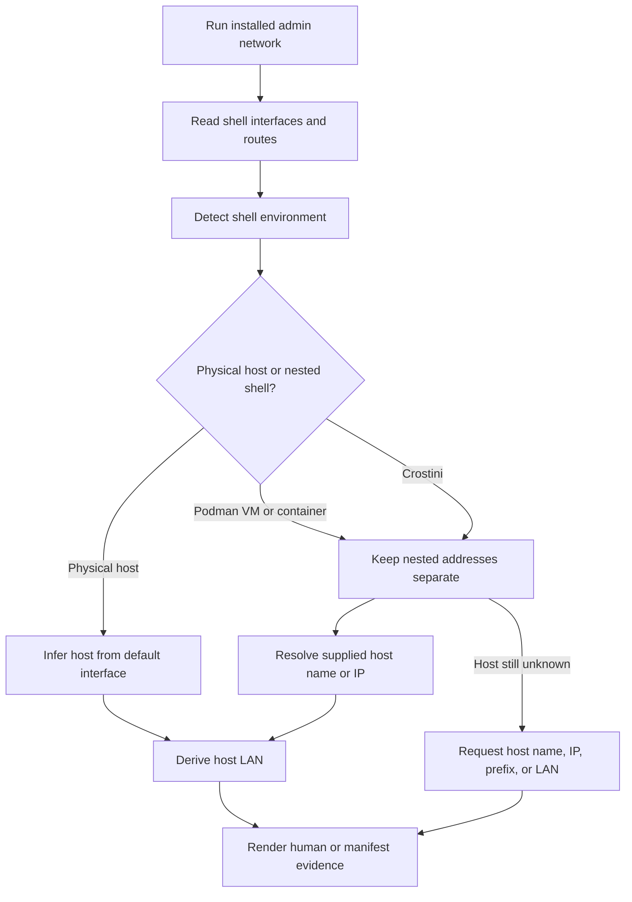
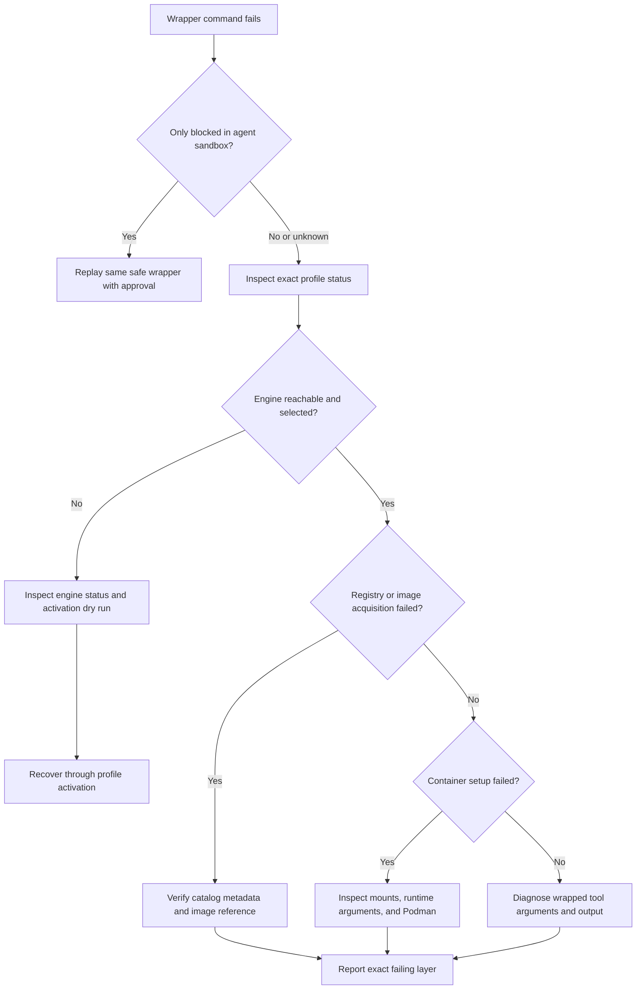
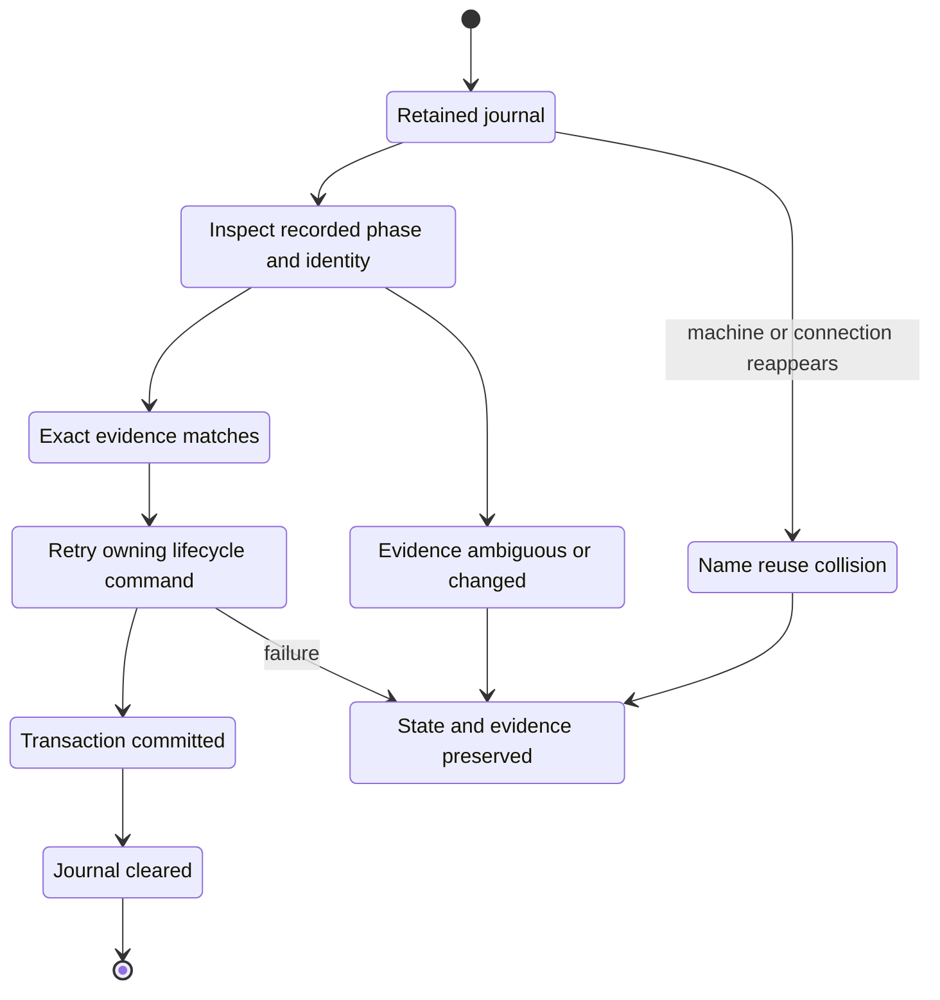

<!-- PAGE_ID: shimmy-12-administration-and-recovery -->
<details>
<summary>📚 Relevant source files</summary>

The following files were used as context for generating this wiki page:

- [admin.sh:1-192](https://github.com/wadebee/shimmy/blob/aaebadedc4bd1ac9f56f7e31bd394ae86cd97485/commands/admin.sh#L1-L192)
- [uninstall.sh:1-1568](https://github.com/wadebee/shimmy/blob/aaebadedc4bd1ac9f56f7e31bd394ae86cd97485/lib/install/uninstall.sh#L1-L1568)
- [lifecycle.sh:1-825](https://github.com/wadebee/shimmy/blob/aaebadedc4bd1ac9f56f7e31bd394ae86cd97485/lib/install/lifecycle.sh#L1-L825)
- [lifecycle.sh:1-321](https://github.com/wadebee/shimmy/blob/aaebadedc4bd1ac9f56f7e31bd394ae86cd97485/lib/engine/lifecycle.sh#L1-L321)
- [netinfo.sh:1-40](https://github.com/wadebee/shimmy/blob/aaebadedc4bd1ac9f56f7e31bd394ae86cd97485/lib/netinfo/netinfo.sh#L1-L40)
- [render.sh:1-148](https://github.com/wadebee/shimmy/blob/aaebadedc4bd1ac9f56f7e31bd394ae86cd97485/lib/netinfo/render.sh#L1-L148)
- [netinfo.md:1-41](https://github.com/wadebee/shimmy/blob/aaebadedc4bd1ac9f56f7e31bd394ae86cd97485/docs/netinfo.md#L1-L41)
- [podman.md:1-318](https://github.com/wadebee/shimmy/blob/aaebadedc4bd1ac9f56f7e31bd394ae86cd97485/docs/podman.md#L1-L318)
- [BOOTSTRAP.md:1-182](https://github.com/wadebee/shimmy/blob/aaebadedc4bd1ac9f56f7e31bd394ae86cd97485/BOOTSTRAP.md#L1-L182)

</details>

# Administration, Diagnostics, and Recovery

> **Related Pages**: [[Getting Started|02-getting-started.md]], [[Engines, Activation, and Registries|06-engines-and-registries.md]], [[Runtime Security and Configuration|10-runtime-security-and-configuration.md]]

---

<!-- BEGIN:AUTOGEN shimmy-12-administration-and-recovery-status -->
## Installation and Engine Status

Run administrative inspection through an installed profile launcher. The command rejects execution when `SHIMMY_CONFIG_ROOT` is absent or invalid, so a repository checkout is not a substitute for an installed control plane ([admin.sh:130-136](https://github.com/wadebee/shimmy/blob/aaebadedc4bd1ac9f56f7e31bd394ae86cd97485/commands/admin.sh#L130-L136)).

The standard read-only verification set is:

```sh
shimmy admin status --format manifest
shimmy admin engine status --format manifest
shimmy profile status --format manifest
shimmy shim list --format manifest
```

These commands inspect different layers of installed state ([BOOTSTRAP.md:130-139](https://github.com/wadebee/shimmy/blob/aaebadedc4bd1ac9f56f7e31bd394ae86cd97485/BOOTSTRAP.md#L130-L139)):

| Command | Inspection scope | Useful evidence |
|---|---|---|
| `shimmy admin status` | Installation-wide active profile, configuration root, catalog authority, and every materialized profile | Human output is intended for operators; manifest output is stable key/value evidence ([admin.sh:71-123](https://github.com/wadebee/shimmy/blob/aaebadedc4bd1ac9f56f7e31bd394ae86cd97485/commands/admin.sh#L71-L123)). |
| `shimmy admin engine status` | Strict engine registry, including engine records and the state used by bindings and projections | The command delegates to the registry status renderer and does not invoke a repair path ([admin.sh:157-174](https://github.com/wadebee/shimmy/blob/aaebadedc4bd1ac9f56f7e31bd394ae86cd97485/commands/admin.sh#L157-L174)). |
| `shimmy profile status` | The selected profile and its recorded engine, catalog, startup, and activation relationships | Use an absolute profile launcher when PATH selection or profile affinity is uncertain ([podman.md:46-56](https://github.com/wadebee/shimmy/blob/aaebadedc4bd1ac9f56f7e31bd394ae86cd97485/docs/podman.md#L46-L56)). |
| `shimmy shim list` | The active profile's materialized shim inventory | Pair it with non-mutating tool version commands to confirm that a named shim reaches its runtime ([BOOTSTRAP.md:130-139](https://github.com/wadebee/shimmy/blob/aaebadedc4bd1ac9f56f7e31bd394ae86cd97485/BOOTSTRAP.md#L130-L139)). |

`admin status` validates each profile independently. In manifest mode it emits an `ok` record followed by encoded profile fields, or an `error` record with a diagnostic; in human mode it marks the profile invalid and prints the reason ([admin.sh:49-69](https://github.com/wadebee/shimmy/blob/aaebadedc4bd1ac9f56f7e31bd394ae86cd97485/commands/admin.sh#L49-L69), [admin.sh:88-122](https://github.com/wadebee/shimmy/blob/aaebadedc4bd1ac9f56f7e31bd394ae86cd97485/commands/admin.sh#L88-L122)). This makes installation-wide status preferable to assuming that one healthy profile proves every retained profile is valid.

If an engine is stopped or its projection is stale, inspect first and recover through a named profile activation. A dry run reports the proposed VM recovery and registry projection; ordinary activation also reconciles the connection, active record, and exact AI-skill links, so a direct `podman machine start` is not equivalent ([podman.md:198-215](https://github.com/wadebee/shimmy/blob/aaebadedc4bd1ac9f56f7e31bd394ae86cd97485/docs/podman.md#L198-L215)).

Sources: [admin.sh:49-174](https://github.com/wadebee/shimmy/blob/aaebadedc4bd1ac9f56f7e31bd394ae86cd97485/commands/admin.sh#L49-L174), [BOOTSTRAP.md:130-145](https://github.com/wadebee/shimmy/blob/aaebadedc4bd1ac9f56f7e31bd394ae86cd97485/BOOTSTRAP.md#L130-L145), [podman.md:46-75](https://github.com/wadebee/shimmy/blob/aaebadedc4bd1ac9f56f7e31bd394ae86cd97485/docs/podman.md#L46-L75), [podman.md:198-221](https://github.com/wadebee/shimmy/blob/aaebadedc4bd1ac9f56f7e31bd394ae86cd97485/docs/podman.md#L198-L221)
<!-- END:AUTOGEN shimmy-12-administration-and-recovery-status -->

---

<!-- BEGIN:AUTOGEN shimmy-12-administration-and-recovery-network -->
## Multi-Perspective Network Diagnostics

`shimmy admin network` is a read-only installed command for comparing the active profile's host, Podman-machine, and container-side network perspectives ([netinfo.md:1-5](https://github.com/wadebee/shimmy/blob/aaebadedc4bd1ac9f56f7e31bd394ae86cd97485/docs/netinfo.md#L1-L5)). It reports observations from the shell where it runs and separately resolves host-side identity instead of assuming that a visible interface belongs to the physical host.



The collector starts with a default route target of `1.1.1.1` when no target is supplied, then reads shell interfaces, default routes, link routes, neighbors, nameservers, per-target routes, and virtualization indicators before resolving host IPv4 and LAN values ([netinfo.sh:15-40](https://github.com/wadebee/shimmy/blob/aaebadedc4bd1ac9f56f7e31bd394ae86cd97485/lib/netinfo/netinfo.sh#L15-L40)). Use repeated `--target` arguments when you need route evidence for several destinations; use `--host-name`, `--host-ip` with `--host-prefix`, or `--host-lan` to supply physical-host evidence that a nested shell cannot discover safely ([netinfo.md:7-24](https://github.com/wadebee/shimmy/blob/aaebadedc4bd1ac9f56f7e31bd394ae86cd97485/docs/netinfo.md#L7-L24)).

Nested environments require special care. A Crostini hostname such as `penguin` identifies the Linux environment rather than the Chromebook on the LAN, and VM/container NAT addresses do not establish the physical host's LAN identity ([netinfo.md:26-37](https://github.com/wadebee/shimmy/blob/aaebadedc4bd1ac9f56f7e31bd394ae86cd97485/docs/netinfo.md#L26-L37)). The renderer therefore leaves unresolved host values as `unknown`, emits actionable manifest keys when host-LAN or DNS evidence is missing, and warns when VM/container-side interfaces were not promoted to host values ([render.sh:16-42](https://github.com/wadebee/shimmy/blob/aaebadedc4bd1ac9f56f7e31bd394ae86cd97485/lib/netinfo/render.sh#L16-L42), [render.sh:71-97](https://github.com/wadebee/shimmy/blob/aaebadedc4bd1ac9f56f7e31bd394ae86cd97485/lib/netinfo/render.sh#L71-L97)).

Use human format for interactive diagnosis and manifest format when another command needs stable key/value evidence. This command does not scan the LAN and deliberately preserves uncertainty rather than converting a nested address into a false host result ([netinfo.md:39-41](https://github.com/wadebee/shimmy/blob/aaebadedc4bd1ac9f56f7e31bd394ae86cd97485/docs/netinfo.md#L39-L41)).

Sources: [netinfo.sh:15-40](https://github.com/wadebee/shimmy/blob/aaebadedc4bd1ac9f56f7e31bd394ae86cd97485/lib/netinfo/netinfo.sh#L15-L40), [render.sh:16-97](https://github.com/wadebee/shimmy/blob/aaebadedc4bd1ac9f56f7e31bd394ae86cd97485/lib/netinfo/render.sh#L16-L97), [netinfo.md:1-41](https://github.com/wadebee/shimmy/blob/aaebadedc4bd1ac9f56f7e31bd394ae86cd97485/docs/netinfo.md#L1-L41)
<!-- END:AUTOGEN shimmy-12-administration-and-recovery-network -->

---

<!-- BEGIN:AUTOGEN shimmy-12-administration-and-recovery-triage -->
## Failure Triage

Classify a failure at the earliest layer that has direct evidence. A wrapper failure can originate at the outer agent sandbox, image acquisition, container setup, or inside the wrapped tool; these are separate failure domains and should remain separate in reports ([podman.md:275-301](https://github.com/wadebee/shimmy/blob/aaebadedc4bd1ac9f56f7e31bd394ae86cd97485/docs/podman.md#L275-L301)).



| Failure class | Evidence and next action |
|---|---|
| Sandbox or approval boundary | If direct Podman works but the wrapper fails only inside an AI-agent sandbox, replay the same safe outer wrapper operation through its approval boundary. A successful `podman info` neither approves nor verifies Podman access nested through the wrapper ([podman.md:275-281](https://github.com/wadebee/shimmy/blob/aaebadedc4bd1ac9f56f7e31bd394ae86cd97485/docs/podman.md#L275-L281)). |
| Profile affinity | Invoke the intended profile's absolute launcher for `profile status`; activation is the workflow that aligns engine, registry projection, active record, and skill links ([podman.md:46-66](https://github.com/wadebee/shimmy/blob/aaebadedc4bd1ac9f56f7e31bd394ae86cd97485/docs/podman.md#L46-L66)). Before activation, remove masking connection or registry overrides; Shimmy reports a masking variable's name without exposing its value ([podman.md:116-123](https://github.com/wadebee/shimmy/blob/aaebadedc4bd1ac9f56f7e31bd394ae86cd97485/docs/podman.md#L116-L123)). |
| Engine reachability or state | Inspect the selected profile and strict engine registry. If the shared machine is stopped, preview and apply named profile activation rather than starting an arbitrary Podman machine directly ([podman.md:190-221](https://github.com/wadebee/shimmy/blob/aaebadedc4bd1ac9f56f7e31bd394ae86cd97485/docs/podman.md#L190-L221)). |
| Registry or image acquisition | `shimmy catalog verify` inspects remote manifests without pulling target layers and uses Skopeo as the registry-policy consumer ([podman.md:125-151](https://github.com/wadebee/shimmy/blob/aaebadedc4bd1ac9f56f7e31bd394ae86cd97485/docs/podman.md#L125-L151)). Image preparation errors identify the tool, version, action, and configured reference; they do not guess whether the underlying cause was registry access, authentication, or network availability ([BOOTSTRAP.md:87-95](https://github.com/wadebee/shimmy/blob/aaebadedc4bd1ac9f56f7e31bd394ae86cd97485/BOOTSTRAP.md#L87-L95)). |
| Container setup | Use source preview to inspect the wrapper's work-directory mount and selected runtime arguments without reaching the engine, then compare those arguments with the failing live invocation ([podman.md:283-288](https://github.com/wadebee/shimmy/blob/aaebadedc4bd1ac9f56f7e31bd394ae86cd97485/docs/podman.md#L283-L288)). |
| Wrapped tool | Once sandbox access, profile selection, engine reachability, image acquisition, and container setup are established, diagnose the tool's own arguments and output as the remaining layer. The documented failure model explicitly distinguishes the wrapped tool from the preceding runtime layers ([podman.md:299-301](https://github.com/wadebee/shimmy/blob/aaebadedc4bd1ac9f56f7e31bd394ae86cd97485/docs/podman.md#L299-L301)). |

A sandbox-only Podman error establishes only that access is unverified from the sandbox. It does not justify changing profiles, starting machines, or acknowledging stopped workloads; status, activation dry-run, activation, and `--stop-running` are separate decisions ([BOOTSTRAP.md:141-145](https://github.com/wadebee/shimmy/blob/aaebadedc4bd1ac9f56f7e31bd394ae86cd97485/BOOTSTRAP.md#L141-L145)).

Sources: [podman.md:116-151](https://github.com/wadebee/shimmy/blob/aaebadedc4bd1ac9f56f7e31bd394ae86cd97485/docs/podman.md#L116-L151), [podman.md:190-221](https://github.com/wadebee/shimmy/blob/aaebadedc4bd1ac9f56f7e31bd394ae86cd97485/docs/podman.md#L190-L221), [podman.md:275-301](https://github.com/wadebee/shimmy/blob/aaebadedc4bd1ac9f56f7e31bd394ae86cd97485/docs/podman.md#L275-L301), [BOOTSTRAP.md:87-95](https://github.com/wadebee/shimmy/blob/aaebadedc4bd1ac9f56f7e31bd394ae86cd97485/BOOTSTRAP.md#L87-L95), [BOOTSTRAP.md:141-145](https://github.com/wadebee/shimmy/blob/aaebadedc4bd1ac9f56f7e31bd394ae86cd97485/BOOTSTRAP.md#L141-L145)
<!-- END:AUTOGEN shimmy-12-administration-and-recovery-triage -->

---

<!-- BEGIN:AUTOGEN shimmy-12-administration-and-recovery-incomplete-transactions -->
## Incomplete Lifecycle Transactions

Machine lifecycle operations are journal-first. A journal is staged, rendered, reread for validation, and atomically installed before the operation advances; it is cleared only after reaching the `committed` phase ([lifecycle.sh:4-25](https://github.com/wadebee/shimmy/blob/aaebadedc4bd1ac9f56f7e31bd394ae86cd97485/lib/engine/lifecycle.sh#L4-L25), [lifecycle.sh:28-58](https://github.com/wadebee/shimmy/blob/aaebadedc4bd1ac9f56f7e31bd394ae86cd97485/lib/engine/lifecycle.sh#L28-L58)). This retained state is recovery evidence, not disposable clutter.



Creation records `planned` intent before initialization, commits the created identity and ownership token after `podman machine init`, and then proceeds through record, start, guest-marker, and commit phases ([lifecycle.sh:61-94](https://github.com/wadebee/shimmy/blob/aaebadedc4bd1ac9f56f7e31bd394ae86cd97485/lib/engine/lifecycle.sh#L61-L94), [lifecycle.sh:96-187](https://github.com/wadebee/shimmy/blob/aaebadedc4bd1ac9f56f7e31bd394ae86cd97485/lib/engine/lifecycle.sh#L96-L187)). Rollback removes a created machine only after the live identity matches the journal and, when present, the engine record agrees with the same ID, name, connection, ownership token, and creation fingerprint ([lifecycle.sh:190-232](https://github.com/wadebee/shimmy/blob/aaebadedc4bd1ac9f56f7e31bd394ae86cd97485/lib/engine/lifecycle.sh#L190-L232)).

When bootstrap cannot establish exact identity or exact removal fails, it preserves the configuration root and lifecycle journal and reports their paths. That retained root intentionally blocks another fresh bootstrap; do not delete or adopt the machine by name, and do not retry bootstrap over the evidence ([BOOTSTRAP.md:97-103](https://github.com/wadebee/shimmy/blob/aaebadedc4bd1ac9f56f7e31bd394ae86cd97485/BOOTSTRAP.md#L97-L103)). The cleanup path likewise reports an incomplete rollback and retains the bootstrap recovery root when engine rollback cannot be proven complete ([lifecycle.sh:45-104](https://github.com/wadebee/shimmy/blob/aaebadedc4bd1ac9f56f7e31bd394ae86cd97485/lib/install/lifecycle.sh#L45-L104)).

Removal also advances through explicit verification, stop, removal, and commit phases. It rechecks ownership immediately before destructive steps and accepts an already absent machine only in the journal-governed removal path ([lifecycle.sh:235-320](https://github.com/wadebee/shimmy/blob/aaebadedc4bd1ac9f56f7e31bd394ae86cd97485/lib/engine/lifecycle.sh#L235-L320)). For a partial global uninstall, retain the installation and rerun the exact command printed by Shimmy; the journal distinguishes completed and pending engines, while a machine or connection recreated under a previously removed name is treated as a collision rather than adopted ([podman.md:267-273](https://github.com/wadebee/shimmy/blob/aaebadedc4bd1ac9f56f7e31bd394ae86cd97485/docs/podman.md#L267-L273)).

Sources: [lifecycle.sh:4-320](https://github.com/wadebee/shimmy/blob/aaebadedc4bd1ac9f56f7e31bd394ae86cd97485/lib/engine/lifecycle.sh#L4-L320), [lifecycle.sh:45-104](https://github.com/wadebee/shimmy/blob/aaebadedc4bd1ac9f56f7e31bd394ae86cd97485/lib/install/lifecycle.sh#L45-L104), [BOOTSTRAP.md:97-103](https://github.com/wadebee/shimmy/blob/aaebadedc4bd1ac9f56f7e31bd394ae86cd97485/BOOTSTRAP.md#L97-L103), [podman.md:267-273](https://github.com/wadebee/shimmy/blob/aaebadedc4bd1ac9f56f7e31bd394ae86cd97485/docs/podman.md#L267-L273)
<!-- END:AUTOGEN shimmy-12-administration-and-recovery-incomplete-transactions -->

---

<!-- BEGIN:AUTOGEN shimmy-12-administration-and-recovery-uninstall -->
## Safe Uninstall

Preview the complete destructive plan before applying it:

```sh
shimmy admin uninstall --dry-run
shimmy admin uninstall
```

The administration parser keeps `--dry-run` and `--stop-running` explicit and separate, then passes both decisions into the uninstall transaction ([admin.sh:176-189](https://github.com/wadebee/shimmy/blob/aaebadedc4bd1ac9f56f7e31bd394ae86cd97485/commands/admin.sh#L176-L189)). Review the dry-run output first; use `--stop-running` only after accepting the listed workload interruption and data loss ([BOOTSTRAP.md:162-182](https://github.com/wadebee/shimmy/blob/aaebadedc4bd1ac9f56f7e31bd394ae86cd97485/BOOTSTRAP.md#L162-L182)).

| Resource | Uninstall behavior |
|---|---|
| macOS machines with complete current Shimmy ownership evidence | Removed in a planned order: inactive owned isolated machines first and the active owned machine last ([podman.md:255-260](https://github.com/wadebee/shimmy/blob/aaebadedc4bd1ac9f56f7e31bd394ae86cd97485/docs/podman.md#L255-L260)). |
| Running containers on an owned machine | Block all mutation until the operator explicitly retries with `--stop-running` ([podman.md:262-265](https://github.com/wadebee/shimmy/blob/aaebadedc4bd1ac9f56f7e31bd394ae86cd97485/docs/podman.md#L262-L265)). |
| VM-local containers, images, volumes, and build caches on a removed machine | Permanently destroyed; none of this VM-local data is preserved ([BOOTSTRAP.md:171-176](https://github.com/wadebee/shimmy/blob/aaebadedc4bd1ac9f56f7e31bd394ae86cd97485/BOOTSTRAP.md#L171-L176)). |
| Legacy, external, mismatched, ambiguous, or Linux host-local engines | Preserved with a reported reason; an engine name or binding is not ownership proof ([podman.md:242-244](https://github.com/wadebee/shimmy/blob/aaebadedc4bd1ac9f56f7e31bd394ae86cd97485/docs/podman.md#L242-L244), [podman.md:255-260](https://github.com/wadebee/shimmy/blob/aaebadedc4bd1ac9f56f7e31bd394ae86cd97485/docs/podman.md#L255-L260)). |
| Source checkout, unrelated registry policy, unrelated user skills, and the user skill root | Left untouched ([BOOTSTRAP.md:171-176](https://github.com/wadebee/shimmy/blob/aaebadedc4bd1ac9f56f7e31bd394ae86cd97485/BOOTSTRAP.md#L171-L176)). |

Before mutating state, uninstall validates the installation, links, startup files, engine roots, planned engine set, and projections, then renders the plan. Without `--stop-running`, detected workloads return a specific retry error before locks and removal begin ([uninstall.sh:1360-1404](https://github.com/wadebee/shimmy/blob/aaebadedc4bd1ac9f56f7e31bd394ae86cd97485/lib/install/uninstall.sh#L1360-L1404)). The transaction writes or resumes its uninstall journal before entering `removing-engines`; if removal fails, it retains installation state and emits a recovery report instead of continuing into configuration cleanup ([uninstall.sh:1422-1448](https://github.com/wadebee/shimmy/blob/aaebadedc4bd1ac9f56f7e31bd394ae86cd97485/lib/install/uninstall.sh#L1422-L1448)).

After machine work completes, Shimmy cleans preserved-engine projections where required, removes owned AI-skill links and startup blocks, and only then moves the installation root aside and commits the external transaction ([uninstall.sh:1460-1558](https://github.com/wadebee/shimmy/blob/aaebadedc4bd1ac9f56f7e31bd394ae86cd97485/lib/install/uninstall.sh#L1460-L1558)). A partial failure retains profiles, commands, ownership evidence, and the durable journal and prints an exact retry; do not replace that recovery path with manual name-based deletion ([podman.md:267-273](https://github.com/wadebee/shimmy/blob/aaebadedc4bd1ac9f56f7e31bd394ae86cd97485/docs/podman.md#L267-L273)).

Sources: [admin.sh:176-189](https://github.com/wadebee/shimmy/blob/aaebadedc4bd1ac9f56f7e31bd394ae86cd97485/commands/admin.sh#L176-L189), [uninstall.sh:1360-1558](https://github.com/wadebee/shimmy/blob/aaebadedc4bd1ac9f56f7e31bd394ae86cd97485/lib/install/uninstall.sh#L1360-L1558), [podman.md:226-273](https://github.com/wadebee/shimmy/blob/aaebadedc4bd1ac9f56f7e31bd394ae86cd97485/docs/podman.md#L226-L273), [BOOTSTRAP.md:162-182](https://github.com/wadebee/shimmy/blob/aaebadedc4bd1ac9f56f7e31bd394ae86cd97485/BOOTSTRAP.md#L162-L182)
<!-- END:AUTOGEN shimmy-12-administration-and-recovery-uninstall -->

---
