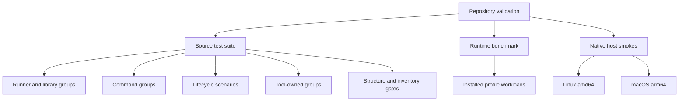

<!-- PAGE_ID: shimmy-14-testing -->
<details>
<summary>📚 Relevant source files</summary>

The following files were used as context for generating this wiki page:

- [testing.md:1-162](https://github.com/wadebee/shimmy/blob/aaebadedc4bd1ac9f56f7e31bd394ae86cd97485/docs/testing.md#L1-L162)
- [CONTEXT.md:1-32](https://github.com/wadebee/shimmy/blob/aaebadedc4bd1ac9f56f7e31bd394ae86cd97485/tests/CONTEXT.md#L1-L32)
- [test.sh:1-232](https://github.com/wadebee/shimmy/blob/aaebadedc4bd1ac9f56f7e31bd394ae86cd97485/tests/test.sh#L1-L232)
- [runner.sh:1-768](https://github.com/wadebee/shimmy/blob/aaebadedc4bd1ac9f56f7e31bd394ae86cd97485/tests/runner.sh#L1-L768)
- [support.sh:1-249](https://github.com/wadebee/shimmy/blob/aaebadedc4bd1ac9f56f7e31bd394ae86cd97485/tests/support.sh#L1-L249)
- [CONTEXT.md:1-30](https://github.com/wadebee/shimmy/blob/aaebadedc4bd1ac9f56f7e31bd394ae86cd97485/tests/commands/CONTEXT.md#L1-L30)
- [CONTEXT.md:1-27](https://github.com/wadebee/shimmy/blob/aaebadedc4bd1ac9f56f7e31bd394ae86cd97485/tests/lib/CONTEXT.md#L1-L27)
- [context-tree.sh:1-128](https://github.com/wadebee/shimmy/blob/aaebadedc4bd1ac9f56f7e31bd394ae86cd97485/tests/context-tree.sh#L1-L128)
- [runtime-benchmark.sh:1-837](https://github.com/wadebee/shimmy/blob/aaebadedc4bd1ac9f56f7e31bd394ae86cd97485/tests/runtime-benchmark.sh#L1-L837)
- [CONTRIBUTING.md:1-218](https://github.com/wadebee/shimmy/blob/aaebadedc4bd1ac9f56f7e31bd394ae86cd97485/CONTRIBUTING.md#L1-L218)

</details>

# Testing and Validation

> **Related Pages**: [[Tool Authoring|09-tool-authoring.md]], [[Contributing and Maintenance|15-contributing-and-maintenance.md]]

---

<!-- BEGIN:AUTOGEN shimmy-14-testing-organization -->
## Test Organization

Shimmy's repository suite is source-checkout-only: `tests/test.sh` validates the catalog, creates a private session root, and dispatches named groups through a bounded worker runner. Installed profiles do not contain this suite or expose a separate installed test command ([CONTEXT.md:3-6](https://github.com/wadebee/shimmy/blob/aaebadedc4bd1ac9f56f7e31bd394ae86cd97485/tests/CONTEXT.md#L3-L6), [testing.md:50-52](https://github.com/wadebee/shimmy/blob/aaebadedc4bd1ac9f56f7e31bd394ae86cd97485/docs/testing.md#L50-L52)).



The canonical registry starts with runner and shared-library groups, continues through command and lifecycle groups, and ends with tool-owned groups. Each name maps to one test function, making group selection an explicit system-boundary choice rather than a filename glob ([runner.sh:10-59](https://github.com/wadebee/shimmy/blob/aaebadedc4bd1ac9f56f7e31bd394ae86cd97485/tests/runner.sh#L10-L59)).

| Coverage boundary | Location and responsibility |
|---|---|
| Runner and shared libraries | `tests/lib/` covers registry parsing, deterministic workers, result integrity, catalog/state codecs, locks, transactions, runtime behavior, engines, activation, and registries ([CONTEXT.md:3-24](https://github.com/wadebee/shimmy/blob/aaebadedc4bd1ac9f56f7e31bd394ae86cd97485/tests/lib/CONTEXT.md#L3-L24)). |
| Public management commands | `tests/commands/` covers agent preflight, catalog, shim, AI-skill, profile, help surface, and six lifecycle scenarios; acceptance normally invokes public installed launchers, while direct source entrypoints are reserved for focused parser or transaction seams ([CONTEXT.md:3-30](https://github.com/wadebee/shimmy/blob/aaebadedc4bd1ac9f56f7e31bd394ae86cd97485/tests/commands/CONTEXT.md#L3-L30)). |
| Tool-specific behavior | Tests live beside each tool under `tools/<tool>/tests/` and are registered as `tools-*` groups ([test.sh:124-171](https://github.com/wadebee/shimmy/blob/aaebadedc4bd1ac9f56f7e31bd394ae86cd97485/tests/test.sh#L124-L171), [testing.md:45-48](https://github.com/wadebee/shimmy/blob/aaebadedc4bd1ac9f56f7e31bd394ae86cd97485/docs/testing.md#L45-L48)). |
| Context and concrete-version structure | `tests/context-tree.sh` verifies retained context links, prohibits context files in tool and management-plugin trees, and requires every concrete version to provide executable runtime and refresh hooks plus smoke and image metadata ([context-tree.sh:94-126](https://github.com/wadebee/shimmy/blob/aaebadedc4bd1ac9f56f7e31bd394ae86cd97485/tests/context-tree.sh#L94-L126)). |
| Performance and preflight review | `tests/runtime-benchmark.sh` is a separate opt-in harness for installed-profile runtime measurements; it is not part of the default source suite ([testing.md:67-83](https://github.com/wadebee/shimmy/blob/aaebadedc4bd1ac9f56f7e31bd394ae86cd97485/docs/testing.md#L67-L83)). |

Sources: [CONTEXT.md:3-32](https://github.com/wadebee/shimmy/blob/aaebadedc4bd1ac9f56f7e31bd394ae86cd97485/tests/CONTEXT.md#L3-L32), [runner.sh:10-59](https://github.com/wadebee/shimmy/blob/aaebadedc4bd1ac9f56f7e31bd394ae86cd97485/tests/runner.sh#L10-L59), [test.sh:83-171](https://github.com/wadebee/shimmy/blob/aaebadedc4bd1ac9f56f7e31bd394ae86cd97485/tests/test.sh#L83-L171), [context-tree.sh:94-126](https://github.com/wadebee/shimmy/blob/aaebadedc4bd1ac9f56f7e31bd394ae86cd97485/tests/context-tree.sh#L94-L126)
<!-- END:AUTOGEN shimmy-14-testing-organization -->

---

<!-- BEGIN:AUTOGEN shimmy-14-testing-runner -->
## Running the Suite

Run the complete source suite from the repository root. The default is bounded parallel execution with three workers, private per-group logs, and output replayed in canonical registry order ([testing.md:3-11](https://github.com/wadebee/shimmy/blob/aaebadedc4bd1ac9f56f7e31bd394ae86cd97485/docs/testing.md#L3-L11)).

```sh
./tests/test.sh
./tests/test.sh --list-groups
./tests/test.sh --group lib-runtime
./tests/test.sh --group commands-profile --group commands-shim
./tests/test.sh --jobs 3
./tests/test.sh --serial --group commands-lifecycle-isolated
```

The runner accepts one or more `--group` selectors, `--jobs 1-3`, `--serial`, and `--list-groups`. It rejects unknown or duplicate groups, invalid worker counts, `--serial` combined with `--jobs`, and list mode combined with execution options before starting the suite ([runner.sh:202-262](https://github.com/wadebee/shimmy/blob/aaebadedc4bd1ac9f56f7e31bd394ae86cd97485/tests/runner.sh#L202-L262)).

Use the default schedule for independent groups. Use `--serial` for a single group, a known order-sensitive case, or immediate failure diagnosis; it is not the routine full-suite mode ([testing.md:21-24](https://github.com/wadebee/shimmy/blob/aaebadedc4bd1ac9f56f7e31bd394ae86cd97485/docs/testing.md#L21-L24), [CONTRIBUTING.md:164-168](https://github.com/wadebee/shimmy/blob/aaebadedc4bd1ac9f56f7e31bd394ae86cd97485/CONTRIBUTING.md#L164-L168)). Worker assignments are calibrated and deterministic for two- and three-worker schedules, while selected groups still replay in registry order ([runner.sh:62-118](https://github.com/wadebee/shimmy/blob/aaebadedc4bd1ac9f56f7e31bd394ae86cd97485/tests/runner.sh#L62-L118), [runner.sh:617-631](https://github.com/wadebee/shimmy/blob/aaebadedc4bd1ac9f56f7e31bd394ae86cd97485/tests/runner.sh#L617-L631)).

The six lifecycle groups are independently selectable but preserve each scenario's internal transitions as one indivisible unit. Selecting any lifecycle group prepares one clean immutable checkout template, which scenarios copy into their own mutable roots ([testing.md:26-32](https://github.com/wadebee/shimmy/blob/aaebadedc4bd1ac9f56f7e31bd394ae86cd97485/docs/testing.md#L26-L32)).

Set `SHIMMY_TEST_TIMING=1` when coarse setup, group, and total durations are useful. Timing-enabled runs emit stable progress and timing records, preserve total timing on ordinary failures, and replay partial evidence before cleanup after interruption ([testing.md:141-157](https://github.com/wadebee/shimmy/blob/aaebadedc4bd1ac9f56f7e31bd394ae86cd97485/docs/testing.md#L141-L157)).

Sources: [testing.md:3-32](https://github.com/wadebee/shimmy/blob/aaebadedc4bd1ac9f56f7e31bd394ae86cd97485/docs/testing.md#L3-L32), [runner.sh:202-303](https://github.com/wadebee/shimmy/blob/aaebadedc4bd1ac9f56f7e31bd394ae86cd97485/tests/runner.sh#L202-L303), [runner.sh:328-365](https://github.com/wadebee/shimmy/blob/aaebadedc4bd1ac9f56f7e31bd394ae86cd97485/tests/runner.sh#L328-L365), [runner.sh:617-767](https://github.com/wadebee/shimmy/blob/aaebadedc4bd1ac9f56f7e31bd394ae86cd97485/tests/runner.sh#L617-L767)
<!-- END:AUTOGEN shimmy-14-testing-runner -->

---

<!-- BEGIN:AUTOGEN shimmy-14-testing-test-design -->
## Test Design and Fixtures

Tests should prove required observable behavior. Rejection or absence coverage is reserved for explicit, durable security, ownership, integrity, rollback, or compatibility invariants; the suite should not accumulate tests merely proving that removed files or aliases remain absent ([CONTRIBUTING.md:164-174](https://github.com/wadebee/shimmy/blob/aaebadedc4bd1ac9f56f7e31bd394ae86cd97485/CONTRIBUTING.md#L164-L174), [CONTEXT.md:23-26](https://github.com/wadebee/shimmy/blob/aaebadedc4bd1ac9f56f7e31bd394ae86cd97485/tests/CONTEXT.md#L23-L26)). For a durable negative invariant, use the lowest-cost authoritative proof rather than duplicating generic rejection coverage across groups ([CONTEXT.md:26-27](https://github.com/wadebee/shimmy/blob/aaebadedc4bd1ac9f56f7e31bd394ae86cd97485/tests/lib/CONTEXT.md#L26-L27)).

The shared support layer provides explicit assertions for output, equality, files, modes, symlinks, and path absence. Successful checks increment `TEST_COUNT` through `pass`, giving each group a concrete count that the runner validates against its worker artifacts ([support.sh:4-136](https://github.com/wadebee/shimmy/blob/aaebadedc4bd1ac9f56f7e31bd394ae86cd97485/tests/support.sh#L4-L136), [runner.sh:463-500](https://github.com/wadebee/shimmy/blob/aaebadedc4bd1ac9f56f7e31bd394ae86cd97485/tests/runner.sh#L463-L500)).

Fixtures are isolated under absolute disposable `HOME` and `XDG_CONFIG_HOME` roots. The session probes copy-on-write support, rejects unsafe fixture source or target paths, confines copies to the session root, and falls back from clone-style copying to recursive copying when needed ([support.sh:145-218](https://github.com/wadebee/shimmy/blob/aaebadedc4bd1ac9f56f7e31bd394ae86cd97485/tests/support.sh#L145-L218)). Catalog-heavy groups create clean local-main Git copies, while lifecycle scenarios derive private mutable checkouts from one session-owned immutable template ([CONTEXT.md:16-21](https://github.com/wadebee/shimmy/blob/aaebadedc4bd1ac9f56f7e31bd394ae86cd97485/tests/CONTEXT.md#L16-L21)).

The runner treats logs, group counts, statuses, worker ownership, elapsed values, and wait statuses as integrity-checked result artifacts. Missing, symlinked, malformed, mismatched, or incomplete artifacts make result collection fail rather than silently reducing coverage ([runner.sh:634-742](https://github.com/wadebee/shimmy/blob/aaebadedc4bd1ac9f56f7e31bd394ae86cd97485/tests/runner.sh#L634-L742)).

Sources: [CONTRIBUTING.md:164-174](https://github.com/wadebee/shimmy/blob/aaebadedc4bd1ac9f56f7e31bd394ae86cd97485/CONTRIBUTING.md#L164-L174), [CONTEXT.md:16-26](https://github.com/wadebee/shimmy/blob/aaebadedc4bd1ac9f56f7e31bd394ae86cd97485/tests/CONTEXT.md#L16-L26), [support.sh:4-218](https://github.com/wadebee/shimmy/blob/aaebadedc4bd1ac9f56f7e31bd394ae86cd97485/tests/support.sh#L4-L218), [runner.sh:463-500](https://github.com/wadebee/shimmy/blob/aaebadedc4bd1ac9f56f7e31bd394ae86cd97485/tests/runner.sh#L463-L500), [runner.sh:634-742](https://github.com/wadebee/shimmy/blob/aaebadedc4bd1ac9f56f7e31bd394ae86cd97485/tests/runner.sh#L634-L742)
<!-- END:AUTOGEN shimmy-14-testing-test-design -->

---

<!-- BEGIN:AUTOGEN shimmy-14-testing-container-acceptance -->
## Container and Native-Host Acceptance

Use the cheapest test mode that proves the intended boundary. Source preview validates rendered runtime shape without starting Podman, lifecycle tests use generated fake Podman state only for engine transaction boundaries, and tool acceptance uses live runtimes with non-mutating commands such as `--version`, `version`, or `--help` ([testing.md:54-68](https://github.com/wadebee/shimmy/blob/aaebadedc4bd1ac9f56f7e31bd394ae86cd97485/docs/testing.md#L54-L68), [CONTEXT.md:16-21](https://github.com/wadebee/shimmy/blob/aaebadedc4bd1ac9f56f7e31bd394ae86cd97485/tests/CONTEXT.md#L16-L21)). Installed shims expose their version-owned smoke arguments through `shimmy shim test [<tool[@version]> ...]`, not by copying the repository test suite into a profile ([testing.md:50-52](https://github.com/wadebee/shimmy/blob/aaebadedc4bd1ac9f56f7e31bd394ae86cd97485/docs/testing.md#L50-L52)).

| Acceptance layer | What it proves | Boundary |
|---|---|---|
| Source preview | Rendered command, platform, mounts, and arguments without container execution | Preferred when runtime shape alone is sufficient ([testing.md:54-65](https://github.com/wadebee/shimmy/blob/aaebadedc4bd1ac9f56f7e31bd394ae86cd97485/docs/testing.md#L54-L65)). |
| Fake-engine lifecycle tests | Initialization, activation, rollback, and ownership transaction behavior | Fake state is limited to lifecycle transaction boundaries ([CONTRIBUTING.md:172-173](https://github.com/wadebee/shimmy/blob/aaebadedc4bd1ac9f56f7e31bd394ae86cd97485/CONTRIBUTING.md#L172-L173)). |
| Live non-mutating smoke | The actual wrapper, image, engine, and tool command execute together | Use version or help-style commands and avoid mutation ([testing.md:67-68](https://github.com/wadebee/shimmy/blob/aaebadedc4bd1ac9f56f7e31bd394ae86cd97485/docs/testing.md#L67-L68)). |
| Native architecture smoke | The concrete image and version work on each supported native host | Required on Linux `amd64` and Apple Silicon macOS `arm64`; an OCI index, preview, or cross-emulation does not replace either result ([testing.md:133-139](https://github.com/wadebee/shimmy/blob/aaebadedc4bd1ac9f56f7e31bd394ae86cd97485/docs/testing.md#L133-L139)). |

The opt-in runtime benchmark measures the active installed profile's shell selection, activation dry run, and bounded `rg`/`jq` version and JSON workloads. Its transparent temporary Podman forwarder records call timing and status, raw output stays in a private directory, and the normal mode does not activate profiles, switch connections, pull images, or build images ([testing.md:67-83](https://github.com/wadebee/shimmy/blob/aaebadedc4bd1ac9f56f7e31bd394ae86cd97485/docs/testing.md#L67-L83), [runtime-benchmark.sh:14-34](https://github.com/wadebee/shimmy/blob/aaebadedc4bd1ac9f56f7e31bd394ae86cd97485/tests/runtime-benchmark.sh#L14-L34)). Extended mode requires already-present `rg` and `jq` images, records host-inapplicable explicit-connection lanes as unavailable, and includes direct-container, wrapper, session, and bounded event measurements ([testing.md:98-114](https://github.com/wadebee/shimmy/blob/aaebadedc4bd1ac9f56f7e31bd394ae86cd97485/docs/testing.md#L98-L114), [runtime-benchmark.sh:713-763](https://github.com/wadebee/shimmy/blob/aaebadedc4bd1ac9f56f7e31bd394ae86cd97485/tests/runtime-benchmark.sh#L713-L763)).

Sources: [testing.md:50-114](https://github.com/wadebee/shimmy/blob/aaebadedc4bd1ac9f56f7e31bd394ae86cd97485/docs/testing.md#L50-L114), [testing.md:133-139](https://github.com/wadebee/shimmy/blob/aaebadedc4bd1ac9f56f7e31bd394ae86cd97485/docs/testing.md#L133-L139), [CONTRIBUTING.md:161-174](https://github.com/wadebee/shimmy/blob/aaebadedc4bd1ac9f56f7e31bd394ae86cd97485/CONTRIBUTING.md#L161-L174), [runtime-benchmark.sh:14-34](https://github.com/wadebee/shimmy/blob/aaebadedc4bd1ac9f56f7e31bd394ae86cd97485/tests/runtime-benchmark.sh#L14-L34), [runtime-benchmark.sh:713-763](https://github.com/wadebee/shimmy/blob/aaebadedc4bd1ac9f56f7e31bd394ae86cd97485/tests/runtime-benchmark.sh#L713-L763)
<!-- END:AUTOGEN shimmy-14-testing-container-acceptance -->

---

<!-- BEGIN:AUTOGEN shimmy-14-testing-final-validation -->
## Final Validation Gates

During implementation, run the affected named groups. At the final integration gate, run the complete default suite; changes to the runner, shared fixtures, lifecycle, or broadly consumed libraries justify an earlier complete run as well ([testing.md:54-58](https://github.com/wadebee/shimmy/blob/aaebadedc4bd1ac9f56f7e31bd394ae86cd97485/docs/testing.md#L54-L58)).

Before declaring a change complete, apply these repository gates:

1. Run the relevant focused groups with `./tests/test.sh --group <name>` and resolve localized failures ([testing.md:13-19](https://github.com/wadebee/shimmy/blob/aaebadedc4bd1ac9f56f7e31bd394ae86cd97485/docs/testing.md#L13-L19)).
2. Run the complete suite with its default bounded parallel schedule ([CONTRIBUTING.md:164-168](https://github.com/wadebee/shimmy/blob/aaebadedc4bd1ac9f56f7e31bd394ae86cd97485/CONTRIBUTING.md#L164-L168)).
3. Validate POSIX shell syntax and exercise generated shell artifacts; syntax alone does not prove that renderer quoting and expansion survived generation ([CONTRIBUTING.md:7-13](https://github.com/wadebee/shimmy/blob/aaebadedc4bd1ac9f56f7e31bd394ae86cd97485/CONTRIBUTING.md#L7-L13)).
4. Verify executable modes and canonical repository inventory. The suite explicitly covers context hierarchy, shell syntax, executable modes, and canonical file inventory, while the context-tree gate requires executable `run.sh` and `refresh.sh` files for every concrete version ([testing.md:34-48](https://github.com/wadebee/shimmy/blob/aaebadedc4bd1ac9f56f7e31bd394ae86cd97485/docs/testing.md#L34-L48), [context-tree.sh:120-126](https://github.com/wadebee/shimmy/blob/aaebadedc4bd1ac9f56f7e31bd394ae86cd97485/tests/context-tree.sh#L120-L126)).
5. Run `git diff --check` as the final whitespace validation ([CONTRIBUTING.md:176-178](https://github.com/wadebee/shimmy/blob/aaebadedc4bd1ac9f56f7e31bd394ae86cd97485/CONTRIBUTING.md#L176-L178)).

If a change creates or rotates a concrete image, the repository gates do not replace the two native version-owned smokes. Record any reviewer-approved native-host deferral explicitly ([testing.md:133-139](https://github.com/wadebee/shimmy/blob/aaebadedc4bd1ac9f56f7e31bd394ae86cd97485/docs/testing.md#L133-L139)).

Sources: [testing.md:13-19](https://github.com/wadebee/shimmy/blob/aaebadedc4bd1ac9f56f7e31bd394ae86cd97485/docs/testing.md#L13-L19), [testing.md:34-58](https://github.com/wadebee/shimmy/blob/aaebadedc4bd1ac9f56f7e31bd394ae86cd97485/docs/testing.md#L34-L58), [testing.md:133-139](https://github.com/wadebee/shimmy/blob/aaebadedc4bd1ac9f56f7e31bd394ae86cd97485/docs/testing.md#L133-L139), [CONTRIBUTING.md:7-15](https://github.com/wadebee/shimmy/blob/aaebadedc4bd1ac9f56f7e31bd394ae86cd97485/CONTRIBUTING.md#L7-L15), [CONTRIBUTING.md:164-178](https://github.com/wadebee/shimmy/blob/aaebadedc4bd1ac9f56f7e31bd394ae86cd97485/CONTRIBUTING.md#L164-L178), [context-tree.sh:120-126](https://github.com/wadebee/shimmy/blob/aaebadedc4bd1ac9f56f7e31bd394ae86cd97485/tests/context-tree.sh#L120-L126)
<!-- END:AUTOGEN shimmy-14-testing-final-validation -->

---
