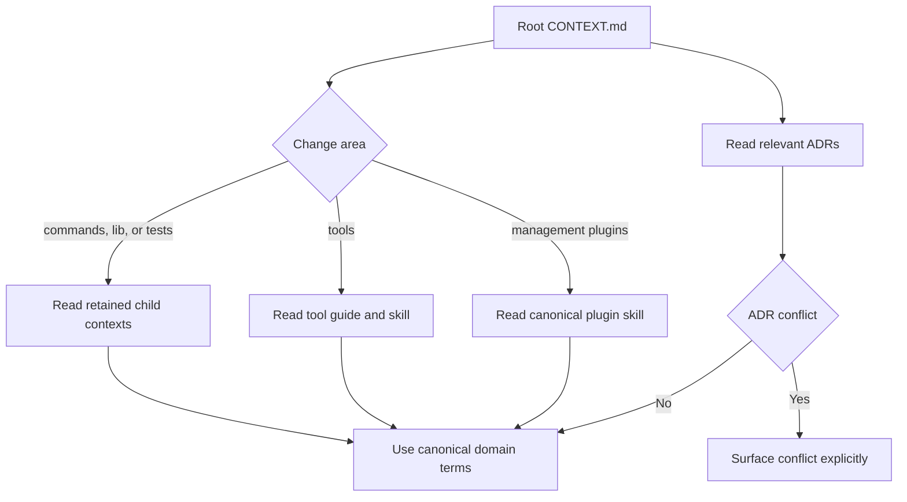

<!-- PAGE_ID: shimmy-15-contributing-and-maintenance -->

📚 Relevant source files

The following files were used as context for generating this wiki page:

- [CONTRIBUTING.md:1-218](https://github.com/wadebee/shimmy/blob/aaebadedc4bd1ac9f56f7e31bd394ae86cd97485/CONTRIBUTING.md#L1-L218)
- [AGENTS.md:1-147](https://github.com/wadebee/shimmy/blob/aaebadedc4bd1ac9f56f7e31bd394ae86cd97485/AGENTS.md#L1-L147)
- [CONTEXT.md:1-101](https://github.com/wadebee/shimmy/blob/aaebadedc4bd1ac9f56f7e31bd394ae86cd97485/CONTEXT.md#L1-L101)
- [domain.md:1-29](https://github.com/wadebee/shimmy/blob/aaebadedc4bd1ac9f56f7e31bd394ae86cd97485/docs/agents/domain.md#L1-L29)
- [issue-tracker.md:1-45](https://github.com/wadebee/shimmy/blob/aaebadedc4bd1ac9f56f7e31bd394ae86cd97485/docs/agents/issue-tracker.md#L1-L45)
- [prompt-shimmy-project.md:1-118](https://github.com/wadebee/shimmy/blob/aaebadedc4bd1ac9f56f7e31bd394ae86cd97485/docs/prompt-shimmy-project.md#L1-L118)
- [SKILL.md:1-188](https://github.com/wadebee/shimmy/blob/aaebadedc4bd1ac9f56f7e31bd394ae86cd97485/plugins/shimmy/skills/shimmy-commit/SKILL.md#L1-L188)

# Contributing and Maintenance

> **Related Pages**: [[Tool Authoring and Image Supply Chain|09-tool-authoring.md]], [[Testing and Validation|14-testing.md]]

---

<!-- BEGIN:AUTOGEN shimmy-15-contributing-and-maintenance-workflow -->
## Contribution Workflow

Begin every change by establishing its repository and domain context. Read the root `CONTEXT.md` and, for changes below `commands/`, `lib/`, or `tests/`, each retained child `CONTEXT.md` on the path to the files being changed. Tool and management-plugin work instead adds the relevant canonical `SKILL.md` and tool guide to that reading set. ([CONTRIBUTING.md:5-15](https://github.com/wadebee/shimmy/blob/aaebadedc4bd1ac9f56f7e31bd394ae86cd97485/CONTRIBUTING.md#L5-L15))

Treat a behavioral change as a coordinated repository change: implementation, tests, bootstrap or installation behavior, documentation, and retained-plan evidence should move together where they are affected. Keep executable shell files executable, and verify generated shell by parsing and exercising the rendered artifact rather than relying on its renderer alone. ([CONTRIBUTING.md:10-14](https://github.com/wadebee/shimmy/blob/aaebadedc4bd1ac9f56f7e31bd394ae86cd97485/CONTRIBUTING.md#L10-L14))

Before editing, inspect the worktree and preserve unrelated user work. Commit preparation requires special care: untracked files must be inspected because ordinary diffs omit their contents, and pre-existing staged changes remain user-owned unless the user explicitly approves including them. ([SKILL.md:16-37](https://github.com/wadebee/shimmy/blob/aaebadedc4bd1ac9f56f7e31bd394ae86cd97485/plugins/shimmy/skills/shimmy-commit/SKILL.md#L16-L37))

Review should follow the actual ownership boundary, not merely the directory layout. A change should identify the resource or repository concern, its owning component or interface boundary, the operation or transition, and the smallest meaningful verification. Split changes when ownership, reason, verification, rollback, or review decisions differ; keep production code and the tests proving one resource transition together. ([SKILL.md:45-59](https://github.com/wadebee/shimmy/blob/aaebadedc4bd1ac9f56f7e31bd394ae86cd97485/plugins/shimmy/skills/shimmy-commit/SKILL.md#L45-L59)) ([SKILL.md:79-102](https://github.com/wadebee/shimmy/blob/aaebadedc4bd1ac9f56f7e31bd394ae86cd97485/plugins/shimmy/skills/shimmy-commit/SKILL.md#L79-L102))

Sources: [CONTRIBUTING.md:5-19](https://github.com/wadebee/shimmy/blob/aaebadedc4bd1ac9f56f7e31bd394ae86cd97485/CONTRIBUTING.md#L5-L19), [SKILL.md:16-59](https://github.com/wadebee/shimmy/blob/aaebadedc4bd1ac9f56f7e31bd394ae86cd97485/plugins/shimmy/skills/shimmy-commit/SKILL.md#L16-L59), [SKILL.md:79-102](https://github.com/wadebee/shimmy/blob/aaebadedc4bd1ac9f56f7e31bd394ae86cd97485/plugins/shimmy/skills/shimmy-commit/SKILL.md#L79-L102)
<!-- END:AUTOGEN shimmy-15-contributing-and-maintenance-workflow -->

---

<!-- BEGIN:AUTOGEN shimmy-15-contributing-and-maintenance-code-conventions -->
## POSIX Shell and Naming Conventions

Shimmy is intentionally a POSIX shell project. Shared behavior and runtimes stay in shell unless an approved design explicitly leaves that architecture, and runtime shims remain small scripts using `#!/bin/sh` and `set -eu`. ([CONTRIBUTING.md:17-19](https://github.com/wadebee/shimmy/blob/aaebadedc4bd1ac9f56f7e31bd394ae86cd97485/CONTRIBUTING.md#L17-L19)) ([CONTRIBUTING.md:115-140](https://github.com/wadebee/shimmy/blob/aaebadedc4bd1ac9f56f7e31bd394ae86cd97485/CONTRIBUTING.md#L115-L140))

Runtime behavior belongs to each concrete version rather than a central tool-name dispatcher. A version uses the shared Podman platform helper, normally mounts `$PWD` at `/work`, owns its `image.conf` and `smoke.conf`, and keeps tool-specific logic in its `run.sh`. ([CONTRIBUTING.md:117-147](https://github.com/wadebee/shimmy/blob/aaebadedc4bd1ac9f56f7e31bd394ae86cd97485/CONTRIBUTING.md#L117-L147))

| Element | Convention | Examples or constraints |
|---|---|---|
| Actions | Prefer truthful verbs ordered general-to-specific; avoid vague verbs such as `handle`, `process`, and `do`. ([CONTRIBUTING.md:180-184](https://github.com/wadebee/shimmy/blob/aaebadedc4bd1ac9f56f7e31bd394ae86cd97485/CONTRIBUTING.md#L180-L184)) | `create`, `read`, `render`, `resolve`, `validate` |
| Shell files | Management commands and modules use lowercase kebab-case ending in `.sh`; a concrete runtime is always `tools/<tool>/versions/<major.minor>/run.sh`. ([CONTRIBUTING.md:186-193](https://github.com/wadebee/shimmy/blob/aaebadedc4bd1ac9f56f7e31bd394ae86cd97485/CONTRIBUTING.md#L186-L193)) | Do not retain staging-only `-target` or `target.sh` names in canonical files. |
| Functions | Shared functions use POSIX-safe `shimmy_` lowercase snake case; internal helpers use `shimmy__`; do not use the `function` keyword. ([CONTRIBUTING.md:195-205](https://github.com/wadebee/shimmy/blob/aaebadedc4bd1ac9f56f7e31bd394ae86cd97485/CONTRIBUTING.md#L195-L205)) | `shimmy_catalog_payload_validate`, `shimmy__catalog_config_value_read` |
| Variables | Locals use lowercase snake case; constants and exported variables use uppercase snake case. Every Shimmy-defined user-facing environment variable begins with `SHIMMY_`. ([CONTRIBUTING.md:207-215](https://github.com/wadebee/shimmy/blob/aaebadedc4bd1ac9f56f7e31bd394ae86cd97485/CONTRIBUTING.md#L207-L215)) | Non-`SHIMMY_` names are limited to documented upstream pass-throughs such as `AWS_*` or `TF_VAR_*`. |

Nearby clear vocabulary is the tie-breaker: names should not be changed solely for preference. ([CONTRIBUTING.md:217-218](https://github.com/wadebee/shimmy/blob/aaebadedc4bd1ac9f56f7e31bd394ae86cd97485/CONTRIBUTING.md#L217-L218))

Sources: [CONTRIBUTING.md:17-19](https://github.com/wadebee/shimmy/blob/aaebadedc4bd1ac9f56f7e31bd394ae86cd97485/CONTRIBUTING.md#L17-L19), [CONTRIBUTING.md:115-147](https://github.com/wadebee/shimmy/blob/aaebadedc4bd1ac9f56f7e31bd394ae86cd97485/CONTRIBUTING.md#L115-L147), [CONTRIBUTING.md:180-218](https://github.com/wadebee/shimmy/blob/aaebadedc4bd1ac9f56f7e31bd394ae86cd97485/CONTRIBUTING.md#L180-L218)
<!-- END:AUTOGEN shimmy-15-contributing-and-maintenance-code-conventions -->

---

<!-- BEGIN:AUTOGEN shimmy-15-contributing-and-maintenance-domain-docs -->
## Domain Context Documentation

The root `CONTEXT.md` is the repository-wide domain entry point. It defines the public model, installation state, transaction and ownership rules, runtime boundaries, and a source map to the command, library, tool, plugin, test, documentation, and retained-plan areas. ([CONTEXT.md:1-17](https://github.com/wadebee/shimmy/blob/aaebadedc4bd1ac9f56f7e31bd394ae86cd97485/CONTEXT.md#L1-L17)) ([CONTEXT.md:87-101](https://github.com/wadebee/shimmy/blob/aaebadedc4bd1ac9f56f7e31bd394ae86cd97485/CONTEXT.md#L87-L101))

The domain guide classifies Shimmy as a single-context repository and directs contributors to begin with the root context and relevant ADRs. The repository workflow further requires retained child context files along the path to changes under `commands/`, `lib/`, and `tests/`; tool and plugin trees use their guides and canonical skills instead. ([domain.md:5-20](https://github.com/wadebee/shimmy/blob/aaebadedc4bd1ac9f56f7e31bd394ae86cd97485/docs/agents/domain.md#L5-L20)) ([CONTEXT.md:87-101](https://github.com/wadebee/shimmy/blob/aaebadedc4bd1ac9f56f7e31bd394ae86cd97485/CONTEXT.md#L87-L101))

Use vocabulary already defined by the context documentation rather than drifting to synonyms. If a concept is absent, reconsider whether it belongs to the project or record the terminology gap for domain modeling; if proposed output conflicts with an ADR, surface that conflict instead of silently overriding the decision. ([domain.md:21-29](https://github.com/wadebee/shimmy/blob/aaebadedc4bd1ac9f56f7e31bd394ae86cd97485/docs/agents/domain.md#L21-L29))

Sources: [CONTEXT.md:1-17](https://github.com/wadebee/shimmy/blob/aaebadedc4bd1ac9f56f7e31bd394ae86cd97485/CONTEXT.md#L1-L17), [CONTEXT.md:87-101](https://github.com/wadebee/shimmy/blob/aaebadedc4bd1ac9f56f7e31bd394ae86cd97485/CONTEXT.md#L87-L101), [domain.md:5-29](https://github.com/wadebee/shimmy/blob/aaebadedc4bd1ac9f56f7e31bd394ae86cd97485/docs/agents/domain.md#L5-L29)
<!-- END:AUTOGEN shimmy-15-contributing-and-maintenance-domain-docs -->

---

<!-- BEGIN:AUTOGEN shimmy-15-contributing-and-maintenance-issues-commits -->
## Issues and Commits

GitHub Issues is the repository's issue and specification tracker, and all tracker operations use the `gh` CLI. The documented workflow covers creating, reading with comments and labels, listing with filters, commenting, changing labels, and closing issues; when run inside the clone, `gh` infers the repository from its Git remote. ([issue-tracker.md:1-14](https://github.com/wadebee/shimmy/blob/aaebadedc4bd1ac9f56f7e31bd394ae86cd97485/docs/agents/issue-tracker.md#L1-L14))

External pull requests are not currently treated as the feature-request triage surface. Because GitHub issues and pull requests share a number space, resolve an ambiguous reference such as `#42` by checking the pull request first and then the issue. ([issue-tracker.md:16-26](https://github.com/wadebee/shimmy/blob/aaebadedc4bd1ac9f56f7e31bd394ae86cd97485/docs/agents/issue-tracker.md#L16-L26))

Commits must be focused around one coherent resource, component or interface boundary, domain transition, or repository concern. The commit skill does not itself authorize a commit: committing occurs only when the user asks for it. ([SKILL.md:8-14](https://github.com/wadebee/shimmy/blob/aaebadedc4bd1ac9f56f7e31bd394ae86cd97485/plugins/shimmy/skills/shimmy-commit/SKILL.md#L8-L14)) Before staging, present each proposed chunk—with paths or hunks, boundary, verification, and full Conventional Commit message—and obtain explicit approval for that chunk. ([SKILL.md:104-112](https://github.com/wadebee/shimmy/blob/aaebadedc4bd1ac9f56f7e31bd394ae86cd97485/plugins/shimmy/skills/shimmy-commit/SKILL.md#L104-L112))

Stage only the next approved change, prefer explicit paths or patch staging, and never use `git add .` or `git add -A` in this workflow. Review the staged diff for secrets, debug output, unrelated formatting, boundary violations, and mixed rollback reasons before committing. ([SKILL.md:114-141](https://github.com/wadebee/shimmy/blob/aaebadedc4bd1ac9f56f7e31bd394ae86cd97485/plugins/shimmy/skills/shimmy-commit/SKILL.md#L114-L141)) Commit messages use `type(scope): short summary`, describe the domain effect and reason, and add a `BREAKING CHANGE` footer when applicable. ([SKILL.md:143-158](https://github.com/wadebee/shimmy/blob/aaebadedc4bd1ac9f56f7e31bd394ae86cd97485/plugins/shimmy/skills/shimmy-commit/SKILL.md#L143-L158))

Sources: [issue-tracker.md:1-26](https://github.com/wadebee/shimmy/blob/aaebadedc4bd1ac9f56f7e31bd394ae86cd97485/docs/agents/issue-tracker.md#L1-L26), [SKILL.md:8-14](https://github.com/wadebee/shimmy/blob/aaebadedc4bd1ac9f56f7e31bd394ae86cd97485/plugins/shimmy/skills/shimmy-commit/SKILL.md#L8-L14), [SKILL.md:104-158](https://github.com/wadebee/shimmy/blob/aaebadedc4bd1ac9f56f7e31bd394ae86cd97485/plugins/shimmy/skills/shimmy-commit/SKILL.md#L104-L158)
<!-- END:AUTOGEN shimmy-15-contributing-and-maintenance-issues-commits -->

---

<!-- BEGIN:AUTOGEN shimmy-15-contributing-and-maintenance-change-checklist -->
## Change Checklist

Use this checklist to close a contribution at the same boundaries at which Shimmy is maintained:

- [ ] Read the root and applicable retained context files; for tool or plugin work, also read the canonical skill and guide. ([CONTRIBUTING.md:5-9](https://github.com/wadebee/shimmy/blob/aaebadedc4bd1ac9f56f7e31bd394ae86cd97485/CONTRIBUTING.md#L5-L9))
- [ ] Preserve unrelated staged, unstaged, and untracked work; catalog refresh work must likewise leave all existing work untouched. ([CONTRIBUTING.md:14](https://github.com/wadebee/shimmy/blob/aaebadedc4bd1ac9f56f7e31bd394ae86cd97485/CONTRIBUTING.md#L14)) ([prompt-shimmy-project.md:52-60](https://github.com/wadebee/shimmy/blob/aaebadedc4bd1ac9f56f7e31bd394ae86cd97485/docs/prompt-shimmy-project.md#L52-L60))
- [ ] Keep the change within the POSIX shell architecture and the documented resource or component boundary. ([CONTRIBUTING.md:17-19](https://github.com/wadebee/shimmy/blob/aaebadedc4bd1ac9f56f7e31bd394ae86cd97485/CONTRIBUTING.md#L17-L19)) ([SKILL.md:45-54](https://github.com/wadebee/shimmy/blob/aaebadedc4bd1ac9f56f7e31bd394ae86cd97485/plugins/shimmy/skills/shimmy-commit/SKILL.md#L45-L54))
- [ ] Update every affected implementation, behavioral test, bootstrap or installer path, document, and retained-plan record together. ([CONTRIBUTING.md:10-11](https://github.com/wadebee/shimmy/blob/aaebadedc4bd1ac9f56f7e31bd394ae86cd97485/CONTRIBUTING.md#L10-L11))
- [ ] Inspect generated artifacts and exercise the rendered shell; preserve executable modes on runnable files. ([CONTRIBUTING.md:12-13](https://github.com/wadebee/shimmy/blob/aaebadedc4bd1ac9f56f7e31bd394ae86cd97485/CONTRIBUTING.md#L12-L13))
- [ ] Run relevant focused tests, then complete shell-syntax, executable-mode, inventory, and whitespace checks. The repository's final integration gate is `./tests/test.sh`, followed by `git diff --check`. ([CONTRIBUTING.md:164-178](https://github.com/wadebee/shimmy/blob/aaebadedc4bd1ac9f56f7e31bd394ae86cd97485/CONTRIBUTING.md#L164-L178)) ([prompt-shimmy-project.md:114-118](https://github.com/wadebee/shimmy/blob/aaebadedc4bd1ac9f56f7e31bd394ae86cd97485/docs/prompt-shimmy-project.md#L114-L118))
- [ ] Prefer the bounded parallel test runner; state `--jobs 3` when concurrency must be explicit, and reserve serial execution for a single group, failure diagnosis, or known ordering. ([CONTRIBUTING.md:164-168](https://github.com/wadebee/shimmy/blob/aaebadedc4bd1ac9f56f7e31bd394ae86cd97485/CONTRIBUTING.md#L164-L168))
- [ ] Keep retained-plan evidence factual: report only checks actually run, and record anything intentionally left uncommitted or unverified. ([SKILL.md:160-178](https://github.com/wadebee/shimmy/blob/aaebadedc4bd1ac9f56f7e31bd394ae86cd97485/plugins/shimmy/skills/shimmy-commit/SKILL.md#L160-L178)) ([SKILL.md:180-188](https://github.com/wadebee/shimmy/blob/aaebadedc4bd1ac9f56f7e31bd394ae86cd97485/plugins/shimmy/skills/shimmy-commit/SKILL.md#L180-L188))

Negative tests are not the default. Add them only for an explicit durable security, ownership, integrity, rollback, or compatibility invariant; otherwise prefer a positive proof of observable behavior. ([CONTRIBUTING.md:164-174](https://github.com/wadebee/shimmy/blob/aaebadedc4bd1ac9f56f7e31bd394ae86cd97485/CONTRIBUTING.md#L164-L174))

Sources: [CONTRIBUTING.md:5-19](https://github.com/wadebee/shimmy/blob/aaebadedc4bd1ac9f56f7e31bd394ae86cd97485/CONTRIBUTING.md#L5-L19), [CONTRIBUTING.md:164-178](https://github.com/wadebee/shimmy/blob/aaebadedc4bd1ac9f56f7e31bd394ae86cd97485/CONTRIBUTING.md#L164-L178), [prompt-shimmy-project.md:52-60](https://github.com/wadebee/shimmy/blob/aaebadedc4bd1ac9f56f7e31bd394ae86cd97485/docs/prompt-shimmy-project.md#L52-L60), [prompt-shimmy-project.md:114-118](https://github.com/wadebee/shimmy/blob/aaebadedc4bd1ac9f56f7e31bd394ae86cd97485/docs/prompt-shimmy-project.md#L114-L118), [SKILL.md:160-188](https://github.com/wadebee/shimmy/blob/aaebadedc4bd1ac9f56f7e31bd394ae86cd97485/plugins/shimmy/skills/shimmy-commit/SKILL.md#L160-L188)
<!-- END:AUTOGEN shimmy-15-contributing-and-maintenance-change-checklist -->

---
