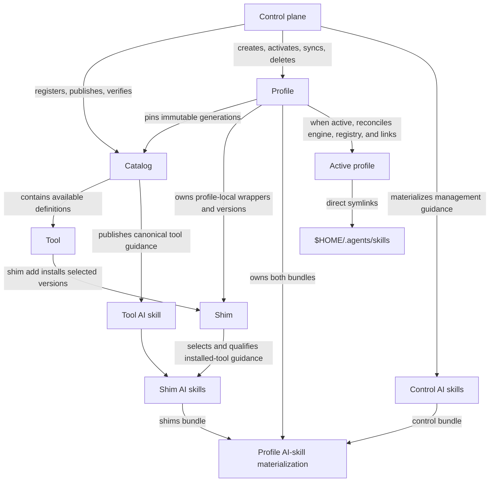

# Redesign the Shimmy control surface

## Objective

Replace Shimmy's unreleased `default|upstream` and top-level lifecycle model
with one coherent control surface for installation administration, arbitrary
profiles, shared immutable catalogs, profile-local shims, and profile-scoped AI
skills. The redesign must preserve Shimmy's POSIX-shell and Podman architecture,
retain current ownership and rollback protections, and make the successful
bootstrap state immediately usable: a mandatory `default` profile exists, is
active, owns the initial `jq` and `rg` shims, and exposes its AI skills through
direct user-level symlinks.

This is a hard cut for an unreleased product. Do not add command aliases,
manifest migration, repository AI-skill export compatibility, or an `upstream`
profile compatibility layer. Existing pre-redesign installations must be
removed with the revision that created them and bootstrapped again. Retained
plans remain historical records; where they conflict, this plan is the
authoritative forward design. No pre-redesign profile-manifest or
catalog-registry reader, renderer, version/source-type branch, fixture, or
version-specific compatibility test remains after the public cutover.
Transitional implementations may coexist behind the unexposed pre-cutover
surface only until the atomic cutover succeeds; Chunk 5 removes them.

## Target layout and terminology

### Stable terms

- **Control plane**: the `shimmy` launcher, management commands, shared
  libraries, tests, and control AI-skill sources materialized into every
  profile.
- **Catalog**: installation-wide, registered, immutable-generation authority
  for available tool/version definitions and canonical tool AI skills.
- **Tool**: a catalog definition. A tool is not installed merely because its
  catalog is registered or belongs to a profile.
- **Shim**: one profile-local tool wrapper and its installed concrete versions.
- **Profile**: a self-contained control-plane, shim, redirect, engine, startup,
  and AI-skill materialization below the canonical profiles root.
- **Active profile**: the one profile selected by Shimmy's installation-wide
  active record and reconciled with Podman registry/connection state and the
  user AI-skill links. There is always exactly one profile active per posix shell session.
- **Sync**: reconcile a resource from its defined authority. `catalog sync` is
  future external-catalog work, `profile sync` adopts current registered
  catalog generations and current control-plane source, and `shim sync` uses
  only generations already pinned by its profile.
- **Repair**: reconstruct owned host integration from current authoritative
  profile state without updating that state. The two repair operations are
  `profile repair-startup` and `ai-skill repair`.
- **AI skill**: the Codex/agent instruction resource previously called a
  skill. Public Shimmy commands, functions, variables, manifests, tests, and
  guidance use `ai-skill`/`ai_skill` terminology where the subject is the
  Shimmy lifecycle. Canonical files retain the ecosystem filename `SKILL.md`.

### Future-state lifecycle relationship (reference)



This diagram is reference information for the future state. A catalog makes
tools available; it does not install them. A profile pins catalog generations,
and `shim add` turns one selected catalog tool into a profile-local shim. Only
installed shims contribute detailed tool AI skills to that profile. Control AI
skills exist in every profile. Activating a profile projects that profile's
control and shim bundles into the user skill directory.

### Installed state

```text
${XDG_CONFIG_HOME:-$HOME/.config}/shimmy/
  active-profile.conf                 # schema and exactly one active name
  catalogs/
    default/
      registry.conf                   # current/previous immutable generations
      generations/
        sha256-.../
          catalog.conf
          generation.conf
          plugins/shimmy/skills/       # canonical control sources in snapshot
          tools/<tool>/SKILL.md         # canonical tool source
          tools/<tool>/tool.conf
          tools/<tool>/versions/...
  profiles/
    <profile>/
      install-manifest.txt             # profile, catalog pins, shims, provenance
      bin/
      commands/
      lib/
      tests/
      tools/                            # installed shim versions only
      config/
      registries.conf
      machine-projection.txt            # only when a Darwin projection exists
      shell-init.sh
      ai-skills/
        control/
          bundle.conf
          skills/<control-skill>/SKILL.md
        shims/
          bundle.conf
          skills/shimmy-tool-<tool>-<catalog>/SKILL.md

$HOME/.agents/skills/
  <shimmy-skill> -> <active-profile>/ai-skills/<bundle>/skills/<shimmy-skill>
```

The only user-level AI-skill artifacts Shimmy creates are direct symlinks into
the active profile. There is no repository target, copied home target, portable
export, catalog-wide exposed bundle, target manifest, or orphan state.

### Public command surface

```text
shimmy
├── admin
│   ├── status
│   ├── network
│   └── uninstall
├── profile
│   ├── list
│   ├── status
│   ├── create
│   ├── activate
│   ├── sync
│   ├── repair-startup
│   ├── delete
│   └── redirect
│       ├── list
│       ├── set
│       └── delete
├── catalog
│   ├── list
│   ├── status
│   ├── add            # documented external-catalog placeholder
│   ├── remove         # documented external-catalog placeholder
│   ├── sync           # documented external-catalog placeholder
│   ├── tools
│   ├── verify
│   ├── publish
│   └── rollback
├── shim
│   ├── list
│   ├── add
│   ├── remove
│   ├── set-version
│   ├── sync
│   └── test
└── ai-skill
    ├── list
    └── repair
```

Exact invocation forms are:

```text
shimmy admin status [--format human|manifest]
shimmy admin network [current netinfo options] [--format human|manifest]
shimmy admin uninstall [--stop-running]

shimmy profile list [--format human|manifest]
shimmy profile status [--format human|manifest]
shimmy profile create <name> [--default-catalog <name>]
  [--include-catalog <name> ...] [--restart] [--stop-running] [--dry-run]
shimmy profile activate <name> [--default-catalog <member>]
  [--restart] [--stop-running] [--dry-run]
shimmy profile sync
shimmy profile repair-startup
shimmy profile delete <name> [--stop-running]
shimmy profile redirect list [--format human|manifest]
shimmy profile redirect set --prefix <logical> --location <physical> [--dry-run]
shimmy profile redirect delete (--prefix <logical> | --all)
  [--detach] [--dry-run]

shimmy catalog list [--format human|manifest]
shimmy catalog status [--catalog-name <name>] [--format human|manifest]
shimmy catalog tools [--catalog-name <name>] [--generation <id>]
  [--format human|manifest]
shimmy catalog verify <catalog-name> [--tool <tool[@version]> ...]
  [--public-only] [--require-current-upstream] [--format human|manifest]
shimmy catalog publish
shimmy catalog rollback

shimmy shim list [--format human|manifest]
shimmy shim add <[catalog/]tool[@version]>
shimmy shim remove <[catalog/]tool[@version]>
shimmy shim set-version <[catalog/]tool@version>
shimmy shim sync [<[catalog/]tool[@version]> ...]
shimmy shim test [<[catalog/]tool[@version]> ...]

shimmy ai-skill list [--format human|manifest]
shimmy ai-skill repair
```

`catalog add`, `catalog remove`, and `catalog sync` appear in group help as
reserved external-catalog operations. Until that lifecycle is separately
designed, invoking one prints concise not-yet-supported guidance and returns
nonzero. Do not add placeholder state or speculative remote-pointer schemas.

## Recorded design decisions

### State identity, naming, and transaction boundaries

1. One canonical validator applies to profile names, catalog names, tool names,
   and the safe name components derived from them: lowercase ASCII letters,
   digits, and single internal hyphens; no empty values, leading/trailing
   hyphen, `--`, path separator, dot, underscore, uppercase, whitespace,
   metacharacter, or control character. AI-skill names are generated from
   validated components.
2. A successful installation always has a regular, non-symlink
   `active-profile.conf` containing exactly:

   ```text
   shimmy_active_profile_schema=1
   shimmy_active_profile_name=<profile>
   ```

   The named canonical profile must exist and validate. Absence, duplication,
   an unsafe target, a missing `default` profile, or disagreement that cannot
   be classified against engine state is invalid installation state, not a
   supported "no active profile" mode.
3. Profile manifest schema 1 is the sole accepted target profile format:

   ```text
   shimmy_install_manifest_version=1
   shimmy_install_layout=profile-materialized-root
   shimmy_profile_manifest_version=1
   shimmy_profile_name=<profile>
   shimmy_source_url=<control-plane-git-url>
   shimmy_source_ref=<materialized-commit>
   default_catalog=<catalog>
   catalog=<catalog>|<generation>|<source-commit>|<content-fingerprint>
   shim=<tool>|<catalog>|<launcher-default-version>|<tracking|pinned>
   shim_version=<tool>|<version>|<default|exact>
   startup_shell=<shell>                # zero or one
   startup_file=<absolute-path>         # repeatable exact ledger
   ```

   Records are lexically ordered and duplicate-free. Every `shim` origin must
   be a catalog membership, every `shim_version` must belong to exactly one
   `shim`, exactly one `default_catalog` membership must exist, and all
   generation/provenance fields must match the retained immutable generation.
   Record components containing `|` are invalid; URL and absolute-path values
   are scalar lines and are not split as records. This value deliberately
   restarts the redesigned format at 1 even though the pre-redesign format also
   used 1. It does not denote compatibility: readers validate this complete
   record contract and its cross-record invariants, never the numeric version
   alone. Pre-redesign manifests fail validation with remove-and-bootstrap
   guidance; there is no migration or legacy version dispatch.
4. `tracking` launcher mode means the unversioned launcher follows the one
   `shim_version=...|default` slot when that slot advances. `pinned` launcher
   mode means `shim set-version` selected an exact installed version. A shim
   has at most one catalog-default tracking slot and any number of exact slots.
5. Catalog registry schema 1 is the sole accepted target registry format and
   supports only localized immutable generations:

   ```text
   catalog_registry_schema=1
   catalog_name=<catalog>
   catalog_generation_current=<generation>
   catalog_generation_previous=<generation-or-empty>
   catalog_source_commit=<commit>
   catalog_content_fingerprint=<fingerprint>
   ```

   Records are in this exact order, scalar, and duplicate-free. The current
   pre-redesign registry is unversioned and supports `checkout|generation`
   source-type shapes; neither shape is accepted as compatibility input. The
   checkout source type, its `catalog_source_type` and `catalog_source_path`
   records, the `upstream` catalog/profile pairing, and `catalog rebind` are
   removed. The catalog payload identity in `catalog.conf` remains a separate
   `catalog_schema=1` format and is not stale registry compatibility code.
6. State-changing operations use same-filesystem staging, canonical-path and
   non-symlink checks, locks, revalidation under lock, candidate validation,
   and commit-last metadata. A selected unit either exposes the complete new
   state or retains the prior valid state. Engine, startup, and user-link
   operations retain bounded rollback reporting when external state prevents a
   complete restoration.
7. Temporary implementation chunks may add unexposed redesigned profile and
   catalog-registry libraries beside the current implementation. Transitional
   pre-redesign readers/renderers may remain only to keep the old dispatcher
   operational through Chunks 1–4; mark them as cutover cleanup and do not make
   the target validators route to them. The public cutover and transitional
   cleanup must be one review unit:
   profile activation, profile/shim sync, AI-skill bundle materialization, user
   links, launcher dispatch, and their manifest producers switch together.

### Profiles and administration

1. Eliminate the special `upstream` profile. Bootstrap creates only the
   mandatory `default` profile, installs catalog-default `jq` and `rg`, creates
   its two AI-skill bundles, activates its engine/registry state, installs the
   user AI-skill links, and then commits the installation. If initial
   activation fails, no valid installation is left behind. Shimmy continues to
   require a pre-existing deterministic Podman machine on Darwin and never
   provisions, adopts, renames, or deletes one.
2. The successful bootstrap path always activates `default`; remove the
   optional `--activate` distinction and the `--profile upstream` path.
   Sourcing still initializes the current shell after the install transaction;
   executing cannot mutate its parent shell. Startup opt-out and exact-ledger
   policy remain supported for the initial default profile.
3. `profile list` and `profile create` are installation-wide. `profile status`,
   `profile sync`, and `profile repair-startup` operate only on the profile
   enclosing the invoked launcher and take no profile name. `profile activate`
   and `profile delete` require one valid installed name. `ai-skill list` and
   `ai-skill repair` resolve the installation-wide active record rather than
   assuming the invoking launcher is active.
4. `profile create` builds an independent materialized control plane with
   catalog-default `jq` and `rg`, then automatically activates it. It accepts
   the same activation safeguards as `profile activate`. `--dry-run` validates
   and reports the complete create/activate/link plan without creating staging
   roots, pulling/building images, or changing engine, profile, startup, active
   record, or user-link state. A real activation failure removes staging and
   restores the previously active profile state.
5. Without catalog options, creation adds the registered catalog literally
   named `default` and designates it as the profile default. With options,
   `--default-catalog` adds and designates that catalog and repeatable
   `--include-catalog` adds other distinct memberships. Every catalog must already be
   registered with a valid current immutable generation. Creation never
   registers, synchronizes, or remotely verifies a catalog.
6. Each membership pins its exact generation, source commit, and fingerprint.
   Unqualified tool references resolve only against `default_catalog`.
   Non-default references require `catalog/tool[@version]`; there is no
   fallback or precedence search. Duplicate tool names may exist across
   memberships, but only one origin may own an installed shim name.
7. `profile activate --default-catalog <member>` transactionally changes the
   target profile's persistent `default_catalog` before it becomes active. The
   value must already be a membership. The active default cannot otherwise be
   removed; membership add/remove commands remain outside this plan.
8. Activation validates the named target's profile structure, pinned catalogs,
   shell asset, redirects, engine identity, and both AI-skill bundles before
   mutation. A malformed supported-schema bundle or invalidation of target's preflight
   represents damaged profile state and blocks activation with output describing problem and remediation steps.
9. Activation retains current workload acknowledgment, `--restart`,
   `--stop-running`, `--dry-run`, Linux registry-link, Darwin VM projection,
   default-connection commit-last, and shell-session-switch guarantees. The
   active record and user-link set are committed only after engine/registry
   validation. Direct execution prints the exact `shell-init.sh` source command;
   a sourced Shimmy function switches the caller only after success.
10. `default` profile cannot be deleted. The active profile cannot be deleted; activate
    another profile first. Deleting an inactive profile reuses exact startup,
    projection, machine-restoration, profile-lock, and ownership cleanup. It
    never changes current user AI-skill links. `--stop-running` is required only
    when the existing cleanup contract proves a necessary stop would interrupt
    listed workloads.
11. `profile repair-startup` is the current exact-ledger repair split out of
    update. It consumes only `startup_shell` and `startup_file` entries in the
    invoking manifest, recreates only Shimmy's marked block at those exact
    paths, never discovers or accepts arbitrary startup targets, and is an
    idempotent zero-result when the profile records no startup files.
12. `profile sync` requires the invoking profile to be active. It fetches the
    latest commit from `shimmy_source_url`, adopts the registered current
    generation of every catalog membership, resolves every installed shim,
    prepares all mandatory pulls/builds, regenerates control and shim assets,
    updates both AI-skill bundles, validates the complete candidate, and
    replaces user links in one transaction. It preserves profile identity,
    catalog membership names/default designation, redirects, engine identity,
    startup ledger/files, installed exact versions, and explicit launcher
    defaults. It does not repair startup files or run `catalog sync`.
13. `admin status` enumerates canonical profiles and renders each profile's own
    status. A per-profile validation/status failure is report data; enumeration
    continues and aggregate exit is zero. Failure to inspect the profiles root,
    parse the active record, or orchestrate the enumeration is nonzero.
14. `admin network` preserves the current netinfo inputs and renderers, always
    reports the host perspective, and adds the active profile name plus its VM
    and container perspective. Because no-active is invalid, an unreadable or
    invalid active record is an administration error rather than an
    "unavailable" success state.
15. `admin uninstall` is the sole operation allowed to remove `default`, the
    active record, every validated profile, all registered catalogs and
    generations, owned startup blocks, exact registry projections, and
    Shimmy-managed user AI-skill paths. It preserves source checkouts, Podman
    machines, operator registry policy, non-Shimmy user skills, and unrelated
    startup content. Keep the existing detach-all-before-delete ordering,
    workload acknowledgment, rollback anchors, and machine/default restoration.

### Catalogs and verification

1. `catalog list` enumerates every direct safe registered catalog directory
   even when its entry is invalid. Human columns are `CATALOG STATE CURRENT
   PREVIOUS`; manifest emits one
   `shimmy_catalog=<name>|<valid|invalid>|<current>|<previous>|<error>` record.
   Invalid entries are report data and list exits zero; inability to enumerate
   the registry root is nonzero.
2. `catalog status` is local-only. It defaults to the installation catalog
   literally named `default`, not the invoking profile default, and reports
   registry schema, current/previous generations, source commit, fingerprint,
   payload/schema health, and local error. A selected invalid catalog is
   nonzero.
3. `catalog tools` has the same literal-default behavior and lists the complete
   validated selected generation, irrespective of installed shims. Optional
   `--generation` selects one retained immutable generation of the named
   catalog without changing registry/profile state; it exists so the generic
   catalog AI skill can inspect each active profile pin. Human columns are
   `TOOL DEFAULT VERSIONS`; manifest records are
   `shimmy_catalog_tool=<catalog>|<generation>|<tool>|<default-version>|<comma-separated-versions>`.
4. `catalog verify <catalog>` absorbs `images verify`. It first validates local
   registry, generation, catalog/tool metadata, source fingerprints, and
   canonical AI-skill alignment. It then uses the active profile's Skopeo
   runtime and strict registry projection to check every configured remote
   runtime/base image by default. Repeatable `--tool` narrows scope,
   `--public-only` visibly skips authenticated entries, upstream drift warns by
   default, and `--require-current-upstream` makes drift fail. Preserve the
   existing `image_verify=...` manifest records and prepend catalog identity and
   local validation records.
5. `catalog publish` and `catalog rollback` are maintainer-only operations from
   the repository root in `$PWD`, always target `default`, and accept no
   selector. Publish requires a clean committed worktree, stages tracked
   catalog content from `HEAD`, computes the generation fingerprint once,
   validates the full candidate, and atomically advances current/previous.
   Rollback validates and atomically swaps the retained current/previous
   generation. Neither operation mutates a profile or its pin.
6. Publication and commit tests statically enforce one-to-one tool AI-skill
   alignment: every `tools/<tool>/tool.conf` has exactly one regular
   `tools/<tool>/SKILL.md`; there is no tool `SKILL.md` without `tool.conf`; the
   frontmatter name is `shimmy-tool-<tool>`; the description identifies the
   same tool; the standard Shimmy-managed header is present; the bytes are part
   of the generation fingerprint; and no tool skill performs an installed-shim
   check on each use. Runtime wrapper invocations do not check catalog or
   AI-skill publication state.
7. External catalog add/remove/sync is deferred. The future documented contract
   is: sync takes exactly one explicit catalog; remove rejects a catalog pinned
   by any profile. Do not decide localized-generation versus remote-pointer
   storage until that work is planned.

### Shims

1. Shim reads and mutations apply only to the invoking profile. `shim add`,
   `shim remove`, `shim set-version`, and `shim sync` require that profile to be
   active so image work and user AI-skill reconciliation share one authority.
   `shim list` and `shim test` remain read-only; test still requires valid
   runtime affinity when it executes a wrapper.
2. `shim add tool` prints versions from the profile's pinned source catalog and
   requires an interactive terminal to select one; the catalog default is the
   prompt default. Selecting the current catalog default records the one
   `default` tracking slot. Selecting another version records `exact`.
   `shim add tool@version` is noninteractive and exact. A qualified ref selects
   a non-default membership. Automation must provide `@version`.
3. The first installed version becomes the unversioned launcher's default.
   Later additions never change it. A catalog-default tracking launcher follows
   its tracking slot during sync; `shim set-version tool@version` changes it to
   `pinned` and requires that exact origin/version already be installed.
   `shim set-version tool` without version is invalid and should report available versions to user for clarification.
4. Adding a same-named tool from another membership rejects with remediation warning and blocks until the existing
   shim is removed. `shim remove tool` removes all versions, launcher/config,
   manifest entries, and the qualified AI skill. `shim remove tool@version`
   removes only that exact installed version and rejects the selected launcher
   default. These are durable ownership/data-integrity boundaries.
5. `shim sync` with no selectors reconciles every installed shim; positional
   selectors narrow to installed tools/versions. It resolves only the profile's
   pinned catalog generations and never adopts a registered newer generation.
   The tracking slot advances only if the pinned generation's catalog default
   changed; exact slots stay pinned. If an old tracking version is not also an
   exact slot, its materialization is replaced rather than accumulated.
6. Add and sync stage regenerated POSIX dispatchers, concrete runtime/config
   files, manifest/default selection, mandatory external-image pulls or local
   builds, and affected shim AI skills. Image readiness and complete candidate
   validation precede commit. There are no `--pull`, `--build`, `--images`, or
   independent AI-skill export switches.
7. `shim test` keeps the current non-mutating smoke contract and accepts no
   selectors as all installed shims. Image index/platform/drift verification is
   exclusively `catalog verify`.

### AI-skill bundles and user links

1. Support exactly two independently versioned bundles per profile:
   `ai-skills/control` contains the control-plane skills and
   `ai-skills/shims` contains only detailed skills for installed shims. Each
   `bundle.conf` is regular, non-symlink, lexically ordered, and uses:

   ```text
   shimmy_ai_skill_bundle_schema=1
   shimmy_ai_skill_bundle_kind=<control|shims>
   shimmy_profile_name=<profile>
   shimmy_ai_skill_source_ref=<control commit or catalog-pin-set fingerprint>
   skill=<materialized-name>|<sha256-content-fingerprint>|<source-identity>
   ```

   A shims source identity is `<catalog>|<tool>|<generation>`; a control source
   identity is `control|<canonical-name>|<commit>`. Bundle validation checks the
   manifest/content one-to-one relationship, safe paths, frontmatter names,
   fingerprints, and absence of nested symlinks/special files.
2. The control bundle contains canonical management skills from
   `plugins/shimmy/skills/` plus a new `shimmy-catalog` skill. It remains small
   and is present in every profile. `shimmy-catalog` gives a brief discovery
   summary only when invoked: resolve the active profile, read its catalog pins
   from `profile status --format manifest`, and query each with `catalog tools
   --catalog-name ... --generation ...`. It may recommend `shim add`; it does
   not expose every catalog tool skill or add a check to ordinary tool use.
3. Each installed tool source `tools/<tool>/SKILL.md` materializes as
   `shimmy-tool-<tool>-<catalog>` even for catalog `default`. Materialization
   rewrites the frontmatter name to that qualified name, preserves the body and
   provenance, and includes it only while that catalog supplies the installed
   shim. Duplicate catalog tool names are therefore distinguishable in source
   guidance even though only one can own a given installed shim.
4. Canonical control and tool `SKILL.md` files carry one of these exact HTML
   comments immediately after YAML frontmatter:

   ```text
   <!-- Shimmy-managed: profile activation links this skill into ~/.agents/skills and may overwrite that path. Do not edit generated copies; change this source only through the control-bundle release cycle. -->
   <!-- Shimmy-managed: profile activation links this skill into ~/.agents/skills and may overwrite that path. Do not edit generated copies; change this source only through the catalog release cycle. -->
   ```

   Use the first for control sources and the second for tool sources. Generated
   profile copies preserve the applicable comment and are never edited ad hoc.
5. On activation, resolve the supported target bundle entries, stage direct
   symlinks, and reconcile the full Shimmy set under `$HOME/.agents/skills`.
   Remove symlinks whose targets are inside any Shimmy profile AI-skill bundle
   but are absent from the supported target set. Preserve unrelated paths, but
   an exact destination named by the target bundle is a Shimmy-owned reserved
   path and is overwritten even when occupied by a file, directory, or foreign
   link. There is intentionally no collision backup, recovery command, or
   `ai-skill repair --dry-run` surface. Commit user links after all other
   activation validations; rollback restores the previous Shimmy link set when
   possible but does not restore an overwritten foreign collision.
6. `profile create`, `profile sync`, `shim add`, `shim remove`, and `shim sync`
   stage bundle changes and active-user links in their owning transaction.
   `profile activate` does not update bundle content; it validates and projects
   the target bundle. `catalog publish/rollback` changes no profile bundle.
7. `ai-skill repair` accepts no profile, selector, or dry-run. It performs the
   same full link reconciliation as activation against the current active
   profile without regenerating either bundle. Supported bundles reconcile
   independently. An unsupported schema is skipped with remediation and makes
   repair nonzero because needed state could not be fully reconciled; an
   activation with that same bundle still succeeds with a warning by explicit
   compatibility policy.
8. `ai-skill list` reads only the active profile's supported expected bundle
   union. It has three states: `valid` when the direct symlink resolves to the
   expected active-profile directory, `empty` when the user path is absent, and
   `invalid` when it exists as anything else or is broken. There is no `stale`,
   `orphan`, installed-check, bundle-presence column, repo column, or copied
   target fingerprint comparison.
9. Human output columns are `SKILL STATE USER LINK`. `USER LINK` includes the
   `~/.agents/skills/<name>` location and its target; empty/invalid rows include
   the expected target, and invalid rows include the actual occupant/target.
   Manifest output uses absolute normalized paths:

   ```text
   shimmy_ai_skill_profile=<active-profile>
   shimmy_ai_skill_bundle=<control|shims>|<schema>|<valid|unsupported>|<warning>
   shimmy_ai_skill=<name>|<control|shims>|<valid|empty|invalid>|<absolute-user-path>|<absolute-expected-target>|<actual-kind>|<absolute-actual-target-or-empty>
   ```

   List returns zero for valid, empty, invalid, or unsupported-schema report
   data. It emits no per-skill rows for an unsupported bundle. It returns
   nonzero only when it cannot inspect or classify required installation state.
10. The clone-free onboarding path is documented as: visit the GitHub
    repository, use the host's `$skill-installer` to install the canonical
    `plugins/shimmy/skills/shimmy-install` source from that repository, then
    invoke `$shimmy-install`. A successful bootstrap validates the installed
    profile copy and deliberately replaces the bootstrap copy at
    `$HOME/.agents/skills/shimmy-install` with the active-profile direct
    symlink. Restart guidance is a fallback only when the host does not detect
    the new symlinked skills automatically.
11. Remove generated `.agents/skills/` repository adapters and all
    `skills install|update|uninstall --target repo|profile`, export/archive,
    target-manifest, copied-home, orphan, and repo-precedence implementation,
    options, tests, and guidance. Preserve `.agents/plugins/marketplace.json`
    because it describes the local plugin, not a generated repo AI-skill
    target. Canonical sources remain in `plugins/shimmy/skills/` and
    `tools/<tool>/SKILL.md`.

### Status and output contracts

1. `profile status` is read-only and locally classifies catalog drift against
   registered current generations; it does not fetch Git or contact registries.
   Human output has `PROFILE`, `ENGINE`, `CATALOGS`, `SHIMS`, `AI SKILLS`, and
   `STARTUP` sections. Catalog columns are `CATALOG DEFAULT PINNED CURRENT DRIFT
   HEALTH`; shim columns are `SHIM ORIGIN DEFAULT MODE VERSIONS`; AI-skill
   summary shows each bundle schema/health and valid/empty/invalid user-link
   counts.
2. Preserve existing `shimmy_engine_*` manifest records and add/replace profile
   records with:

   ```text
   shimmy_profile_name=<name>
   shimmy_profile_active=<true|false>
   shimmy_profile_root=<absolute-path>
   shimmy_profile_source_url=<url>
   shimmy_profile_source_ref=<commit>
   shimmy_profile_default_catalog=<name>
   shimmy_profile_catalog=<name>|<true|false>|<pinned>|<registered-current>|<current|drift|invalid>|<fingerprint>
   shimmy_profile_shim=<tool>|<catalog>|<default-version>|<tracking|pinned>
   shimmy_profile_shim_version=<tool>|<version>|<default|exact>
   shimmy_profile_ai_skill_bundle=<control|shims>|<schema>|<valid|unsupported|invalid>
   shimmy_profile_ai_skill_links=<valid-count>|<empty-count>|<invalid-count>
   shimmy_profile_startup_shell=<shell-or-empty>
   shimmy_profile_startup_file=<absolute-path>   # repeated
   ```

3. `profile list` human columns are `PROFILE ACTIVE DEFAULT CATALOGS CONTROL
   STATE`. Manifest emits one
   `shimmy_profile=<name>|<true|false>|<default-catalog>|<comma-separated-members>|<source-ref>|<valid|invalid>`.
   Missing `default`, multiple active markers, or an unreadable profiles root is
   an orchestration error.
4. `admin status --format manifest` emits the active profile first, then one
   `shimmy_admin_profile=<name>|<ok|error>|<message>` and repeated
   `shimmy_admin_profile_record=<name>|<profile-status-key>|<value>` records.
   Human output labels and preserves each profile's complete status or error.
   Error strings are sanitized to one line and never include secret values.
5. Manifest order is deterministic: scalar identity/provenance, catalogs,
   shims/versions, AI-skill bundles/counts, startup, then engine records. Human
   paths use `~` only when they are under the current home; manifests always use
   normalized absolute paths.

### Documentation, source guidance, and testing policy

1. Update `README.md`, `BOOTSTRAP.md`, `CONTRIBUTING.md`, `commands/README.md`,
   `docs/prompt-shimmy-project.md`, relevant topic docs, root/child context, and
   canonical control/tool AI skills together with the public cutover. README
   and CONTRIBUTING each include one short paragraph summarizing activation's
   direct-symlink replacement and exact-path overwrite caution.
2. Update `AGENTS.md` to teach the new groups, active-profile invariant,
   absolute-launcher activation safeguards, `catalog verify`, profile-scoped
   AI-skill ownership, and the prohibition on ad-hoc generated bundle edits.
   Remove instructions for upstream profiles, `images`, top-level update/install,
   or explicit repo/home skill exports.
3. Rename test groups by resource (`commands-admin`, `commands-profile`,
   `commands-catalog`, `commands-shim`, `commands-ai-skill`) and retain the
   default bounded parallel runner. Use `--jobs 3` when selecting multiple
   groups; use serial only to diagnose a failure or an order-sensitive external
   state acceptance case.
4. Prefer positive acceptance proofs. Do not add tests whose only assertion is
   that removed top-level commands, the upstream profile, repo targets, orphan
   state, or obsolete options no longer exist. Negative tests are retained or
   added only for durable ownership, destructive-action, path safety,
   transaction rollback, manifest integrity, secret redaction, active/default
   deletion, catalog-origin collision, and launcher-default integrity.
5. Validate rendered shell artifacts by syntax checking and executing their
   installed copies. Stateful profile/engine acceptance uses explicitly
   prepared disposable config roots and pre-existing deterministic Podman
   machines; it never mutates the developer's normal profiles or provisions a
   machine.

## Verified implementation inventory

- Root `bootstrap.sh` currently accepts only `default|upstream`, always appends
  `jq` and `rg`, delegates both bootstrap and installed shim addition to
  `commands/install.sh`, and treats engine activation as optional.
- `lib/install/launcher-template.sh` validates the pre-redesign manifest version
  1 and exact profile/catalog name equality, dispatches the current top-level
  `catalog|images|install|uninstall|netinfo|profile|skills|status|test|update`
  surface, and special-cases profile help before manifest validation. Because
  the redesigned manifest also starts at version 1, the cutover must replace
  this shape-specific reader rather than route on the version value.
- `lib/profile/profile.sh`, registry projection code, install/uninstall, update,
  tests, and generated fixed VM scripts encode the `default|upstream` allowlist
  and current one-profile/one-catalog manifest model.
- `lib/catalog/catalog.sh` already provides strict catalog/generation metadata,
  fingerprint, path, tool, and canonical `SKILL.md` validation. The registry
  is currently unversioned and supports both immutable `generation` and live
  `checkout` source types; publication retains current/previous generations.
  The separate catalog payload already declares `catalog_schema=1` and remains
  part of the target catalog-generation contract.
- `commands/images.sh` and `lib/images/images.sh` already provide the Skopeo
  index, platform, access, digest, and drift checks to move under `catalog
  verify`.
- `lib/update/` already clones the configured source into staging and couples
  control-plane refresh, selected shim rematerialization, catalog-default
  adoption, optional pull/build, and startup repair. Its staging and rollback
  seams are the basis for the separated profile/shim transactions, not a
  compatibility API.
- `commands/skills.sh` is a large copied-target/export lifecycle with repo/home
  targets, `.shimmy-skills-manifest.txt`, archive export, catalog snapshot
  validation, and rollback. It is replacement scope, not reusable public
  behavior; only safe path validation, staging patterns, and canonical source
  resolution should be extracted.
- Canonical control AI skills are under `plugins/shimmy/skills/`; every current
  catalog tool has a colocated `tools/<tool>/SKILL.md`. Generated repository
  copies are under `.agents/skills/`. `.agents/plugins/marketplace.json` is a
  separate local-plugin descriptor.
- Current status, netinfo, profile activation, redirects, startup ledger,
  global uninstall, image verification, and profile smoke tests contain
  functionality to preserve under new ownership. The test runner already
  defaults to three bounded workers and has resource-oriented group seams.
- `README.md`, `BOOTSTRAP.md`, `CONTRIBUTING.md`, `commands/README.md`,
  `docs/{podman,registries,testing,netinfo,network-tools}.md`, canonical skills,
  tool guides, contexts, and retained plans contain extensive old command and
  upstream-profile terminology; classify every match before changing it.
- Official Codex skill guidance confirms that user skills are discovered under
  `$HOME/.agents/skills`, symlinked skill folders are supported, changes are
  normally detected automatically, and initial skill-list context is bounded.
  The two-bundle/installed-shim design limits exposed skills and uses direct
  supported links: <https://learn.chatgpt.com/docs/build-skills>.
- At plan creation, `plans/default-command-help.md` was already untracked. It is
  user work and must remain untouched by this plan and its implementation
  unless separately authorized. `plans/redesign-control-surface.md` did not
  previously exist.

## Unresolved

None.

## Progress Checklist

- [ ] Chunk 1 — Add unexposed redesigned state and transaction primitives.
- [ ] Chunk 2 — Implement the immutable catalog surface and publication checks.
- [ ] Chunk 3 — Build profile/admin lifecycle and status internals behind the current dispatcher.
- [ ] Chunk 4 — Build shim and AI-skill bundle/link internals behind the current dispatcher.
- [ ] Chunk 5 — Perform the atomic public control-surface cutover.
- [ ] Chunk 6 — Complete repository-wide guidance cleanup and final acceptance.

## Execution protocol

For every chunk:

1. Read `AGENTS.md`, `CONTEXT.md`, every child context on the path to a changed
   file, this plan, and the chunk's target files.
2. Execute only that chunk's scope.
3. Run its verification checklist and record `[x]`, `[ ]`, or `[~]` with notes.
4. Update the cumulative **Lessons learned** block.
5. Summarize changes, tests, failures, uncertainties, and remaining risks.
6. Stop for human review and explicit acceptance before starting the next
   chunk.

Repository paths in this plan are relative to `<repo>` so it remains portable
across workstations and sessions.

## Chunk 1 — Redesigned state and transaction primitives

### Goal

Add fully tested, unexposed readers, validators, renderers, staging, lock, and
rollback primitives for the target active record, profile manifest, immutable
catalog pins, shim ledger, and two AI-skill bundles without changing current
launcher dispatch or installed behavior.

### Files

- Shared/state libraries: `lib/common/common.sh`, `lib/profile/{profile,state}.sh`,
  `lib/catalog/catalog.sh`, `lib/install/{manifest,profile-assets}.sh`, and new
  `lib/{shim,ai-skill}/` modules plus their `CONTEXT.md` files.
- Transaction reuse: relevant files under `lib/install/`, `lib/update/`,
  `lib/profile/`, and `lib/registries/` only where a neutral staging/rollback
  primitive must be extracted.
- Unit fixtures and groups: `tests/lib/`, `tests/support.sh`, `tests/test.sh`,
  and `tests/runner.sh`.

### Implementation requirements

- Add the exact target schema-1 record validators from this plan, including
  cross-record membership, origin, tracking-slot, launcher-default, provenance,
  path, and ordering checks. Validate one complete target shape; do not add a
  version router or reuse a pre-redesign shape parser merely because both
  formats use version 1.
- Add the exact catalog-registry schema-1 validator and renderer, including
  ordered scalar identity, current/previous generation, commit, and fingerprint
  validation. Do not retain source-type dispatch in the target implementation.
- Add the canonical active-record resolver and atomic renderer without making
  any current public command consume it yet.
- Add bundle validators/renderers for independent control/shims schemas and a
  safe direct-symlink plan classifier that reports valid/empty/invalid.
- Extract reusable same-filesystem stage, lock, revalidate, commit, and bounded
  rollback operations instead of copying update/install logic. Preserve the
  existing exact projection/startup ownership boundaries.
- Keep the current public tests green during preparation. Mark the temporary
  pre-redesign profile-manifest and catalog-registry implementations clearly as
  cutover-only seams scheduled for complete deletion in Chunk 5; do not turn
  them into compatibility behavior.

### Verification checklist

- [ ] Target profile-manifest schema-1 round-trip fixtures prove deterministic
  manifest, active-record, catalog-pin, shim-ledger, and two-bundle
  rendering/validation.
- [ ] Target catalog-registry schema-1 round-trip fixtures prove deterministic
  current/previous generation and provenance rendering/validation without
  source-type routing.
- [ ] Positive fixtures prove arbitrary safe profile names, multiple catalog
  pins with one default, duplicate tool names across catalogs, one installed
  origin, tracking/exact coexistence, and qualified materialized AI-skill names.
- [ ] Durable integrity coverage proves unsafe paths, foreign links, duplicate
  records, invalid origin/default relationships, and partial transaction
  rollback do not become owned state.
- [ ] User-link classification reports valid, empty, invalid regular occupant,
  foreign symlink, wrong-profile symlink, and broken symlink without mutation.
- [ ] Rendered POSIX artifacts pass `sh -n`, and shell-generation tests exercise
  the rendered output rather than only renderer source.
- [ ] Run focused library groups with bounded concurrency:

  ```sh
  ./tests/test.sh --jobs 3 \
    --group lib-catalog \
    --group lib-profile-state \
    --group lib-shim \
    --group lib-ai-skill
  ```

- [ ] Run `./tests/test.sh` and record the exact pass count; existing public
  behavior remains green because no cutover occurred.

### Human review gate

Confirm the owned formats, validators, transaction ordering, direct-link
classification, and explicitly temporary pre-redesign profile/registry seams.
Acceptance authorizes catalog implementation, not public
profile/shim/AI-skill cutover.

## Chunk 2 — Immutable catalog surface and publication constraints

### Goal

Implement the target read-only and maintainer catalog behavior on immutable
generations, absorb image verification, and establish the static canonical
tool AI-skill publication constraint.

### Files

- Catalog/image commands and libraries: `commands/catalog.sh`,
  `commands/images.sh` (source to be absorbed then removed at cutover),
  `lib/catalog/catalog.sh`, `lib/images/images.sh`, `lib/runtime/image.sh`, and
  `lib/install/catalog-lifecycle.sh`.
- Catalog metadata/source: `catalog.conf`, `plugins/shimmy/skills/`,
  `tools/*/{tool.conf,SKILL.md}`, and the generation/publication payload lists.
- Coverage: `tests/lib/catalog.sh`, `tests/commands/{catalog,images}.sh`, image
  fixtures, test registry/support, and relevant context files.

### Implementation requirements

- Implement list/status/tools/verify output and exit contracts exactly as
  recorded, including literal-default selection and exact retained-generation
  inspection.
- Make every target catalog registry producer and consumer use the exact schema
  1 registry contract. Keep any old unversioned registry implementation isolated
  behind the pre-cutover dispatcher and marked for Chunk 5 deletion; do not add
  fallback reads, migration, or dual-format writes.
- Move Skopeo verification orchestration under catalog without changing strict
  redirects, authentication redaction, platform/digest checks, drift severity,
  or public-only skip visibility.
- Make publish/rollback default-only, clean-committed-repository operations and
  remove their dependency on an upstream profile or checkout registry entry.
- Add `shimmy-catalog` canonical source and static one-to-one tool AI-skill
  validation. Add the standard managed header to canonical sources in the
  publication payload, but do not generate profile bundles or user links yet.
- Keep `add|remove|sync` as documented non-mutating placeholders. Do not add
  external catalog state.

### Verification checklist

- [ ] Catalog list reports valid and invalid registered entries as rows and
  reserves nonzero for enumeration/orchestration failure.
- [ ] Registry schema-1 creation, publication advance, and rollback round-trip
  the exact ordered format and retain valid current/previous generation state.
- [ ] Status and tools inspect local default/current and explicit retained
  generations without network or profile mutation; output is deterministic.
- [ ] Verify covers complete default selection, repeated tool narrowing,
  authenticated skips, platform/index/digest validation, warning drift, and
  strict drift failure using existing fixtures and the active registry policy.
- [ ] Publish from a clean committed source produces one fingerprinted
  generation whose validated payload includes every canonical tool skill;
  rollback swaps valid current/previous state atomically.
- [ ] Commit/publication validation positively proves the exact tool-to-skill
  mapping and fingerprint inclusion. Do not add a generic removed-interface
  rejection suite.
- [ ] Run focused groups:

  ```sh
  ./tests/test.sh --jobs 3 \
    --group lib-catalog \
    --group commands-catalog \
    --group commands-images
  ```

- [ ] Run `./tests/test.sh`; record pass count and any fixture changes.

### Human review gate

Confirm immutable default catalog ownership, registry schema-1 boundaries,
local versus remote reads, exact output schemas, static AI-skill alignment, and
image verification parity. Acceptance authorizes internal profile lifecycle
work.

## Chunk 3 — Profile and administration internals

### Goal

Build and directly test the complete redesigned profile-manifest schema-1
profile/admin workflows behind the current public dispatcher, including
bootstrap/create plans, activation,
sync orchestration hooks, status, startup repair, deletion, redirects, network,
and global uninstall.

### Files

- Profile/admin commands and internals: `commands/profile.sh`, new
  `commands/admin.sh`, `commands/{status,netinfo}.sh` as sources to absorb,
  `lib/profile/`, `lib/registries/`, `lib/startup/`, `lib/netinfo/`,
  `lib/install/{startup,uninstall,profile-assets}.sh`, and profile portions of
  `lib/update/`.
- Bootstrap/install preparation: `bootstrap.sh`, a new bootstrap-specific
  command module, `lib/install/launcher-template.sh`, and install request/state
  helpers, without switching root dispatch yet.
- Coverage: profile activation/state, registries, startup, lifecycle, status,
  netinfo, onboarding, and management tests plus contexts.

### Implementation requirements

- Generalize safe names, exact profile discovery, engine identities, Linux
  targets, Darwin fixed scripts, shell-init switching, projection records, and
  uninstall enumeration from two built-ins to arbitrary canonical profiles.
- Implement active-record-aware list/status/create/activate/delete and the
  default-profile invariants. Use stubbed bundle/link and shim-reconciliation
  hooks with explicit candidate interfaces supplied by Chunk 4; do not expose
  a partially transitioned activation publicly.
- Implement create's catalog selection, `jq`/`rg` baseline, dry run, activation
  rollback, and prior-active restoration against disposable fixtures.
- Split exact-ledger startup repair from profile sync and preserve startup bytes
  during ordinary profile/shim transactions.
- Implement profile sync's all-or-nothing control/catalog-pin orchestration up
  to the shim/bundle candidate boundary; it must not independently commit
  catalog pins or control assets before the Chunk 4 candidate succeeds.
- Implement admin aggregation, active network selection, and all-owned-state
  uninstall, including a hook for final user AI-skill cleanup.

### Verification checklist

- [ ] Disposable fixtures prove bootstrap/default-active planning, arbitrary
  create and automatic activation, persistent default-catalog override,
  inactive status, active-switch rollback, sourced-shell success, and direct
  launcher guidance.
- [ ] Profile sync stages current control source plus all registered generation
  advances as one candidate while preserving profile identity, redirects,
  startup, exact shim intent, and pinned launcher defaults.
- [ ] Startup repair changes only exact ledger paths and is a zero-result for a
  profile without entries.
- [ ] Profile deletion and admin uninstall retain exact ownership, workload,
  detach, restoration, default/active safeguards, and no-machine-provisioning
  behavior.
- [ ] Admin status continues past per-profile errors with zero aggregate status;
  admin network uses the active record and current host/VM/container renderers.
- [ ] Run focused groups:

  ```sh
  ./tests/test.sh --jobs 3 \
    --group lib-profile-activation \
    --group lib-registries \
    --group commands-profile \
    --group commands-admin
  ```

- [ ] Run `./tests/test.sh`; record pass count. Public dispatcher remains on the
  pre-cutover route during this internal chunk.

### Human review gate

Confirm arbitrary-profile engine/path safety, default/active invariants,
create/activation rollback, sync preservation, status aggregation, startup
repair, and deletion/uninstall boundaries. Acceptance authorizes the shim and
AI-skill half of the cutover.

## Chunk 4 — Shim and AI-skill internals

### Goal

Build and directly test the profile-local shim lifecycle, two AI-skill bundle
materializers, direct user-link reconciler, and transaction callbacks required
to make profile activation and both sync commands change together.

### Files

- New commands/internals: new `commands/{shim,ai-skill}.sh`, new
  `lib/{shim,ai-skill}/`, relevant runtime/install/update selection,
  refresh/image, manifest, profile-assets, and transaction modules.
- Source materialization: `plugins/shimmy/skills/`, `tools/*/SKILL.md`, tool
  metadata/version renderers, and `lib/install/launcher-template.sh` candidate
  generation.
- Coverage: new `tests/lib/{shim,ai-skill}.sh`, new
  `tests/commands/{shim,ai-skill}.sh`, profile smoke tests, fixtures, contexts,
  and test runner registration.

### Implementation requirements

- Implement exact catalog-qualified parsing, interactive/default versus exact
  add intent, single-origin ownership, installed version/default records,
  remove/set-version, pinned-generation sync, and smoke selection.
- Make pull/build mandatory for add/sync candidates and validate image readiness
  before any manifest, wrapper, bundle, or link commit.
- Materialize qualified tool skills from the pinned catalog and control skills
  from the candidate control source; render and validate independent bundle
  manifests and fingerprints.
- Implement list and repair exact output/exit contracts, supported-bundle
  independent reconciliation, unsupported-schema behavior, direct-link
  scanning, complete old-active removal, exact destination overwrite, and
  admin-uninstall cleanup.
- Connect the candidate callbacks to Chunk 3 transactions in tests while still
  leaving the current root launcher route unchanged. Verify collision behavior
  without adding backup/recovery features.

### Verification checklist

- [ ] Shim fixtures prove default-catalog and qualified resolution, one-origin
  ownership, interactive default/exact recording, first-default stability,
  explicit default pinning, version/all removal, and tracking advancement from
  pinned generations only.
- [ ] Add/sync failure injection before image readiness or candidate validation
  leaves wrappers, versions, manifest, bundles, and user links at the previous
  valid state.
- [ ] Control and shims bundles validate independently; installed shims produce
  only `shimmy-tool-<tool>-<catalog>` entries and removal removes that expected
  entry.
- [ ] AI-skill list includes user link locations and accurately renders
  valid/empty/invalid with zero status; unsupported bundle schema warns and
  emits no rows for that bundle.
- [ ] Repair and activation share one reconciliation primitive. Repair returns
  nonzero for an unsupported bundle after reconciling supported content;
  activation succeeds with the same warning policy.
- [ ] Exact reserved-path collisions are overwritten and unrelated user skill
  paths are preserved. Tests assert the accepted overwrite outcome, not a
  recovery mechanism.
- [ ] Run focused groups:

  ```sh
  ./tests/test.sh --jobs 3 \
    --group lib-shim \
    --group lib-ai-skill \
    --group commands-shim \
    --group commands-ai-skill
  ```

- [ ] Run `./tests/test.sh`; record pass count before public cutover.

### Human review gate

Confirm shim intent/default semantics, mandatory image preparation, bundle
qualification/fingerprints, direct-link ownership, collision overwrite,
unsupported-schema behavior, and shared transaction callbacks. Acceptance
authorizes the one public cutover chunk.

## Chunk 5 — Atomic public control-surface cutover

### Goal

Switch bootstrap, installed launcher dispatch, all manifest producers, public
commands, profile activation/sync, shim lifecycle, and AI-skill projection to
the target design in one implementation unit; remove the obsolete public and
repo-target surfaces in the same unit.

### Files

- Entrypoints and dispatch: `bootstrap.sh`, bootstrap command module,
  `lib/install/launcher-template.sh`, `commands/{admin,profile,catalog,shim,ai-skill}.sh`.
- Removed/replaced command sources: `commands/{images,install,netinfo,skills,status,update}.sh`
  after their retained behavior has moved; installed test dispatch moves under
  `shim test`.
- All schema producers/consumers under `lib/`, generated Darwin scripts,
  agent-preflight, materialization payload lists, and install/update/uninstall
  orchestration.
- Public behavioral tests and fixtures under `tests/`; generated repo adapters
  under `.agents/skills/` are removed while `.agents/plugins/marketplace.json`
  remains.
- Primary guidance required with behavior: `README.md`, `BOOTSTRAP.md`,
  `CONTRIBUTING.md`, `commands/README.md`, `AGENTS.md`, root/changed-path
  `CONTEXT.md`, and canonical control/tool `SKILL.md` files.

### Implementation requirements

- Change every public profile-manifest producer and consumer to the exact
  redesigned schema 1 shape. Remove the pre-redesign manifest readers,
  renderers, version branches, fixtures, and version-specific compatibility
  tests together with the upstream profile/catalog checkout, rebind, optional
  bootstrap activation, old dispatcher, copied/exported skills, and split
  update/image commands. Do not retain hidden forwarding aliases. Retain only
  schema-integrity tests that exercise the redesigned format's durable
  validation contract rather than a prior version's compatibility behavior.
- Change every public catalog-registry producer and consumer to the exact
  redesigned schema 1 shape. Remove the unversioned checkout/generation
  readers, renderers, source-type dispatch, rebind paths, fixtures, and
  compatibility-only tests after target publication/rollback succeeds. Retain
  the separate catalog-payload `catalog_schema=1` validator and its durable
  payload-integrity coverage.
- Make a successful bootstrap commit default profile, active record, catalog
  pin, baseline shims/images, bundles, user links, engine/registry state, and
  startup state as one lifecycle result.
- Wire activation, create, profile sync, shim add/remove/sync, AI repair, and
  admin uninstall to the shared bundle/link transaction callbacks. Ensure
  profile activation and tool syncs cannot expose pre-redesign AI-skill state.
- Install the exact root/group/action help and manifest/human schemas from this
  plan. Preserve help-before-state validation so users can obtain remediation
  from damaged installations.
- Remove obsolete fixtures/tests rather than adding rejection coverage for the
  removed interface. Retain positive invariants previously protected by those
  tests under their new resource group.
- Update README and CONTRIBUTING onboarding with the brief direct-symlink
  process and overwrite caution, plus the remote `$skill-installer` then
  `$shimmy-install` workflow. Add the standard header to all associated
  canonical sources.

### Verification checklist

- [ ] Root and second/third-level help present exactly the target resource
  groups, invocation forms, future catalog placeholders, defaults, scopes,
  mutation warnings, and remediation.
- [ ] A pristine disposable bootstrap produces one active default profile,
  one default catalog pin, jq/rg shims, both bundles, direct user links, valid
  engine/registry state, and optional exact startup ledger; a failed activation
  leaves no installed state.
- [ ] End-to-end create → activate → shim add/set-version/sync/remove → profile
  sync → startup repair → activate sibling → delete inactive demonstrates the
  recorded ownership and atomicity contracts.
- [ ] Admin status/network/uninstall, catalog publish/rollback/verify, strict
  redirects, agent preflight, installed smoke dispatch, and sourced shell
  behavior retain their positive functionality under new names.
- [ ] An unsupported target bundle schema independently skips with activation
  success/warning; AI repair reports nonzero; valid bundle links still match
  the selected active profile.
- [ ] The remote-install onboarding is exercised from a disposable home: the
  initially installed `shimmy-install` copy successfully bootstraps, then its
  exact user path is a direct active-profile symlink.
- [ ] Syntax-check all runnable shell sources and rendered installed assets.
- [ ] Inventory searches and test-group review confirm no pre-redesign
  profile-manifest parser, renderer, version branch, fixture, or
  compatibility-only test remains. Redesigned round-trip and manifest-integrity
  coverage proves that readers accept only the complete target record contract
  without adding an old-manifest rejection fixture.
- [ ] Inventory searches and test-group review confirm no unversioned catalog
  registry parser/renderer, checkout source-type branch, rebind path, fixture,
  or compatibility-only test remains. Registry schema-1 round-trip and
  transaction coverage proves the target contract without adding an old-format
  rejection fixture.
- [ ] Run all new resource groups with bounded concurrency, then the complete
  suite with the default three workers:

  ```sh
  ./tests/test.sh --jobs 3 \
    --group commands-admin \
    --group commands-profile \
    --group commands-catalog \
    --group commands-shim \
    --group commands-ai-skill
  ./tests/test.sh
  ```

- [ ] Perform native Podman acceptance only with explicitly prepared disposable
  config/home roots and pre-existing deterministic machines. Capture before and
  after machine, connection, workload, registry link, active record, profile,
  catalog, bundle, and user-link state; mark `[~]` if the reviewer accepts
  deferral.

### Human review gate

Confirm the public hard cut as one coherent release boundary: no partial
activation/AI state, default always active after success, complete transaction
rollback evidence, exact command/output contracts, remote onboarding, primary
documentation, and native Podman evidence or explicit deferral. Acceptance
authorizes only repository-wide cleanup and final regression.

## Chunk 6 — Repository-wide guidance cleanup and final acceptance

### Goal

Classify and update every remaining current guidance/reference, finish test
group organization and source-package cleanup, and prove the repository has one
internally consistent control-surface design without rewriting historical plan
records.

### Files

- Current guidance: remaining `AGENTS.md`, `CONTEXT.md`, `README.md`,
  `CONTRIBUTING.md`, `BOOTSTRAP.md`, `commands/README.md`, `docs/**/*.md`,
  `docs/templates/`, `plugins/shimmy/skills/`, `tools/*/{SKILL.md,guide.md}`,
  and source comments/help.
- Tests/runner: `tests/**/*.sh`, `tests/**/*.md`, fixture names, group registry,
  assignment/timing comments, and test documentation.
- Packaging/inventory files that enumerate control/profile/catalog payloads.
- Retained `plans/*.md` are historical and are not mechanically rewritten;
  this plan's objective already records supersession.

### Implementation requirements

- Run broad terminology searches and classify each match as current behavior,
  external upstream-image terminology, historical plan evidence, or stale
  guidance. Change only stale current behavior; do not mechanically replace
  legitimate uses of “upstream” for image publishers or Git sources.
- Ensure every current example uses the new resource group and exact selector
  grammar, every skill describes active-profile and approval behavior, and no
  current onboarding depends on a repository clone or repo-level adapter.
- Ensure payload lists include only canonical sources and installed bundle
  generators; repository `.agents/skills` copies and their generation logic are
  absent from current source/package ownership.
- Consolidate test groups/resources without adding absence-only regression
  tests. Preserve one authoritative proof for each durable invariant.

### Verification checklist

- [ ] Classified `rg` searches find no stale current references to the upstream
  profile/catalog binding, top-level install/update/uninstall/status/netinfo/test,
  separate images group, `shimmy skills`, repo/profile AI-skill targets,
  `.shimmy-skills-manifest.txt`, orphan/stale states, or ad-hoc generated skill
  edits. Remaining matches are documented external or historical uses.
- [ ] All canonical `SKILL.md` frontmatter, managed headers, tool/catalog
  identities, commands, and profile paths pass catalog publication validation.
- [ ] `README.md` and `CONTRIBUTING.md` each contain the agreed brief activation
  symlink summary and overwrite caution; bootstrap onboarding is clone-free for
  an AI-agent user while checkout bootstrap remains documented for maintainers.
- [ ] Test group listing, group assignment validation, context-tree validation,
  shell syntax, and executable-bit checks pass.
- [ ] Run the complete default bounded-parallel suite twice from clean
  disposable state if any prior failure proved order sensitivity; otherwise
  run once and rerun only failures serially for diagnosis.
- [ ] Record final test count, native/deferred acceptance state, dirty-worktree
  classification, remaining external prerequisites, and release risks.

### Human review gate

Confirm terminology classification, canonical-source ownership, onboarding and
overwrite guidance, test evidence, retained historical-plan treatment, and any
explicitly deferred native acceptance. Acceptance completes the redesign plan.

## Risk register

- **Atomic cutover breadth:** Profile manifests, catalogs, shims, activation,
  and AI links are coupled. Mitigation: build/test unexposed primitives in
  Chunks 1–4, then switch every public producer/consumer in one Chunk 5 review
  unit; do not publish intermediate chunks as a release.
- **Reused profile schema number:** Both the pre-redesign and redesigned
  profile manifests identify themselves as version 1, so the number cannot
  distinguish their incompatible shapes. Mitigation: accept only the complete
  redesigned record set and cross-record invariants, delete every legacy
  reader/renderer/test fixture at cutover, and give invalid old installations
  remove-and-bootstrap guidance. This deliberately gives up precise
  version-based diagnostics for old manifests.
- **Catalog schema-name ambiguity:** The future state uses schema 1 for both
  `catalogs/<name>/registry.conf` and the distinct catalog payload
  `catalog.conf`; the current registry itself is unversioned. Mitigation: use
  distinct identity keys (`catalog_registry_schema` versus `catalog_schema`),
  validate each file against its own exact contract, delete unversioned
  registry/source-type paths after cutover, and retain payload schema-1 code and
  integrity tests.
- **External engine rollback:** Podman machine/connection and registry state can
  fail outside filesystem transactions. Mitigation: retain current workload
  guards, exact projection records, locks, commit-last connection/active record,
  bounded restoration, and explicit incomplete-rollback reporting.
- **User-path overwrite:** Activation intentionally overwrites an exact
  bundle-named user skill path. Mitigation is deliberately narrow: validate the
  target bundle/name, explain ownership in onboarding and canonical headers,
  commit links last, and preserve all unrelated names. Do not add backup or
  recovery scope.
- **Cross-profile control revisions:** A launcher may inspect a sibling produced
  by another commit. Mitigation: require supported profile/catalog schemas for
  mutation, keep target assets self-validating, permit only the explicitly
  accepted unsupported AI-bundle warning/skip behavior, and direct users to
  activate then `profile sync`.
- **Catalog drift versus profile pins:** Registered current may advance while a
  profile retains an older generation. Mitigation: retain immutable generations,
  report local drift in profile status, let shim sync use only pins, and make
  profile sync adopt all pins and affected shims atomically.
- **Exact version removed by a newer generation:** Profile sync may be unable to
  reproduce an installed exact version. Mitigation: fail candidate validation
  before mutation with guidance to remove the exact shim or roll back the
  catalog; never silently substitute a version.
- **AI-skill host discovery lag:** A host may cache its skill list during a
  session. Mitigation: use supported direct symlinks, report exact link state,
  and document restart only as a fallback after activation/repair.
- **Context budget:** Exposing every registered catalog skill could crowd agent
  context. Mitigation: expose the small generic `shimmy-catalog` control skill
  and detailed qualified skills only for installed shims.
- **Large terminology cleanup:** “Upstream” remains valid for publishers,
  mutable discovery refs, and Git sources. Mitigation: classify matches by
  behavior and exclude retained historical plans from mechanical edits.
- **Existing user work:** The planning worktree already contains the unrelated
  untracked `plans/default-command-help.md`. Mitigation: preserve it, inspect
  status before each chunk, and never fold it into a redesign commit without
  separate authorization.

## Lessons learned

### Initial

- The current implementation's two-name allowlists span more than command help:
  manifest identity, catalog registry source types, VM scripts, registry link
  parsing, test fixtures, bootstrap, updater, uninstall, and canonical AI
  guidance all encode them. The redesign needs one public cutover. Because the
  new profile format restarts at version 1, its full record shape—not a numeric
  epoch—must enforce the hard boundary.
- The current catalog registry has no schema record; schema 1 is a clean target
  baseline rather than a reused registry number. The existing
  `catalog_schema=1` belongs to catalog payloads, so cleanup must distinguish
  obsolete registry source-type code from retained payload validation.
- The accepted direct-link model does not need stable dispatcher skills or
  runtime installed-state checks. Direct links can follow profile activation;
  static catalog publication checks and transactional profile materialization
  keep detailed skills aligned.
- Two bundles preserve independent control/shim schema compatibility without
  exposing a catalog-sized skill set. The generic catalog skill can query exact
  profile pins only when discovery is requested.
- “No active profile” and AI-skill “orphan” are not useful normal states in the
  accepted model. Unexpected absence belongs to generic installation/bundle
  integrity handling, while list reserves zero for link classification data.
- Existing image verification, startup ledger, profile activation, and global
  uninstall already contain valuable safety behavior. The redesign changes
  ownership and naming, not those safeguards.

## Session bootstrap

This plan is awaiting human review. Before implementing Chunk 1, read the
repository instructions and contexts, inspect the current worktree without
altering the pre-existing `plans/default-command-help.md`, read this entire
plan, and confirm Chunk 1 alone is explicitly accepted. The target profile
manifest is the redesigned schema 1 record contract; do not add migration,
numeric-version routing, or any retained pre-redesign manifest code or tests at
the public cutover. The target catalog registry is the exact schema 1 localized
generation contract; transitional unversioned/source-type code may support the
old dispatcher only through Chunks 1–4 and must be removed in Chunk 5. Preserve
the separate catalog-payload schema 1 validator. Keep catalogs
installation-wide, profiles independently materialized and generation-pinned,
shims profile-local, and exposed AI skills derived only from the active
profile's control and installed-shim bundles. Do not begin a later chunk
without its preceding human review gate.
