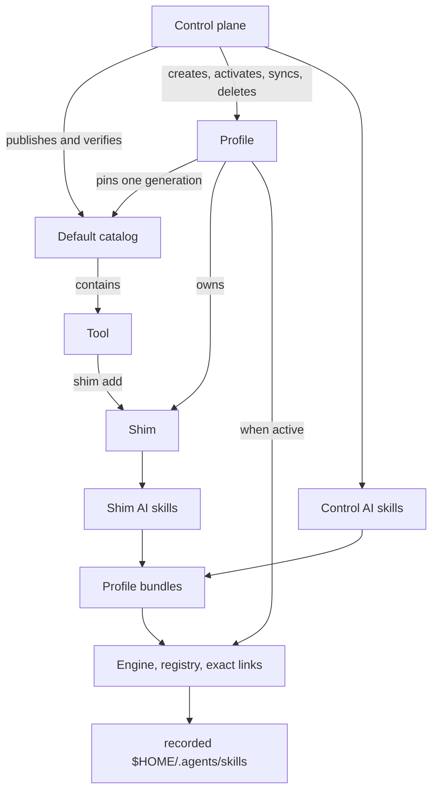

# Redesign the Shimmy control surface

## Objective

Replace Shimmy's unreleased `default|upstream` profile model and top-level
lifecycle commands with one coherent control surface for installation
administration, arbitrary profiles, one shared immutable default catalog,
profile-local shims, and profile-scoped AI skills. Preserve the POSIX-shell and
Podman architecture, path and ownership protections, workload guards, and
bounded rollback reporting.

A successful bootstrap is immediately usable: a mandatory `default` profile
exists, is installation-wide active, owns the initial `jq`, `rg`, and `skopeo`
shims, has valid control and shim AI-skill bundles, exposes those bundle-declared
skills through direct user-level symlinks, and records its startup and user-skill
integration roots.

This is a hard cut for an unreleased product. The incompatible redesigned
profile manifest uses version 2. Do not add aliases, migration, a pre-redesign
reader, an `upstream` profile compatibility layer, copied home skills, portable
skill export, or repository AI-skill export compatibility. Existing
pre-redesign installations must be removed with the revision that created them
and bootstrapped again.

Only the installation-owned catalog literally named `default` is in scope.
Do not implement or advertise external catalog add/remove/sync, profile
catalog-membership changes, catalog-qualified tool selectors, multi-catalog
precedence, or generation garbage collection. External catalogs require a
separate future `plan-review-act` plan and are not authorized here.

Control synchronization tracks the source repository's exact
`refs/heads/main`. Configurable release branches or tags are a future capability
requiring a separate plan. Do not add a release selector or speculative release
schema in this redesign.

Retained plans remain historical. This plan is the authoritative forward
design. Target code may coexist with current code only behind an explicitly
private candidate dispatcher through Chunk 9. Chunk 10 flips every public
producer and consumer and removes transitional code in one release boundary.

## Target layout and terminology

### Stable terms

- **Control plane**: the launcher, management commands, shared libraries, tests,
  and control AI-skill sources materialized into each profile.
- **Default catalog**: the installation-wide immutable-generation authority
  named `default` for available tool/version definitions and canonical tool AI
  skills.
- **Tool**: an available default-catalog definition; availability is not
  installation.
- **Shim**: one profile-local tool launcher and its installed versions.
- **Profile**: an independently materialized control plane, shim set, redirect
  policy, deterministic engine identity, startup ledger, and AI-skill bundles.
- **Invoking profile**: the profile enclosing the launcher being executed.
- **Active profile**: the one installation-wide profile selected by
  `active-profile.conf` and reconciled with Podman and user AI-skill integration.
  Exactly one exists per Shimmy configuration root, not per shell.
- **Shell-selected profile**: the profile whose `bin/` wins in one shell's
  `PATH`. Different shells may select different launchers while only the active
  profile may perform active-only mutations.
- **Sync**: `profile sync` adopts `refs/heads/main` plus registry-current
  default catalog; `shim sync` uses only the profile's pinned generation.
- **Repair**: reconstruct owned integration without advancing control/catalog
  state. The repair commands are `profile repair-startup` and `ai-skill repair`.
- **AI skill**: the Codex/agent instruction resource. Shimmy lifecycle names use
  `ai-skill`/`ai_skill`; canonical ecosystem files remain `SKILL.md`.

### Lifecycle relationship



### Installed state

```text
${XDG_CONFIG_HOME:-$HOME/.config}/shimmy/
  active-profile.conf                 # active name and immutable user skill root
  catalogs/default/
    registry.conf                     # current/previous and provenance
    generations/sha256-.../
      catalog.conf
      generation.conf
      plugins/shimmy/skills/
      tools/<tool>/SKILL.md
      tools/<tool>/tool.conf
      tools/<tool>/versions/...
  profiles/<profile>/
    install-manifest.txt               # profile schema 2
    bin/
    commands/
    lib/
    tests/
    tools/                              # installed versions only
    config/
    registries.conf
    machine-projection.txt              # Darwin projection only
    shell-init.sh
    ai-skills/control/{bundle.conf,skills/...}
    ai-skills/shims/{bundle.conf,skills/shimmy-tool-<tool>/SKILL.md}

<recorded-user-skill-root>/
  <bundle-name> -> <active-profile>/ai-skills/<bundle>/skills/<bundle-name>
```

Initial bootstrap records normalized `$HOME/.agents/skills` in the active
record. The root is immutable until `admin uninstall`; later lifecycle commands
require it to match the current installation context.

Shimmy creates only direct symlinks for exact names declared by validated active
profile bundles. Each declared destination is reserved and is unconditionally
replaced even when it is a file, nonempty directory, broken link, or foreign
link. There is no backup or recovery. Onboarding, dry-run activation, and
canonical guidance must warn users prominently.

This overwrite is narrow. Shimmy must never perform a globbed or wholesale
deletion of `<recorded-user-skill-root>/*`. Stale cleanup removes only links
whose normalized targets are inside canonical Shimmy profile bundle roots.
Unrelated user skills remain outside Shimmy ownership.

The repository `.agents/skills/` has a separate boundary: the user explicitly
authorizes its wholesale removal in Chunk 10, including tracked nongenerated
content. Preserve `.agents/plugins/marketplace.json`.

### Public command surface

```text
shimmy
├── admin
│   ├── status
│   ├── network
│   └── uninstall
├── profile
│   ├── list
│   ├── status
│   ├── create
│   ├── activate
│   ├── sync
│   ├── repair-startup
│   ├── delete
│   └── redirect
│       ├── list
│       ├── set
│       └── delete
├── catalog
│   ├── status
│   ├── tools
│   ├── verify
│   ├── publish
│   └── rollback
├── shim
│   ├── list
│   ├── add
│   ├── remove
│   ├── set-version
│   ├── sync
│   └── test
└── ai-skill
    ├── list
    └── repair
```

Exact invocation forms are:

```text
shimmy admin status [--format human|manifest]
shimmy admin network [--target <host-or-ip> ...]
  [--host-name <name>] [--host-ip <ipv4>] [--host-prefix <bits>]
  [--host-lan <cidr>] [--format human|manifest]
shimmy admin uninstall [--stop-running]

shimmy profile list [--format human|manifest]
shimmy profile status [--format human|manifest]
shimmy profile create <name> [--restart] [--stop-running] [--dry-run]
shimmy profile activate <name> [--restart] [--stop-running] [--dry-run]
shimmy profile sync
shimmy profile repair-startup
shimmy profile delete <name> [--stop-running]
shimmy profile redirect list [--format human|manifest]
shimmy profile redirect set --prefix <logical> --location <physical> [--dry-run]
shimmy profile redirect delete (--prefix <logical> | --all)
  [--detach] [--dry-run]

shimmy catalog status [--format human|manifest]
shimmy catalog tools [--generation <id>] [--format human|manifest]
shimmy catalog verify [--tool <tool[@version]> ...]
  [--public-only] [--require-current-upstream] [--format human|manifest]
shimmy catalog publish
shimmy catalog rollback

shimmy shim list [--format human|manifest]
shimmy shim add <tool[@version]>
shimmy shim remove <tool[@version]>
shimmy shim set-version <tool@version>
shimmy shim sync [<tool[@version]> ...]
shimmy shim test [<tool[@version]> ...]

shimmy ai-skill list [--format human|manifest]
shimmy ai-skill repair
```

Help must not advertise external catalog commands/selectors, profile catalog
options, or catalog-qualified shim selectors.

## Recorded design decisions

### State formats, encoding, and locks

1. Profile, catalog, tool, and generated skill name components accept lowercase
   ASCII letters, digits, and single internal hyphens only. They reject empty,
   leading/trailing hyphens, `--`, separators, dots, underscores, uppercase,
   whitespace, metacharacters, and controls. Only catalog name `default` is
   valid. Version labels retain the current alphanumeric/dot/underscore/hyphen
   grammar.
2. A valid installation has one regular non-symlink active record in exact
   order:

   ```text
   shimmy_active_profile_schema=1
   shimmy_active_profile_name=<profile>
   shimmy_active_ai_skill_root=<normalized-absolute-path>
   ```

   The profile and root validate. Absence, duplication, unsafe path, missing
   `default`, or unclassifiable engine disagreement is invalid state.
3. Profile manifest version 2 is the sole target format:

   ```text
   shimmy_install_manifest_version=2
   shimmy_install_layout=profile-materialized-root
   shimmy_profile_manifest_version=2
   shimmy_profile_name=<profile>
   shimmy_source_url=<control-plane-git-url>
   shimmy_source_tracking_ref=refs/heads/main
   shimmy_source_ref=<materialized-commit>
   catalog=default|<generation>|<source-commit>|<content-fingerprint>
   shim=<tool>|<tracking|pinned>
   shim_version=<tool>|<version>|<default|exact>
   startup_shell=<shell>                # zero or one
   startup_file=<absolute-path>         # repeatable
   ```

   Repeated records are lexical and duplicate-free. Exactly one catalog pin
   exists. Every version belongs to one shim, and every shim owns exactly one
   installed `shim_version=...|default` slot plus zero or more
   `shim_version=...|exact` slots. One version cannot occupy both roles. The
   default slot alone is authoritative for the bare launcher target; every
   installed version, including the default, remains explicitly addressable.
   The `<tool>|<version>` pair is the concrete runtime identity and resolves
   directly to `tools/<tool>/versions/<version>/run.sh`. Version 2 stores no
   separate implementation/version name and materializes no profile-local
   `implementations/` adapter layer.
   Catalog provenance matches a retained generation. Record components reject
   `|`, CR, LF, and NUL; scalar URL/path values reject CR, LF, and NUL. No
   target version-1 reader exists.
4. The `shim` record owns only the default-slot update policy. `tracking`
   advances the one default slot to the resolved catalog default during sync;
   `pinned` preserves the version occupying that slot. An `exact` version is an
   additional non-default pinned slot. It does not mean that only exact slots
   are explicitly addressable.
5. Catalog registry schema 1 is exact and target-only:

   ```text
   catalog_registry_schema=1
   catalog_name=default
   catalog_generation_current=<generation>
   catalog_generation_previous=<generation-or-empty>
   catalog_source_commit=<commit>
   catalog_content_fingerprint=<fingerprint>
   ```

   The separate payload remains `catalog_schema=1`; old unversioned
   checkout/generation shapes are not compatibility input.
6. Fingerprints use `sha256:<64-lowercase-hex>` and generations use
   `sha256-<same-hex>`. Hash inputs are byte-oriented, path-sorted under
   `LC_ALL=C`, documented, and covered by fixed vectors.
7. Public manifest output is line-oriented. Arbitrary pipe-record fields encode
   `%` as `%25`, `|` as `%7C`, CR as `%0D`, and LF as `%0A`, in that order.
   Token fields use strict grammars. Human output is unencoded. One shared
   encoder handles paths, URLs, diagnostics, warnings, and nested admin values.
8. Mutation uses this lock order:

   1. installation catalog lock;
   2. installation activation/integration lock;
   3. profile locks in lexical profile-name order;
   4. profile-local registry lock.

   A caller never acquires an earlier lock while holding a later one. Network,
   Git, image work, and expensive rendering occur before locks. Commit acquires
   only required locks and revalidates authorities/candidates under lock.
9. Filesystem-owned state uses same-filesystem staging, path checks, candidate
   validation, and commit-last metadata. Engine, startup, and individual user
   links are external compensating transactions. Rollback reports
   `complete|incomplete` and never claims to restore overwritten foreign data.
10. Target behavior uses a private dispatcher and disposable roots until Chunk
    10. It is never installed on user PATH. Current public entrypoints and state
    writers remain unchanged through Chunk 9.

### Profiles, source, shell selection, and administration

1. Bootstrap creates only `default`, installs catalog-default jq/rg/Skopeo,
   creates both bundles, activates engine/registry, reconciles exact links,
   applies startup integration, and commits the installation. Initial activation
   failure leaves no valid installation. Shimmy never provisions or removes a
   Podman machine.
2. Bootstrap records `refs/heads/main` plus its materialized commit. `profile
   sync` fetches with an option terminator, resolves exactly that ref, stages one
   commit, and never follows remote HEAD. Release channels are deferred.
3. `profile create` copies the invoking profile's validated exact control
   commit/source/tracking ref and exact pinned default generation; it does not
   fetch newer control or adopt a newer registry-current generation. It installs
   jq/rg/Skopeo and activates automatically.
4. List/create are installation-wide. Status/sync/startup repair/redirect apply
   to the invoking profile. Activate/delete take an installed name. AI-skill
   list/repair use the active record.
5. Create dry run reports the complete create/activate/image/link plan without
   staging, fetch, image, engine, startup, active-record, or link mutation.
6. Activation preflights profile structure, source, catalog pin, shell,
   redirects, engine, both bundle schemas, bundle union, and user root.
   Malformed supported bundles block. Unsupported bundles use the explicit
   warning/skip policy below.
7. Activation retains restart/stop-running/dry-run, Linux link, Darwin
   projection, workload guards, rootless validation, and connection commit-last.
   Links change only after engine validation. Failure attempts rollback of
   engine, record, and prior Shimmy links; overwritten foreign data is reported
   unrecoverable.
8. `shell-init.sh` prepends its profile `bin/` and defines a POSIX-compatible
   `shimmy` wrapper that delegates through the absolute launcher. Successful
   sourced create/activate sources the target shell-init into the caller. Direct
   execution prints the exact source command. The wrapper prevents recursion,
   preserves status, and changes PATH only after success.
9. `default` and the active profile cannot be deleted. Inactive deletion retains
   startup/projection/machine/lock/ownership safeguards and does not change user
   links.
10. Startup repair consumes only exact manifest ledger paths and is a successful
    no-op with no entries.
11. Active-only profile sync snapshots main plus registry current, resolves all
    shims, prepares images, regenerates control/shim assets and bundles, validates
    the full candidate, and reconciles links. It preserves identity, redirects,
    engine, startup bytes/ledger, exact versions, and explicit defaults.
12. Admin status continues across per-profile errors with aggregate zero;
    profiles-root/active-record/orchestration failures are nonzero. Admin network
    preserves current netinfo inputs and uses active profile VM/container state.
13. Admin uninstall alone removes default, active record, validated profiles,
    catalog generations, exact startup blocks, projections, and recognized
    Shimmy user links. It fails closed on unclassifiable owned-looking state and
    preserves checkouts, machines, operator policy, and unrelated user content.

### Default catalog and shims

1. Only `catalogs/default` is valid. A sibling catalog is unsupported state, not
   an external catalog to enumerate.
2. Catalog status is local-only. Tools lists current or an explicit retained
   generation. Human columns are `TOOL DEFAULT VERSIONS`; manifest records are
   `shimmy_catalog_tool=default|<generation>|<tool>|<default>|<versions>`.
3. Publication never deletes generations. Current, previous, and older profile
   pins remain immutable until admin uninstall. Garbage collection is deferred.
4. Catalog verify absorbs images verify and preserves local validation,
   Skopeo/jq execution from the active profile, strict redirects, authentication
   redaction, platform/index/digest checks, caching, public-only skips, and
   warning/strict upstream drift. Missing jq/Skopeo returns exact versioned
   `shim add` remediation; no hidden host/catalog fallback exists.
5. jq, rg, and Skopeo are ordinary removable baseline shims.
6. Publish/rollback run from repository root, target only default, and accept no
   selector. Publish requires clean committed local `main` at the published
   commit, stages tracked content, fingerprints once, validates, and atomically
   advances current/previous. Rollback swaps valid pointers. Neither mutates a
   profile pin or deletes a generation.
7. Publication validates exact one-to-one `tool.conf`/`SKILL.md`, canonical
   frontmatter/description/header, fingerprint inclusion, and no runtime
   installed-state check.
8. Shim reads/mutations use the invoking profile; mutation requires it active.
   `shim add tool` interactively selects a version with catalog default as the
   prompt default; explicit `tool@version` is noninteractive exact-version
   selection. Selector exactness does not determine record role: the first
   installed version becomes default, while a later one becomes exact.
9. The first installed version occupies the default slot. Unqualified add uses
   `tracking`; an explicit first `tool@version` add uses `pinned`. Later
   additions become exact slots and do not change the default. `set-version`
   atomically changes the selected exact slot to default, changes the prior
   default to exact, and sets the shim policy to `pinned`.
10. Remove tool deletes all versions/config/launcher/skill. Remove
    `tool@version` deletes one version and rejects the launcher default.
11. Shim sync uses only the profile pin. Tracking may advance the default slot
    within that pin; exact slots stay pinned. Advancing tracking replaces the
    prior tracked default rather than automatically retaining it as exact. If
    the resolved tracking default already exists as an exact slot, sync removes
    that exact role, makes the version default, and removes the prior tracked
    default without creating a duplicate version record. Add/sync prepare
    images and validate regenerated wrappers/config/manifest/skill before
    commit.
12. Shim test keeps non-mutating smoke semantics; no selectors means all. Remote
    image verification belongs only to catalog verify.

### AI-skill bundles and links

1. Each profile owns control and shims bundles:

   ```text
   shimmy_ai_skill_bundle_schema=1
   shimmy_ai_skill_bundle_kind=<control|shims>
   shimmy_profile_name=<profile>
   shimmy_ai_skill_source_ref=<control-commit or catalog-generation/fingerprint>
   skill=<name>|<sha256-fingerprint>|<source-identity>
   ```

   Shim identities are `default|<tool>|<generation>`; control identities are
   `control|<name>|<commit>`. Validation proves exact manifest/content mapping,
   safe regular paths, frontmatter, fingerprints, and no nested links/specials.
2. Profile-wide validation proves control commit match, shim catalog-pin match,
   one skill per installed shim, every identity matches the manifest, and names
   are unique across both bundles.
3. Control includes the canonical management skills plus `shimmy-catalog`.
   Catalog discovery reads the active profile's pin and calls `catalog tools
   --generation`; it does not expose every catalog skill initially.
4. Each installed tool skill materializes as `shimmy-tool-<tool>` and exists only
   while that shim is installed.
5. Canonical sources warn immediately after frontmatter that active-profile
   reconciliation unconditionally overwrites the exact bundle-declared
   `~/.agents/skills` destination without backup, never deletes unrelated names,
   and profile copies must not be edited.
6. Reconciliation removes prior Shimmy links by prior exact names or verified
   targets inside canonical bundle roots. It never recursively cleans the user
   root.
7. Every exact target name is reserved. Reconciliation removes its current
   occupant, including a nonempty directory, and creates the direct symlink.
   Each path is independently validated; no wildcard, backup, recovery command,
   force flag, or repair dry run exists. Activation dry run lists collisions.
8. Profile create/sync and shim add/remove/sync own related bundle/link changes.
   Activation validates/projects without regenerating. Catalog changes do not
   mutate bundles.
9. Unsupported target bundles are skipped independently with warning; recognized
   prior-kind links are removed and no target-kind links are created. Activation
   may succeed; repair returns nonzero. Malformed supported bundles block.
10. AI list reports `valid|empty|invalid`, emits no rows for unsupported bundles,
    returns zero for classified data, and nonzero only on inspection failure.
11. Clone-free onboarding installs canonical `shimmy-install` with the host
    `$skill-installer`; successful bootstrap replaces that exact path with the
    active direct link. Restart is fallback only.
12. Chunk 10 removes repository `.agents/skills/` wholesale by explicit
    authorization and removes target/export/archive/copied-home/orphan logic.
    Canonical plugin/tool sources and `.agents/plugins/marketplace.json` remain.

### Status, documentation, and testing

1. Profile status is local. Human sections are `PROFILE`, `ENGINE`, `CATALOG`,
   `SHIMS`, `AI SKILLS`, `STARTUP`. Catalog columns are `CATALOG PINNED CURRENT
   DRIFT HEALTH`; shim columns are `SHIM DEFAULT MODE VERSIONS`. Link counts are
   `not-applicable` for inactive profiles. `DEFAULT` is read from the sole
   default version slot, and `MODE` is read independently from the shim policy
   record; status does not reconstruct either value from the other.
2. Manifest profile records include identity/root/source URL/tracking ref/commit,
   one catalog record, shim/version records, bundle records, link counts,
   startup ledger, then preserved `shimmy_engine_*` records. Arbitrary values use
   the shared encoding.
3. Profile list human columns are `PROFILE ACTIVE CONTROL CATALOG STATE` with
   `STATE=valid|invalid`; manifest is
   `shimmy_profile=<name>|<active>|<source-ref>|<generation>|<state>`.
4. Admin manifest emits active identity, then
   `shimmy_admin_profile=<name>|<ok|error>|<encoded-message>` and repeated
   `shimmy_admin_profile_record=<name>|<key>|<encoded-value>`. Diagnostics are
   one-line and secret-redacted.
5. Update primary/current guidance with cutover. README, BOOTSTRAP,
   CONTRIBUTING, and shimmy-install warn about exact-name overwrite/no backup and
   explicitly state Shimmy never wholesale-deletes the home skills root.
6. Rename tests by resource and retain bounded parallel execution. Use
   `--jobs 3` for selected groups and serial only for diagnosis or an explicitly
   order-sensitive external case.
7. Prefer positive acceptance proofs. Negative coverage is limited to durable
   ownership/destructive scope/path/lock/rollback/manifest/encoding/secret/
   active-default/bundle/launcher invariants.
8. Syntax-check and execute rendered POSIX assets. Engine acceptance uses
   disposable config/home roots and pre-existing machines; never developer state
   or machine provisioning.

## Verified implementation inventory

- Bootstrap currently accepts `default|upstream`, appends jq/rg, delegates to
  install, and makes activation optional.
- The installed launcher validates version 1 and directly exposes current
  profile/catalog commands, so target work cannot remain private by editing
  those entrypoints in place.
- Profile, activation, registry, lifecycle, Darwin scripts, and fixtures encode
  two-name and current manifest assumptions.
- The verified adapter-removal work eliminated profile-local `implementations/`.
  Current version-1 `tool_version=<tool>|<label>|<version-name>` records retain
  a legacy implementation-name field only until the hard cut; it is not input
  to the version-2 schema or runtime identity.
- Catalog code already validates payload/generation/fingerprint/tool/skill state.
  Its registry is unversioned with checkout/generation types; generation
  directories persist beyond current/previous pointers.
- Images verification already provides Skopeo index/platform/auth/digest/drift
  behavior. Installed use requires materialized Skopeo and jq, so adding Skopeo
  closes the pristine-profile dependency gap.
- Update currently clones source URL and follows remote default HEAD implicitly;
  target sync must explicitly resolve `refs/heads/main`.
- Skills is currently a copied-target/export lifecycle. Safe path/staging/source
  patterns are evidence, not a compatibility API for direct links.
- Canonical control skills are in `plugins/shimmy/skills/`; tool skills are in
  `tools/<tool>/SKILL.md`. Wholesale repository `.agents/skills/` deletion is
  explicitly authorized for Chunk 10.
- Current status, netinfo, startup, activation, redirects, uninstall, image, and
  smoke tests contain safeguards to preserve.
- The retained suite baseline is 41 groups/159 tests and roughly nine minutes;
  focused checks belong in each chunk and full runs at integration milestones.
- Current guidance contains old command/profile terminology requiring
  classification; legitimate Git/image `upstream` language remains.
- The worktree was clean when this revision began. Later sessions must recheck
  and preserve newly introduced unrelated work.

## Deferred follow-up

- **External catalogs:** a separate future `plan-review-act` must design source
  authority, registration, add/remove/sync, profile pin references, qualified
  selectors, collisions, retention/GC, output, transactions, and tests. This
  plan creates no placeholder command or state.
- **Release channels:** a separate future plan may replace fixed main tracking
  with selected release branches/tags. This plan has no selector or fallback.

## Unresolved

None.

## Progress Checklist

- [x] Chunk 1 — Add target formats, codecs, and pure validators. The reconciled
  implementation uses `shim=<tool>|<tracking|pinned>` and exactly one
  authoritative default version slot per shim.
- [x] Chunk 2 — Shared lock, transaction, and ownership primitives were human
  verified 2026-08-20 16:50:26 EDT.
- [x] Chunk 3 — Private target default-catalog core was human verified
  2026-08-20 16:50:26 EDT.
- [x] Chunk 4 — Private catalog image verification and the jq/rg/Skopeo
  baseline candidate were accepted by the user on 2026-08-20.
- [x] Chunk 5 — Private profile-local shim lifecycle was human verified and
  accepted by the user's 2026-08-20 request to implement Chunk 6.
- [x] Chunk 6 — AI bundles and narrowly destructive links were accepted by the
  user's 2026-08-20 request to implement Chunk 7.
- [~] Chunk 7 — Arbitrary profile identity, activation, active authority,
  redirects, runtime affinity, real links, and shell selection are implemented
  and automatically verified; human acceptance is pending.
- [ ] Chunk 8 — Integrate profile, bootstrap, and admin candidate lifecycles.
- [ ] Chunk 9 — Complete private target commands and end-to-end tests.
- [ ] Chunk 10 — Perform atomic public cutover and primary documentation.
- [ ] Chunk 11 — Complete repository-wide cleanup and final acceptance.

## Execution protocol

For every chunk:

1. Read `AGENTS.md`, `CONTEXT.md`, every child context on the path to a changed
   file, this plan, and the chunk's target files.
2. Execute only that chunk's scope.
3. Run its verification checklist and record `[x]`, `[ ]`, or `[~]` with notes.
4. Update the cumulative **Lessons learned** block.
5. Summarize changes, tests, failures, uncertainties, and remaining risks.
6. Stop for human review and explicit acceptance before starting the next
   chunk.

Repository paths in this plan are relative to `<repo>` so it remains portable
across workstations and sessions.

Thinking levels are minimum implementation-session reasoning effort:

- **High:** cross-module work with explicit invariants and bounded rollback.
- **Extra high (`xhigh`):** destructive, externally stateful, schema-cutover, or
  multi-resource work where a wrong boundary is expensive to undo.

## Chunk 1 — Target formats, codecs, and pure validators

### Recommended thinking level

High.

### Goal

Add unexposed target readers, renderers, fingerprint/output codecs, and complete
cross-record validators without changing public commands or canonical installed
state.

### Files

- `lib/common/common.sh`, `lib/profile/{profile,state}.sh`,
  `lib/catalog/catalog.sh`, `lib/install/manifest.sh`, and new state-focused
  modules plus required `CONTEXT.md` links.
- Schema-only portions of new `lib/{shim,ai-skill}/` modules.
- Focused fixtures/groups under `tests/lib/`, runner registration, and support.

### Implementation requirements

- Implement profile manifest version 2, active schema 1, catalog registry schema
  1, normalized two-field shim policy records, one authoritative default
  version slot per shim, direct `<tool>|<version>` runtime identity with no
  implementation-name field, and both bundle schema readers/renderers exactly.
- Keep target and current readers separate. Target validators never dispatch to
  old version-1 manifest or unversioned registry parsing.
- Implement fixed main-ref validation, SHA-256/name algorithms, public manifest
  encoding, record ordering, and fixed vectors.
- Implement profile-wide catalog/shim/bundle validation including source/pin
  matching and cross-bundle union uniqueness, without mutation.
- Parameterize target roots for disposable candidate tests while public commands
  remain bound to current state.

### Verification checklist

- [x] All target state fixtures round-trip byte-deterministically. Active,
  registry, profile-manifest, and bundle renderings compare byte-for-byte with
  two-field shim policy records.
- [x] Fixed vectors prove generation, content, and bundle SHA-256 identities.
  Coverage includes the path-sorted catalog manifest algorithm and exact
  `SKILL.md` bytes.
- [x] Fixed vectors prove percent/pipe/CR/LF/path/warning/nested-value encoding
  without secret leakage. Literal redaction precedes output and handles encoded
  reserved bytes.
- [x] Positive fixtures prove arbitrary safe profile names, one default pin,
  tracking/exact coexistence, launcher membership, and bundle consistency.
  Tracking and pinned policies both derive launcher membership from their sole
  default version slot.
- [x] Durable integrity coverage proves unsafe paths, duplicates, invalid
  commit/pin relationships, bundle drift, and cross-bundle collisions fail.
  Coverage includes NUL/final-line rejection, zero or multiple default slots,
  one version in both roles, and a redundant shim-policy version field.
- [x] Focused target state groups pass with `--jobs 3` (9 tests across
  `lib-target-codec`, `lib-target-profile-state`, and
  `lib-target-ai-skill-state`), including an explicit `/bin/dash` run.
- [x] Current launcher/manifest tests remain green; no public target route
  exists. Runner, catalog/context, current dispatcher, and current install
  groups pass (30 tests), and target symbols have no command/bootstrap/launcher
  reference.

### Human review gate

Confirm every target format, version boundary, hash/encoding algorithm, and
cross-record invariant, including the two-field shim policy record, sole
default-slot authority, exact-slot meaning, and duplicate-free role changes.
Acceptance authorizes transaction primitives, not target mutation or routing.

## Chunk 2 — Shared locks, transactions, and ownership primitives

### Recommended thinking level

Extra high (`xhigh`).

### Goal

Add reusable lock ordering, filesystem candidate commits, external rollback,
and exact user-link classification without exposing a target command.

### Files

- Shared helpers under `lib/common/`, `lib/install/`, `lib/profile/`,
  `lib/registries/`, and new transaction/AI-link modules.
- Failure-injection support and focused groups under `tests/lib/`.

### Implementation requirements

- Implement catalog → activation → lexical profile → registry lock order,
  ownership detection, signal cleanup, and reverse-order release.
- Extract same-filesystem stage, validate, under-lock revalidate, commit, and
  cleanup helpers without weakening projection/startup protections.
- Classify exact bundle destinations, recognized Shimmy links, foreign
  occupants, broken links, and links into canonical profile bundles.
- Permit replacement only when a validated bundle supplies that exact name. No
  API accepts a user-root glob or recursive operation.
- Return `complete|incomplete` rollback results and identify restored Shimmy
  state. Never claim recovery of overwritten foreign content.

### Verification checklist

- [x] Lock tests cover allowed nesting, rejected inversion, concurrent
  acquisition, stale handling, and signal cleanup.
- [x] Failure injection proves candidate filesystem commits expose complete new
  state or prior valid state.
- [x] External rollback tests distinguish complete/incomplete restoration.
- [x] Link planning classifies empty, file, nonempty directory, foreign link,
  wrong-profile link, and broken link without mutation.
- [x] Exact declared collisions are overwritten in mutation tests while
  unrelated sibling names/root survive byte-for-byte.
- [x] No implementation/test helper recursively deletes the user skills root.
- [x] Existing registry activation/uninstall rollback groups remain green.

### Chunk 2 evidence

- Private target-only modules add atomically claimed regular-file locks,
  same-filesystem regular-file candidates, an external compensation journal,
  and bundle-authorized exact AI-skill link planning/mutation. Searches find no
  target transaction symbol referenced by a public command, bootstrap, or
  launcher.
- The target lock stack proves catalog, activation, lexical profile, and
  registry ordering; exact owner-only reverse release; live contention;
  quarantined dead-owner cleanup; and HUP/INT/TERM cleanup. A complete owner
  record is hard-linked into the final lock path so claim publication has no
  ownerless intermediate state.
- Before/after-commit injection retains exact prior bytes and mode or complete
  new bytes and mode. Candidate fingerprint, target snapshot, validator, and
  caller authority are all rechecked while a target lock is held.
- External compensation restores registered Shimmy state in reverse and emits
  `complete|incomplete`. Exact foreign file, nonempty-directory, and link
  occupants are overwritten only for validated bundle names; rollback removes
  projected links but explicitly reports the foreign content unrecoverable.
  Unrelated root markers and sibling skill bytes remain unchanged.
- `./tests/test.sh --group runner --group lib-target-codec --group
  lib-target-profile-state --group lib-target-ai-skill-state --group
  lib-target-lock --group lib-target-transaction --group
  lib-target-ai-skill-link --jobs 3` passes 32 tests. The three new groups pass
  all 8 tests under both the default shell and an explicit `/bin/dash` run.
- `./tests/test.sh --group lib-profile-activation --group lib-registries
  --group commands-lifecycle --jobs 3` passes all 30 activation, registry, and
  uninstall rollback tests. `lib-catalog` passes all 10 context, catalog, and
  runtime metadata tests, and `commands-startup` passes all 5 startup ownership
  tests. Repository shell syntax checks and `git diff --check` pass; ShellCheck
  is unavailable on this host.

### Human review gate

Confirm lock hierarchy, commit boundaries, exact-name destructive scope,
rollback honesty, and absence of broad home-skill deletion. Acceptance
authorizes private catalog transactions.

## Chunk 3 — Private default-catalog core

### Recommended thinking level

High.

### Goal

Implement target registry, generations, status/tools, publish/rollback,
retention, and canonical-skill validation behind private candidate routing and
disposable roots.

### Files

- Private catalog command/library candidates, `lib/catalog/catalog.sh`,
  `lib/install/catalog-lifecycle.sh`, `catalog.conf`, publication payloads,
  `plugins/shimmy/skills/`, and `tools/*/{tool.conf,SKILL.md}`.
- Catalog fixtures and target library/command groups.

### Implementation requirements

- Accept only `catalogs/default` and target registry schema 1.
- Implement local status and current/retained tools output; do not add list,
  add/remove/sync, named selectors, or external catalog state.
- Implement clean local-main publication, fingerprint-once staging,
  current/previous advance, rollback swap, collision validation, and no
  generation deletion.
- Add `shimmy-catalog` canonical source and exact tool-skill/header/fingerprint
  validation.
- Leave current public catalog command, old registry, and installed dispatch
  unchanged.

### Verification checklist

- [x] Creation, publish, repeat publish, rollback, and invalid-current recovery
  preserve current/previous and all valid generations.
- [x] Status/tools are deterministic/local-only; retained inspection is
  non-mutating.
- [x] Publication rejects dirty, detached, non-main, moved-HEAD, malformed
  skill, fingerprint collision, and unsafe generation state.
- [x] Positive validation proves exact tool-skill mapping and fingerprint input.
- [x] Private catalog groups pass; current public catalog behavior remains green.

### Chunk 3 evidence

- `lib/catalog/target.sh`, `lib/install/catalog-target.sh`, and the uninstalled
  `commands/catalog-target.sh` implement schema-1 `catalogs/default` creation,
  local status/current-or-retained tools inspection, clean attached-main
  publication, repeat publication, invalid-current recovery, and rollback.
  The current installed dispatcher, bootstrap, and public catalog command have
  no target route.
- Publication archives the recorded commit's tracked payload, validates and
  fingerprints that staged copy, rechecks `HEAD`, `refs/heads/main`, and clean
  state under the target catalog lock, then commits immutable generation bytes
  before the schema-1 registry. No path deletes a retained generation. A failed
  moved-HEAD registry commit may leave a valid unreferenced generation, which
  remains available rather than being garbage-collected.
- The canonical management plugin now contains `shimmy-catalog`. All six
  control skills and every tool skill carry the exact managed-copy warning
  immediately after frontmatter. Target validation proves exact skill names,
  one-to-one tool mapping, headers, safe files, and inclusion of skill bytes in
  the catalog fingerprint. The current public five-skill default export remains
  unchanged.
- `./tests/test.sh --group lib-target-catalog --group
  commands-target-catalog --jobs 3` passes all 6 private tests under both the
  default shell and explicit `/bin/dash` execution. `runner`, `lib-catalog`,
  `commands-catalog`, and `commands-management` pass 33 tests together;
  `commands-skills` passes its 10 tests separately.

### Human review gate

Confirm default-only scope, schema, main publication authority, retention, and
static skill alignment. Acceptance authorizes target image verification.

## Chunk 4 — Private catalog verification and baseline dependency

### Recommended thinking level

High.

### Goal

Move image verification into private `catalog verify`, preserve security/drift
semantics, and prove jq/Skopeo availability and remediation without changing the
public baseline yet.

### Files

- Private catalog verification candidate; `commands/images.sh` and
  `lib/images/images.sh` as source behavior; `lib/runtime/image.sh`; registry
  client resolution; jq/Skopeo metadata; fixtures and target tests.

### Implementation requirements

- Preserve complete default selection, repeated tool narrowing, auth/public-only
  handling, strict redirect mount, index/platform/digest validation, caching,
  and warning/strict drift.
- Resolve jq/Skopeo only from active profile materialization. Emit exact
  add-with-version remediation when missing.
- Add Skopeo to private bootstrap/create baseline candidates; do not change
  public bootstrap before Chunk 10.
- Retain `image_verify=...` after encoded catalog/local records and preserve
  secret redaction.

### Verification checklist

- [x] OCI/Docker, malformed, platform, auth, digest, cache, warning, and strict
  drift fixtures pass under private catalog verify.
- [x] Current-profile registry projection and read-only Skopeo mount remain exact.
- [x] Missing jq/Skopeo remediation names an exact-version shim add and uses no
  hidden fallback.
- [x] Private pristine profile candidates contain jq, rg, and Skopeo.
- [x] Target catalog/image groups and complete current public suite pass; record
  exact counts.

### Chunk 4 evidence

- The uninstalled `catalog-target.sh verify` route validates the target catalog,
  active record, version-2 profile manifest, retained profile pin, and current
  immutable generation before selecting remote image records. No current
  dispatcher, bootstrap, or installed public command routes to it.
- Complete current-catalog selection and repeatable `--tool` narrowing preserve
  OCI/Docker index, required-platform, authenticated/public-only, digest,
  inspection-cache, warning, and strict upstream-drift behavior. Manifest
  results retain encoded `image_verify=...` records and redact the explicit
  Skopeo auth-secret value.
- jq and Skopeo resolve only from exact default-version records and regular,
  executable, non-symlink runtimes in the active target profile materialization.
  Missing runtime tests retain a valid catalog runtime and still fail with
  exact `shimmy shim add <tool>@<version>` remediation before remote inspection.
- The private pristine-profile baseline renderer produces exactly `jq|1.8`,
  `rg|15.1`, and `skopeo|1.22` from catalog defaults. The current public jq/rg
  bootstrap baseline is unchanged.
- `./tests/test.sh --group lib-target-catalog --group commands-target-catalog
  --group commands-images --group lib-registries --group tools-skopeo --jobs 3`
  passes all 20 focused tests. The complete default parallel suite passes all
  198 tests with approved live Podman access for its existing non-mutating
  installed smoke group. Repository shell syntax checks and `git diff --check`
  pass. After the final manifest-authority tightening, the four
  `commands-target-catalog` tests pass again in isolation.

### Human review gate

Confirm verification parity, Skopeo/jq authority, baseline, redirect security,
encoded output, and full-suite regression. Acceptance authorizes shim lifecycle.

## Chunk 5 — Private profile-local shim lifecycle

### Recommended thinking level

High.

### Goal

Implement target shim state, selectors, materialization, image readiness, and
smoke selection behind private routing, excluding user-link mutation until
Chunk 6.

### Files

- New private shim command/library modules; runtime/install/update selection;
  materialization; refresh/image; manifest candidates; profile assets; focused
  tests and contexts.

### Implementation requirements

- Implement unqualified add/remove/set-version/sync/list/test grammar and exact
  interactive versus automation behavior.
- Implement first-default stability, two-field tracking/pinned policy state,
  exactly one authoritative default version slot, exact retention,
  selected-default removal guard, role-swapping set-version, collision-free
  tracking advancement, and pinned-generation sync.
- Stage regenerated wrappers/config/runtime, manifest version 2, and mandatory
  image preparation before commit.
- Resolve concrete execution and smoke selection directly from the manifest's
  `<tool>|<version>` pair to `tools/<tool>/versions/<version>/run.sh`; do not
  recreate or interpret implementation names or `implementations/` adapters.
- Produce a typed shim-bundle input for Chunk 6. Do not stub profile activation
  or link callbacks and do not expose a partially integrated command.

### Verification checklist

- [x] Fixtures prove interactive tracking, noninteractive exact selection,
  first-default stability, explicit-first pinned default, later exact
  additions, set-version role swapping, tracking collisions with an existing
  exact slot, non-retention of replaced tracked defaults, version/all removal,
  and pinned generation sync.
- [x] Image/candidate failure leaves wrappers, versions, config, and manifest at
  prior valid state.
- [x] Rendered dispatchers/config pass syntax and installed-copy execution.
- [x] Smoke selection covers all/tool/version, affinity failure, and wrapped
  nonzero propagation.
- [x] Focused private shim groups pass; current public suite remains green.

### Chunk 5 evidence

- `commands/shim-target.sh` and `lib/shim/target.sh` implement the private
  disposable-root route. No bootstrap, current command, or installed launcher
  references it. Mutations resolve only the active profile and its exact
  retained catalog generation; publishing a newer registry current does not
  change shim sync authority.
- Unqualified add requires a terminal and records `tracking`; the test-only
  interactive seam proves a non-default first selection. Explicit add is
  noninteractive and records `pinned` only when it creates the shim. Later
  versions remain exact, set-version swaps roles without duplicates, exact
  removal rejects the selected default, and whole-shim removal clears all
  owned materialization.
- Unqualified sync advances only tracking defaults within the pinned
  generation, removes the prior tracked default rather than retaining it, and
  consumes an already exact target version without duplicate roles. Exact
  `tool@version` sync prepares only that installed version and never changes
  roles.
- Every mutation stages regenerated regular launchers, per-shim and
  per-version config, direct `tools/<tool>/versions/<version>/run.sh` assets,
  and manifest version 2. External images use `pull`, local builds use `build`,
  and preparation completes before the profile lock and manifest-last commit.
  Pre-commit image failure and injected post-asset failure retain exact prior
  manifest, bundle input, wrappers, tools, and config.
- The typed `config/shim-bundle-input.conf` candidate records schema 1, profile,
  pinned generation, content fingerprint, and lexical installed shim names.
  Policy/default authority remains solely in the profile manifest for Chunk 6
  to validate rather than being duplicated in bundle input.
- `./tests/test.sh --group commands-target-shim --jobs 3` passes 3 focused
  tests. A combined target/current run passed every selected group except the
  existing live smoke when sandboxed; rerunning `commands-test` with approved
  Podman access passed all 3 tests. The complete default suite then passed all
  201 tests with approved non-mutating Podman access. Repository shell syntax,
  generated launcher/config syntax, installed-copy execution,
  `git diff --check`, context-tree coverage, and executable modes pass.
  ShellCheck is unavailable on this host.

### Human review gate

Confirm selector/default semantics, image-before-commit, manifest ownership,
materialization, and the concrete bundle input. Acceptance authorizes AI links.

## Chunk 6 — AI-skill bundles and narrowly destructive links

### Recommended thinking level

Extra high (`xhigh`).

### Goal

Implement both bundles, profile-wide consistency, list/repair, and exact-name
user-link reconciliation with accepted unconditional overwrite.

### Files

- New private AI-skill command/library modules; canonical sources;
  materializers; profile integration; link transaction helpers; fixtures/tests.

### Implementation requirements

- Materialize control skills from exact control commit and one tool skill per
  installed shim from pinned default generation.
- Validate each bundle plus complete profile source/pin/shim/union invariants.
- Implement list, unsupported-bundle policy, and shared activation/repair
  reconciliation.
- Overwrite only exact target names, including directories, without backup.
  Enumerate destructive collisions in plan output and report nonrecoverability.
- Remove stale links only through exact prior entries or recognized canonical
  bundle targets. Never recursively/glob-clean the recorded user root.

### Verification checklist

- [x] Bundle fingerprints, frontmatter rewrites, identities, and content mapping
  are deterministic.
- [x] Shim add/remove inputs produce exactly `shimmy-tool-<tool>` lifecycle.
- [x] Cross-bundle/source/pin mismatch blocks supported reconciliation.
- [x] List/repair cover valid, empty, invalid, unsupported, broken,
  wrong-profile, and encoded-path cases.
- [x] File, nonempty directory, foreign link, and broken-link collisions are
  overwritten; unrelated siblings/root survive byte-for-byte.
- [x] Failure injection restores prior Shimmy links when possible and reports
  overwritten foreign content as unrecoverable.
- [x] Focused AI groups pass; current public suite remains green.

### Chunk 6 evidence

- `lib/ai-skill/target.sh` materializes the six canonical control skills from
  exact Git object bytes at the profile's recorded control commit and one
  `shimmy-tool-<tool>` skill per typed shim input from the profile's retained
  immutable catalog generation. Frontmatter, the managed-copy warning,
  fingerprints, source identities, lexical records, and complete bundle trees
  are validated after rendering.
- Profile-wide validation binds supported control and shim bundles to the
  manifest's control commit, catalog generation/fingerprint, installed shims,
  and duplicate-free union. Malformed supported bundles block before mutation.
  Unsupported schemas are classified per kind, emit no list rows, warn and skip
  target projection, remove only recognized stale Shimmy links, and make repair
  return nonzero after completing supported reconciliation.
- The uninstalled `commands/ai-skill-target.sh` route lists
  `valid|empty|invalid` bundle state plus exact link classifications and encoded
  manifest paths. Repair preflights and revalidates under activation then
  profile locks, renders exact collision warnings, and reconciles only validated
  direct children of the immutable active-record user root.
- `lib/ai-skill/link.sh` recognizes only canonical
  `profiles/<profile>/ai-skills/<control|shims>/skills/<name>` direct targets.
  Stale cleanup removes exact recognized links only. Exact declared files,
  nonempty directories, foreign links, and broken links are overwritten without
  backup; no root-wide deletion API or test helper was added.
- Private shim mutations now regenerate and validate the shims bundle with the
  staged manifest/materialization, commit under activation/profile locks, then
  reconcile links through the external compensation journal. A link failure
  restores profile assets and prior recognized links where possible; overwritten
  foreign content remains absent and is explicitly reported unrecoverable.
- The focused state/link/shim/AI run passes all 13 selected tests. The
  consolidated AI command group passes all 4 tests using one immutable catalog
  fixture, and the complete default three-worker suite passes all 205 tests with
  approved non-mutating Podman access. Context-tree coverage, POSIX shell syntax,
  executable modes, private-route searches, and `git diff --check` pass.
  ShellCheck remains unavailable on this host.

### Human review gate

Confirm bundle consistency, output, immutable user root, exact destructive
scope, unsupported behavior, and rollback reporting. Acceptance authorizes
profile activation integration.

## Chunk 7 — Profile identity, activation, and shell selection

### Recommended thinking level

Extra high (`xhigh`).

### Goal

Generalize identity and engine/registry state, add the active record, integrate
real links, and implement shell PATH switching behind the private surface.

### Files

- Private profile candidates; `lib/profile/`, `lib/registries/`, `lib/startup/`;
  shell-init renderer; Darwin scripts; runtime affinity; profile assets; focused
  activation/shell tests.

### Implementation requirements

- Replace target two-name assumptions with safe names and deterministic
  `shimmy-<profile>` engine identity.
- Implement private list/status/activate/redirect with active record, fixed user
  root, workload guards, projections, lock order, and real link callbacks.
- Implement direct-execution guidance and sourced wrapper without recursion or
  premature PATH changes.
- Keep public profile/bootstrap behavior unchanged through private routing.

### Verification checklist

- [x] Arbitrary safe names resolve canonical paths/engines; path/link escapes
  fail closed.
- [x] Active switch, ordinary/restart, workload refusal, Linux/Darwin
  projection, connection, and rollback ordering pass.
- [x] Malformed supported bundles block; unsupported bundles warn/skip and
  remove recognized prior-kind links.
- [x] Multiple-shell tests distinguish invoking, active, shell-selected profiles
  and enforce active-only mutation.
- [x] Sourced supported shells switch PATH only after success; direct execution
  prints exact source command and preserves status.
- [x] Focused profile/registry/shell groups pass; public suite remains green.

### Chunk 7 evidence

- Shared profile identity now maps every safe target name to a deterministic
  `shimmy-<profile>` engine while the public resolver retains version-1
  `default|upstream` admission. Linux active links, Darwin projection records
  and remote scripts, registry parsing, client mounts, and Darwin runtime
  affinity accept only one exact canonical safe-name profile path. Nested
  lookalikes, unsafe components, symlink parents, mismatched version-2 active
  records, and malformed mode/identity state fail closed.
- The private `profile-target.sh` route provides installation-wide list, local
  invoking-profile status, named activation, and invoking-profile redirects.
  Mutation acquires activation, lexical prior/target profile, and target
  registry locks; revalidates authority/candidates under lock; commits the
  workload-guarded Linux/Darwin engine and registry transition before the
  mode-`0644` active record and exact user links; and retains rollback until
  those external resources succeed. Redirect mutation is active-only. Public
  bootstrap and profile dispatch remain unchanged.
- Target status preserves PROFILE, ENGINE, CATALOG, SHIMS, AI SKILLS, and
  STARTUP sections, recorded catalog health/drift and shim default/mode/version
  fields, prefixed engine records, and active-only link counts. Inactive status
  reports link counts as `not-applicable` without inspecting the home link root.
  Malformed supported bundles block before engine mutation; unsupported kinds
  warn, skip projection, and remove only recognized prior-kind links.
- The byte-validated target launcher and POSIX shell initializer remove only
  exact safe sibling profile bins, prepend the selected bin, delegate through
  an absolute launcher without recursion, preserve command failure status, and
  source a successful create/activate target only after non-dry-run success.
  Direct activation prints the shell-quoted exact source command. Independent
  POSIX, Bash, and Zsh cases distinguish invoking, active, and shell-selected
  profiles.
- `commands-target-profile` passes all 5 focused integration scenarios;
  `lib-registries` passes all 5 tests; and `lib-runtime` passes all 9 tests.
  The complete default three-worker suite initially reached only its live
  installed-tool smoke before sandboxed Podman access failed; the identical
  approved outer-command rerun passes all 212 tests, including public,
  exact-version, and all-version live Podman smokes. Context-tree coverage,
  POSIX syntax, executable modes, and `git diff --check` pass. ShellCheck
  remains unavailable on this host.

### Human review gate

Confirm arbitrary profile safety, active authority, external ordering, link
integration, and shell semantics. Acceptance authorizes complete lifecycle
orchestration.

## Chunk 8 — Profile, bootstrap, and administration candidate lifecycles

### Recommended thinking level

Extra high (`xhigh`).

### Goal

Integrate bootstrap, create, profile sync, startup repair, delete, admin
status/network/uninstall, and concrete catalog/shim/bundle transactions behind
the private dispatcher without future stubs.

### Files

- Private bootstrap/launcher candidates; target profile/admin commands;
  `lib/install/`, `lib/update/`, `lib/netinfo/`; profile/catalog/AI transaction
  integration; lifecycle/onboarding/admin tests.

### Implementation requirements

- Implement pristine default bootstrap with jq/rg/Skopeo, fixed main tracking,
  active record, pin, images, bundles, links, engine/registry, startup, cleanup.
- Implement create from the invoking profile's exact control revision and exact
  catalog pin, plus automatic activation and complete dry-run planning.
- Implement active-only sync from explicit main and snapshotted registry current
  with under-lock revalidation.
- Implement exact startup repair, guarded inactive deletion, aggregate status,
  active network, and fail-closed all-owned-state uninstall.
- Use only concrete implementations accepted in Chunks 1–7; no callback stub
  may define an acceptance result.

### Verification checklist

- [ ] Pristine candidate bootstrap produces active default with jq/rg/Skopeo,
  registry, manifest v2, bundles, links, startup, and shell selection; failed
  activation leaves no valid installation.
- [ ] Create copies invoking exact control without fetch, prepares baseline,
  activates, and restores prior Shimmy state within documented boundaries.
- [ ] Sync adopts explicit main plus registry current atomically while preserving
  exact intent, redirects, startup bytes, and launcher pins.
- [ ] Startup repair, inactive deletion, admin status/network, and uninstall
  preserve ownership/workload/machine safeguards.
- [ ] Admin uninstall removes recognized home links only and never recursively
  deletes the home skills root.
- [ ] Target lifecycle groups and complete public suite pass; record counts.

### Human review gate

Confirm concrete lifecycle integration, main authority, baseline, rollback
limitations, ownership cleanup, and full-suite evidence. Acceptance authorizes
the complete shadow command surface.

## Chunk 9 — Private target commands and end-to-end integration

### Recommended thinking level

Extra high (`xhigh`).

### Goal

Complete and exercise the exact target launcher, parsing/help/output, and full
lifecycle through a private installed candidate while current public entrypoints
remain unchanged.

### Files

- Private target dispatcher/wrappers, help renderers, installed candidate
  payloads, all target command tests, end-to-end fixtures, and runner groups.

### Implementation requirements

- Implement only target groups/forms, help-before-state validation, and encoded
  manifest output.
- Expose no legacy forwarding alias or external-catalog placeholder.
- Exercise the same target assets intended for cutover, not a test-only behavior
  reimplementation.
- Inventory every legacy producer/consumer and prepare exact Chunk 10 removal
  without deleting it yet.

### Verification checklist

- [ ] Root/nested help exactly presents target commands, options, defaults,
  scopes, overwrite warnings, and remediation.
- [ ] End-to-end bootstrap → create → shim add/set/sync/remove → profile sync →
  startup repair → sibling activation → inactive deletion → uninstall passes
  through the private installed launcher.
- [ ] Status/network/catalog verify/AI repair/smoke/sourced-shell flows use exact
  target schemas/statuses.
- [ ] Remote `$skill-installer` onboarding in disposable home replaces its exact
  bootstrap destination while unrelated skills survive.
- [ ] Runnable/rendered assets pass syntax and executable-bit checks.
- [ ] All target groups and complete current public suite pass; record counts and
  cutover removal inventory.

### Human review gate

Confirm the candidate is feature-complete, uses production-intended assets,
preserves current public behavior, and leaves Chunk 10 as routing/removal/
documentation rather than unfinished integration.

## Chunk 10 — Atomic public cutover and primary documentation

### Recommended thinking level

Extra high (`xhigh`).

### Goal

Flip bootstrap/launcher to the accepted target, remove all old behavior and
shadow routing, delete repository `.agents/skills/` wholesale, and update
primary guidance in one release boundary.

### Files

- `bootstrap.sh`, final `commands/{admin,profile,catalog,shim,ai-skill}.sh`,
  launcher template, payloads, and all schema producers/consumers.
- Removed old `commands/{images,install,netinfo,skills,status,update}.sh` after
  retained behavior moves, plus obsolete libraries/routes/fixtures.
- Entire `.agents/skills/`; preserve `.agents/plugins/marketplace.json`.
- Primary README, BOOTSTRAP, CONTRIBUTING, commands README, AGENTS, changed
  contexts, and canonical onboarding/control skills.

### Implementation requirements

- Switch every public profile producer/consumer to version 2 and registry
  producer/consumer to target schema 1 together.
- Remove version-1/unversioned readers/writers, legacy `tool_version`
  implementation-name consumers, source types, upstream binding, rebind,
  optional activation, old top-level groups, copied/exported skills, and private
  shadow route. Retain redesigned integrity tests, not old rejection fixtures.
- Make public bootstrap commit complete default with jq/rg/Skopeo and fixed main.
- Delete repository `.agents/skills/` recursively as explicitly authorized. Do
  not extend this authorization to home skills or another path.
- Add primary warnings for exact-name overwrite, no recovery, dry-run collision
  visibility, and prohibition on broad home-skill deletion.

### Verification checklist

- [ ] Target help/output and end-to-end lifecycle pass through final launcher.
- [ ] Pristine bootstrap and failure cleanup satisfy target with jq/rg/Skopeo.
- [ ] Inventory proves no version-1 profile parser/writer, unversioned registry
  source type, implementation-name routing, old dispatch, external-catalog
  placeholder, copied target, or shadow route remains.
- [ ] `.agents/skills/` is absent; `.agents/plugins/marketplace.json` remains.
- [ ] Disposable-home tests prove exact collision overwrite and byte-preserve
  unrelated skill names/root.
- [ ] Primary guidance records main authority, catalog exclusion, overwrite
  warning, and approval workflow.
- [ ] All target groups and complete default suite pass.
- [ ] Native Podman acceptance uses disposable config/home and pre-existing
  machines; capture before/after engine, workload, registry, active, profile,
  catalog, bundle, and link state. Mark `[~]` only for reviewer-approved deferral.

### Human review gate

Confirm coherent hard cut, authorized repo deletion, narrow home behavior, no
legacy surface, exact guidance, full regression, and native evidence/deferral.
Acceptance authorizes only final cleanup.

## Chunk 11 — Repository-wide cleanup and final acceptance

### Recommended thinking level

High.

### Goal

Classify/update remaining current guidance/comments, finish test/package
organization, and prove one consistent target without rewriting historical
plans.

### Files

- Remaining AGENTS/CONTEXT/docs/templates/canonical skills/tool guides/help/
  comments, tests/fixtures/groups, and package inventories.
- Retained `plans/*.md` remain historical except this plan's progress/lessons.

### Implementation requirements

- Classify matches as current behavior, legitimate Git/image upstream language,
  historical evidence, or stale guidance; change only stale current behavior.
- Ensure examples use target grammar and no onboarding depends on repo skills,
  ordinary-user clone, external catalog, or release selector.
- Ensure payloads contain only canonical sources/bundle generators; no copied
  target or shadow remains.
- Consolidate tests while retaining one proof per durable invariant and avoiding
  absence-only suites.

### Verification checklist

- [ ] Searches find no stale upstream profile/catalog, old top-level lifecycle,
  images/skills groups, external-catalog placeholder, copied target, or ad-hoc
  generated profile-skill guidance.
- [ ] Remaining upstream terms are legitimate Git/image terms or historical.
- [ ] Canonical skill metadata, warnings, identities, commands, paths pass
  publication validation.
- [ ] Context tree, group assignment, syntax, executable bits, payloads, and
  default parallel suite pass.
- [ ] Run full suite once; if order sensitivity is proven, diagnose failures
  serially and repeat a clean default run.
- [ ] Record counts, native/deferred state, dirty-worktree classification,
  prerequisites, and release risks.

### Human review gate

Confirm classification, source ownership, onboarding/destructive warnings,
tests, historical-plan treatment, and deferred native items. Acceptance
completes this redesign, not external catalogs or release channels.

## Risk register

- **Public cutover breadth:** schema, launcher, lifecycle, and links switch
  together. Mitigation: finish production behavior privately by Chunk 9 so
  Chunk 10 is a routing/removal release boundary.
- **Shadow exposure:** editing public paths early could leak target behavior.
  Mitigation: distinct private dispatcher/state, no PATH install, public
  regressions, mandatory cutover removal.
- **Manifest incompatibility:** target is incompatible with version 1.
  Mitigation: version 2, no migration/old reader, exact removal guidance.
- **Default-policy split brain:** storing a launcher version in both the shim
  policy and version records can permit disagreement. Mitigation: the two-field
  shim record stores policy only, exactly one version record stores the default
  role, and validators reject zero/multiple defaults or duplicate version
  roles.
- **Catalog schema ambiguity:** registry schema 1 and payload schema 1 differ.
  Mitigation: exact keys, file-specific validators, selective old-code removal.
- **Concurrency/deadlock:** catalog, activation, profiles, redirects, startup,
  and links cross domains. Mitigation: one lock order, work before locks,
  under-lock revalidation, failure-injected tests.
- **Engine rollback:** Podman/projection can fail outside filesystem commits.
  Mitigation: workload guards, exact records, commit-last selection, bounded
  restoration, explicit incomplete reporting.
- **Unconditional user overwrite:** an exact bundle path may contain unrelated
  data and is destroyed without backup. Mitigation is deliberately limited by
  user decision: validate bundle/name/root, enumerate dry-run collisions, warn,
  mutate exact paths only, preserve siblings, never promise recovery.
- **Broad home deletion regression:** a glob could exceed the accepted scope.
  Mitigation: APIs accept one validated destination, stale removal requires
  recognized link targets, durable destructive-scope tests, no recursive-root
  helper.
- **Recorded HOME drift:** one XDG config reused with another HOME may target an
  old root. Mitigation: immutable recorded root, validate each AI operation, use
  it for uninstall; change requires uninstall/rebootstrap.
- **Shell/active drift:** one shell can retain inactive PATH after another
  activates. Mitigation: distinct identities, active-only enforcement, exact
  remediation, caller switch only after success.
- **Main movement:** main can advance during sync. Mitigation: resolve/stage one
  commit and revalidate the ref before commit; never follow remote HEAD.
- **Generation accumulation:** publication does not collect old generations.
  Mitigation: validate/retain as owned state and defer reference-aware GC.
- **Removed exact version:** sync may not reproduce it. Mitigation: fail before
  mutation with remove/rollback guidance; never substitute.
- **Baseline dependency removal:** removing jq/Skopeo disables verify.
  Mitigation: bootstrap both and give exact reinstall remediation.
- **Bundle divergence:** independently valid bundles may be stale together.
  Mitigation: profile-wide source/pin/shim/union validation.
- **Delimiter ambiguity:** paths/diagnostics contain reserved bytes.
  Mitigation: shared encoding, strict persisted records, fixed vectors,
  redaction.
- **Repository skill deletion:** Chunk 10 removes useful repo content.
  Mitigation: explicit authorization, exact repository target, marketplace
  preservation, updated contributor/plugin guidance.
- **Host skill discovery lag:** hosts may cache skills. Mitigation: direct
  links, exact list/repair, restart only as fallback.
- **Terminology cleanup:** upstream remains valid for Git/images. Mitigation:
  classify behavior and exclude historical plans from mechanical replacement.

## Lessons learned

### Initial

- Two-name assumptions span manifests, catalog sources, VM scripts, registry,
  fixtures, bootstrap, update, uninstall, and AI guidance. Complete private
  target behavior must precede one public hard cut.
- Reusing manifest version 1 adds ambiguity without benefit; target uses 2.
- Existing catalog code retains generations beyond current/previous. Profiles
  need immutable pins, so this plan performs no garbage collection.
- Default-only scope removes unreachable flags, qualified selectors, and
  placeholders. External catalogs need separate ownership/transactions.
- Current update follows remote HEAD; target records and resolves main exactly.
- Skopeo is required for installed verify but missing from jq/rg baseline;
  adding it makes pristine verify explainable while keeping explicit removal.
- Direct links are host-supported but a set in a user-owned directory is not
  filesystem-atomic. Internal atomic commits and external compensation are
  distinct; overwritten foreign data is unrecoverable by decision.
- Two bundles limit exposed context; profile-wide validation keeps source,
  catalog pin, installed shims, and links aligned.
- Repository `.agents/skills/` wholesale deletion is explicitly authorized and
  separate from narrow home ownership.
- The full suite is substantial; focus each gate and run full integration at
  catalog verify, lifecycle, shadow, cutover, and final milestones.

### Chunk 1

- Exact target readers are simpler and safer when byte termination, key order,
  record order, token grammar, and cross-record relationships are separate
  checks; command-substitution equality alone cannot prove byte round trips.
- Profile consistency needs both independently validated bundles at once.
  Snapshotting each parsed bundle before reading the next prevents shared
  parser state from hiding cross-bundle name or source collisions.
- A profile catalog pin may refer to any retained immutable generation, not
  only registry current or previous. Validation therefore binds the pin to its
  exact generation path and metadata while validating registry-current state
  independently.
- Manifest encoding and diagnostic redaction are separate operations. Encode
  reserved bytes deterministically, redact encoded secret literals, and never
  treat encoding as secrecy.
- The current version-1 lifecycle can coexist safely only when every target
  function is explicitly prefixed, target modules are sourced by tests alone,
  and no public dispatcher references them.
- Review found that the original three-field shim record repeated the launcher
  version already represented by the default version slot. Reconciliation
  replaced it with a policy-only shim record and made exactly one version slot
  authoritative for both tracking and pinned launchers.
- The completed profile-implementation adapter removal makes `<tool>|<version>`
  the natural concrete runtime identity. Version 2 must not preserve legacy
  names such as `jq_1_8` or recreate `implementations/` routing assets.

### Chunk 2

- Atomic target lock publication is simplest as a fully rendered regular owner
  record plus a same-directory hard-link claim. This avoids the unclassifiable
  empty-directory window between `mkdir` and writing ownership metadata.
- Lock order and lock ownership are separate invariants. Rank and lexical-name
  validation prevent inversion, while exact PID/token/content validation keeps
  stale cleanup and release from deleting a changed or foreign claim.
- Same-filesystem staging does not by itself make a transaction trustworthy.
  Snapshot bytes/mode, candidate bytes/mode, the validator, and external
  authority must all be rechecked under lock before the atomic file replace;
  rollback needs the same exact postcondition check.
- A symlink to a directory cannot be portably replaced by blindly moving
  another symlink over it because `mv` may follow the destination. Exact link
  compensation verifies and removes only the expected current symlink before
  recreating the prior direct link.
- Foreign exact-name overwrite is intentionally not compensable. The journal
  can remove a newly projected Shimmy link, but its result must remain
  `incomplete` and identify the overwritten foreign occupant as unrecoverable.

### Chunk 3

- Registry recovery and immutable retention require separating registry
  authority validation from exhaustive payload validation. Current and previous
  must be valid; an invalid former current may remain as a safe-named,
  unreferenced retained directory after recovery and is rejected if explicitly
  inspected.
- A content-addressed generation is committed before its registry pointer. If
  Git authority moves after staging, retaining the complete unreferenced
  generation is safer and consistent with the no-garbage-collection contract;
  the registry remains byte-identical.
- Static AI-skill alignment is a catalog integrity property. Enforcing the
  exact frontmatter name, managed-copy header, and tool-directory mapping in
  target validation makes skill bytes part of the same reviewed fingerprint as
  runtime metadata without exposing the target catalog route publicly.
- Adding a canonical target control skill does not require changing the current
  public export selection. The current payload validator admits the source so
  present catalogs remain valid, while the old command's default five-skill
  export stays unchanged until cutover.

### Chunk 5

- Selector exactness and manifest role are separate. An explicit first add is
  pinned, a later explicit add is exact, and exact sync narrows image work
  without implicitly changing the launcher's role.
- Tracking advancement must remove both the prior default role and a matching
  exact role before adding the new default. This single normalization handles
  ordinary advancement and exact-slot collision without preserving the old
  tracked version or creating duplicates.
- Image readiness is safest outside the profile lock against the complete
  candidate. Commit then rechecks the active record, manifest fingerprint, and
  retained generation under the profile lock before replacing shim-owned
  assets and committing the manifest last.
- A generated launcher that hardcodes only the manifest-authoritative
  `<tool>|<version>` default is simpler than copying the version-1 dispatcher:
  it avoids implementation names, catalog lookups, and a second default source.
- Chunk 6 needs shim names plus immutable catalog source identity, not duplicate
  policy/default records. A small typed input keeps bundle materialization
  explicit while leaving profile-manifest consistency validation authoritative.
- Real immutable-catalog fixtures make pin and materialization assertions
  strong but add several minutes to the static worker schedule. Later suite
  balancing should reuse a session catalog fixture or recalibrate the group
  assignment without weakening generation-boundary coverage.

### Chunk 6

- Materializing control skills directly from Git object bytes proves the
  recorded commit boundary without trusting a dirty worktree or introducing a
  copied canonical source inside profiles.
- Supported-bundle validity and unsupported-schema policy are separate states.
  Repair can safely reconcile one supported kind and remove recognized links
  from an unsupported kind only after core manifest/catalog authority is valid;
  malformed schema-1 content remains a hard preflight failure.
- Link integration is an external compensation transaction layered after an
  internally reversible profile commit. Holding activation then profile locks
  across both boundaries prevents bundle/link drift while preserving honest
  incomplete rollback when accepted foreign data has already been destroyed.
- Stale discovery may enumerate direct children for classification, but mutation
  accepts one validated exact name at a time. Keeping broad user-root deletion
  absent from production and test helpers makes the destructive boundary
  auditable.
- Reusing one immutable catalog/profile fixture for AI list/repair transitions
  retains real generation and fingerprint coverage without multiplying the
  multi-minute setup cost. Fresh disposable user roots isolate each transition.

### Chunk 7

- Reusing the shared activation and registry state machines safely requires an
  explicit private bridge: external target locks establish the broader lock
  order, deferred engine commit retains rollback state across active-record and
  link integration, and default flag values preserve the public transaction.
- Installed runtime affinity must recognize a canonical profile without first
  depending on helpers from that profile. Keep the initial name/layout/version
  identity check self-contained, then source version-specific helpers; only
  version 2 consumes active-record authority and arbitrary-name paths.
- Shell selection has three independent identities: the launcher determines the
  invoking profile, the active record determines mutation and engine authority,
  and the sourced initializer determines PATH. Successful activation does not
  change a parent shell, so direct execution must print a safely quoted source
  command and the sourced wrapper must delay selection until success while
  detecting `--dry-run` at any argument position.
- Generalizing a VM projection path is not only a name-parser change. Both root
  and rootless remote scripts must reconstruct the exact
  `.../shimmy/profiles/<safe>/registries.conf` shape and reject traversal,
  symlinked parent/profile directories, and non-regular config targets.
- Full candidate validation is deliberately expensive. One shared immutable
  two-profile fixture keeps the proof realistic, but Chunk 7 materially
  lengthens one default-suite worker; recalibrate runner weights in a later
  testing chunk instead of weakening semantic validation or forcing serial
  execution.

## Session bootstrap

Chunk 1 was accepted by the user's 2026-08-20 request to implement Chunk 2.
Chunks 2 and 3 were explicitly human verified by the user's 2026-08-20 request
at 16:50:26 EDT. Chunk 4 was accepted by the user's 2026-08-20 request to
implement Chunk 5. Chunk 5 was accepted by the user's 2026-08-20 request to
implement Chunk 6. Chunk 6 was accepted by the user's 2026-08-20 request to
implement Chunk 7. Chunk 7 is implemented and automatically verified, and
awaits its human review gate. Do not start Chunk 8 without explicit acceptance.
The implemented
version-2 manifest uses `shim=<tool>|<tracking|pinned>`, exactly one authoritative
`shim_version=<tool>|<version>|default` record, and zero or more non-default
pinned `exact` records per shim. Resolve concrete runtimes directly from the
`<tool>|<version>` pair; add no implementation-name field or `implementations/`
adapter. Add no migration, version 3, or target version-1 reader. Target catalog
is only immutable `default`; add no external catalog commands, memberships, or
qualified selectors. Control sync resolves
exactly `refs/heads/main`; add no release selection. Bootstrap/create install
jq, rg, and Skopeo.

Keep public entrypoints/state unchanged through Chunk 9 and use private target
routing/disposable roots. Home AI reconciliation may unconditionally overwrite
only exact validated bundle names, never wildcards or recursive root cleanup,
and never promises recovery of foreign data. Chunk 10 alone may delete
repository `.agents/skills/` wholesale. Stop at every review gate.
